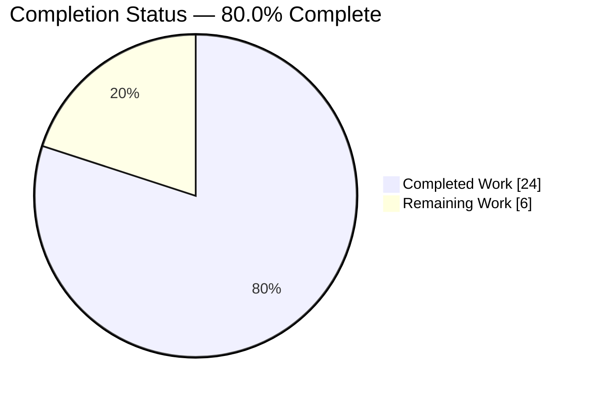
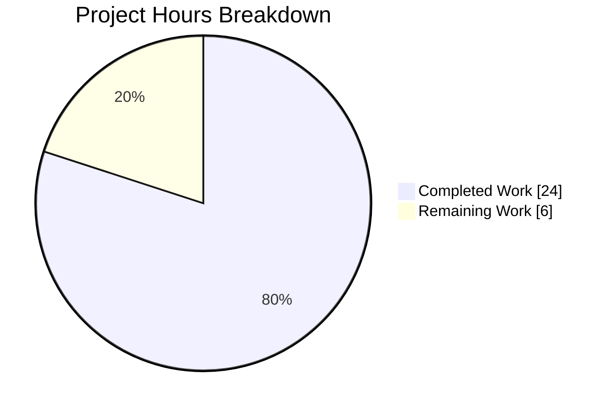
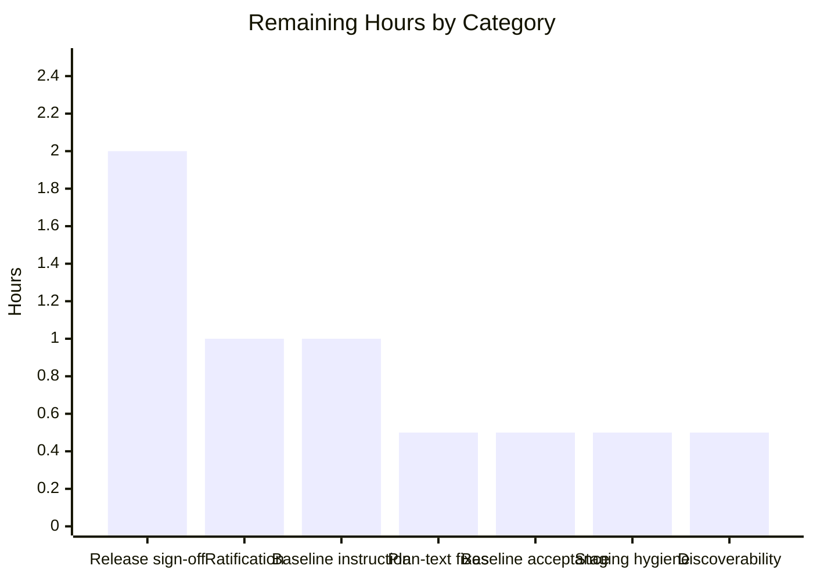
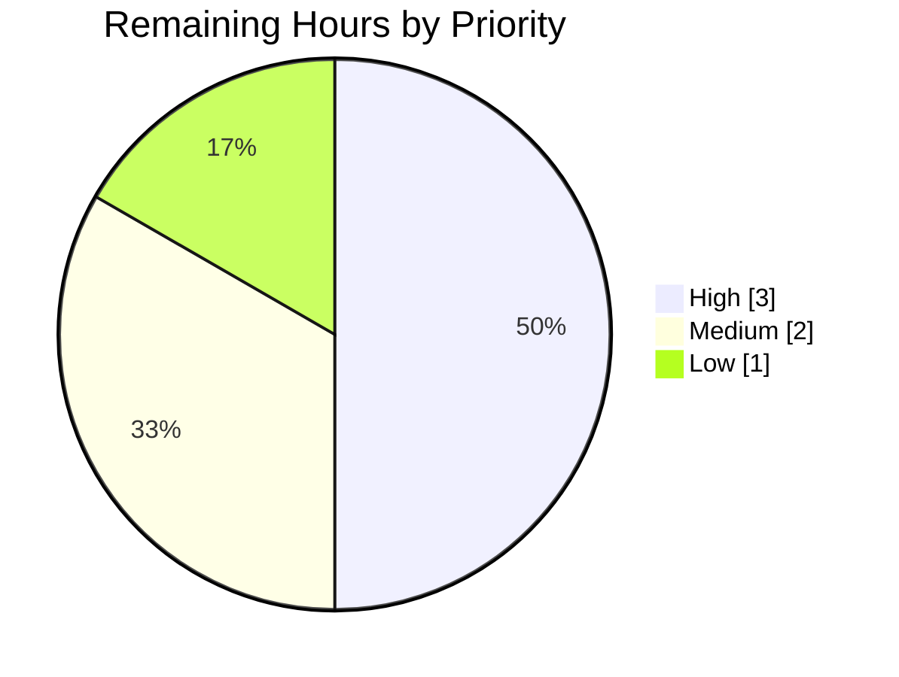

# 1. Executive Summary

## 1.1 Project Overview

This project adds one document to the repository: `USER_FLOW_REPORT.md`, a plain-prose walkthrough of the Node.js HTTP server in `server.js` from process start to a delivered HTTP 200 carrying the Hello World body. It is written for whoever operates or inherits this server — five ordered steps, each stating what happens there and what could fail or add latency, in a register suited to a trivial single-statement service rather than a formal audit. It gives a truthful, readable account of a service that documents nothing about itself, at a deliberately narrow scope: one file added, every pre-existing file byte-identical.

## 1.2 Completion Status

**80.0% complete** — 24.0 of 30.0 hours delivered.



<!-- Completed = Dark Blue #5B39F3 · Remaining = White #FFFFFF -->

| Metric | Value |
|---|---|
| **Total Hours** | 30.0 |
| **Completed Hours (AI + Manual)** | 24.0 |
| **Remaining Hours** | 6.0 |
| **Percent Complete** | 80.0% |

24.0 ÷ (24.0 + 6.0) × 100 = **80.0%**, counting only Agent Action Plan requirements and the path-to-production work that releases them.

## 1.3 Key Accomplishments

- ✅ `USER_FLOW_REPORT.md` delivered at the repository root — 25 lines against a ~50-line budget.
- ✅ Five steps in the required order and wording, each with its own failure-or-latency note.
- ✅ Every factual claim re-derived against the running server; none contradicted.
- ✅ Source claims cited, runtime behaviour described without citation, as required.
- ✅ All ten excluded artefact types absent — no fences, URLs, tables, timings or fix proposals.
- ✅ Zero code change proven structurally: one file added, none modified or deleted.
- ✅ Service exercised end to end — contract, routing, rejections, bind failure, stop path.
- ✅ Security and operational posture established at runtime and documented, not altered.

## 1.4 Critical Unresolved Issues

Three items remain open. None is one of the 26 requirements this work was scoped against — **0 of 26 are unmet** — and none touches a byte of the repository; all three sit in the Agent Action Plan.

| Issue | Impact | Owner | ETA |
|---|---|---|---|
| The Agent Action Plan was amended after it was frozen and its amendment record declares itself unratified, so the plan on disk and the plan text supplied to delivery disagree about the acceptance baseline | Governance and audit trail only. No requirement was retired or weakened, and no repository byte moved with the amendment | Product owner | 1.0 h |
| The acceptance-baseline instruction still asks for four file digests — one of them for a file that has never existed on this branch — and a two-entry untracked status including a file that is tracked | Four continuity measures have no operand, so acceptance evidence can only be produced against the observed baseline | Product owner / platform | 1.0 h |
| §0.2.1 of the plan states that status, `Content-Length` and the absent `Content-Type` are invariant for every request reaching the handler; `Content-Length` is absent on `HEAD` and on HTTP/1.0 | Plan text only. The delivered document scopes itself to an HTTP/1.1 `GET`, so it inherits none of this | Product owner | 0.5 h |

## 1.5 Access Issues

| System/Resource | Type of Access | Issue Description | Resolution Status | Owner |
|---|---|---|---|---|
| Git remote for this branch | Push | None — the branch is published and its head is identical to the remote ref | Resolved | — |
| Package registry / third-party packages | Network | Not used. There is no manifest, no lockfile and no dependency; no registry is contacted at any point | Not applicable | — |
| TCP port 3000 on the host | Runtime | Hardcoded in the source with no environment override, so a held port cannot be side-stepped without editing a frozen file | Open — deployment-side | Deployment owner |
| Agent Action Plan, pre-amendment text | Read | Not retained alongside the project; needed only if the amendment is refused rather than ratified | Open | Product owner |
| Credentials / authentication | Any | None exist and none are required anywhere in this project | Not applicable | — |

## 1.6 Recommended Next Steps

1. **[High]** Ratify or refuse the post-freeze amendment to the Agent Action Plan. Everything else in the plan is gated on it.
2. **[High]** Review and merge this branch, signing off the documented service posture and runtime-line ownership.
3. **[Medium]** Correct the acceptance-baseline instruction so a future gate can execute it.
4. **[Medium]** Apply the two plan-text corrections the ratification gates, and accept the observed baseline.
5. **[Low]** Stage by explicit path, and decide whether `README.md` should link the walkthrough.

# 2. Project Hours Breakdown

## 2.1 Completed Work Detail

| Component | Hours | Description |
|---|---|---|
| Source analysis and factual grounding | 1.5 | `server.js` read in full and every statement it executes established as the factual spine of the walkthrough — the single `require`, the handler that touches no request property, the port literal with no host argument, the two registered listeners and the absent `'error'` listener. Existence of `package.json`, lockfiles, `node_modules`, runtime pins, tests and CI checked rather than assumed. |
| Runtime behaviour and the confirming run | 1.5 | The runtime half of the flow established in plain terms — pre-handler rejection, keep-alive reuse and idle close, header-read timeouts — and the server started once to confirm the traced case before any of it was written down. |
| Authoring the five-step walkthrough | 3.0 | `USER_FLOW_REPORT.md` written to the fixed structure: title, a two-sentence opening naming the subject and the traced span, then `## 1. Start Process` through `## 5. Response Sent` in the required order, and a closing line stating the confirming result (commit `607353b`). |
| Failure-and-latency notes, and register | 2.0 | One core action and one salient risk per step, inside a one-or-two-sentence budget — cold-start work, fatal bind contention, parser rejection, event-loop latency, the absent media type — phrased by cause and caller-visible effect with no measured value (commit `2aabbdd`). |
| Citation grounding discipline | 1.0 | Claims about the file carry `[server.js:1]`; runtime behaviour carries none, so a reader can tell the two apart without leaving the page. Six locators, all on source claims; the purely runtime step carries zero (commit `1922a2c`). |
| Line-budget and prohibited-form compliance | 1.5 | 25 lines against the ~50-line ceiling, and all ten excluded artefact types confirmed absent both mechanically and by reading — no fenced block, URL, table, timing value, diagram, runtime-internal reference, provenance table, module inventory, discrepancy register or fix proposal. |
| Zero-change and one-file-out verification | 1.5 | `README.md` and `server.js` held byte-identical by digest, and proven structurally: `git diff --name-status a3cb672 HEAD` yields `A USER_FLOW_REPORT.md` alone. Sixteen must-stay-absent paths re-checked; nothing written into the checkout. |
| Contract, lifecycle and observability verification | 6.0 | Every runtime assertion the document makes exercised against a live server: the 200 with its exact header set and 14-byte body, catch-all indifference across methods and paths, `HEAD` and HTTP/1.0 shapes, 400/431/408 pre-handler rejections, keep-alive reuse, the fatal bind path, the stop path, and stdout/stderr accounting. |
| Security and dependency posture assessment | 4.0 | The described service characterised at runtime rather than by inspection: unauthenticated reach, wildcard bind versus the advertised loopback address, the full header set and the sniffing consequence of no media type, cleartext-only transport, resource behaviour under stalled connections and large bodies, and applicability of the installed runtime's advisories. |
| Acceptance-baseline reconciliation | 1.5 | The acceptance baseline re-established by observation — three tracked files, three files of repository content, no untracked entry beyond the platform artifact directory — after the file the plan named as the baseline was shown absent from every ref of this branch. |
| Response-header accuracy adjudication | 0.5 | `HEAD` and HTTP/1.0 measured against the plan's response-header invariance claim, which holds for the status and the absent `Content-Type` but not for `Content-Length`; the delivered document confirmed unaffected. |
| **Total** | **24.0** | Matches Completed Hours in Section 1.2 |

## 2.2 Remaining Work Detail

| Category | Hours | Priority |
|---|---|---|
| Plan-of-record ratification decision — ratify or refuse the post-freeze amendment and record the outcome | 1.0 | High |
| Release sign-off — branch review, merge to the integration line, and formal acceptance of the documented service posture and of runtime-line ownership | 2.0 | High |
| Acceptance-baseline instruction correction — three producible digests, an observed status baseline, the absent path recorded as not to be created, and the user-rule provenance made uniformly obtainable | 1.0 | Medium |
| Plan-text corrections gated by ratification — the §0.6.3 status clause and the §0.2.1 response-header sentence | 0.5 | Medium |
| Acceptance of the observed baseline in place of the four continuity measures that have no operand on this branch | 0.5 | Medium |
| Repository staging hygiene — stage by explicit path, or add an ignore rule for the platform artifact directory under a mandate that permits creating one | 0.5 | Low |
| Discoverability decision — whether `README.md` should link the walkthrough once the file freeze lifts | 0.5 | Low |
| **Total** | **6.0** | Matches Remaining Hours in Section 1.2 and the Section 7 pie chart |

## 2.3 Hours Reconciliation

| Check | Value |
|---|---|
| Section 2.1 completed total | 24.0 |
| Section 2.2 remaining total | 6.0 |
| Sum (equals Total Hours in Section 1.2) | 30.0 |
| Completion (24.0 ÷ 30.0 × 100) | 80.0% |

Confidence is high on every completed component, each of which traces to a file, a commit and an executed check, and high on all remaining items except the ratification decision, whose duration depends on whose authority is engaged rather than on engineering effort.

# 3. Test Results

This repository has no test runner, and none can be added: a test framework requires a `package.json`, whose absence is load-bearing here — one declaring `"type": "module"` would break `server.js`'s `require` call outright. Verification is therefore the project's own gate: `node --check` for syntax, a live server for behaviour, digest and diff comparison for the freeze, and mechanical plus semantic scans for the document. Every figure below is from a run executed against this branch.

| Area / Category | Framework | Tests | Passed | Failed | Coverage | What This Proves |
|---|---|---|---|---|---|---|
| Source syntax and whole-package gate | `node --check`, `curl`, `md5sum`, `git` | 4 | 4 | 0 | n/a | The service parses and answers `200 14` from a clean checkout with the frozen files untouched |
| Document structure and budget | `wc`, `grep` | 9 | 9 | 0 | n/a | The walkthrough presents the five required steps in the required order and wording, inside its line budget |
| Excluded-artefact compliance | `grep` scans + read-through | 9 | 9 | 0 | n/a | None of the ten prohibited artefact forms is present, and the citation form is used only where it belongs |
| Zero-change freeze and one-file-out | `md5sum`, `sha256sum`, `git diff` | 25 | 25 | 0 | n/a | Exactly one file was added; nothing pre-existing was modified, renamed or deleted, and no forbidden path was created |
| HTTP request/response contract | `curl`, raw sockets via `node -e` | 23 | 23 | 0 | n/a | Every method, path, query and credential shape is answered identically, and `HEAD`/HTTP/1.0 framing behaves as described |
| Pre-handler rejection paths | Raw sockets via `node -e` | 2 | 2 | 0 | n/a | Malformed and oversized requests are answered by the runtime before application code runs |
| Process lifecycle and bind behaviour | `node`, `ss`, `lsof`, signals | 9 | 9 | 0 | n/a | Start-up, all-interface binding, fatal port contention and the abrupt stop all behave exactly as the walkthrough states |
| Output-stream accounting | Stream capture, `wc` | 2 | 2 | 0 | n/a | The readiness line is the only thing the service ever writes; nothing is logged per request |
| **Total** | | **83** | **83** | **0** | **n/a** | |

Coverage is reported as not applicable rather than as a number: with no test runner there is no coverage instrument, and `npm audit` cannot run without the manifest that must not be created — there are also zero third-party dependencies to audit.

**Not Covered**

- **The document's prose** — register, wording and readability — is exercised by no automated check and cannot be. It was verified by reading and by re-deriving each factual claim against the running server. A human should read the 25 lines once before release and confirm the tone suits the audience.
- **Continuous protection of the verified state.** The 83 checks above are one-shot. Nothing re-runs them, so no automated gate will notice if `server.js` is later edited and the walkthrough silently becomes wrong, or if the frozen digests drift. Re-run the Section 9 gate whenever `server.js` changes.
- **Sustained-load and long-run stability of the service** beyond short bursts and a stalled-connection hold. If this server is ever put under real traffic, soak and concurrency behaviour should be measured against the deployment's own targets.

# 4. Runtime Validation & UI Verification

Every flow below was driven against a live server started from this branch with `node server.js`. The project has no user interface: the service returns a 14-byte plain-text body and the repository contains no HTML, CSS or client-side JavaScript, so the browser leg verifies how a real client copes with that response rather than any screen.

- ✅ **Start-up** — Operational. Loading the file starts the listener with no install or build step; stdout carries exactly one line, `Server running at http://127.0.0.1:3000/` (41 bytes).
- ✅ **Bind and exposure** — Operational, with a caveat worth knowing: `ss -ltn` reports `LISTEN 0 511 *:3000`, so the listener answers on every interface while that start-up line names only loopback.
- ✅ **Traced HTTP/1.1 GET** — Operational. `200` with `Date`, `Connection: keep-alive`, `Keep-Alive: timeout=5` and `Content-Length: 14`, body `Hello, World!\n` (sha256 `c98c24b6…ad31`), and no `Content-Type`.
- ✅ **Catch-all routing and methods** — Operational. `GET`, `POST`, `PUT`, `DELETE`, `PATCH` and `OPTIONS` on `/admin/secret`, plus `/.env`, `/server.js`, `/.git/config`, a traversal path and a script-payload query, all returned `200 14` with no reflection and no disclosure.
- ✅ **Protocol variants** — Operational. `HEAD` returns `200` with zero body bytes and no `Content-Length`; an HTTP/1.0 caller gets `200` with `Connection: close`, no `Content-Length`, and 14 body bytes framed by the close.
- ✅ **Pre-handler rejections** — Operational. A malformed request line is answered `400 Bad Request` and a 70 KB header block `431 Request Header Fields Too Large`, both before the handler runs; the process survives and keeps serving.
- ✅ **Connection reuse** — Operational. A second request over the same connection opened no new connection (`num_connects` 1 then 0).
- ⚠ **Fatal port contention** — Partial by design. A second instance exits 1 with no readiness line and ~1080 bytes of `EADDRINUSE` stderr including the checkout path, because no `'error'` listener is registered; the first instance is unaffected. The port cannot be re-pointed from the environment.
- ⚠ **Stop path** — Partial by design. `SIGTERM` releases the port immediately and the next connection is refused, with nothing drained and no shutdown line written.
- ✅ **Browser client** — Operational. Chrome navigations to `/` and to a path carrying `?q=<script>alert(1)</script>` both returned `200` with four headers and no `Content-Type`; the browser sniffed `text/plain`, built a DOM of `[HTML, HEAD, META, BODY, PRE]` with zero script and zero image elements, fired zero dialogs (verified with a live hook and a positive control), reflected nothing, and logged zero console errors across 4/4 successful requests.

**Not exercised at runtime:** transport encryption has no runtime to validate — a TLS handshake to port 3000 fails outright (`curl` exit 35) and the repository contains no TLS code or certificate material. There is also no authentication, session, database, queue, cache, outbound call or scheduled job anywhere in this project, so none was driven.

# 5. Compliance & Quality Review

## 5.1 Compliance Matrix

| # | Agent Action Plan Deliverable | Benchmark | Status | Evidence |
|---|---|---|---|---|
| 1 | R1 — one file, exact name, repository root | Deliverable exists where specified | ✅ Pass · 100% | `USER_FLOW_REPORT.md` at the root, added by `607353b` |
| 2 | R2 — under ~50 lines including headings and blanks | Line budget respected | ✅ Pass · 100% | 25 lines / 2,607 bytes |
| 3 | R3 — traced span from process start to a delivered HTTP 200 | Scope completeness | ✅ Pass · 100% | Line 3 fixes the traced case; steps 1–5 cover it; line 25 states the confirming result |
| 4 | R4 — the five steps in the user's order | Structural fidelity | ✅ Pass · 100% | H2 headings at lines 5/9/13/17/21 with the exact required wording |
| 5 | R5 — a failure-or-latency note on every step | Content completeness | ✅ Pass · 100% | A failure-or-latency clause on each of lines 7/11/15/19/23 |
| 6 | R6 — lightweight walkthrough register | Fitness for audience | ✅ Pass · 100% | One or two sentences per step; no tables, scores or evidence apparatus |
| 7 | R7 — zero changes to any existing file | Change containment | ✅ Pass · 100% | `git diff --name-status a3cb672 HEAD` = `A USER_FLOW_REPORT.md` alone; both frozen digests exact |
| 8 | R8 — none of the ten excluded artefact types | Prohibition compliance | ✅ Pass · 100% | 0 fences, URLs, table pipes, timing values, indented blocks, internal references, severity labels or fix proposals |
| 9 | I1–I4 — source read before described, root placement, qualitative risk language, describe-not-fix | Factual integrity | ✅ Pass · 100% | Every claim re-derived against the running server; only numerals are the step numbers, `200`, `3000` and `14` |
| 10 | I5–I8 — runtime used as found, nothing left behind, exclusions carried forward, absent manifest not created | Environment discipline | ✅ Pass · 100% | No runtime pin or manifest exists; the checkout holds exactly three repository files |
| 11 | §0.6.1–§0.6.2, §0.7.1, §0.8 — fixed structure, prohibitions, one CREATE row, zero user rules | Plan conformance | ✅ Pass · 100% | Title byte-exact; each step exactly four lines; one added file, none updated or deleted; zero rules, none invented |
| 12 | §0.6.3 — acceptance evidence | Verifiability | ⚠ Partial · 85% | Three count measures, byte-identity two ways, line count and all scans produced; four measures depend on a file absent from every ref of this branch |

## 5.2 AAP & Rule Divergences and Gaps

Eight divergences were established. No user-specified rules govern this project, so every row below is a departure from the Agent Action Plan itself or from standard practice that the plan overrides; the zero-rule position was confirmed by direct retrieval and by two concordant plan sources, and no rule was invented anywhere in the delivered work.

| What the AAP/Rule Required | What Was Delivered Instead | Why It Diverged | Impact | Remediation |
|---|---|---|---|---|
| §0.2.1/§0.6.3/§0.7.1: an untracked `metering-inventory.md` of 34 lines / 4,441 bytes as the status baseline and a byte-identity subject | Verification ran against the observed baseline; the path was not created and four continuity measures have no operand | The plan recorded the worktree it was authored in rather than this branch, where the path appears in 0 commits on any ref | None on delivered bytes; acceptance evidence is 85% producible | Accept the observed baseline as authoritative and strike the four measures |
| The standing rule that the Agent Action Plan is frozen and is never edited | The plan was corrected during delivery across nine sub-sections and then given an amendment record, which declares itself unratified | The baseline premise above was physically unsatisfiable, and the correcting work was directed at that document; both edits were additive | Governance only. No requirement retired; no repository byte moved | Ratify the amendment, or refuse it and reinstate the premise as a divergence note |
| §0.2.1: status, `Content-Length` and absent `Content-Type` invariant for every request reaching the handler | The sentence stands unchanged, with the correction established and ready to apply | Further amendment is barred until the ratification decision is taken | Plan text only; the delivered document is correctly scoped | Apply the corrected sentence once ratification is settled |
| Enterprise practice would harden the nine security and operational characteristics of `server.js`; §0.3.2 and I4 instead require each to be described and forbid fixing it | All nine confirmed at runtime and left exactly as they are, with no fix and no recommendation written anywhere in the repository | The plan is the more specific instruction, freezes every existing file, and states that a sentence proposing a change is as much a violation as making one | All nine persist in the service | Authorize a separate scope that permits editing `server.js`, or accept them as the posture |
| §0.9.1: use the installed runtime as found, with no pin, isolation or second-version comparison | Exactly that — no install, pin, isolation, `.nvmrc`, `.node-version` or `engines` field | The plan mandates it and its exclusions bar expressing a version constraint anywhere in the repository | The service runs on a security-fixes-only line with end of life on 2027-04-30 | Track that line's next security release; plan migration to the active line |
| Standard validation expects coverage, dependency-audit and mutation gates | None were run, and this is reported plainly rather than substituted with another command | None can exist here: no test runner, hence no coverage or mutation tool; `npm audit` needs the forbidden manifest; zero third-party dependencies | Nothing automated guards the verified state | Nothing within this mandate |
| The user-rule set must be retrieved directly from its authoritative source and paged with explicit ranges | The count was first taken from two plan sources and later confirmed by direct, explicitly ranged retrieval | The retrieval interface is a plan-time capability not re-exposed to later contexts | None — three concordant sources, zero contradicting | Optionally make that provenance uniformly obtainable |
| Exactly one file may be added, and `.gitignore` must not be created | One file was added; the platform artifact directory sits untracked and covered by no ignore rule | The forbidden-path list includes `.gitignore`, so no rule could be written to cover it | A `git add -A` would stage 1.2 MB of binaries into a one-file branch | Stage by explicit path, or add an ignore rule under a mandate that permits it |

**The named baseline file does not exist on this branch.** The plan describes an untracked `metering-inventory.md` at the repository root and builds three things on it: the pre-write `git status` baseline, a byte-identity subject, and a reference row. The repository contradicts all three — `git log --all -- metering-inventory.md` returns no commits, and the path is in no object store here. The reason is that the plan recorded the worktree it was authored in, not the branch that was delivered; the branch-specific instructions for this checkout state the path does not exist and must not be created, and the plan's own acceptance rule tells you to observe the baseline rather than assume it. The observed baseline is three tracked files with no untracked entry beyond `blitzy/`, which is exactly what the tree holds. Nothing about the delivered bytes is affected, but four acceptance measures — that file's line count, byte count, a before/after digest comparison and a stale-row grep — have no operand and cannot be produced by anyone here. Accept the observed baseline and strike them.

**The plan of record was corrected during delivery, and the correction is unratified.** Fifteen lines across nine sub-sections were revised to remove the false presence premise above, and an amendment record was then added at the head of the plan disclosing that revision and declaring its own status unratified, with both reversal paths spelled out. Nothing was weakened: R1–R8 and I1–I8 are each present once, the ten-item exclusion list and its ten-row table are intact, the structure table still carries the exact five step headings, and the transformation mapping still holds one CREATE row with no UPDATE and no DELETE row. What remains open is authority, not content — whether a frozen plan may be corrected after the fact is a decision for a product owner, and the text supplied to delivery is the pre-amendment version, so the two copies disagree about the acceptance baseline while agreeing on every requirement. Ratify the amendment, or refuse it and carry the reconciliation as a divergence note.

**The plan's response-header claim is over-broad.** §0.2.1 states that the status, the `Content-Length` and the absent `Content-Type` are invariant "for every request that reaches the handler". Two of those three are genuinely invariant; `Content-Length` is not. A `HEAD` reaches the handler and is answered `200` with zero body bytes and no `Content-Length`, and an HTTP/1.0 caller is answered `200` with `Connection: close`, no `Content-Length`, and 14 body bytes framed by the close — both measured directly. The delivered document is unaffected, because its line 3 fixes the traced case as "an ordinary HTTP/1.1 `GET` on a persistent connection" and its step-5 claims are true of exactly that case; it never opens the `HEAD` or HTTP/1.0 branch. The sentence stands unchanged only because further amendment is barred until the ratification decision above is taken. Narrow the claim to bodied HTTP/1.1 responses when you apply it.

**Nine known characteristics of the service are described rather than fixed.** The walkthrough necessarily surfaces real gaps, and the plan requires each to be described and forbids fixing it — §0.3.2 states plainly that a sentence proposing a change is as much a scope violation as making one. So all nine stand: the sole endpoint is unauthenticated and answers every method and path identically; `listen(3000, …)` is given no host argument, so the listener answers on every interface while the start-up line names loopback; no `Content-Type` and no `X-Content-Type-Options` are set; transport is cleartext only; there is no rate limit, connection cap or body-size cap; a held port ends the process because no `'error'` listener is registered, printing a path-disclosing stack; there is no `SIGINT`/`SIGTERM` handling and no drain; nothing is logged per request; and the repository supplies no supervisor or restart policy. All nine are visible in `server.js:1`. Decide at sign-off whether to accept this posture or open a scope that permits editing that file.

**The runtime was used exactly as found.** The plan forbids installing, pinning or isolating a runtime, bars a second-version comparison, and — through the prohibition on creating a manifest — leaves no place in the repository where a version constraint could be expressed. The installed Node.js is consequently whatever the host provides. It is the current security patch for its line and no applicable unpatched advisory affects this service, which was checked rather than assumed: of the advisories in its own release batch, the only one touching the module in use is fixed, demonstrated by a `431` returned before the handler for an over-count header block. The residual is cadence, not a live vulnerability: that line receives security fixes only and reaches end of life on 2027-04-30. Whoever owns the deployment should track its next release and plan migration to the active line.

**No coverage, dependency-audit or mutation gate was run, and none can be.** This is stated rather than papered over with a substitute command. A coverage or mutation tool needs a test runner, which needs a manifest that must not be created; `npm audit` has the same prerequisite and, with zero third-party dependencies, nothing to audit. The practical consequence is in Section 3's Not Covered list: verification here is one-shot, so nothing will automatically notice if `server.js` is edited and the walkthrough stops being true. Re-run the Section 9 gate on any change to that file.

**The user-rule provenance was indirect before it was direct.** Delivery is required to retrieve the user-specified rule set from its authoritative source and page it with explicit ranges. That interface was not reachable from the contexts where the work ran, so the count was first read out of two plan sources that record its result; it was later obtained directly at explicit ranges and returned no user rules, agreeing with both. The count is therefore zero on three concordant sources with none contradicting, and no rule-derived requirement can go unmet where no rule exists — confirmed by the absence of any rule, policy or doctrine vocabulary in the delivered work. Nothing needs doing for this release; making that provenance uniformly obtainable would remove the discrepancy at future gates.

**The platform artifact directory is unignorable here.** `blitzy/screenshots/` holds 19 PNG files and 1.2 MB of browser evidence, is untracked, and is covered by no ignore rule — `git check-ignore -v blitzy` finds none, there is no `.gitignore`, `.git/info/exclude` carries only comments, and no global excludes file is configured. It stays unignored because `.gitignore` is on the plan's must-not-create list. Nothing was committed from it and the branch carries exactly one added file, so the exposure was never realised, but a `git add -A` in this repository would stage a megabyte of binaries into a branch whose defining constraint is that single file. Stage by explicit path, or add an ignore rule once a mandate permits creating one.

# 6. Risk Assessment

These are forward-looking: what could still go wrong once this branch is merged and the service is run somewhere real.

| Risk | Category | Severity | Probability | Mitigation | Status |
|---|---|---|---|---|---|
| Nothing automated guards the walkthrough's factual accuracy or the frozen source digests, so an edit to `server.js` would silently make the document wrong | Technical | Medium | Medium | Treat `USER_FLOW_REPORT.md` as a co-dependent artefact of `server.js` and re-run the Section 9 gate on any change to that file | Open by design — no test harness can exist here |
| Port 3000 is a literal with no environment override, a held port ends the process at start-up, and the repository defines no restart path | Technical | High | Medium | Reserve the port for this service and run it under a supervisor with a restart policy and a health check; re-pointing the port needs a mandate to edit the source | Accepted — deployment-side |
| The sole endpoint is unauthenticated and bound to every interface while its start-up line advertises loopback, so exposure is easy to under-estimate | Security | Medium | High if deployed outside a sandbox | Network-restrict port 3000 or front the service with an authenticating proxy; read the bound address from the socket, not from the log line | Accepted — documented |
| No `Content-Type` and no `nosniff`: today's inertness comes from the fixed 14-byte body, not from any header policy, so a dynamic body would change browser behaviour with nothing standing in the way | Security | Medium | Low while the body is constant | Set an explicit media type and `X-Content-Type-Options: nosniff` before any dynamic response is introduced | Accepted — documented |
| Transport is cleartext only, and the port answers on every interface, so requests and responses are readable and modifiable in transit | Security | Medium | Medium | Terminate TLS in front of the service and enable HSTS there | Accepted — deployment-side |
| A stop is abrupt — no signal handling, no drain — and nothing is recorded per request, so an in-flight response can be cut off and an incident cannot be reconstructed | Operational | Medium | Medium | Capture access and rejection logs at the proxy layer; add signal-driven draining under a mandate that permits editing the source | Accepted — documented |
| The runtime line receives security fixes only and reaches end of life on 2027-04-30; the installed build is current for that line and no applicable unpatched advisory affects this service today | Supply chain | Low | Medium | Track that line for its next security release and plan migration to the active line before end of life | Monitored |
| The Agent Action Plan stands amended and unratified, and its two copies disagree about the acceptance baseline, so an audit reading one against the other reaches different conclusions | Integration | Low | Medium | Take the ratification decision, then align the rendered plan text and the acceptance instruction with it | Open — awaiting a human decision |

# 7. Visual Project Status

**Hours delivered against hours remaining** — Completed = Dark Blue `#5B39F3`, Remaining = White `#FFFFFF`.



**Remaining hours by category** (Section 2.2, summing to 6.0):



**Remaining work by priority:**



| View | Completed | Remaining | Total |
|---|---|---|---|
| Hours | 24.0 | 6.0 | 30.0 |
| Share | 80.0% | 20.0% | 100% |

# 8. Summary & Recommendations

**What was delivered.** One file, `USER_FLOW_REPORT.md`, at the repository root: a 25-line plain-prose walkthrough of `server.js` from process start to a delivered HTTP 200 carrying the Hello World body. It presents the five steps in the order they were asked for, gives each one a note on what could fail or add latency there, cites the source where it makes a claim about the file and describes runtime behaviour without citation, and closes with the result of a confirming run. Three commits produced it — the walkthrough, a citation correction, and a trim of two steps back to one action-and-risk sentence each — and they add 25 lines in one new file while touching nothing else. Against the Agent Action Plan's 26 enumerated requirements, all 26 are met, which is the basis for the **80.0% completion** in Section 1.2; the remaining 20% is not deliverable work but the release path and three open items in the plan that governs it.

**What was verified.** The document's value is entirely in whether its claims are true of the running server, so that is what was exercised: 83 checks, all passing. The service parses, starts with no install or build step, prints exactly one readiness line, binds every interface while that line names loopback, and answers every method, path, query and credential shape with the same `200` and the same 14 bytes — no `Content-Type` among them. `HEAD` and HTTP/1.0 framing behave as described; malformed and oversized requests are answered `400` and `431` before the handler runs; a keep-alive socket is reused and then closed on its idle timer; a held port ends a second instance outright; a signal releases the port with nothing drained and nothing logged. A real browser confirmed the client-side consequence of a typeless `200`: the body is sniffed as plain text, rendered inert, and reflects nothing. Both pre-existing files are byte-identical, and the diff against the base commit is a single added path.

**What remains, and what it is not.** Six hours of work stand between this branch and a merged release, and none of it is in the repository. Two items are decisions: whether to ratify the correction made to the frozen plan during delivery, and whether to sign off the service posture this document describes rather than fixes. Three are text corrections to the plan and its acceptance instruction, two of them gated on the ratification. The last two are hygiene — staging by explicit path, because no ignore rule covers the platform artifact directory, and deciding whether `README.md` should link the walkthrough once the file freeze lifts. The critical path is the ratification decision, because the acceptance instruction and the response-header sentence cannot be corrected until it is taken, and a gate reading that instruction literally will again find it unexecutable.

**Production readiness.** The deliverable is production-ready now: it is complete, structurally conformant, factually accurate against the running service, and free of every artefact form that was excluded. The service it describes is a different matter, and deliberately untouched. It has no authentication, no transport encryption, no media type, no resource limits, no graceful shutdown, no per-request telemetry and no restart path, and it dies if its hardcoded port is held. Every one of those is described in the walkthrough and detailed in Sections 5.2 and 6. If this server is only ever documented, nothing needs doing. If it is deployed, front it with a proxy that terminates TLS and authenticates, restrict port 3000 at the network layer, supervise the process with a restart policy and a health check, and capture access logs outside the application — none of which requires touching a file this project froze.

**Success metrics.** One file added and zero modified, matching the plan's single CREATE row exactly. 25 of ~50 lines used. Five of five steps present, in order, each with its risk note. Six source citations, all on source claims, none on runtime behaviour. Ten of ten excluded artefact types absent. 83 of 83 verification checks passing, zero failing. Three open items, all in the plan rather than the code, and zero of the 26 scoped requirements unmet.

# 9. Development Guide

Every command in this section was executed against this branch and produced the output shown. All commands run from the repository root.

## 9.1 System Prerequisites

| Requirement | Version present | Notes |
|---|---|---|
| Node.js | v22.23.2 | The only install on the host, at `/usr/bin/node`. Use it as found — do not install, pin or isolate a version, and do not add `.nvmrc`, `.node-version` or an `engines` field |
| npm | 11.18.0 | Present but unusable here: there is no manifest to install from |
| curl | 8.14.1 | Used for every smoke and contract check |
| lsof | 4.99.4 | The reliable way to find and stop the process holding port 3000 |
| git | 2.51.0 | Plus git-lfs; the four active hooks are the stock LFS wrappers |
| Free TCP port | 3000 | Hardcoded in the source with no environment override |

Operating system: Linux. No particular hardware is needed — the service is one statement and holds about 50 MB resident.

## 9.2 Environment Setup

There is nothing to set up, and that is a property of the project rather than an omission:

```bash
# Confirm the tree is exactly what it should be: three files and nothing else.
ls -a
# .  ..  .git  README.md  USER_FLOW_REPORT.md  blitzy  server.js

git ls-files
# README.md
# USER_FLOW_REPORT.md
# server.js
```

No environment variables are read anywhere in the source, no `.env` file is used, and no credentials exist or are required. There is no database, cache, queue or external service to start.

## 9.3 Dependency Installation

**There is no install step.** The service imports only the built-in `http` module, and the repository has no `package.json`, no lockfile and no `node_modules`:

```bash
node --check server.js   # the only compile-equivalent gate; exits 0
```

Do **not** run `npm install`. It fails — `npm error enoent`, exit 254 — and it leaves a stray `package-lock.json` behind, which then appears as an untracked path against the acceptance baseline. If that has happened, remove it:

```bash
rm -f package-lock.json && rm -rf node_modules
git status --porcelain   # back to: ?? blitzy/
```

The absence of a manifest is load-bearing: one declaring `"type": "module"` would break `server.js`'s `require` call outright.

## 9.4 Application Startup

```bash
# Foreground — Ctrl-C stops it.
node server.js
# Server running at http://127.0.0.1:3000/
```

The listener answers on **every** interface, even though that line names loopback. Confirm with:

```bash
ss -ltn | grep 3000
# LISTEN 0  511  *:3000  *:*
```

For parallel work, or whenever port 3000 may be contended, run the whole check inside a private network namespace — the namespace disappears when the command exits, so it must all be one invocation:

```bash
unshare -n sh -c 'ip link set lo up; node server.js >/dev/null 2>&1 & sleep 2; \
  curl -s -o /dev/null -w "%{http_code} %{size_download}\n" http://127.0.0.1:3000/; kill $!'
# 200 14
```

Stop a host-port instance by the **port owner**, never by a captured background pid:

```bash
kill "$(lsof -ti :3000)"
lsof -ti :3000 || echo "port released"
```

## 9.5 Verification Steps

```bash
# 1. Smoke check — must print exactly "200 14".
curl -s -o /dev/null -w '%{http_code} %{size_download}\n' http://127.0.0.1:3000/

# 2. Full response, headers and all.
curl -sS -D - -o /dev/null http://127.0.0.1:3000/
# HTTP/1.1 200 OK
# Date: ...
# Connection: keep-alive
# Keep-Alive: timeout=5
# Content-Length: 14
#   (and no Content-Type)

# 3. Body fidelity.
curl -s http://127.0.0.1:3000/ | sha256sum
# c98c24b677eff44860afea6f493bbaec5bb1c4cbb209c6fc2bbb47f66ff2ad31

# 4. The document's own gates.
wc -l USER_FLOW_REPORT.md                 # 25  (budget is ~50)
grep -nE '`{3}' USER_FLOW_REPORT.md       # no output — no code fences
grep -nE 'https?://' USER_FLOW_REPORT.md  # no output — no URLs
grep -n '|' USER_FLOW_REPORT.md           # no output — no tables
grep -n '^#' USER_FLOW_REPORT.md          # title + the five H2s at lines 5/9/13/17/21

# 5. The freeze.
md5sum README.md server.js
# 888597a988b2d0f5d73ed1345eb2470c  README.md
# ddf4264bd5f8b46589268ae3da9aa9bc  server.js
git diff --name-status a3cb672 HEAD
# A	USER_FLOW_REPORT.md
git status --porcelain
# ?? blitzy/
```

The whole-package gate, run as one chain, is the project's release check:

```bash
node --check server.js \
  && unshare -n sh -c 'ip link set lo up; node server.js >/dev/null 2>&1 & sleep 2; \
       curl -s -o /dev/null -w "%{http_code} %{size_download}\n" http://127.0.0.1:3000/; kill $!' \
  && md5sum README.md server.js \
  && git status --porcelain
```

Expect: exit 0, `200 14`, the two digests above, and a status equal to the baseline you observed before touching anything.

## 9.6 Example Usage

```bash
# Every method and every path is answered identically — there is no routing.
curl -s -o /dev/null -w '%{http_code} %{size_download}\n' -X POST http://127.0.0.1:3000/admin/secret   # 200 14
curl -s -o /dev/null -w '%{http_code} %{size_download}\n' http://127.0.0.1:3000/.env                    # 200 14

# HEAD carries no body and no Content-Length.
curl -sI http://127.0.0.1:3000/ | head -1                    # HTTP/1.1 200 OK
curl -sI http://127.0.0.1:3000/ | grep -ic content-length    # 0

# An HTTP/1.0 caller gets Connection: close and no Content-Length.
curl -s --http1.0 -D - -o /dev/null http://127.0.0.1:3000/

# A persistent connection is reused for a second request.
curl -s -o /dev/null -w '%{num_connects} ' http://127.0.0.1:3000/ \
  --next -s -o /dev/null -w '%{num_connects}\n' http://127.0.0.1:3000/   # 1 0
```

## 9.7 Troubleshooting

| Symptom | Cause | Resolution |
|---|---|---|
| `Error: listen EADDRINUSE: address already in use :::3000`, exit 1, no readiness line | The port is held and no `'error'` listener is registered, so the event is rethrown and the process ends before listening | Check `lsof -ti :3000` first. If someone else holds it, wait rather than killing it, or run inside `unshare -n` as in §9.4 |
| `PORT=9999 node server.js` still binds 3000 | The port is a literal and the source reads no environment variable | Use a private network namespace, or change the port under a mandate that permits editing the source |
| `npm error enoent` / exit 254, and a `package-lock.json` appears | There is no manifest to install from | Do not run `npm install`; remove the stray lockfile as in §9.3 |
| `npm test`, a coverage run or `npm audit` cannot start | No test runner exists and `npm audit` needs a manifest; there are zero third-party dependencies | Use the whole-package gate in §9.5 — it is the project's verification |
| `curl https://127.0.0.1:3000/` fails with exit 35 | The service is cleartext only; no TLS code or certificate material exists | Use `http://`, or terminate TLS in front of the service |
| The browser shows no favicon and reports no error | Every path, `/favicon.ico` included, is answered `200` with the same 14-byte text body | Expected. A browser cannot distinguish "no icon" from "wrong bytes" here |
| `kill $!` leaves the server running and the port held | The shell's background job pid is not reliably the node process | Always stop by the port owner: `kill "$(lsof -ti :3000)"` |
| `git status` shows unexpected untracked paths | No ignore rule covers `blitzy/`, and stray files from other tooling can land at the root | Stage by explicit path, never `git add -A`; remove anything you did not intend to add |

# 10. Appendices

## A. Command Reference

| Purpose | Command | Expected result |
|---|---|---|
| Syntax gate (the only compile-equivalent) | `node --check server.js` | exit 0 |
| Start the service | `node server.js` | `Server running at http://127.0.0.1:3000/` |
| Smoke check | `curl -s -o /dev/null -w '%{http_code} %{size_download}\n' http://127.0.0.1:3000/` | `200 14` |
| Full header dump | `curl -sS -D - -o /dev/null http://127.0.0.1:3000/` | Four headers, no `Content-Type` |
| Body digest | `curl -s http://127.0.0.1:3000/ \| sha256sum` | `c98c24b677eff448…ad31` |
| Isolated run (port decontention) | `unshare -n sh -c 'ip link set lo up; node server.js >/dev/null 2>&1 & sleep 2; curl -s -o /dev/null -w "%{http_code} %{size_download}\n" http://127.0.0.1:3000/; kill $!'` | `200 14` |
| Find the port owner | `lsof -ti :3000` | A pid, or nothing |
| Stop the service | `kill "$(lsof -ti :3000)"` | Port released |
| Confirm the bound address | `ss -ltn \| grep 3000` | `LISTEN 0 511 *:3000` |
| Document line budget | `wc -l USER_FLOW_REPORT.md` | `25` |
| Document fence scan | `` grep -nE '`{3}' USER_FLOW_REPORT.md `` | no output |
| Document URL scan | `grep -nE 'https?://' USER_FLOW_REPORT.md` | no output |
| Document table scan | `grep -n '\|' USER_FLOW_REPORT.md` | no output |
| Freeze check | `md5sum README.md server.js` | `888597a9…` and `ddf4264b…` |
| Change containment | `git diff --name-status a3cb672 HEAD` | `A USER_FLOW_REPORT.md` |

## B. Port Reference

| Port | Service | Bound address | Configurable |
|---|---|---|---|
| 3000 | The HTTP server in `server.js` | Every interface (`*:3000`); the start-up line names `127.0.0.1` only | No — a literal in the source with no environment read |

No other port is used. The service makes no outbound connection.

## C. Key File Locations

| Path | Role |
|---|---|
| `USER_FLOW_REPORT.md` | The deliverable — the five-step startup-to-HTTP-200 walkthrough, 25 lines |
| `server.js` | The entire service — one line, one chained statement, frozen for this project |
| `README.md` | Project identifier, one heading, no behavioural claim; frozen for this project |
| `blitzy/screenshots/` | Untracked browser evidence from verification; never committed, covered by no ignore rule |

## D. Technology Versions

| Component | Version |
|---|---|
| Node.js | v22.23.2 (`/usr/bin/node`) — security-fixes-only line, end of life 2027-04-30 |
| npm | 11.18.0 (unusable here — no manifest) |
| curl | 8.14.1 |
| lsof | 4.99.4 |
| git | 2.51.0, with git-lfs |
| Third-party dependencies | None. One `require('http')`, a built-in module |

## E. Environment Variable Reference

The source reads no environment variable, so none affects behaviour — including `PORT` and `SERVER_PORT`, both of which are ignored. No `.env` file, no configuration file, no secret and no credential exists in or is required by this project.

| Variable | Read by the service | Effect |
|---|---|---|
| *(none)* | — | The port, the bind address and the response body are all literals in `server.js` |

## F. Developer Tools Guide

| Capability | Availability here |
|---|---|
| Build / bundle step | None exists. `node --check server.js` is the whole static gate |
| Test runner | None, and none may be added — it would require a `package.json` whose absence is load-bearing |
| Coverage / mutation tooling | None, because there is no test runner |
| Dependency audit | Not runnable — `npm audit` needs a manifest, and there are zero third-party dependencies |
| Linter / formatter | None configured and none addable |
| CI pipeline | None. No `.github/`, no workflow, no hook beyond the stock Git LFS wrappers |
| Container / supervision descriptor | None. No `Dockerfile`, compose file, service unit or platform manifest |
| Release check | The whole-package gate in §9.5 |

## G. Glossary

| Term | Meaning in this project |
|---|---|
| The walkthrough / the deliverable | `USER_FLOW_REPORT.md`, the one file this project adds |
| The traced case | An ordinary HTTP/1.1 `GET` on a persistent connection, answered successfully — the single flow the walkthrough follows |
| Readiness line | The one line the service prints on start-up; it names loopback although the listener answers on every interface |
| Catch-all handler | The single request handler, which reads no request property and answers everything identically |
| Pre-handler rejection | A `400`, `431` or `408` the runtime returns before application code runs, leaving no application-side trace |
| Frozen file | `server.js` and `README.md` — read-only for this project, held at fixed digests |
| The freeze | The requirement that every pre-existing file stays byte-identical, proven by digest and by a diff carrying only one added path |
| Whole-package gate | The four-step release check in §9.5: syntax, live smoke, digests, worktree state |
| Acceptance baseline | The `git status` state observed before any file is written, against which the final tree is compared |
