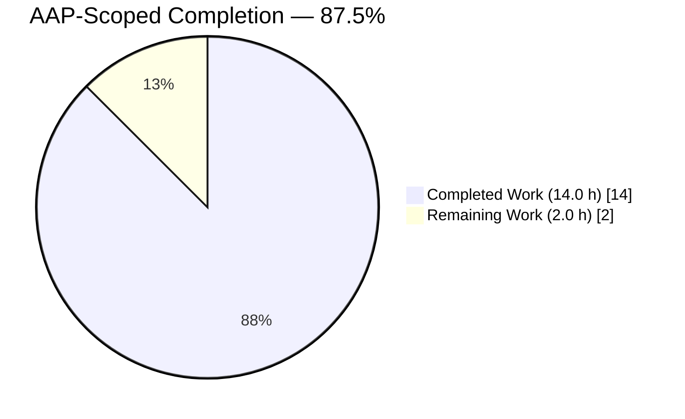
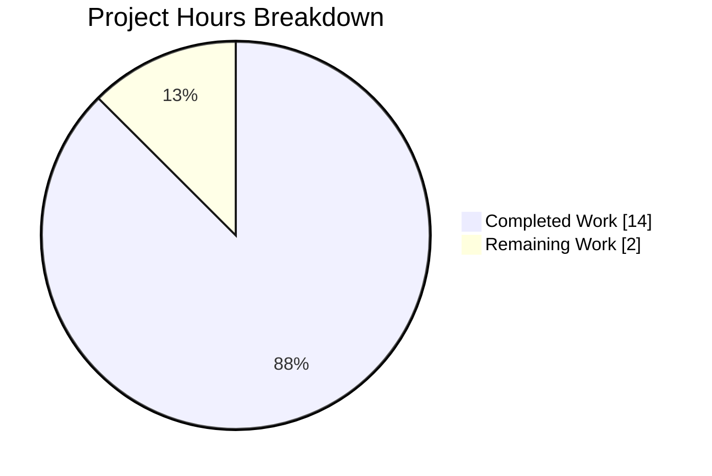
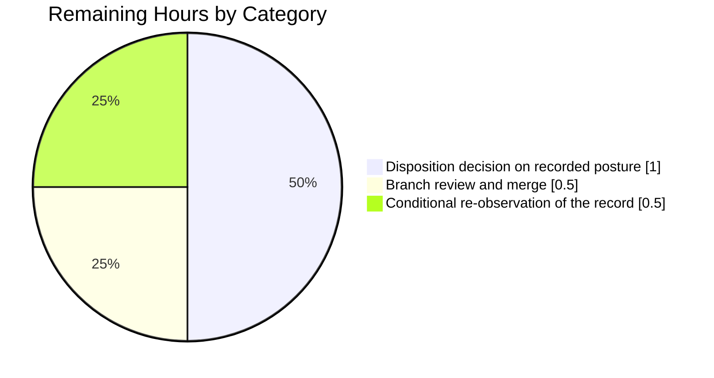
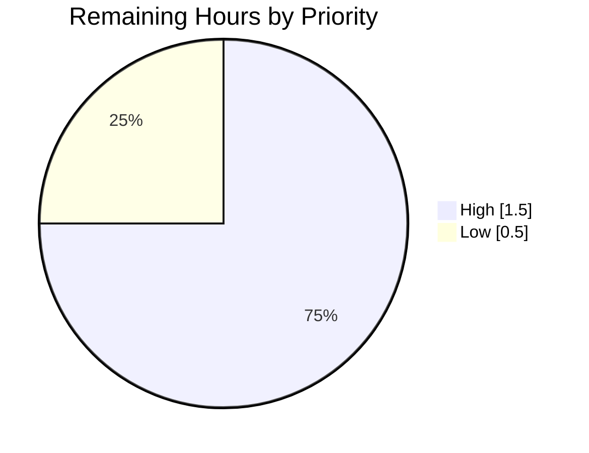

# 1. Executive Summary

## 1.1 Project Overview

This project audits the HTTP response of the repository's one-line Node.js server (`server.js`) against a plain-text specification. The server is run once as a black box and three response properties are compared with their expected values: the status code, the `Content-Type` header, and the body bytes. The outcome is `audit-report.md` — a nine-line record, verdict first, one row per property — a dated statement, for the owner of `server.js`, of what the endpoint returns.

## 1.2 Completion Status



Colours: Completed = Dark Blue `#5B39F3`, Remaining = White `#FFFFFF`.

| Metric | Value |
|---|---|
| Total Hours | 16.0 |
| Completed Hours (AI + Manual) | 14.0 (14.0 autonomous + 0.0 manual) |
| Remaining Hours | 2.0 |
| Percent Complete | **87.5%** |

14.0 ÷ 16.0 × 100 = **87.5%**. All 11 specified requirements are complete; the remaining 2.0 h is human path-to-production work.

## 1.3 Key Accomplishments

- One live black-box check: started once, one `GET http://127.0.0.1:3000/`, stopped.
- Status verified at `200`, the runtime default `server.js` never sets.
- Body verified byte-identical to the literal at `server.js:1` offset 49 — 14 bytes with trailing newline.
- `Content-Type` absence established from the complete raw header dump.
- `audit-report.md` delivered verdict-first in its fixed nine-line shape.
- Size budget met: 9 lines against a 49-line maximum.
- `server.js` and `README.md` byte-identical to their pre-project state; nothing added.
- Record re-confirmed live and in a browser: 82 of 82 checks passed.

## 1.4 Critical Unresolved Issues

**1 of the 3 compared properties is open**: `Content-Type` does not match the plain-text specification — the finding this project exists to record, left unfixed by design. Beyond it, **13 of the 13** posture conditions in `server.js` remain open, accepted rather than changed because the project's terms freeze that file. The groups sum to 13 and close through one 1.0 h decision (Section 2.2), evidenced in Section 5.2.

| Issue | Impact | Owner | ETA |
|---|---|---|---|
| Response media type and encoding undeclared — no `Content-Type`, no `charset` (2 conditions, `server.js:1`) | Clients guess: Chrome sniffs `text/plain` and decodes as `windows-1252`; `fetch` sees `content-type: null`. The specification expected `text/plain` — this is the `FAIL` row | Owner of `server.js` | Shared 1 h decision |
| Browser protections absent — no `X-Content-Type-Options`, CSP, `X-Frame-Options`, `Permissions-Policy`, `Referrer-Policy` (5 conditions) | Typeless body is accepted into script and stylesheet contexts; cross-origin framing is not refused. Bounded today by a static, inert 14-byte body | Owner of `server.js` | Shared 1 h decision |
| Caching unspecified — no `Cache-Control`/`Expires`/`Pragma` and no `ETag`/`Last-Modified` (2 conditions) | Freshness is left to heuristics; a conditional request returns a plain 200, never a 304 | Owner of `server.js` | Shared 1 h decision |
| Transport is cleartext — no TLS listener, `Strict-Transport-Security` absent and inert (2 conditions) | Nothing confidential is in transit today; residual risk is response integrity on an untrusted network | Platform owner | Shared 1 h decision |
| Exposure and resilience — wildcard bind versus an advertised loopback URL; port 3000 hardcoded with an unhandled bind failure (2 conditions) | The service answers on every host address while its only log line advertises `127.0.0.1`; a port collision exits the process with code 1 and no retry | Owner of `server.js` | Shared 1 h decision |

## 1.5 Access Issues

No access issues identified. The branch is checked out with read/write access, the Git LFS pre-push hook exits 0, and the audit needs no credential, secret or third-party service — `server.js` holds no `process.env` reference and makes no outbound call. Its only shared resource, TCP port 3000, bound and released cleanly.

## 1.6 Recommended Next Steps

1. **[High]** Read `audit-report.md` and merge the branch — the verdict and its three rows are the whole deliverable (0.5 h).
2. **[High]** Decide the disposition of the recorded response posture: accept it, or authorize a change permitting edits to `server.js` (1.0 h).
3. **[Medium]** Before this server is reachable beyond loopback, settle the exposure question and put TLS in front of it.
4. **[Low]** If `server.js` ever changes, re-run the live check in that change so the record cannot drift (0.5 h).

# 2. Project Hours Breakdown

## 2.1 Completed Work Detail

| Component | Hours | Description |
|---|---|---|
| Expected-value establishment from source | 1.0 | Read `server.js` and `README.md` in full; located the body literal at line 1 offset 49 and confirmed it is 14 bytes on the wire; established that no status and no `Content-Type` literal exists, so those expectations come from Node's runtime default and from the plain-text specification respectively |
| Live black-box check design and execution | 1.5 | Port precondition probe; one `node server.js` child started with stdout captured; readiness gated on the startup line rather than a timer; one `curl` capturing status, raw headers and body bytes together; process stopped and reaped |
| Byte-exact comparison of the three values | 0.5 | `cmp` against the materialised source literal, `wc -c` for length, `od -c` to make the trailing newline visible, and case-insensitive header grep whose non-zero exit is the evidence of absence |
| `audit-report.md` authoring | 1.0 | Nine lines in the fixed shape: verdict-first heading, four-column table with exactly three data rows carrying expected, observed and per-row verdict, and the closing timestamp and endpoint line |
| Size-budget measurement and acceptance evidence | 0.5 | `wc -l` on the created set, summed and recorded against the 49-line maximum, together with the observed values and the expected literals cited to `server.js` — none of it written into the artefact |
| Repository-hygiene verification | 0.5 | Before-and-after working-tree comparison proving the only new entry is the report, scratch captures kept outside the checkout and removed, and a forbidden-artefact sweep over manifests, lockfiles, tooling directories and CI descriptors |
| Static review of the deliverable and frozen sources | 2.0 | Report shape, cell structure, encoding and trailing newline; the three rows cross-checked against `server.js`; blob identity of `server.js` and `README.md` against the pre-project commit; annotation and rule-compliance review; `node --check` as the project's whole compilation surface |
| Runtime verification of response contract, request spectrum and lifecycle | 3.0 | Status, header set and body re-derived live across repeated clean boots; every HTTP method and a range of paths and query payloads exercised; keep-alive reuse proven; concurrency, spawn-to-readiness latency, `SIGTERM` teardown, port release and second-instance bind failure observed |
| Live security-posture verification and runtime advisory assessment | 2.5 | Header-absence sweep over the complete raw dump; injection, traversal, oversized-input and hostile-`Origin` probes confirming no reflection and no file disclosure; bind-address reachability and transport probes; the running Node build assessed against published advisories, with no third-party dependency surface to audit |
| Browser-based corroboration | 1.5 | Real Chrome sessions covering the inline plain-text render, MIME sniffing and encoding fallback, script and stylesheet acceptance, cross-origin framing, reload and caching behaviour, console cleanliness and the full network list |
| **Total** | **14.0** | Matches Completed Hours in Section 1.2 |

## 2.2 Remaining Work Detail

| Category | Hours | Priority |
|---|---|---|
| [Path-to-production] Branch review and merge — read the nine-line record, confirm the verdict and its provenance rows, confirm `server.js` and `README.md` are byte-identical to their pre-project state, merge | 0.5 | High |
| [Path-to-production] Disposition decision on the 13 recorded response-posture and resilience conditions (Section 5.2, rows D1–D7): accept them for loopback demo use, or authorize a change whose scope permits editing `server.js` | 1.0 | High |
| [Path-to-production] Re-observation of the audit record if `server.js` is authorized to change, so the `Content-Type` row reflects the new response | 0.5 | Low |
| **Total** | **2.0** | Matches Remaining Hours in Section 1.2 and Section 7 |

Implementing any authorized change to `server.js` — emitting headers, passing an explicit bind host, terminating TLS, parameterising the port, adding observability — lies outside the scope this project was given, which required the mismatch to be reported and not fixed. Those hours are therefore not part of these totals; Sections 5.2 and 6 state what each change would involve.

## 2.3 Hours Reconciliation

| Line | Hours |
|---|---|
| Specified requirements, all complete (Section 2.1) | 14.0 |
| Path-to-production work outstanding (Section 2.2) | 2.0 |
| **Total Project Hours** | **16.0** |
| **Percent Complete** — 14.0 ÷ 16.0 × 100 | **87.5%** |

All 11 specified requirements are classified Completed; none is Partially Completed and none is Not Started. The 12.5% shortfall is entirely human path-to-production work, not unfinished implementation.

# 3. Test Results

The project has no test framework, runner, coverage tool or CI pipeline, and its terms forbid adding any — so its gate is `node --check` for JavaScript, `wc -l` for the size budget, and a live black-box exercise of the running endpoint. The run below was executed against this branch on 2026-09-22, with the server started from this checkout. Every count is an observed result; no pass rate is estimated, and no coverage percentage is available because the project has no coverage tooling.

| Area / Category | Framework | Tests | Passed | Failed | Coverage | What This Proves |
|---|---|---|---|---|---|---|
| Deliverable integrity (`audit-report.md`) | Shell assertions (`wc`, `sed`, `awk`, `od`) | 17 | 17 | 0 | n/a | The record is exactly nine lines with the verdict first, three four-cell rows for status, media type and body, per-row verdicts `PASS`/`FAIL`/`PASS`, a trailing newline, and no measurement or advisory metadata |
| Source integrity and syntax | `node --check`, git blob comparison | 8 | 8 | 0 | n/a | `server.js` (142 B) and `README.md` (22 B) are byte-identical to their pre-project state, the program parses cleanly, and it sets no status or media-type literal |
| Live response contract | `curl` + `cmp` black box | 14 | 14 | 0 | n/a | Every request returns `200` with exactly four headers (`Date`, `Connection`, `Keep-Alive`, `Content-Length: 14`) and a 14-byte body byte-identical to the source literal, delivered over a reused keep-alive connection |
| Request spectrum — methods, paths, payloads, concurrency | `curl` black box | 10 | 10 | 0 | n/a | `GET`, `POST`, `PUT`, `DELETE`, `OPTIONS`, `PATCH` and `HEAD` all answer `200`; `/admin`, unknown paths, script and SQL payloads, `../../etc/passwd`, `/.env` and `/.git/config` all return the same inert body — nothing is reflected and no file is disclosed; 20 simultaneous requests all succeed |
| Response header posture | `curl -D` + grep exit codes | 16 | 16 | 0 | n/a | Sixteen named headers — media type, `nosniff`, CSP, framing, HSTS, caching, validators, `Server`, `X-Powered-By`, `Set-Cookie`, `WWW-Authenticate` — are provably absent from the complete raw dump, so the record's `Content-Type` row rests on evidence rather than assertion |
| Process lifecycle and operator signal | Shell + `ss` | 7 | 7 | 0 | n/a | The single 41-byte startup line is a reliable readiness gate, stderr stays silent, `SIGTERM` teardown releases the port, and a second instance fails loudly with `EADDRINUSE` and exit code 1 |
| Repository hygiene and size budget | git, `find`, grep | 10 | 10 | 0 | n/a | The branch adds exactly one file of nine lines (9 of a permitted 49) and introduces no manifest, lockfile, tooling directory, committed script, CI descriptor or deferred-work marker |
| **Total** | — | **82** | **82** | **0** | n/a | — |

**Not Covered**

- **No committed regression gate exists.** These 82 checks are run on demand and leave no harness in the repository, because the project's terms forbid committing one. A future change to `server.js` would trip nothing automatically — a human must re-run the live check by hand using the commands in Section 9.
- **IPv6 loopback reachability was not exercised.** This host has no IPv6 stack, so `http://[::1]:3000/` cannot answer. The wildcard bind was instead confirmed from the listener table (`*:3000`) and from identical `200` responses on the host's non-loopback addresses.
- **Load and endurance behaviour was not exercised** beyond 20 simultaneous requests and incidental single-request timing. Sustained traffic, long uptime and memory behaviour under load are untested; test them before this server carries real traffic.
- **The encrypted path has no implementation to test.** Absence of TLS was confirmed (the port answers a TLS handshake with a record-layer error and no other listener exists), but no certificate, cipher or HSTS behaviour could be exercised.
- Everything the project delivered is otherwise covered: the sole delivered artefact is Markdown with no executable behaviour, and each of its three recorded values was independently re-derived against a live server.

# 4. Runtime Validation & UI Verification

The server was started from this checkout, driven over the command line and in a real headless Chrome session, and stopped. There is no user interface, no login and no session in this application — the "screen" is the browser's own plain-text viewer rendering a 14-byte response.

- ✅ **Operational — Start-up.** `node server.js` binds TCP 3000 and prints one line, `Server running at http://127.0.0.1:3000/`, which is the entire output for the process lifetime. Gating the first request on that line succeeded on every boot; stderr stayed empty.
- ✅ **Operational — Primary endpoint `GET /`.** `200`, exactly four response headers, and a 14-byte body byte-identical to the literal in `server.js`, with the trailing newline intact.
- ✅ **Operational — Browser render.** The response renders inline as one monospace line, `Hello, World!`, with no interstitial, no download prompt and no warning banner; `document.body.innerText` is `"Hello, World!\n"`.
- ⚠ **Partial — Media type on the wire.** No `Content-Type` is sent. Chrome sniffs `text/plain` and falls back to `windows-1252`; `fetch('/')` reports `headers.get('content-type')` as `null` (not an empty string), `headers.has` `false`, and a `Blob` of type `""` and size 14. This is the mismatch the audit records.
- ✅ **Operational — Request spectrum.** Every HTTP method and every path tried, including hostile query payloads, traversal attempts and `/.env`, returns the same inert body; `HEAD` returns `200` with no body and no `Content-Length`. Nothing is reflected back.
- ⚠ **Partial — Caching behaviour.** A conditional request returns a plain `200`, never a `304`, and a normal browser reload re-fetched from the network (`transferSize` 314, `deliveryType` empty, response `Date` advanced). No directive or validator is offered, so freshness is entirely the client's guess.
- ⚠ **Partial — Exposure surface.** The listener is the dual-stack wildcard `*:3000`, answering identically on the host's non-loopback addresses, while the only operator signal advertises `http://127.0.0.1:3000/`.
- ❌ **Failing — Encrypted transport.** There is no TLS listener on 3000 or any other port: a TLS client handshake is answered with a record-layer error and the browser reports `ERR_SSL_PROTOCOL_ERROR` with no certificate-proceed affordance. `https://` is unusable by design.
- ✅ **Operational — Console and network cleanliness.** Zero console messages across the session, with capture liveness proven by injected messages moving the count 0 → 2; all 5 network requests returned `200`, none failed, was blocked or returned status ≥ 400.
- ✅ **Operational — Teardown.** `SIGTERM` stops the process cleanly, the port is released immediately (a follow-up request gets no response), and a second instance started while the port is bound exits with code 1 reporting `EADDRINUSE` with no retry and no fallback port.

**Not exercised at runtime:** authentication and authorization flows (none exist in this application — no credential, session or cookie construct is present anywhere in the code), outbound integrations (none exist — the program makes no network call out), database access (none exists), IPv6 loopback reachability (no IPv6 stack on this host), and sustained-load or long-uptime behaviour.

# 5. Compliance & Quality Review

## 5.1 Compliance Matrix

| # | Deliverable / Requirement | Quality Benchmark | Status | Progress | Evidence |
|---|---|---|---|---|---|
| 1 | One live check — server started once, one request, process stopped, exercised only over TCP | Functional correctness | ✅ PASS | 100% | `audit-report.md:9` names the single `GET http://127.0.0.1:3000/`; re-observed live with readiness gated on the startup line |
| 2 | Status code compared against Node's runtime default `200` | Contract verification | ✅ PASS | 100% | `audit-report.md:5`; observed `200`; no status literal exists in `server.js:1` |
| 3 | `Content-Type` compared against the plain-text specification | Contract verification | ⚠ PASS with recorded mismatch | 100% | `audit-report.md:6` — expected `text/plain`, observed `(absent)`, row verdict `FAIL`; header absence proven by grep exit code over the full dump |
| 4 | Body compared against the source literal at `server.js:1` offset 49 | Byte-exact verification | ✅ PASS | 100% | `audit-report.md:7`; `cmp` against `printf 'Hello, World!\n'` identical at 14 bytes with trailing LF |
| 5 | One short Markdown record, verdict first, fixed nine-line shape | Documentation standard | ✅ PASS | 100% | 17 of 17 shape checks pass; `wc -l` 9, 448 bytes, trailing newline present |
| 6 | Report the mismatch; do not fix it | Scope discipline | ✅ PASS | 100% | Heading carries `FAIL`; `server.js` blob unchanged; `audit-report.md` contains no recommendation, advisory or remediation prose |
| 7 | Touch nothing that already exists; add no dependency | Change isolation | ✅ PASS | 100% | `server.js` and `README.md` byte-identical to commit `a3cb672`; sole import is the built-in `http` module |
| 8 | No committed reusable tooling, npm script or pipeline | Proportionality | ✅ PASS | 100% | 3 tracked files; no manifest, lockfile, tooling directory, committed script or CI descriptor exists |
| 9 | No lifecycle machinery, provenance tracking or design-system output | Proportionality | ✅ PASS | 100% | `audit-report.md` carries the verdict, three rows and one timestamp — no hashes, no revision block, no HTML or CSS |
| 10 | Under 50 total lines added or changed, measured | Change-size budget | ✅ PASS | 100% | `wc -l audit-report.md` → 9; branch diff `9 0 audit-report.md`; 40 lines of headroom |
| 11 | Repository left as found; branch publishable | Release hygiene | ✅ PASS | 100% | Tracked working tree clean; the branch delta is exactly `A audit-report.md` in the single commit `055e1d9` |
| 12 | Acceptance evidence recorded alongside the change, never inside the artefact | Evidence standard | ✅ PASS | 100% | Observed values, the expected literals cited to `server.js`, the verdict and the line-count sum are recorded with the change; six sweeps confirm none of it leaked into `audit-report.md` |

No user-specified rules govern this project — the rule count is zero, confirmed by direct retrieval — so no rule-compliance row could pass or fail, and none was invented.

## 5.2 AAP & Rule Divergences and Gaps

Every divergence below is **Sanctioned**: the project's requirements freeze `server.js` and `README.md` read-only, direct that a mismatch be reported rather than fixed, and name the resulting `FAIL` verdict as the intended outcome. No unsanctioned divergence was found — all 11 requirements were delivered as specified, and the user-rule count is zero, so no rule could be departed from. The seven rows below cover the 13 conditions counted in Section 1.4.

| What the AAP/Rule Required | What Was Delivered Instead | Why It Diverged | Impact | Remediation |
|---|---|---|---|---|
| **D1** Response media type to match the plain-text specification (`text/plain`) | No `Content-Type` and no `charset` on the wire (`server.js:1`) — Sanctioned | Requirements freeze `server.js` and mandate reporting the mismatch, not fixing it; the `FAIL` verdict is the stated intended outcome | Clients guess the type and the encoding; Chrome sniffs `text/plain` and decodes as `windows-1252` | Authorize a change that sets `Content-Type: text/plain; charset=utf-8`, then re-observe the media-type row |
| **D2** Nothing required a sniffing protection, but the audited endpoint offers none | No `X-Content-Type-Options: nosniff` (`server.js:1`) — Sanctioned | Same freeze; adding a header is the one action the requirements exclude | A typeless body is accepted into script and stylesheet contexts by the browser | Add `nosniff` in the same authorized change as D1 — it is inert without a declared type |
| **D3** Browser policy posture left as found | No CSP, `X-Frame-Options`, `Permissions-Policy` or `Referrer-Policy` (`server.js:1`) — Sanctioned | Same freeze; the documentation branch would need `README.md`, which is equally frozen | Cross-origin framing is not refused and referrer exposure follows browser defaults | Decide the policy set against real deployment needs rather than adding headers reflexively |
| **D4** Caching behaviour left as found | No `Cache-Control`, `Expires` or `Pragma`, and no `ETag`/`Last-Modified` validator (`server.js:1`) — Sanctioned | Same freeze; the handler also never reads the request, so it could not answer a conditional one | Freshness is heuristic; a conditional request returns a plain `200` and every reload re-fetches | Emit `Cache-Control: no-store` or an explicit lifetime when the response is ever cached deliberately |
| **D5** Transport left as found | Plain HTTP only, no TLS listener anywhere; `Strict-Transport-Security` absent (`server.js:1`) — Sanctioned | TLS would require new files and certificate material the requirements forbid | Cleartext responses; nothing confidential is in transit today, so the exposure is integrity, not confidentiality | Terminate TLS in front of the service before it carries non-public data, and add HSTS at that same moment |
| **D6** Bind posture left as found | `.listen(3000, callback)` omits the host, binding the dual-stack wildcard while the startup line advertises loopback (`server.js:1`) — Sanctioned | Both branches — an explicit bind host or documenting the exposure — need a frozen file | The service answers on every host address; the operator's only signal says otherwise | Bind `127.0.0.1` for local-only use, or correct the advertised URL and authorize the exposure explicitly |
| **D7** Port and failure handling left as found | Port 3000 hardcoded with no override; the `'error'` event unhandled, so `EADDRINUSE` exits 1 (`server.js:1`) — Sanctioned | Lifecycle machinery is explicitly excluded; contention is treated as a precondition to check, not a condition to handle | A port collision stops the process with no retry and no fallback | Parameterise the port and handle the bind error in an authorized change; until then check the port before starting |

**D1 — media type.** The specification the audit compares against expects `text/plain`, but nothing in the program declares it: a case-insensitive search of `server.js` for `writeHead`, `setHeader`, `statusCode`, `Content-Type` and `charset` returns nothing, and Node supplies no default for `res.end(string)`. The observed response carries four headers and no media type, so `audit-report.md:6` records expected `text/plain` against observed `(absent)` with verdict `FAIL`. That single row carries the heading verdict. You must decide whether a declared media type is required: if it is, authorize a change to `server.js` and re-observe this row in the same change, because it goes stale the moment a header is set.

**D2 — sniffing protection.** `X-Content-Type-Options: nosniff` is absent, which matters only in combination with D1: `nosniff` instructs a browser to honour the *declared* type, and none is declared. Driven in a browser, the typeless body was accepted both as a script and as a stylesheet — the script tag fired `load` and the bytes reached the JavaScript parser, failing only because `Hello, World!` is not valid JavaScript. The body today is a fixed, inert 14 bytes that no request input can influence (`server.js:1` never reads `req`), so there is no active exploitation path. Add `nosniff` alongside the media type in one change, not on its own.

**D3 — browser policy headers.** No `Content-Security-Policy`, `X-Frame-Options`, `Permissions-Policy` or `Referrer-Policy` is emitted. Exercised in a browser, a page on another origin framed this endpoint successfully at full declared size with no refusal message of any kind, and the framing request carried its referrer through unconstrained. That is the clickjacking precondition, bounded today because the framed content is one line of static text with nothing to click. The decision you face is not "add four headers" but "what policy does this endpoint need" — answer it against the real deployment, then emit the set that follows and nothing more.

**D4 — caching directives.** The response states no freshness lifetime and offers no validator, so whether a browser or proxy caches it, and for how long, is decided by heuristics. A conditional request carrying `If-None-Match` and `If-Modified-Since` returned a plain `200` with the full body rather than a `304`, and a normal browser reload re-fetched from the network with `transferSize` 314 and an advancing `Date`. Two facts drive it: no header is set anywhere in `server.js:1`, and the handler ignores its request argument entirely, so it could not answer a conditional request even if one arrived. Harmless for a 14-byte demo; state an explicit directive before this response is cached deliberately.

**D5 — transport.** The service speaks cleartext HTTP only. A TLS client handshake against port 3000 is answered with a record-layer error, no other listener exists on the host, and a browser navigating to `https://` on this port gets `ERR_SSL_PROTOCOL_ERROR` with no certificate-proceed affordance — the signature of a plaintext listener, not an untrusted certificate. `Strict-Transport-Security` is absent and would be ignored anyway over plain HTTP. Nothing confidential is in transit — the handler consumes no request and returns a constant — so the residual risk is response integrity on an untrusted path. Terminate TLS in front of this service before it carries anything non-public, and emit HSTS then.

**D6 — exposure surface.** `.listen(3000, callback)` passes the port and a callback with no host argument, so Node binds the unspecified dual-stack address. The listener table shows `*:3000`, and requests to the host's non-loopback addresses returned `200` with the identical 14-byte body, while the program's only operator signal — the one line it prints for its whole lifetime — advertises `http://127.0.0.1:3000/`. Advertised and actual reachability disagree, and that gap, not the exposure alone, is what makes this worth your attention: whoever starts this service is told it is loopback-only. Choose one branch explicitly — bind `127.0.0.1`, or correct the advertised URL and accept the exposure.

**D7 — port and failure handling.** Port 3000 is a hardcoded literal with no environment override, and the server's `'error'` event is unhandled. Started while the port was already bound, a second instance printed the error event and exited with code 1 — no retry, no fallback port, no message an operator could act on beyond the raw event. This is deliberate minimalism rather than an oversight: lifecycle machinery is excluded by the project's terms, and port contention is treated as a precondition to check before starting rather than a condition to recover from. If this server is ever run anywhere it might contend for a port, parameterise the port and handle the bind failure.

# 6. Risk Assessment

These are forward-looking risks to the audited service and to the record's continued accuracy. Every one is a property of `server.js` as it stands, accepted rather than remediated because the project's terms froze that file.

| Risk | Category | Severity | Probability | Mitigation | Status |
|---|---|---|---|---|---|
| Untyped response leaves media type and encoding to client guesswork; becomes an execution risk if the body ever turns dynamic or carries markup | Technical / Security | Medium | High | Declare `Content-Type: text/plain; charset=utf-8` and `X-Content-Type-Options: nosniff` in a separately authorized change; keep the body static until then | Open — accepted |
| Service answers on every host interface while its only operator signal advertises loopback, so the exposure is unknown to whoever starts it | Security | Medium | High | Bind `127.0.0.1` explicitly, or correct the advertised URL and place the service behind a network policy boundary | Open — accepted |
| Cleartext transport with no TLS anywhere; an on-path peer can tamper with or spoof the response | Security | Low | High | Terminate TLS in front of the service before it carries non-public data, and emit HSTS at that point | Open — accepted |
| Cross-origin framing is not refused and no CSP, referrer or feature policy is declared | Security | Low | Medium | Decide the policy set against the real deployment, then emit it; revisit before the response ever serves interactive content | Open — accepted |
| No caching directive and no validator, so freshness is heuristic and every client re-fetches | Operational | Low | Medium | Emit `Cache-Control: no-store` or an explicit lifetime when caching behaviour starts to matter | Open — accepted |
| Single hardcoded port with an unhandled bind failure — a collision exits the process with code 1, no retry and no fallback | Operational | Medium | Medium | Check the port before starting (Section 9 gives the probe); parameterise the port and handle the bind error in an authorized change | Open — accepted |
| Observability floor of one startup line — no request log, no health endpoint, no metrics — so a production failure would be invisible | Operational | Low | Medium | Add a health endpoint and request logging when the service leaves demo use; monitor the port externally until then | Open — accepted |
| The delivered record is a point-in-time observation; its media-type row goes stale the moment a header is set | Technical / Integration | Low | Medium | Re-run the one live check in the same change that touches `server.js`, and update the row in that change | Open — owner action |

No dependency or supply-chain risk row applies: the project has no manifest, no lockfile and no `node_modules`, its only import is the built-in `http` module, and every published advisory assessed against the running Node build (v22.23.2) is already fixed in that build. No integration risk beyond the last row applies either — the program opens no outbound connection and has no queue, webhook or third-party client.

# 7. Visual Project Status



Colour key: **Completed Work = Dark Blue `#5B39F3`**, **Remaining Work = White `#FFFFFF`**. Accents follow Violet-Black `#B23AF2`; highlights follow Mint `#A8FDD9`.

Completed 14.0 h of 16.0 h total — **87.5% complete**, with 2.0 h remaining.





All three remaining categories are path-to-production work requiring a human decision; no specified requirement is outstanding. The remaining total of 2.0 h matches Section 1.2's Remaining Hours and the sum of Section 2.2's Hours column exactly.

# 8. Summary & Recommendations

**What was delivered.** One file, `audit-report.md`, nine lines, added in a single commit (`055e1d9`) that changes nothing else. It records one live black-box check of the repository's HTTP server: the status code observed at `200` against Node's runtime default, the body observed byte-identical to the literal at `server.js:1` offset 49 at 14 bytes, and `Content-Type` observed absent against an expected `text/plain`. The heading carries the overall verdict, `FAIL`, which the media-type row alone produces. The project's own terms named that outcome in advance — the audit's job was to observe and record, not to repair — so the `FAIL` is the deliverable working correctly, not a defect in it.

**What was verified, and how far.** The delivered record was checked line by line against the fixed shape it had to take, and each of its three values was re-derived against a live server rather than taken on trust: 82 checks executed, 82 passed, covering deliverable integrity, source integrity, the response contract, the request spectrum, header posture, process lifecycle and repository hygiene. The endpoint was additionally driven in a real browser, where it renders inline as plain text with an empty console and 5 of 5 network requests at `200`. `server.js` (142 bytes) and `README.md` (22 bytes) are byte-identical to their pre-project state, the branch adds 9 lines against a 49-line cap, and the repository still contains no manifest, lockfile, dependency, committed script or pipeline. What is *not* covered is equally clear: nothing in the repository re-runs these checks automatically, so a future change to `server.js` trips no gate — Section 3 lists that and the other four coverage gaps.

**What remains.** 2.0 hours, none of it implementation. A human must read the record and merge the branch (0.5 h), decide the disposition of the 13 recorded response-posture and resilience conditions (1.0 h), and re-observe the record if `server.js` is ever authorized to change (0.5 h). That is the whole critical path: 14.0 of 16.0 hours are complete, **87.5%**, and the shortfall is review and decision work rather than unfinished code.

**The decision this audit puts in front of you.** The endpoint declares no media type, no encoding, no sniffing protection, no framing or referrer policy, no caching directive and no transport security, and it answers on every host address while announcing loopback. Today each of those is bounded by the same fact: the response is a constant 14 bytes that no request input can influence, so there is no reflection sink, no state to corrupt and nothing confidential in transit. They stop being bounded the moment this server returns anything dynamic or runs anywhere beyond a loopback demo. Section 5.2 states each one with its evidence and the single change that closes it; Section 6 prices the risk if the answer is "not yet".

**Production readiness.** The deliverable is ready to merge as it stands — accurate, proportionate, verified against a live system, and leaving the audited program byte-for-byte as it found it. The *audited service* is not production-ready, and this project was not scoped to make it so: use it for loopback demonstration, settle the exposure and media-type questions before it serves anyone else, and re-run the live check (Section 9) in the same change that alters its response so this record never drifts from reality.

| Success metric | Target | Result |
|---|---|---|
| Specified requirements complete | 11 of 11 | 11 of 11 ✅ |
| Verification checks passed | 100% | 82 of 82 ✅ |
| Lines added or changed | Under 50 | 9 ✅ |
| Pre-existing files modified | 0 | 0 ✅ |
| Dependencies added | 0 | 0 ✅ |
| Compared properties matching expectation | 2 of 3 expected | 2 of 3 — media type recorded as the intended mismatch ⚠ |

# 9. Development Guide

Every command below was executed on this branch and produced the output shown. Run them from the repository root.

## 9.1 System Prerequisites

- **Node.js 22.x** — verified on `v22.23.2`. Nothing pins the version (there is no manifest and no `.nvmrc`), so whatever is on `PATH` is used. Do not switch runtimes when reproducing the audit: a different build can emit a different default header set, which would change the very thing under observation.
- **`curl`** (verified 8.14.1), **`git`** (2.51.0), **`bash`** (5.2.37), and `grep`, `sed`, `cmp`, `od`, `wc`, `mktemp`, `timeout`, `flock`, `ss`.
- **TCP port 3000 free.** The port is a hardcoded literal with no override — check it before starting, because a collision exits the process rather than falling back.
- **No installation step exists.** There is no `package.json`, lockfile or `node_modules`, so `npm install` has nothing to read and must not be run. No virtual environment is needed and none should be created.

```bash
node --version          # v22.23.2
curl --version | head -1
git --version           # git version 2.51.0
```

## 9.2 Environment Setup

No environment variable, secret or configuration file is required or consumed — `server.js` contains no `process.env` reference. Clone the repository and you are ready:

```bash
git clone <repository-url> check_billing_sep_01
cd check_billing_sep_01
git checkout blitzy-527bf6a7-a6a2-4c77-8845-84a6b4a70185
ls -a                   # .git  README.md  audit-report.md  server.js
```

Write every intermediate file to a scratch directory outside the checkout: there is no `.gitignore`, so anything dropped in the tree shows up in `git status`.

## 9.3 Per-Change Validation

These commands are the project's entire gate — there is no linter, type-checker, test runner or build step, and the project's terms forbid adding any.

```bash
node --check server.js          # exit 0, no output
wc -l audit-report.md           # 9 audit-report.md   (budget: under 50)
git status --porcelain --untracked-files=no   # empty = tracked tree clean
```

## 9.4 Application Startup

The server binds TCP 3000 as a load-time side effect, exports nothing, and prints exactly one line for its whole lifetime. Exercise it as a black box over TCP; never `require()` it.

```bash
## Step zero — a scratch directory outside the checkout, asserted as such
S=$(mktemp -d)
case "$S" in "$PWD"/*) echo "refusing: scratch is inside the checkout"; exit 1;; esac

## Step one — confirm the port is free (portable probe, catches an IPv6-only occupant too)
node -e "require('net').createServer().listen(3000).on('listening',function(){this.close();process.exit(0)}).on('error',()=>process.exit(1))" \
  && echo "PORT 3000 FREE" || echo "PORT 3000 OCCUPIED"

## Step two — start it, capturing output outside the checkout
node server.js > "$S/startup.log" 2>&1 &
SRV=$!

## Step three — gate readiness on the startup line, never on a fixed sleep
timeout 10 bash -c "until grep -q 'Server running at' '$S/startup.log'; do sleep 0.05; done"
cat "$S/startup.log"             # Server running at http://127.0.0.1:3000/

## Step four — stop it when finished, and clear the scratch directory
kill "$SRV"; wait "$SRV" 2>/dev/null; rm -rf "$S"
```

## 9.5 Verification Steps — Reproducing the Audit

One request carries the status, the headers and the body together:

```bash
S=$(mktemp -d)
node server.js > "$S/startup.log" 2>&1 & SRV=$!
timeout 10 bash -c "until grep -q 'Server running at' '$S/startup.log'; do sleep 0.05; done"

CODE=$(curl -sS -o "$S/body.bin" -D "$S/headers.txt" -w '%{http_code}' http://127.0.0.1:3000/)
echo "status: $CODE"                     # status: 200
cat "$S/headers.txt"                     # HTTP/1.1 200 OK
                                         # Date: ...
                                         # Connection: keep-alive
                                         # Keep-Alive: timeout=5
                                         # Content-Length: 14
od -c "$S/body.bin"                      # H e l l o ,   W o r l d ! \n  (ends at 0000016)
cmp -s "$S/body.bin" <(printf 'Hello, World!\n') && echo "BODY PASS (14 bytes, byte-identical)"
grep -i '^content-type:' "$S/headers.txt" || echo "Content-Type: ABSENT (grep exit 1)"

kill "$SRV" 2>/dev/null; wait "$SRV" 2>/dev/null; rm -rf "$S"
```

Expected outcome, matching the three rows of `audit-report.md`: status `200` (**PASS**), `Content-Type` absent against an expected `text/plain` (**FAIL** — the intended finding), body 14 bytes byte-identical to the source literal (**PASS**). The non-zero exit of the header grep *is* the evidence of absence; do not replace it with an assertion.

If anything else on the machine may want port 3000, wrap that whole start → request → stop block in one lock and stop the child inside it:

```bash
LOCK="$(dirname "$(mktemp -u)")/hello-world-port3000.lock"
flock -w 600 "$LOCK" bash -c '<the block above>'
```

## 9.6 Example Usage

```bash
# Plain request
curl -i http://127.0.0.1:3000/

# Any method and any path answer identically — the handler never reads the request
curl -sS -o /dev/null -w '%{http_code}\n' -X POST http://127.0.0.1:3000/anything
curl -sS -o /dev/null -w '%{http_code}\n' http://127.0.0.1:3000/does-not-exist

# HEAD returns 200 with no body (use -I, not -X HEAD)
curl -I http://127.0.0.1:3000/

# Prove keep-alive reuse: num_connects is 1 then 0
curl -sS -m 5 -o /dev/null -o /dev/null -w '%{http_code}:%{num_connects}\n' \
  http://127.0.0.1:3000/ http://127.0.0.1:3000/

# In a browser: http://127.0.0.1:3000/ renders one line of plain text, no console output
```

## 9.7 Troubleshooting

| Symptom | Cause | Resolution |
|---|---|---|
| `Error: listen EADDRINUSE :::3000` and the process exits with code 1 | Port 3000 is already bound and the program handles no bind error — it is hardcoded with no override | Find the occupant (`ss -ltnp \| grep ':3000 '`), stop it, and start again. Do not edit the port in `server.js` when reproducing the audit — a port-rewritten copy is no longer the program under observation |
| Readiness loop hits its 10-second timeout with an empty startup log | The process never reached listening state, almost always because of the bind conflict above | Check the captured log for the error event, free the port, retry |
| `curl -X HEAD` appears to hang | `curl` waits for a body that a `HEAD` response never carries | Use `curl -I` instead; add `-m 5` to any probe whose runtime you cannot predict |
| `npm install` fails or `npm audit` reports `ENOLOCK` | There is no manifest and no lockfile by design | Run neither. The project has zero third-party dependencies and must not gain one |
| `curl https://127.0.0.1:3000/` fails with exit 35, `packet length too long` | There is no TLS listener — the port speaks cleartext HTTP | Use `http://`. Introducing TLS requires a separately authorized change (Section 5.2, D5) |
| A `wait` with no arguments never returns while the server is running | Bare `wait` blocks on the long-lived child too | Capture the pid at spawn (`node server.js & SRV=$!`) and wait on specific pids |
| `git status` shows unexpected untracked files | There is no `.gitignore`, so anything written into the tree is visible | Keep scratch files outside the checkout. Browser evidence under `blitzy/screenshots/` is untracked by design and must never be committed |

# 10. Appendices

## A. Command Reference

| Purpose | Command | Observed result |
|---|---|---|
| Syntax check (whole compilation surface) | `node --check server.js` | exit 0, no output |
| Size budget | `wc -l audit-report.md` | `9` — against a 49-line maximum |
| Tracked tree clean | `git status --porcelain --untracked-files=no` | empty |
| Branch delta | `git diff a3cb672 --name-status` | `A	audit-report.md` |
| Lines added / removed | `git diff a3cb672 --numstat` | `9	0	audit-report.md` |
| Port free probe | `node -e "require('net').createServer().listen(3000).on('listening',function(){this.close();process.exit(0)}).on('error',()=>process.exit(1))"` | exit 0 when free |
| Port occupant | `ss -ltnp \| grep ':3000 '` | `LISTEN 0 511 *:3000 *:*` while running |
| Start server | `node server.js > "$S/startup.log" 2>&1 &` | prints one 41-byte line |
| Readiness gate | `timeout 10 bash -c "until grep -q 'Server running at' '$S/startup.log'; do sleep 0.05; done"` | exit 0 |
| Single capture of all three values | `curl -sS -o body.bin -D headers.txt -w '%{http_code}' http://127.0.0.1:3000/` | `200` |
| Body byte identity | `cmp -s body.bin <(printf 'Hello, World!\n')` | exit 0 (identical, 14 bytes) |
| Media-type absence | `grep -i '^content-type:' headers.txt` | exit 1 — the evidence of absence |
| Body literal offset in source | `grep -bo 'Hello, World' server.js` | `49:Hello, World` |
| Keep-alive reuse | `curl -sS -m 5 -o /dev/null -o /dev/null -w '%{http_code}:%{num_connects}\n' http://127.0.0.1:3000/ http://127.0.0.1:3000/` | `200:1` then `200:0` |

`$S` is a scratch directory outside the checkout, created with `S=$(mktemp -d)`.

## B. Port Reference

| Port | Protocol | Bound by | Notes |
|---|---|---|---|
| 3000 | HTTP (cleartext) | `server.js` | Hardcoded literal, no environment override. Binds the dual-stack wildcard `*:3000`, so it answers on every host address despite the startup line advertising `127.0.0.1` |
| 443 / 8443 | — | nothing | No TLS listener exists anywhere; connections are refused |

## C. Key File Locations

| Path | Role | Size |
|---|---|---|
| `server.js` | The audited program — one line: creates an HTTP server, answers every request with `Hello, World!\n`, listens on 3000, logs one startup line. Read-only in this project; never edited | 142 B, 1 line |
| `audit-report.md` | The deliverable — nine-line record of the one live check: verdict heading, three expected-versus-observed rows, timestamp line | 448 B, 9 lines |
| `README.md` | Repository heading only; documents no endpoint, media type or run command | 22 B, no trailing newline |
| `blitzy/screenshots/` | Browser evidence from runtime verification; untracked by design and never committed | 7 PNGs |

The tree has no other tracked file and no tracked subdirectory. Absent by design and not to be created: `package.json`, `package-lock.json`, `yarn.lock`, `pnpm-lock.yaml`, `node_modules`, `.nvmrc`, `.gitignore`, `.github`, `audit/`, `scripts/`, `src/`, `test/`, `tests/`, `docs/`, `Dockerfile`, `docker-compose.yml`, `Makefile`, any linter or type-checker config, any CI descriptor.

## D. Technology Versions

| Component | Version | Notes |
|---|---|---|
| Node.js | v22.23.2 (`/usr/bin/node`) | Whatever is on `PATH`; nothing pins it. Every published advisory assessed against this build is already fixed in it |
| npm | 11.18.0 | Present but unused — there is no manifest to read |
| curl | 8.14.1 | Used for the single capture of status, headers and body |
| git | 2.51.0 | Four active Git LFS hooks require `git-lfs` on `PATH` (3.7.1 present); pre-push exits 0 |
| bash | 5.2.37 | Process substitution is required by the body comparison |
| grep | GNU grep 3.11 | Header-absence evidence comes from its exit code |
| Runtime dependencies | none | Sole import is the built-in `http` module |

## E. Environment Variable Reference

No environment variable or secret is required or consumed: `server.js` contains no `process.env` reference, so there is nothing to configure. Git author and committer identities are supplied by the environment, and the single commit on this branch carries them.

## F. Developer Tools Guide

- **Reproducing the audit** — follow Section 9.5 exactly. Gate readiness on the startup line, never a fixed sleep: a request issued immediately after spawn is refused, while a request issued after the line appears succeeds first time.
- **Serialising access to port 3000** — the port cannot be partitioned and a second instance dies on `EADDRINUSE`, so wrap the whole start → request → stop block in one `flock` and stop the child inside it (Section 9.5). Keep the lock file outside the checkout and leave it in place.
- **Browser inspection** — navigate to `http://127.0.0.1:3000/`. Useful probes: `document.contentType` (`"text/plain"`, a sniff — the server sends nothing), `document.characterSet` (`"windows-1252"`, the encoding fallback), and `fetch('/').then(r => r.headers.has('content-type'))` (`false`).
- **Editing the deliverable** — don't, unless the response changes. Its shape is fixed at nine lines with no row for anything else; measurement, provenance and advisory content belong outside it.
- **Keeping the tree clean** — there is no `.gitignore`. Write scratch files outside the checkout and assert the location before writing: `case "$S" in "$PWD"/*) exit 1;; esac`.

## G. Glossary

| Term | Meaning |
|---|---|
| Black-box check | Exercising the server over TCP as a running process rather than importing it. Required here: `server.js` exports nothing and binds its port as a load-time side effect |
| Readiness gate | Blocking until the server's single startup line appears on stdout before issuing the first request, instead of waiting a fixed interval |
| Provenance (of an expected value) | Where an expectation comes from — a source literal (body), the runtime default (status `200`), or the plain-text specification alone (`text/plain`) |
| Evidence of absence | A header proven missing by the non-zero exit of a case-insensitive grep over the complete raw header dump, rather than by assertion |
| MIME sniffing | A browser guessing a response's media type from its bytes when no `Content-Type` is declared — what makes this endpoint render as text |
| Wildcard bind | A listener bound to the unspecified address, reachable on every host interface, as happens when `listen()` is given no host argument |
| Size budget | The cap of under 50 total lines added or changed across the project, measured with `wc -l`; this change spends 9 |
