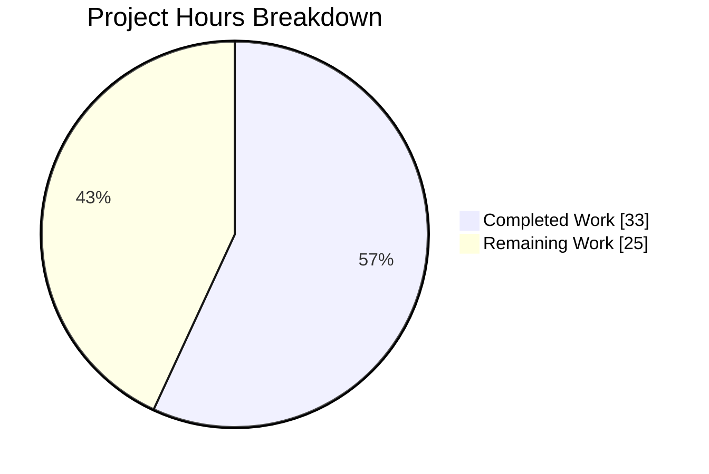
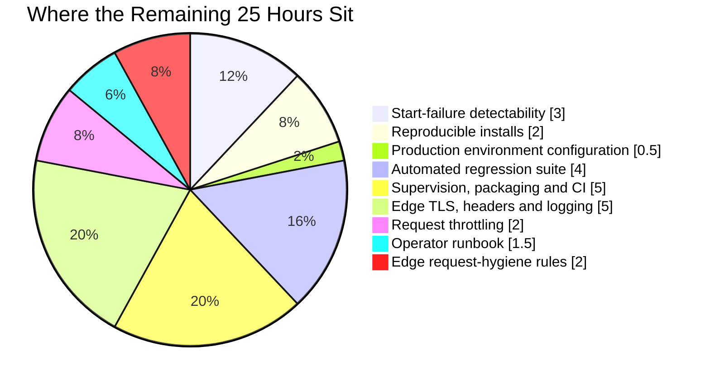
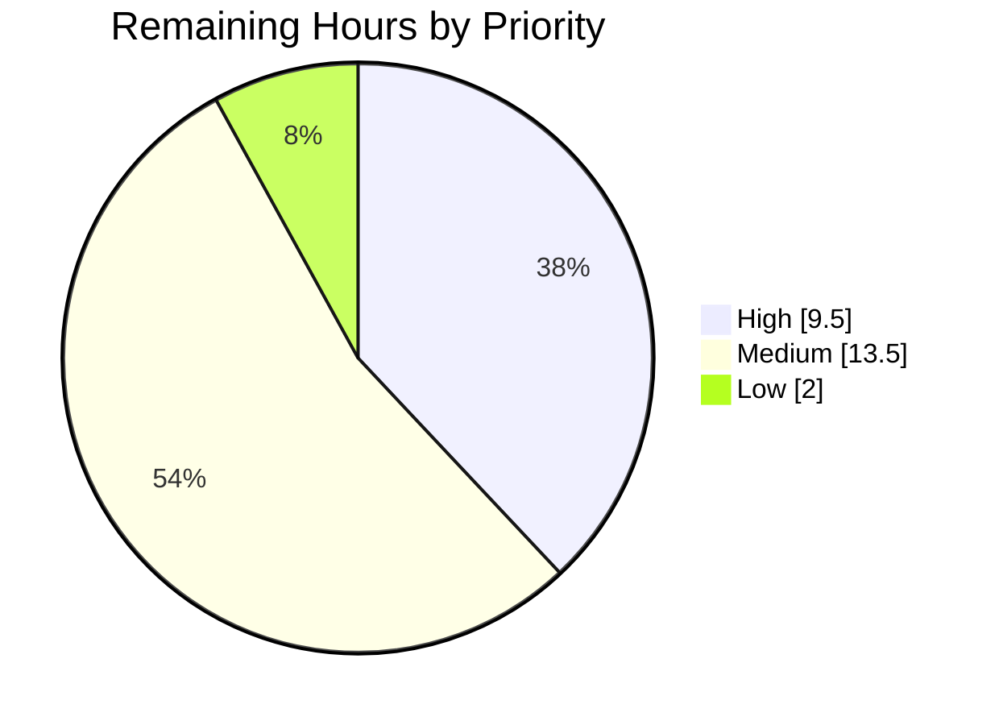

# 1. Executive Summary

## 1.1 Project Overview

This project adds a second route, `GET /good-evening`, to a minimal single-file HTTP service, re-expressing it on Express while leaving the existing `GET /` response untouched. Its users are the developers and operators who run it directly. Scope is deliberately narrow: one application file holding a single executable statement, plus a three-key npm manifest declaring `express` as the only dependency. There is no database, build step, authentication or user interface.

## 1.2 Completion Status


Chart colours: Completed = Dark Blue `#5B39F3`, Remaining = White `#FFFFFF`.

| Metric | Value |
|---|---|
| **Total Hours** | **58** |
| Completed Hours (AI + Manual) | 33 (33 AI + 0 Manual) |
| Remaining Hours | 25 |
| **Percent Complete** | **56.9%** |

33 ÷ (33 + 25) = **56.9%**. Every agreed requirement is delivered; the 25 remaining hours are path-to-production work the scope excluded.

## 1.3 Key Accomplishments

- `GET /good-evening` serves `Good evening\n` — 200, 13 bytes, `Content-Type: text/plain; charset=utf-8`.
- `GET /` is unchanged — 200, `Hello, World!\n`, 14 bytes, still emitting no `Content-Type`.
- The new route issues a weak `ETag`, and `If-None-Match` returns 304.
- `express` is the sole dependency and installs cleanly to 5.2.1 with no lockfile.
- CommonJS resolution is preserved: the manifest omits `type`, so `require(...)` keeps working.
- Boot, serve, stop and restart are deterministic, with one 41-byte startup line and nothing more.
- Unmatched paths, other methods and hostile inputs hit framework defaults with no disclosure, no 5xx and no crash.
- The change spans two files — one modified, one created — and adds no documentation, lockfile or test file.

## 1.4 Critical Unresolved Issues

Fifteen items are live: one unresolved, because no fix exists inside the agreed specification, and fourteen accepted consequences of it, closable at an edge or by amending the specification. The groups below sum to 15.

| Issue | Impact | Owner | ETA |
|---|---|---|---|
| A start that never acquired port 3000 reports success — exit 0, the startup banner, empty stderr, nothing listening (1 item, **unresolved**) | A supervisor, CI step or operator cannot tell a failed start from a successful one; a restart-on-failure policy sees a clean run | Service owner (specification decision) | 3h once authorised |
| No response security headers on either served route — framework name disclosed, no `nosniff`, no framing policy, no `Cache-Control` (4 items, accepted) | Low today: both bodies are fixed public constants with no input, cookies or session. Material if publicly exposed | Platform / edge owner | Within 5h edge task |
| Framework-default router surface — the 404 echoes the escaped request path, auto-`OPTIONS` discloses `Allow: GET, HEAD`, matching is case-insensitive and tolerates one trailing slash (3 items, accepted) | Reflection is inert and the bypass surface is bounded; relevant only if a cache or WAF fronts the service | Platform / edge owner | Within 2h edge task |
| No request throttling, and duplicate `Host` headers are accepted rather than rejected (2 items, accepted) | A single client can issue unbounded requests; multi-`Host` becomes a smuggling precondition only behind a disagreeing proxy | Platform / edge owner | Within 4h edge tasks |
| No lockfile, so the transitive dependency closure is unpinned (1 item, accepted) | The same commit resolves to different transitive code on different days, and an advisory-affected version can be selected with no audit signal | Service owner (specification decision) | 2h once authorised |
| `GET /` emits no `Content-Type`, so clients MIME-sniff it (1 item, accepted — **the specification requires this**) | Chrome sniffs `text/plain` and falls back to `windows-1252`; harmless for an invariant ASCII constant | No action — reopening the `/` contract only | n/a |
| Deployment posture — development-mode error output armed, plain HTTP with no TLS or HSTS, no application-side request logging (3 items, accepted) | Nothing is disclosed today because no error path is reachable; all three matter the moment the service faces a public network | Platform / edge owner | Within 5.5h of tasks |

## 1.5 Access Issues

| System/Resource | Type of Access | Issue Description | Resolution Status | Owner |
|---|---|---|---|---|
| TCP port 3000 | Host network binding | A hardcoded literal with no environment override, so only one instance can run per host or network namespace — and a bind conflict fails silently rather than reporting an error | Open — constrains automated validation; detect it by checking process liveness after launch | Service owner |
| npm registry | Package download | None — the dependency install completes and resolves `express` to 5.2.1 | No issue | — |
| Repository | Git read/write | None — all operations are local and the working tree is clean | No issue | — |

No credential or secret issue exists: the service reads no environment, stores nothing and calls no external service.

## 1.6 Recommended Next Steps

1. **[High]** Decide how a failed start reports itself — authorise one of the two proven one-line changes, or gate automated starts on process liveness.
2. **[High]** Authorise a lockfile and deploy with `npm ci`, pinning the transitive closure.
3. **[High]** Set `NODE_ENV=production` in the deployment environment; this needs no code change.
4. **[High]** Add an automated contract test for both routes, which requires lifting the no-test-files constraint.
5. **[Medium]** Front the service with a proxy or ingress terminating TLS, adding the absent response headers, throttling and logging requests.

# 2. Project Hours Breakdown

## 2.1 Completed Work Detail

| Component | Hours | Description |
|---|---|---|
| Express re-expression and the new `/good-evening` route | 3.0 | `server.js:1` rewritten from `require('http').createServer(...)` to an Express app with two chained handlers; `res.type('text/plain')` chained ahead of `send` to type the new body; the `/` handler text and the whole `.listen(3000, ...)` tail carried across character-for-character |
| Dependency manifest and CommonJS resolution contract | 1.5 | `package.json` created with exactly `name`, `version` and `dependencies`; `type` deliberately omitted so Node keeps resolving `server.js` as CommonJS; install path kept lockfile-free |
| Closed-scope and no-unrequested-behaviour conformance | 2.5 | Confirmed the change touches only two files, adds no middleware, error handler, environment configuration or hardening, leaves `README.md` byte-identical, and introduces no lockfile, test or CI artifact |
| Route-contract verification, on the wire and in a browser | 4.0 | Both routes exercised for status, byte-exact body, header set and conditional-request behaviour; the deliberate `Content-Type` asymmetry between the two routes confirmed three independent ways in a real browser |
| Unspecified-input and routing-surface verification | 2.5 | Method and path matrix across both routes; the default 404, auto-`OPTIONS` and `HEAD` behaviour; the bounds of case-insensitive and trailing-slash matching established against encoded-separator variants |
| Static review against the dependency's own source | 3.0 | Every Express and Node API assumption behind the single statement confirmed in the installed `express@5.2.1` source; preserved literals compared against the original file; manifest field inventory checked against an exhaustive forbidden-field list |
| Security assessment of the request surface | 5.0 | Entry-point-to-sink trace for both handlers; a hostile-request campaign covering traversal, injection, XSS, CRLF splitting, smuggling, oversized bodies, prototype pollution and long-path patterns; reflected-content inertness proven server-side and in a browser |
| Performance, load and resource characterisation | 3.5 | Startup cost decomposed and attributed; per-route latency percentiles; concurrency headroom to 500 parallel clients; memory and file-descriptor behaviour under sustained load; caching and conditional-request efficiency |
| Boot lifecycle and boot-path verification | 2.5 | Boot, shutdown, port release and restart determinism; startup-log fidelity before and after traffic; the three equivalent boot paths established and the missing test script confirmed as intentional |
| Start-failure root-cause analysis and options appraisal | 3.5 | The false-success start traced to Express's `app.listen` registering the trailing callback as the server's `'error'` listener; candidate fixes enumerated and measured; a no-code-change detection method identified and proven |
| Dependency supply-chain analysis | 2.0 | The unpinned closure demonstrated by resolving the same manifest at two points in time; advisory exposure corroborated from the installed package; every alternative mitigation appraised against the agreed constraints |
| **Total** | **33.0** | Matches Completed Hours in Section 1.2 |

## 2.2 Remaining Work Detail

| Category | Hours | Priority |
|---|---|---|
| Start-failure detectability — apply one of the two proven one-line changes, or gate automated starts on process liveness | 3.0 | High |
| Reproducible dependency installs — authorise and commit a lockfile, deploy with `npm ci` | 2.0 | High |
| Production environment configuration — set `NODE_ENV=production` in the deployment environment | 0.5 | High |
| Automated regression suite for the two-route contract (requires lifting the no-test-files constraint) | 4.0 | High |
| Process supervision, health checking, deployment packaging and a CI pipeline | 5.0 | Medium |
| Edge fronting — TLS termination, HSTS, the absent response security headers, and access logging | 5.0 | Medium |
| Request throttling at that edge | 2.0 | Medium |
| Operator runbook — install prerequisite, the three boot paths, and the bind-verification caveat | 1.5 | Medium |
| Edge request-hygiene rules — duplicate-`Host` rejection and the route-matching strictness decision | 2.0 | Low |
| **Total** | **25.0** | Matches Remaining Hours in Section 1.2 and Section 7 |

## 2.3 Hours Reconciliation

| Check | Value |
|---|---|
| Section 2.1 completed total | 33.0 |
| Section 2.2 remaining total | 25.0 |
| Sum (equals Total Hours in Section 1.2) | 58.0 |
| Completion percentage (33 ÷ 58) | 56.9% |

Every hour above traces either to a requirement in the agreed scope or to a path-to-production activity needed to deploy it. Confidence is **high** on the completed side, where each item corresponds to work visible in the two delivered files and the verification performed against them. Confidence is **high** on the four High-priority remaining items, whose shape is fully known, and **medium** on the edge and packaging items, which depend on the deployment target the owner chooses — a serverless or platform-managed target would absorb some of that work, an operator-managed proxy would not.

# 3. Test Results

The project has no automated test suite and no coverage instrumentation — test files are outside the agreed scope, so `npm test` reports a missing script by design. The results below were produced directly against the delivered tree on Node v22.23.2 / npm 11.18.0, with `express` installed at 5.2.1, and total **80 verification items: 77 passed, 3 failed**. That is a scripted harness of **78 checks (75 passed, 3 failed)** plus **2 browser validation passes (both passed)**, recorded as the final row. The three failures are one behaviour, reported in Section 1.4.

| Area / Category | Framework | Tests | Passed | Failed | Coverage | What This Proves |
|---|---|---|---|---|---|---|
| Static integrity & manifest contract | `node --check`, `JSON.parse`, `npm ls` | 20 | 20 | 0 | No tool configured | The single statement parses, the manifest is valid three-key JSON with `type` absent, `express@^5.x` is the sole dependency, and no lockfile, test or CI artifact exists |
| Route response contract | `curl` + `cmp` byte comparison | 16 | 16 | 0 | No tool configured | Both routes answer 200 with byte-exact bodies, `/good-evening` is typed `text/plain; charset=utf-8` with a working 304 revalidation, and `/` still emits no `Content-Type` |
| Unspecified-input surface | `curl` method/path matrix | 15 | 15 | 0 | No tool configured | Unmatched paths, other methods, traversal and source-disclosure attempts all land on framework defaults with no file content returned and no reflected query value |
| Security posture assertions | `curl` header inspection, `/proc` | 10 | 10 | 0 | No tool configured | The response header set is exactly as specified, transport is plain HTTP only, and no stack frame or filesystem path appears in any error body |
| Load, stability & log fidelity | `curl` + `xargs -P 20` | 7 | 7 | 0 | No tool configured | 100 concurrent and 50 sequential requests all succeed with no throttling, both bodies stay byte-identical, and the process writes nothing beyond its one startup line |
| Shutdown & restart determinism | `curl`, signal handling | 5 | 5 | 0 | No tool configured | The port is released on shutdown, a restart reprints one byte-exact banner and serves identically, and no listener is left behind |
| Start under port contention | `curl`, process liveness | 5 | 2 | **3** | No tool configured | A start that never acquired the port still exits 0 and prints the success banner with empty stderr; only one listener ever exists and the original holder keeps serving |
| Browser rendering & network | Headless Chrome | 2 | 2 | 0 | No tool configured | Both routes render their exact text with zero script nodes and zero application console errors, and the 404's reflected path is inert — escaped server-side, no dialog, no injected element |
| **Total** | — | **80** | **77** | **3** | None configured | — |

### Not Covered

No capability in this project is covered by an automated test, because the agreed scope excludes test files, test suites and test frameworks. Every result above was produced by a manual run and none of it will re-run on a future change. Before release, a human should:

- **Add a contract test for both routes** asserting status, byte-exact body, the `Content-Type` present/absent asymmetry and the 304 revalidation. This is the single highest-value gap: the `/` route's missing `Content-Type` is a deliberate, easily-broken property that nothing currently guards.
- **Test the start path under contention** in whatever supervisor or orchestrator will run the service, since the exit code and startup line cannot be trusted as evidence of a bind.
- **Re-test after any dependency install**, because the transitive closure is unpinned and can change between installs of the same commit.
- **Exercise the service through its intended edge** once a proxy or ingress is in front of it; everything verified here was measured against the service directly, with nothing between the client and the port.

# 4. Runtime Validation & UI Verification

The service was installed, started, driven and shut down against the delivered tree, and both routes were additionally loaded in a real headless browser. This project has no user interface — both routes return plain text — so the browser work verifies rendering, response headers and client-side behaviour rather than any visual design.

- ✅ **Dependency install** — `npm install` completes with exit 0, resolving 68 packages and `express@5.2.1` from the declared range, producing no lockfile.
- ✅ **Service start-up** — `node server.js` binds TCP 3000 and prints exactly one 41-byte line, `Server running at http://127.0.0.1:3000/`, with nothing on stderr.
- ✅ **`GET /`** — 200 with `Hello, World!\n` (14 bytes) and exactly five response headers, none of them `Content-Type`; the browser MIME-sniffs it to `text/plain` and renders the text, confirming the header's absence three independent ways.
- ✅ **`GET /good-evening`** — 200 with `Good evening\n` (13 bytes), `Content-Type: text/plain; charset=utf-8` and a weak `ETag`; renders identically in the browser, with the character set correctly derived as UTF-8.
- ✅ **Conditional requests** — `If-None-Match` against the issued `ETag` returns 304 with no body.
- ✅ **Unmatched paths and other methods** — `POST`, `PUT`, `DELETE` and unknown paths return the framework's default 404; `HEAD` returns 200; `OPTIONS` returns 200 with `Allow: GET, HEAD`.
- ✅ **Reflected-content safety** — a raw `<script>` payload in the request path comes back percent-encoded as literal text with no script, image or frame element created and no dialog fired; a query-string payload is ignored entirely. The escaping is applied server-side, so it does not depend on a well-behaved client.
- ✅ **Concurrency and stability** — 100 parallel requests all succeed, both bodies stay byte-identical afterwards, and the process writes no further output, confirming there is no per-request logging.
- ✅ **Shutdown and restart** — the port is released on shutdown and a restart serves identically, reprinting one byte-exact banner.
- ⚠ **Start under port contention** — a second start against an occupied port 3000 exits 0, prints the success banner and writes nothing to stderr while binding nothing. Process liveness detects this about a second after launch; a port probe does not, because the existing holder answers it.

**Never exercised at runtime:** the service was only ever reached directly on loopback. It has not been run behind a reverse proxy, load balancer or ingress, over TLS, under a process supervisor or orchestrator, or with `NODE_ENV` set — so the behaviour of the development-mode error path under a production environment value, and the service's behaviour behind an edge that rewrites or adds headers, are both unverified.

# 5. Compliance & Quality Review

## 5.1 Compliance Matrix

Each row is the verified state of a deliverable as it stands now.

| # | Deliverable | Benchmark | Status | Evidence |
|---|---|---|---|---|
| 1 | `GET /good-evening` — registered, 200, body `Good evening\n` (13 bytes), typed by `res.type(...)` chained ahead of `send` | Functional contract | ✅ Pass — 100% | `server.js:1`; 200 with a 13-byte byte-exact body and `Content-Type: text/plain; charset=utf-8` |
| 2 | `GET /` preserved — 200, `Hello, World!\n`, no `Content-Type` | Backward compatibility | ✅ Pass — 100% | `server.js:1`; handler text identical to the original file; `Content-Type` header count 0 |
| 3 | Port literal, listen callback and startup log preserved verbatim | Backward compatibility | ✅ Pass — 100% | `server.js:1`; 41-byte startup line byte-exact; no environment lookup present |
| 4 | One line, one executable statement, terse style | Diff minimalism | ✅ Pass — 100% | `server.js` is 220 bytes, 1 line, 1 semicolon, inline arrow handlers only |
| 5 | Dependency and CommonJS seam — `require('express')` the sole import, `require('http')` removed, `type` omitted | Runtime correctness | ✅ Pass — 100% | `server.js:1` closes 1↔1 against `package.json:4`; no `type` key, so the service boots and `require(...)` resolves |
| 6 | Manifest carries exactly `name`, `version`, `dependencies` | Minimal configuration | ✅ Pass — 100% | `package.json:1-5`; 98 bytes; every excluded field absent |
| 7 | No lockfile, and no unrequested behaviour added | Agreed exclusions | ✅ Pass — 100% | No lockfile of any flavour in the tree; `server.js` has no middleware, error handler, environment lookup or hardening construct |
| 8 | Closed two-file scope; documentation untouched | Scope discipline | ✅ Pass — 100% | Branch diff is exactly one file created and one modified; `README.md` byte-identical at 22 bytes |
| 9 | Code hygiene — no placeholders, stubs or dead code | Production readiness | ✅ Pass — 100% | No `TODO`/`FIXME`/`HACK`/placeholder marker in any tracked file; both handlers return real computed responses |
| 10 | Automated regression coverage | Production readiness | ❌ Not met — 0% | No test file, suite or runner exists; excluded from the agreed scope (see 5.2) |
| 11 | Reproducible dependency resolution | Production readiness | ❌ Not met — 0% | No lockfile, so the transitive closure is re-resolved at every install (see 5.2) |
| 12 | Start-failure observability | Production readiness | ❌ Not met — 0% | A start that never bound still exits 0 and reports success (see 5.2) |

## 5.2 AAP & Rule Divergences and Gaps

Eight divergences were established. Two are sanctioned — you explicitly asked for them — and the rest follow from the eleven numbered constraints the request carried.

| What the AAP/Rule Required | What Was Delivered Instead | Why It Diverged | Impact | Remediation |
|---|---|---|---|---|
| **V1.** Preserve the port literal, the listen callback and the startup log verbatim inside one statement, and add no `'error'` listener | Exactly that — `server.js:1` is the specified statement. The consequence is that a start against an occupied port reports false success | The dependency's `listen` registers the trailing callback as the server's `'error'` listener, so the banner callback consumes the bind error. Verifying framework behaviour was itself excluded from scope, so the plan assumed the previous major's behaviour | A failed start is indistinguishable from a successful one by exit code or output | Authorise one of two proven one-line changes, or gate automated starts on process liveness (3.0h) |
| **V2.** Create and commit no lockfile | No lockfile — as specified | Explicit constraint, restated three times in the agreed scope | Installs are not reproducible; an advisory-affected transitive version can be selected with no audit signal | Authorise a lockfile and deploy with `npm ci` (2.0h) |
| **V3.** Add no test suite and no test files | None added | Explicit constraint | The delivered contract has no automated regression protection | Add a contract test for both routes once the constraint is lifted (4.0h) |
| **V4.** Add no hardening, security middleware or unrequested behaviour | None added — no response security headers, no throttle, no request guard, no TLS, no logging, no environment configuration | Explicit constraints, restated across the agreed exclusions | Acceptable for a local or internal service; materially exposed on a public network | Apply at a reverse proxy or ingress rather than in this code (5.0h + 2.0h + 2.0h) |
| **V5.** `GET /` must emit no `Content-Type` | No `Content-Type` — as specified | The requirement that `/` be unchanged; the original handler writes through the raw response writer, which sets no media type | Clients MIME-sniff the body; harmless for an invariant ASCII constant | None required — action only if the `/` contract is deliberately reopened |
| **V6.** *(Sanctioned)* Add `express` as the sole new dependency | `express` added | Your explicit instruction, which supersedes the prior zero-dependency constraint | The service is no longer runnable from a clean checkout; an install is now a prerequisite | Record the install step in the operator runbook (within 1.5h) |
| **V7.** *(Sanctioned)* Take the dependency version as given; perform no version verification | The range was declared unverified | Your explicit instruction | This is the upstream cause of V1 — the behaviour change that produced it would have been caught by verification | Closed together with V1 |
| **V8.** The operator-facing expectation that `npm start` fails with a missing script | `npm start` boots the service | The package manager applies a documented default-start fallback when a `server.js` sits at the package root; the recorded expectation was simply wrong about it | Automation written against the old expectation would be misinformed in both directions | Correct the runbook; do not add a `scripts` key (within 1.5h) |

**V1 — false-success start.** The agreed scope froze `.listen(3000,()=>console.log('Server running at http://127.0.0.1:3000/'))` verbatim and separately forbade any `'error'` listener. Express registers the trailing `listen` callback as the server's `'error'` listener whenever that last argument is a function, so `EADDRINUSE` invokes the zero-argument banner callback, which discards it, and Node never throws. Reproduced directly: a second `node server.js` exits **0**, prints the 41-byte banner, writes 0 bytes to stderr and binds nothing (`server.js:1`). The previous implementation exited 1 with a kilobyte of diagnostic, so this is an operational regression. Decide between the two proven one-line changes or adopt a liveness-gated start — a port probe will not do, because the existing holder answers it.

**V2 — unpinned dependency closure.** Three separate clauses of the agreed scope forbid a lockfile, and `package.json:4` declares a range rather than a resolution. Resolving that same manifest at two points in time yields materially different closures — differing package counts and a different `proxy-addr` version, one of which its own changelog records as superseded for a security fix. Worse, the audit tool reports nothing at the affected version, so a deployer would be neither pinned nor warned. `npm ci` cannot substitute, since it requires the very artifact the scope forbids. This is an owner decision: permit the lockfile and switch deployments to `npm ci`, or accept that the same commit is not the same code twice.

**V3 — no automated coverage.** Test files, suites and frameworks are all excluded, so `npm test` reports a missing script by design and nothing guards the delivered contract on a future edit. The exposure is concrete rather than theoretical: the `/` route's absence of a `Content-Type` is a deliberate property produced by one specific writer call, and an innocuous-looking change to `res.send` would silently break it. The remediation is small — a single file asserting status, byte-exact bodies, the header asymmetry and the 304 revalidation — but it needs the constraint lifted first, since adding it today would itself be a scope violation.

**V4 — no hardening.** The agreed exclusions rule out security middleware, hardening, environment configuration, logging, CORS and body parsing by name, and the delivered code contains none of them. Measured consequences: the framework name is disclosed on every response, neither 200 carries `nosniff`, a framing policy or `Cache-Control`, nothing throttles requests, duplicate `Host` headers are accepted, transport is plain HTTP with no HSTS, and the service writes no request log. None of this is a code defect — every one of these belongs at a reverse proxy or ingress, where it needs no change to this repository. Decide whether the deployment target warrants that edge before exposing the service beyond a trusted network.

**V5 — no media type on `GET /`.** This is the one divergence the specification positively requires: the `/` contract states that no `Content-Type` is emitted, and the mechanism is the original handler's raw response writer, carried across character-for-character (`server.js:1`). Confirmed in a browser, which sniffs the body to `text/plain` and falls back to `windows-1252` because no charset is declared either. Both facts are harmless for a fixed 14-byte ASCII constant, and neither is correctable without emitting a header and thereby breaking the requirement that `/` be unchanged. Treat any change here as a contract decision, not a bug fix.

**V6 — clean-checkout runnability ended.** The service previously ran from a fresh checkout with no install step, a property the earlier technical specification recorded as a constraint. Your request explicitly added `express`, which supersedes it, so this is a sanctioned divergence rather than a defect. The practical effect is concrete and reproducible: running the two delivered files without `node_modules` fails immediately with `Error: Cannot find module 'express'`. The diff deliberately performs no install, so whoever runs the service must do it. Record that prerequisite wherever the service is documented or automated — it is the single most likely cause of a first-run failure.

**V7 — dependency behaviour taken on trust.** The request forbade registry lookups, test installs and any re-derivation of framework behaviour, so the latest stable major was declared as given. That instruction is the direct upstream cause of V1: the previous Express major's `listen` registers no `'error'` listener, and the current one does, which is precisely the behaviour change the excluded verification would have surfaced before the callback form was frozen. No separate work applies — V1's fix closes it. The lesson worth carrying forward is that freezing a call's exact shape and declining to verify the library's behaviour at that call are a poor combination.

**V8 — wrong boot-path expectation.** The operator-facing guidance recorded that `npm start` would fail with a missing script and that `node server.js` was the only way to boot. Neither holds: the package manager's documented default-start fallback runs `node server.js` because a `server.js` sits at the package root, so `node server.js`, `npm start` and `npm run start` are three equivalent boot paths, and only a named script such as `npm test` reports a missing script. No repository file carries the incorrect claim — `README.md` is 22 bytes of title text and is out of scope — and the manifest is correct as delivered. Fix the runbook, and specifically do not add a `scripts` key to make the old expectation true.

# 6. Risk Assessment

These are forward-looking risks to the service in production, not items already closed.

| Risk | Category | Severity | Probability | Mitigation | Status |
|---|---|---|---|---|---|
| A failed start is indistinguishable from a successful one — exit 0 and the startup banner appear even when nothing was bound | Technical / Operational | High | High — certain whenever port 3000 is already held | Gate every automated start on process liveness about a second after launch; a port probe gives a false pass because the existing holder answers it. Or authorise one of the two proven one-line changes | Open — accepted by the agreed scope |
| Unpinned transitive dependency closure | Security (supply chain) | Medium | Medium | Commit a lockfile and deploy with `npm ci`. Until then, every install re-resolves and can select an advisory-affected transitive version with no audit signal | Accepted by the agreed scope |
| No automated regression coverage for the delivered contract | Technical | Medium | High — on any future edit | Add a contract test asserting both routes' status, byte-exact bodies, the `Content-Type` asymmetry and the 304 revalidation; requires the no-test-files constraint to be lifted | Open |
| Development-mode error output is armed | Security | High | Low today — no error path is reachable, since neither handler can throw | Set `NODE_ENV=production` in the deployment environment before adding any component that can throw. Measured to suppress stack frames and filesystem paths entirely, with no code change | Accepted — deployment-level fix available |
| Unencrypted transport with no HSTS | Security | High if publicly exposed | Low while internal | Terminate TLS and emit `Strict-Transport-Security` at a reverse proxy, load balancer or ingress; keep the service on plain HTTP behind it | Accepted by design |
| No request throttling or connection cap | Operational (availability) | Medium | Medium | Throttle at the edge or WAF. The service absorbs bursts and floods without wedging or leaking descriptors, but bounds nothing itself | Accepted by the agreed scope |
| No application-side request logging | Operational | Medium | Medium | Capture access logs at the edge, ingress or platform layer. An attack against the service leaves no trace in its own output, which is one startup line and nothing more | Accepted by the agreed scope |
| Install prerequisite and a fixed, non-configurable port | Integration | Low | Medium | Record `npm install` as a deployment step, and run one instance per host or network namespace. Sharing a host with another listener on 3000 fails — and fails silently | Open |

# 7. Visual Project Status

Brand colours applied throughout: **Completed = Dark Blue `#5B39F3`**, **Remaining = White `#FFFFFF`**, headings and accents Violet-Black `#B23AF2`, highlights Mint `#A8FDD9`.

### Overall Progress — 56.9% Complete



### Delivered Scope vs Path to Production



### Priority Distribution of Remaining Work



### Requirement Status


All twelve requirements in the agreed scope are delivered and verified. The 25 remaining hours are entirely path-to-production work that the scope deliberately excluded — which is why requirement completion reads 12 of 12 while overall project completion reads 56.9%.

# 8. Summary & Recommendations

**What was delivered.** The service now serves two routes instead of one. `GET /good-evening` returns `Good evening\n` as 200 with `Content-Type: text/plain; charset=utf-8`, and `GET /` returns `Hello, World!\n` exactly as it always did — same status, same 14 bytes, and still with no `Content-Type` header, which was the harder half of the requirement and the easiest thing to break. The change is confined to two files: `server.js`, still one executable statement on one line, and a new three-key `package.json` declaring `express` as the only dependency and deliberately omitting `type` so the existing `require(...)` keeps resolving. Nothing else in the repository moved; `README.md` is byte-identical and no lockfile, test, configuration or documentation file was added.

**What was verified.** Both routes were exercised on the wire and in a real browser for status, byte-exact bodies, header sets and conditional-request behaviour, and the deliberate `Content-Type` asymmetry between them was confirmed three independent ways. Around the contract, the framework-default surface was mapped — unmatched paths, other methods, `HEAD`, `OPTIONS`, and the bounds of case-insensitive and trailing-slash matching — and a hostile-request campaign covering traversal, injection, cross-site scripting, response splitting, oversized bodies and long-path patterns produced no disclosure, no server error and no crash, with the 404's reflected path proven inert by server-side encoding rather than by client good behaviour. Under load the service serves 100 concurrent requests without throttling, absorbs a half-open connection flood without leaking descriptors, and writes nothing beyond its single 41-byte startup line. A scripted harness of 78 checks run against the delivered tree passed 75.

**What remains.** Three of the 78 checks fail, and they are all one behaviour: a start that never acquired port 3000 still exits 0 and prints the success banner with empty stderr, because the framework registers the startup-log callback as the server's own error listener. There is no fix available inside the agreed scope, so this needs an owner decision — one of two measured one-line changes, or gating automated starts on process liveness. Beyond it, the path to production is what the scope deliberately excluded: no lockfile, so installs are not reproducible; no automated tests, so the contract has no regression protection; and no hardening, TLS, throttling or request logging, all of which belong at a reverse proxy or ingress rather than in this code. Setting `NODE_ENV=production` in the deployment environment is the cheapest high-value action on the list, at half an hour and no code change.

**Critical path and readiness.** The project stands at **56.9% complete** — 33 hours delivered against 25 remaining — with all twelve agreed requirements met and verified. The critical path is short: decide the start-failure question, authorise a lockfile, set the production environment value, and add a contract test. That is 9.5 hours of High-priority work, after which the remaining 15.5 hours are deployment packaging and edge configuration that can proceed in parallel with use. As it stands the service is ready to run on a trusted internal network, where its accepted posture is proportionate to two fixed public text constants. It is **not** ready to face a public network until TLS, response headers, throttling and access logging are in place at an edge in front of it.

**Success metrics.** Consider this work closed when: both routes' contracts are asserted by an automated test that runs on every change; a start that fails to bind exits non-zero or is caught by a liveness gate; `npm ci` installs a pinned closure from a committed lockfile; `NODE_ENV=production` is set wherever the service runs; and access logs for the service are visible in whatever observability system the deployment uses.

# 9. Development Guide

Every command below was executed against this repository and its output is what you should expect. Run them from the repository root unless stated otherwise.

## 9.1 System Prerequisites

| Requirement | Version used | Notes |
|---|---|---|
| Node.js | v22.23.2 | `express@5.2.1` declares `engines: { node: ">= 18" }`, so any 18+ runtime works |
| npm | 11.18.0 | Ships with the Node install; no version manager is used or needed |
| Operating system | Linux (any POSIX host) | No platform-specific code; nothing is compiled |
| Disk | ~5 MB | `node_modules/` is 4.4 MB; the tracked source is 340 bytes |
| Network | Outbound HTTPS to the npm registry, once | Only for the dependency install; the service itself makes no outbound call |

There is **no build step, no database, no message broker, no container and no credential**. The service reads no environment variables and has no authentication, so there is nothing to configure before running it.

```bash
node --version    # expect v22.23.2 (or any >= 18)
npm --version     # expect 11.18.0
```

## 9.2 Environment Setup

Per-project isolation is the checkout's own `node_modules/` directory — there is no virtual environment to create and no `.env` file to populate.

```bash
cd <repository root>
CI=true npm install --no-package-lock --no-audit --no-fund
```

Expected: exit 0, and on a cold cache `added 68 packages in ~1s`. On a warm cache you will see `up to date`.

- `--no-package-lock` is **required**. A lockfile is outside the agreed scope; if a `package-lock.json` appears, delete it and do not commit it.
- `node_modules/` will always show as untracked in `git status`, because the scope excludes adding a `.gitignore`. That is expected — never commit it.
- Never add `scripts`, `engines`, `license` or `type` to `package.json`. `type` in particular must stay absent; adding `"type":"module"` breaks the application outright.

Verify the install:

```bash
npm ls --depth=0
# expect: hello-world-server@1.0.0
#         └── express@5.2.1
```

## 9.3 Application Startup

Three equivalent boot paths, all verified. There is no start-up ordering to observe — this is a single process with no dependencies to bring up first.

```bash
node server.js      # the direct path
npm start           # equivalent: npm's default-start fallback runs `node server.js`
npm run start       # equivalent: the same code path as `npm start`
```

Expected output, on stdout, exactly once and nothing further:

```
Server running at http://127.0.0.1:3000/
```

`npm start` and `npm run start` prefix two lines of their own (`> hello-world-server@1.0.0 start` and `> node server.js`) before that line. The service listens on **TCP 3000**, which is a hardcoded literal with no environment override — only one instance can run per host or network namespace.

To run it in the background and keep the process id, which you will need for the verification step below:

```bash
node server.js > server.log 2>&1 &
SERVICE_PID=$!
sleep 1
```

`server.log` is written into the working directory and will show as untracked; delete it when you are done, or redirect elsewhere.

## 9.4 Verification Steps

**Step 1 — confirm the process actually bound the port.** Do this by liveness, not by the exit code or the log line:

```bash
kill -0 "$SERVICE_PID" && echo "BIND OK (process alive)" || echo "BIND FAILED"
```

This matters. If port 3000 was already held, the process prints `Server running at http://127.0.0.1:3000/`, exits 0 and binds nothing — and a `curl` against the port will still return 200 because the *existing holder* answers it. Process liveness is the only reliable check; the banner and the exit code are not evidence of a bind.

**Step 2 — verify both route contracts:**

```bash
curl -i http://127.0.0.1:3000/
curl -i http://127.0.0.1:3000/good-evening
```

Expected for `GET /` — 200 with exactly five headers and **no** `Content-Type`:

```
HTTP/1.1 200 OK
X-Powered-By: Express
Date: <date>
Connection: keep-alive
Keep-Alive: timeout=5
Content-Length: 14

Hello, World!
```

Expected for `GET /good-evening` — 200 with seven headers, including the media type and a weak validator:

```
HTTP/1.1 200 OK
X-Powered-By: Express
Content-Type: text/plain; charset=utf-8
Content-Length: 13
ETag: W/"d-7fFyiNLFhmJrNT+BforqesSHNow"
Date: <date>
Connection: keep-alive
Keep-Alive: timeout=5

Good evening
```

The missing `Content-Type` on `/` is deliberate and required — do not "fix" it.

**Step 3 — stop the service by the process id you captured:**

```bash
kill "$SERVICE_PID"
curl -s -o /dev/null -w '%{http_code}\n' --max-time 2 http://127.0.0.1:3000/   # expect 000
```

**Per-change validation.** Run these after editing either file:

```bash
node --check server.js                                                      # expect exit 0
node -e "JSON.parse(require('fs').readFileSync('package.json','utf8'))"     # expect exit 0
```

## 9.5 Example Usage

```bash
# The new route
curl -s http://127.0.0.1:3000/good-evening
# -> Good evening

# The preserved route
curl -s http://127.0.0.1:3000/
# -> Hello, World!

# Conditional request against the issued validator -> 304, no body
curl -s -o /dev/null -w '%{http_code}\n' \
  -H 'If-None-Match: W/"d-7fFyiNLFhmJrNT+BforqesSHNow"' \
  http://127.0.0.1:3000/good-evening
# -> 304

# Method discovery on a registered path
curl -s -D - -o /dev/null -X OPTIONS http://127.0.0.1:3000/good-evening | grep -i '^allow:'
# -> Allow: GET, HEAD

# Anything else falls to the framework default
curl -s -o /dev/null -w '%{http_code}\n' http://127.0.0.1:3000/nope
# -> 404
```

## 9.6 Troubleshooting

| Symptom | Cause | Resolution |
|---|---|---|
| `Error: Cannot find module 'express'` with `code: 'MODULE_NOT_FOUND'`, exit 1 | The dependency install was skipped. The service is deliberately not runnable from a clean checkout | Run the install command in §9.2 |
| `ReferenceError: require is not defined in ES module scope, you can use import instead`, exit 1 | `"type":"module"` was added to `package.json` | Remove the `type` key. Its absence is what keeps `server.js` resolving as CommonJS |
| `npm error Missing script: "test"`, exit 1 | There is no `test` script, and no test suite | Expected behaviour, not a breakage. The scope excludes test files and a `scripts` block |
| The startup banner appears but nothing is being served by *your* process | Port 3000 was already held. The process exits 0 after printing success, and the existing holder answers your requests | Check process liveness as in §9.4 Step 1. Stop the other listener, or run in a separate network namespace |
| `npm run` lists no scripts and `npm pkg get scripts` returns `{}` | The manifest has no `scripts` key | Correct and required. Do not add one |
| `node_modules/` and artifact directories show as untracked in `git status` | The scope excludes adding a `.gitignore` | Expected. Never commit them |
| Response bodies look right but a trailing newline is missing | Both bodies end in a line feed — 14 and 13 bytes respectively | Compare with `cmp` against `printf 'Hello, World!\n'` / `printf 'Good evening\n'`, not by eye |

# 10. Appendices

## A. Command Reference

| Purpose | Command | Expected result |
|---|---|---|
| Install dependencies | `CI=true npm install --no-package-lock --no-audit --no-fund` | Exit 0; 68 packages; no lockfile produced |
| Verify the dependency tree | `npm ls --depth=0` | `hello-world-server@1.0.0` → `express@5.2.1` |
| Syntax-check the application | `node --check server.js` | Exit 0, no output |
| Validate the manifest | `node -e "JSON.parse(require('fs').readFileSync('package.json','utf8'))"` | Exit 0, no output |
| Start the service | `node server.js` | One line: `Server running at http://127.0.0.1:3000/` |
| Start via the package manager | `npm start` or `npm run start` | Two npm banner lines, then the startup line |
| Confirm a successful bind | `kill -0 "$SERVICE_PID"` | Exit 0 means the process is alive and bound |
| Exercise the new route | `curl -i http://127.0.0.1:3000/good-evening` | 200, 13 bytes, `text/plain; charset=utf-8` |
| Exercise the preserved route | `curl -i http://127.0.0.1:3000/` | 200, 14 bytes, no `Content-Type` |
| Stop the service | `kill "$SERVICE_PID"` | Port released; a later request returns `000` |
| Inspect the branch change set | `git diff --stat $(git merge-base HEAD origin/2009_01)...HEAD` | 2 files changed, 6 insertions, 1 deletion |

## B. Port Reference

| Port | Protocol | Used by | Configurable? |
|---|---|---|---|
| 3000 | HTTP (plain, no TLS) | The service's only listener, bound as `[::]:3000` | **No** — a hardcoded literal with no environment override. One instance per host or network namespace |

No other port is opened. There is no TLS listener; a TLS handshake attempted against 3000 fails, because the port answers with HTTP bytes.

## C. Key File Locations

| Path | Role | Size | State |
|---|---|---|---|
| `server.js` | The entire application — one executable statement registering both routes and binding the listener | 220 bytes, 1 line | Modified by this work |
| `package.json` | Dependency manifest: `name`, `version`, `dependencies` only; `type` deliberately absent | 98 bytes, 5 lines | Created by this work |
| `README.md` | Repository title text only; holds no operational guidance | 22 bytes | Untouched |
| `node_modules/` | Installed dependency closure, 68 packages | 4.4 MB | Untracked, never committed |

The tracked source is three files totalling 340 bytes. There is no `src/`, no `routes/`, no test directory, no CI configuration, no lockfile and no `.gitignore`.

## D. Technology Versions

| Component | Version | Notes |
|---|---|---|
| Node.js | v22.23.2 | Satisfies `express`'s `>= 18` floor |
| npm | 11.18.0 | Applies a default-start fallback, which is why `npm start` boots the service without a `scripts` block |
| express | 5.2.1 | Resolved from the declared `^5.x`; declares 28 direct dependencies, all as ranges |
| Installed closure | 68 packages | Re-resolved at every install — there is no lockfile pinning it |

## E. Environment Variable Reference

| Variable | Read by the service? | Recommendation |
|---|---|---|
| *(none)* | No | The service reads no environment variable at all. The port, the log string and both response bodies are literals in `server.js` |
| `NODE_ENV` | Not read by the application, but read by the framework | **Set it to `production` in the deployment environment.** It is currently unset, which puts the framework in development mode, where its built-in error handler would write stack traces and absolute filesystem paths into responses. No error path is reachable today, but this is the cheapest safeguard available and needs no code change |
| `CI` | No | Used only to keep the dependency install non-interactive |

There is no `.env` file, no secret provider and no configuration layer. Nothing needs to be supplied for the service to run.

## F. Developer Tools Guide

| Tool | Configured? | Notes |
|---|---|---|
| Linter | No | No linter configuration exists and adding one is outside the agreed scope. `node --check` and a byte-exact comparison serve as the parse gate |
| Formatter | No | The file's terse single-statement style is required; do not reformat, reindent or rename `req`/`res` |
| Test runner | No | Excluded from the agreed scope. `npm test` reports a missing script by design. This is the largest production-readiness gap — see §5.2 |
| Type checker | No | Plain CommonJS JavaScript; no type packages are declared |
| Build tool | No | There is nothing to build. The file runs as written |
| Coverage tool | No | None configured, so no coverage figure exists for any part of the service |

**Working on this code.** The single statement is the entire application, so every change is a change to one line. Two properties in it are load-bearing and easy to break by accident: the `/` handler must keep writing through `res.end` (switching it to `res.send` or adding `res.type` would emit a `Content-Type` and break the requirement that `/` be unchanged), and `package.json` must never gain a `type` key.

## G. Glossary

| Term | Meaning in this project |
|---|---|
| **The contract** | The agreed response specification: `GET /good-evening` → 200, `Good evening\n`, `text/plain; charset=utf-8`; `GET /` → 200, `Hello, World!\n`, no `Content-Type` |
| **False-success start** | A start that never acquired port 3000 yet exits 0 and prints the success banner, because the framework registers the startup-log callback as the server's error listener |
| **Liveness gate** | Checking that the started process is still alive about a second after launch — the only reliable way to confirm a bind, since a port probe is answered by whichever process holds the port |
| **Framework default surface** | Behaviour for methods and paths the contract does not specify: the default 404, the automatic `OPTIONS` responder, `HEAD` on a `GET` route, and case-insensitive non-strict path matching |
| **Unpinned closure** | The set of 68 installed packages, re-resolved from version ranges at every install because no lockfile records what was previously chosen |
| **Accepted by specification** | A gap that is a consequence of the agreed scope rather than a defect — reported so the owner can decide, not fixed |
| **Weak validator** | The `W/`-prefixed `ETag` on `/good-evening`, which lets `If-None-Match` return 304 instead of resending the body |
