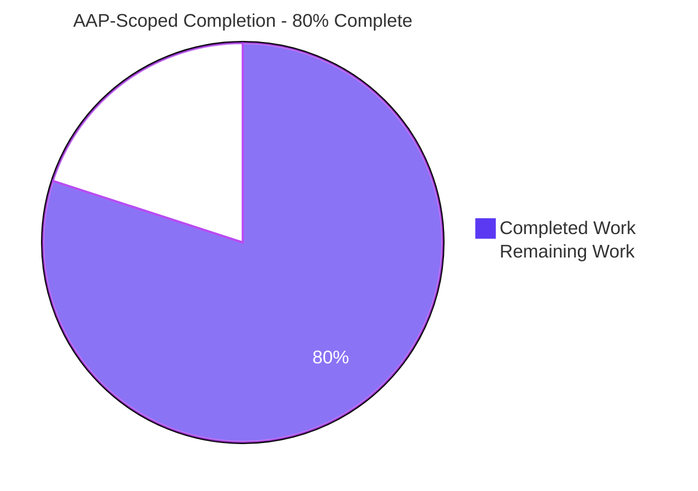
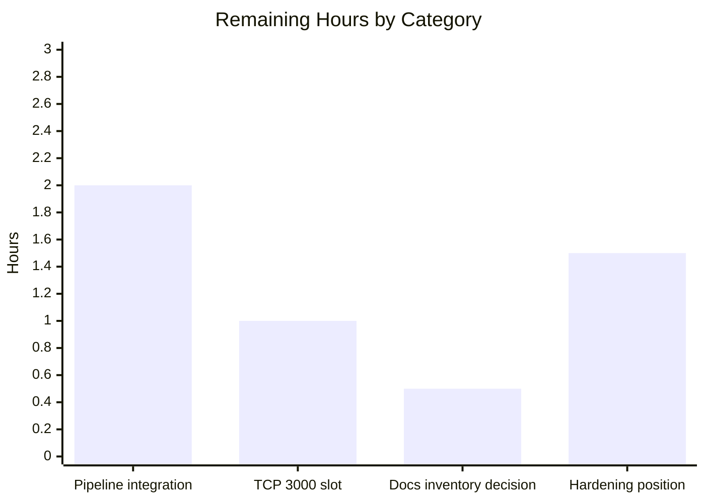

# 1. Executive Summary

## 1.1 Project Overview

`check_billing_sep_01` is a minimal Node.js HTTP service whose single entry point answers every request with HTTP 200 and the 14-byte body `Hello, World!\n`. This work gave the repository its first automated test: `server.test.js`, a two-case suite that asserts that response contract over a live socket using only the Node runtime — no dependency, manifest, lockfile or configuration file enters the repository. The audience is the developer or pipeline that needs a fast, install-free regression gate on the service's response contract. Technical scope is one 19-line file at the repository root, run with `node --test server.test.js`, plus the runtime verification that proves its assertions genuinely bite.

## 1.2 Completion Status

AAP-scoped completion, measured in engineering hours: **20.0 completed / 25.0 total × 100 = 80%**.



| Metric | Value |
|---|---|
| Total Hours | 25.0 |
| Completed Hours (AI + Manual) | 20.0 (AI 20.0 + Manual 0.0) |
| Remaining Hours | 5.0 |
| Percent Complete | 80% |

## 1.3 Key Accomplishments

- ✅ First automated test for this repository: `server.test.js` — 2 cases, 4 assertions, 19 lines.
- ✅ Response contract pinned byte-exactly: status `200` and the 14 bytes `Hello, World!\n`.
- ✅ Method independence pinned separately, so one verb regressing fails on its own.
- ✅ Assertions proven non-vacuous — 16 mutated-server scenarios each turn the suite red.
- ✅ The suite starts the service itself, ends in ~0.09 s and leaves port 3000 free.
- ✅ Zero dependencies: runs from a bare checkout with no install step, creating no artifact.
- ✅ Live service behaviour re-verified: every method and path answers 200 with the exact body.
- ✅ Change set is one added file of 19 lines; nothing else in the repository is modified.

## 1.4 Critical Unresolved Issues

Seven items remain open and **none blocks release**. Of the 19 requirements and directives this work was scoped against, 18 hold outright and one — the repository-root artifact inventory — rests on a reading the owner must confirm. The ETA column sums to the 5.0 remaining hours in Section 2.2.

| Issue | Impact | Owner | ETA |
|---|---|---|---|
| Canonical invocation is not enforced by any automated pipeline (1 item) | A bare `node server.test.js` exits 0 even when assertions fail and prints no counters, so a red suite could report green. The same job also needs a TCP 3000 slot it does not share, because the port is a literal with no override | Platform / CI owner | 3.0 h |
| Repository-root documentation-artifact inventory reading unconfirmed (1 item) | Presentation only — no effect on behaviour, tests, dependencies or the delivered file set | Repository owner | 0.5 h |
| HTTP service posture accepted rather than hardened (5 items: wildcard bind, admission control, server error listener, access-control boundary, response headers) | Deferred by instruction; matters only once the service is exposed beyond a local machine | Service owner | 1.5 h |

## 1.5 Access Issues

**No access issues identified.** Repository write access was confirmed against the live remote (`git push --dry-run` → "Everything up-to-date"), and nothing here needs a credential, environment variable, database or third-party API.

## 1.6 Recommended Next Steps

1. **[High]** Add a pipeline job running `node --test server.test.js`, and prove it turns red by breaking one expectation.
2. **[Medium]** Give that job a TCP 3000 slot it does not share, or serialize runs.
3. **[Medium]** Confirm the root documentation-artifact position: keep `README.md` as delivered, or re-cut the baseline without it.
4. **[Low]** Record a hardening position for the service before any non-local exposure.

# 2. Project Hours Breakdown

## 2.1 Completed Work Detail

| Component | Hours | Description |
|---|---|---|
| Target contract discovery and runner determination | 1.0 | Established the authoritative contract from `server.js:1` — default status `200`, the 14-byte body, method and path independence, the load-time bind, and the absence of any export — and selected `node:test` with `node:assert/strict` plus the `*.test.js` discovery name (AAP R1, R7) |
| HTTP response-contract suite implementation | 2.5 | `server.test.js`: two cases, four assertions, status compared to `200` and the body compared byte-for-byte through `arrayBuffer()` and `Buffer` rather than a text decode (AAP R2, R3) |
| Deferred-termination design and runtime verification | 1.5 | Line 19 ends the run with one `setImmediate` tick after both test promises settle; verified to report both results and return in ~0.09 s instead of waiting on a listener it cannot close (AAP R5) |
| Assertion-strength (mutation) verification | 2.0 | 16 mutated-server scenarios — dropped newline, 17-byte BOM prefix, empty body, off-by-one, case flip, status 201/500, socket destroy, truncated `Content-Length`, wrong port, no listener, method-sensitive handler — each fails the suite, plus two equivalence controls that still pass (AAP R3) |
| Runtime HTTP contract verification over a live socket | 3.0 | Method × path matrices, request bodies up to 10 MB, content-negotiation and statelessness checks, malformed-protocol probes answered `400`/`431`/`408` by the runtime parser, 200-way concurrency, and a complete response-header inventory (AAP R3, R9) |
| Runner lifecycle, invocation-form and port-hygiene verification | 2.0 | Require-time start with no readiness gate, the canonical and discovery invocation forms, the bare-invocation hazard, loud `EADDRINUSE` on a taken port and recovery afterwards, port release, repeatability and orphan checks (AAP R4, R5, R10) |
| Zero-dependency and artifact-inventory verification | 1.5 | Five independent proofs that no third-party module participates, per-category absence sweeps for manifests, lockfiles, runner and coverage configuration, `node_modules`, test directories, fixtures and helpers, and a clean-copy run with no install step (AAP R1, R8) |
| Security posture assessment of the delivered surface | 2.5 | Injection, reflection, disclosure and credential-spoof probes against the live listener, environment-value leak scans over captured output, bind-exposure evidence, and severity-graded records for each accepted posture item (AAP R9) |
| Performance and resource-behaviour characterisation | 2.0 | Latency profile, concurrency to 1,000 sockets, sustained rounds to steady-state memory with no descriptor leak, keep-alive behaviour, and cold-start segmentation of the suite's own 0.09 s run (AAP R10) |
| Compliance certification | 1.0 | Comment budget, file shape and line count, the authoritative user-rule set, and the frozen diff shape confirmed against the delivered tree (AAP R6, R7, R8, R9) |
| Branch integration and publication hygiene | 1.0 | One descriptive non-merge commit carrying the whole deliverable, clean working tree, correct commit identity, no stray artifact committed |
| **Total** | **20.0** | Matches Completed Hours in Section 1.2 |

## 2.2 Remaining Work Detail

| Category | Hours | Priority |
|---|---|---|
| Pipeline integration enforcing the canonical `node --test server.test.js` invocation | 2.0 | High |
| Execution-slot provisioning for the fixed TCP 3000 precondition | 1.0 | Medium |
| Repository-root documentation-artifact inventory decision | 0.5 | Medium |
| Deferred HTTP-service hardening position before non-local exposure | 1.5 | Low |
| **Total** | **5.0** | — |

## 2.3 Hours Calculation

- Completed Hours = 20.0 (Section 2.1 total)
- Remaining Hours = 5.0 (Section 2.2 total)
- Total Project Hours = 20.0 + 5.0 = **25.0**
- Completion = (20.0 / 25.0) × 100 = **80%**

Every hour above traces to an Agent Action Plan requirement (R1–R10) or to a path-to-production activity needed to run the delivered suite in an automated environment. Confidence is high on the implementation and verification rows, which rest on observed test results and repository evidence, and medium on the pipeline row, which depends on the runner the owner chooses.

# 3. Test Results

Every figure below comes from a run that was executed and observed. The project has no coverage tooling — none is installed, configured or reported — so the Coverage column records that rather than a percentage.

| Area / Category | Framework | Tests | Passed | Failed | Coverage | What This Proves |
|---|---|---|---|---|---|---|
| HTTP response contract (the automated suite) | `node:test` + `node:assert/strict` | 2 | 2 | 0 | Not instrumented | `GET /` and `POST /` both return status `200` and a body byte-equal to the 14 bytes `Hello, World!\n`, trailing newline included |
| Assertion strength (mutated-server scenarios) | `node:test` against mutated copies | 16 | 16 | 0 | Not instrumented | A wrong status, a dropped newline, a BOM prefix, an empty or over-long body, a dead listener or a method-sensitive handler each fail the suite — so a green run is real evidence, not a vacuous pass |
| Runner lifecycle and invocation forms | `node:test` + shell/port probes | 61 | 61 | 0 | Not instrumented | The suite starts the service itself with no readiness gate, reports both results, returns in ~0.09 s instead of hanging, releases port 3000 with no orphan process, and exits non-zero and loudly when the port is already taken |
| Live HTTP contract (methods, paths, bodies, malformed traffic) | `curl` + raw sockets + Node `fetch` | 349 | 349 | 0 | Not instrumented | Every method and path answers identically with the same 14 bytes, and malformed requests are rejected by the runtime parser (`400`/`431`) without leaking internals |
| Hostile input and dependency surface | `curl` + raw sockets + module introspection | 398 | 398 | 0 | Not instrumented | No payload changes the response or is reflected back, no source, `.git`, host-file or environment content is disclosed, and no third-party module participates in the run |
| Performance and resource behaviour | Node and `curl` load harnesses | 78 | 78 | 0 | Not instrumented | Sustained traffic reaches steady-state memory with no descriptor leak, keep-alive is honoured, and the suite's runtime is startup-dominated rather than server-bound |
| End-to-end delivery verification | `node:test` + `curl` + raw sockets | 258 | 258 | 0 | Not instrumented | The delivered tree passes end to end: the change set is one added file of 19 lines, the pre-existing service is byte-unmodified, and running the suite creates no artifact |
| **Total** | — | **1,162** | **1,162** | **0** | Not instrumented | — |

**Canonical result, reproduced on the delivered tree:** `node --test server.test.js` → `# tests 2`, `# suites 0`, `# pass 2`, `# fail 0`, `# cancelled 0`, `# skipped 0`, `# todo 0`, exit `0`, 0.091 s wall. The default-discovery form `node --test` gives the same counts and never executes `server.js` as a test.

### Not Covered

The automated suite is deliberately two cases, so most of what was verified above is verified by hand and would not be caught again automatically. Before release, a human should re-run the checks in Section 9 after any change to `server.js`, because no automated test covers:

- **Response headers.** The suite asserts no header. `Content-Length: 14` and the absence of `Content-Type` were confirmed over the wire, but a change to either would pass the suite.
- **Startup and shutdown behaviour.** Nothing asserts the bind, the startup log, the `EADDRINUSE` path or port release; each was exercised manually only.
- **Methods and paths beyond `GET /` and `POST /`.** Every verb and a wide set of paths answer correctly today, verified by hand; the suite pins only those two requests.
- **Invocation-form safety.** No file in the repository prevents the unsafe bare `node server.test.js` form, and no test can detect its misuse.
- **Coverage instrumentation.** The project has no coverage tool, threshold or reporter, so no coverage figure is claimed anywhere in this guide.

# 4. Runtime Validation &amp; UI Verification

Each line below was driven against the running service and observed. The project has no user interface — the only response is 14 bytes of plain text with no HTML, CSS or script — so browser verification is limited to confirming what that response renders as.

- ✅ **Operational — Service start-up.** `node server.js` logs exactly `Server running at http://127.0.0.1:3000/` and begins answering immediately.
- ✅ **Operational — Start-up by require.** `require('./server.js')` binds the port during module load, and the first request succeeds with no readiness wait, retry or sleep.
- ✅ **Operational — Primary journey, `GET /`.** `curl -i http://127.0.0.1:3000/` → `HTTP/1.1 200 OK`, `Content-Length: 14`, body `Hello, World!\n` (14 bytes, byte-compared).
- ✅ **Operational — Input independence.** 30 method × path combinations (`GET`/`POST`/`PUT`/`DELETE`/`PATCH`/`OPTIONS` across `/`, `/nope`, `/a/b/c`, `/?q=1`, `/index.html`) all returned `200` with a byte-equal body; `HEAD /` returned `200` with the body correctly suppressed.
- ✅ **Operational — Suite execution.** `node --test server.test.js` reports two passing cases and exits `0` in 0.091 s; the default-discovery form behaves identically.
- ✅ **Operational — Termination and port release.** The run ends by itself rather than waiting on the listener it cannot close; afterwards no process holds port 3000 and an immediate re-run succeeds.
- ✅ **Operational — Loud failure on a taken port.** With port 3000 occupied, the run reports `Error: listen EADDRINUSE: address already in use :::3000` and exits non-zero; freeing the port restores a clean pass.
- ✅ **Operational — Browser render.** Headless Chrome on `http://127.0.0.1:3000/` and on an unmatched path both returned `200` and rendered exactly `Hello, World!`, with zero console errors or warnings. Because no `Content-Type` is sent, the browser sniffs the document as `text/plain` and falls back to a `windows-1252` charset — correct for this ASCII body, and the reason the response-header item in Section 6 matters if the content model ever changes.
- ⚠ **Partial — Invocation safety.** The unsafe bare `node server.test.js` form was driven deliberately against a failing copy: it printed both failures yet exited `0` and emitted no summary counters. The canonical form must be used, and nothing in the repository enforces it.
- ❌ **Not exercised at runtime — Automated pipeline.** No CI or scheduled runner executes this suite today, so no pipeline-level evidence exists; there are no external integrations, data stores or message brokers in this project to exercise.

# 5. Compliance &amp; Quality Review

## 5.1 Compliance Matrix

Each row records where the deliverable stands on the delivered tree today.

| # | Deliverable / Benchmark | Status | Evidence | Progress |
|---|---|---|---|---|
| 1 | Runner and assertions supplied by the runtime only; `fetch` and `Buffer` used as globals | ✅ PASS | `server.test.js:1-2`; both specifiers resolve as built-ins | 100% |
| 2 | Exactly two cases — `GET /` and `POST /` on the same path, no third | ✅ PASS | `server.test.js:6,13`; every run reports `# tests 2` | 100% |
| 3 | Exactly two assertions per case — status `200` and a byte-exact 14-byte body | ✅ PASS | `server.test.js:8-9,15-16`; 16 mutation scenarios each fail the suite | 100% |
| 4 | Service started only by `require('./server.js')`; target left untouched | ✅ PASS | `server.test.js:3`; `git diff a3cb672..HEAD -- server.js` is empty | 100% |
| 5 | Deferred explicit termination is the file's last statement | ✅ PASS | `server.test.js:19`; both results reported and the run returns in 0.091 s | 100% |
| 6 | Exactly two short single-line comments, one per case | ✅ PASS | `server.test.js:5,12`; no block comment or JSDoc anywhere | 100% |
| 7 | 19 lines in the specified order, named to match default discovery | ✅ PASS | `wc -l server.test.js` → 19; `server.js` never runs as a test | 100% |
| 8 | No manifest, lockfile, runner config, coverage config or coverage tooling | ✅ PASS | Repository root holds only `README.md`, `server.js`, `server.test.js` | 100% |
| 9 | Out-of-scope work not performed — no hardening, no documentation file, no helper, fixture or test directory | ⚠ PASS, one reading open | Change set is `A server.test.js` alone; see divergence D-1 | 95% |
| 10 | Acceptance evidence — two passes, exit `0`, prompt return, never the bare invocation | ✅ PASS | `node --test server.test.js` → 2/2/0, exit 0 | 100% |
| 11 | Code quality — no placeholder or deferred-work marker, strict assertion semantics, clean compile, and no user-rule conflict (none are defined for this project) | ✅ PASS | Placeholder sweeps return no hits; `node --check` exit 0 on both files; authoritative rule count 0 | 100% |
| 12 | Automated pipeline gate that runs the suite on every change | ❌ NOT STARTED | No runner executes the suite today | 0% |

## 5.2 AAP &amp; Rule Divergences and Gaps

| What the AAP/Rule Required | What Was Delivered Instead | Why It Diverged | Impact | Remediation |
|---|---|---|---|---|
| D-1 — No README, documentation page or CHANGELOG at the repository root | `README.md` remains at the root, byte-untouched | The requirement bars *introducing* documentation, and this file predates the work; removing it would breach the frozen change set | Presentation only; no effect on behaviour, tests, dependencies or the delivered file set | Confirm the reading, or re-cut the supplied baseline without the file at integration level |
| D-2 — End the run with a deferred `process.exit(0)` and add no manifest, script or configuration | Exactly that statement at `server.test.js:19`, with the resulting invocation sensitivity accepted | Every in-repository fix — script, config, guard, or redesigning the line — is forbidden by the plan | A pipeline using the bare invocation would report a failing suite as green | Enforce `node --test server.test.js` in the pipeline (Section 2.2, High) |
| D-3 — Add no 404 handler, error handler, environment configuration or hardening to `server.js` | Five posture items recorded and accepted, with the file left byte-identical | Explicit exclusion; the plan also relies on an unhandled bind failure to fail runs loudly | The listener is reachable beyond loopback, availability rests on runtime defaults, and a bind error ends the process | Take them up under a separately authorized hardening scope (Section 2.2, Low) |
| D-4 — A `"test"` script was the only permitted manifest change | No manifest at all, so no `npm test` form exists | The plan's own absolute exclusion of the manifest governs, and the script proved unnecessary | Contributors and runners must carry the raw command rather than an npm entry point | None required; the command is documented in Section 9 and carried by the pipeline task |

**D-1 — Repository-root documentation artifact.** `README.md` (22 bytes, the single line `# check_billing_sep_01`) sits at the repository root, where one reading of the artifact-inventory requirement expects no documentation file at all. The file entered at the repository's initial commit `bc1e26a`, predates the baseline `a3cb672`, and is byte-identical there, at `HEAD` and in the working tree, so nothing was introduced by this work. Deleting it would itself breach the frozen change set — "one added file of 19 lines and zero modified lines in any existing file" — which `git diff a3cb672..HEAD --numstat` confirms as `19 0 server.test.js`. Decide which reading you want: keeping the file needs no action, and re-cutting the baseline without it changes no file content either.

**D-2 — Invocation sensitivity accepted rather than fixed.** `server.test.js:19` is the mandated `Promise.all([getCase, postCase]).then(() => setImmediate(() => process.exit(0)));`. Under the canonical `node --test server.test.js`, the runner's parent process sets the exit status from reported results, so a real failure exits 1 — confirmed against a mutated copy. Run bare as `node server.test.js`, the same file prints `not ok` lines yet exits `0` and emits no summary counters at all. Every repository-side remedy is excluded by the plan: no manifest, no `"test"` script, no CI file, no environment guard, no redesign of that line, not even a comment on it. The control is therefore external — the pipeline must use the canonical form, and Section 2.2 carries that task.

**D-3 — Service posture accepted rather than hardened.** `server.js` was required to remain untouched, so five posture items stand as delivered: `.listen(3000, …)` omits a host and binds the wildcard address (`LISTEN 0 511 *:3000`, answered `200` from a non-loopback address) while the startup log advertises `127.0.0.1`; there is no connection cap, rate limit or per-socket request limit; the server handle is discarded so no `error` listener can be attached and a bind failure ends the process; there is no authentication or authorization boundary; and no `Content-Type` or `X-Content-Type-Options` is set. None is exploitable today — the response is a constant public 14-byte body with no state, data store or privileged operation behind it — and the loud bind failure is relied upon deliberately. Record a position before any non-local exposure.

**D-4 — No manifest, and therefore no `npm test`.** The plan opened with a `"test"` script as the one change it would permit to `package.json`, then settled the question the other way: the manifest exclusion is absolute because the runner needs no manifest anywhere up the directory chain. The delivered repository has no `package.json`, no lockfile and no `node_modules`, which is what keeps the suite installable-free and runnable from a bare checkout. The practical consequence is narrow: the canonical command `node --test server.test.js` has no shorthand and is not discoverable from the repository itself, so it lives in Section 9 of this guide and must be written into whatever pipeline runs the suite.

# 6. Risk Assessment

These are forward-looking: what can still go wrong once this repository is used in anger.

| Risk | Category | Severity | Probability | Mitigation | Status |
|---|---|---|---|---|---|
| A runner invoking the suite as `node server.test.js` reports a failing suite as passing, with no summary counters to give it away | Technical / Integration | High | Medium | Use `node --test server.test.js` or the bare-directory `node --test` discovery form; both exit 1 on a genuine failure. Prove it once by breaking an expectation deliberately | Open — external control required |
| Port 3000 is a hard-coded literal with no override, so an occupied port fails the whole run and parallel runs on one host collide | Operational | Medium | Medium | Give the job a port it does not share, or serialize runs. The failure is loud — `EADDRINUSE` at module load with a non-zero exit — never a silent pass | Open — environment control |
| The listener binds the wildcard address and is reachable from non-loopback interfaces, though its log advertises `127.0.0.1` (CWE-668) | Security | Medium | Medium | Bind explicitly to loopback, or enforce equivalent network policy (firewall, namespace, reverse proxy), under an authorized hardening scope | Accepted — deferred |
| No admission control: no connection cap, rate limit or per-socket request limit, so availability rests on runtime timeout defaults (CWE-770) | Security / Operational | Medium | Low | Front the service with a reverse proxy or firewall and configure connection, request and timeout limits | Accepted — deferred |
| The server handle is discarded, so a bind or socket error has no application-level handler and terminates the process (CWE-248) | Operational | Medium | Medium | Retain the handle and add bounded error handling that preserves a non-zero exit on bind failure | Accepted — deferred |
| No authentication or authorization boundary exists to build on if the service ever gains state, data or a privileged action | Security | Low today, High if scope grows | Low | Decide whether the service is public and add network or application access control before introducing any state | Accepted — deferred |
| No `Content-Type` or `X-Content-Type-Options`, so browsers MIME-sniff the response — harmless for constant ASCII, material for rendered or non-ASCII content | Security / Technical | Low | Low | Set an accurate media type and `X-Content-Type-Options: nosniff` if the content model changes | Accepted — deferred |
| Automated regression protection covers only the status-and-body contract for two requests, so a change to headers, lifecycle or routing would pass unnoticed | Technical | Medium | Medium | Treat any change to `server.js` as requiring the manual checks in Section 9, or widen the suite under a scope change | Open — by design of the current scope |

# 7. Visual Project Status

Completed work is shown in Blitzy Dark Blue (`#5B39F3`); remaining work is shown in White (`#FFFFFF`).


Remaining hours by category (Section 2.2, 5.0 hours total):



Priority distribution of the remaining 5.0 hours: **High 2.0 h** (pipeline integration) · **Medium 1.5 h** (execution slot, documentation-artifact decision) · **Low 1.5 h** (hardening position).

# 8. Summary &amp; Recommendations

This repository now has an automated test where it previously had none. `server.test.js` is 19 lines at the repository root and asserts the service's whole observable contract: status `200` and a response body byte-equal to the 14 bytes `Hello, World!\n`, once for `GET /` and once for `POST /` so that method independence is pinned on its own. It runs on the Node runtime alone — `node --test server.test.js` completes in about nine hundredths of a second with two passes and exit `0`, from a bare checkout, with no install step, no manifest, no lockfile and no configuration file. The change set is exactly one added file; `server.js` and `README.md` are byte-identical to what was there before.

The suite's value rests on its assertions actually biting, and that was established rather than assumed. Sixteen mutated-server scenarios — a dropped trailing newline, a byte-order-mark prefix that a text comparison would have waved through, an empty body, an extra byte, a flipped letter, statuses 201 and 500, a destroyed socket, a lying `Content-Length`, the wrong port, no listener at all, and a handler that answers `GET` correctly but not `POST` — each turn the suite red, while two equivalent-but-different responses still pass. Alongside that, the service itself was re-exercised over a live socket across every HTTP method, a wide set of paths, request bodies up to ten megabytes, malformed protocol traffic and two hundred concurrent requests, in total 1,162 executed verification cases with no failures.

At 80% AAP-scoped completion — 20.0 of 25.0 hours — what remains is not implementation. The critical path to production is a single job: run `node --test server.test.js` on every change, on a runner where TCP 3000 is free, and confirm once that a deliberately broken expectation turns the job red. That matters more than its two hours suggest, because the plan forbade the repository from carrying the command itself: run as a bare `node server.test.js`, the same file exits `0` even when both assertions fail. Two smaller items follow: confirm whether the pre-existing `README.md` should stay at the root, and record a hardening position for the service before it is ever reachable from outside a developer machine.

Production readiness depends on what you are shipping. As a regression gate for the response contract, the suite is ready now and behaves identically from any checkout. As a service, the HTTP endpoint carries five accepted posture items — a wildcard bind, no admission control, no server error listener, no access-control boundary and no response-hardening headers — each left in place because the plan froze that file, and none exploitable while the response is a constant public string with no state behind it. Success is measurable and narrow: the pipeline job exists and is proven to fail on a real regression, the two cases stay green, and any future change to `server.js` is accompanied by the manual checks in Section 9 that the two-case cap cannot cover.

# 9. Development Guide

Every command below was executed against this repository, and the outputs quoted are the ones observed. Run all of them from the repository root.

## 9.1 System Prerequisites

| Requirement | Value | Why |
|---|---|---|
| Node.js | v22.23.2 (any Node ≥ 22.12.0) | Supplies the runner (`node:test`), the assertions (`node:assert/strict`) and the globals `fetch`, `Buffer` and `setImmediate` |
| Operating system | Linux, macOS or Windows | Nothing platform-specific is used |
| Hardware | Any; the suite completes in ~0.1 s and the service holds ~25 MB resident at rest | — |
| Free TCP port | 3000 must be free before a run | The port is a hard-coded literal with no override |
| Optional tooling | `curl`, `lsof` or `ss` | For the manual verification steps below |

```bash
# Confirm the runtime
node --version
# → v22.23.2
```

## 9.2 Environment Setup

There is nothing to set up, and that is deliberate.

- No dependency installation. There is no `package.json`, no lockfile and no `node_modules`, and none may be added.
- No environment variables and no secrets. `server.js` reads no `process.env`.
- No database, cache, message broker or external service.
- No build or compile step. The equivalent check is a syntax check:

```bash
node --check server.js && node --check server.test.js
# → no output, exit 0
```

## 9.3 Running the Test Suite

```bash
# Canonical command — this is the only supported form
node --test server.test.js
```

Expected output, ending with:

```
1..2
# tests 2
# suites 0
# pass 2
# fail 0
# cancelled 0
# skipped 0
# todo 0
```

Exit status `0`, wall time ~0.09 s. The line `Server running at http://127.0.0.1:3000/` in the output is the service's own startup log — expected, not an error.

```bash
# Whole-repository gate (default discovery from the root)
node --check server.js && node --test
# → same counts; server.js is never executed as a test
```

> **Never run `node server.test.js` directly.** Under `node --test`, the runner's parent process derives the exit status from reported results, so a failure exits `1`. Run directly, the file's own `process.exit(0)` overrides that: a failing suite prints `not ok` lines, emits no summary counters at all, and exits `0`. Both behaviours were reproduced on this repository.

**On a machine where several runs can overlap**, serialize them so two cannot contend for port 3000 — any lock file both jobs agree on will do:

```bash
LOCKFILE="$HOME/.node-port-3000.lock"
flock -w 300 "$LOCKFILE" node --test server.test.js
```

## 9.4 Running the Service

```bash
# Start it in the foreground
node server.js
# → Server running at http://127.0.0.1:3000/

# Stop it by the pid that owns the port (never by process name)
kill "$(lsof -ti :3000)"
```

## 9.5 Verification Steps

```bash
# Is the port free before you start?
lsof -ti :3000    # empty output means free

# Full response, headers included
curl -i http://127.0.0.1:3000/
```

Observed:

```
HTTP/1.1 200 OK
Date: ...
Connection: keep-alive
Keep-Alive: timeout=5
Content-Length: 14

Hello, World!
```

```bash
# The body is exactly 14 bytes, trailing newline included
curl -s http://127.0.0.1:3000/ | wc -c
# → 14

# Byte-for-byte comparison against the expected body, using scratch files
# outside the repository so the working tree stays clean
expected=$(mktemp) && actual=$(mktemp)
printf 'Hello, World!\n' > "$expected"
curl -s -o "$actual" http://127.0.0.1:3000/ && cmp "$actual" "$expected" && echo BYTE-EQUAL
# → BYTE-EQUAL
rm -f "$expected" "$actual"
```

## 9.6 Example Usage

```bash
# Any method, any path — the response is always identical
curl -s -X POST -d 'anything' -o /dev/null -w 'status=%{http_code} bytes=%{size_download}\n' http://127.0.0.1:3000/
# → status=200 bytes=14

curl -s -o /dev/null -w 'status=%{http_code} bytes=%{size_download}\n' http://127.0.0.1:3000/no/such/path
# → status=200 bytes=14   (no routing and no 404 handler exist, by design)

# HEAD returns the status with the body suppressed
curl -sI -o /dev/null -w 'status=%{http_code} bytes=%{size_download}\n' http://127.0.0.1:3000/
# → status=200 bytes=0
```

## 9.7 Troubleshooting

| Symptom | Cause | Resolution |
|---|---|---|
| `Error: listen EADDRINUSE: address already in use :::3000`, run reports `# tests 1 / # pass 0 / # fail 1` and exits non-zero | Something already holds TCP 3000 — often a previous run of the service left in the foreground | Find the owner with `lsof -ti :3000`; stop it if it is yours, otherwise wait or serialize with a lock as shown in 9.3. Do not kill a port holder you did not start |
| `Could not find 'server.test.js'`, exit 1 | Command run from the wrong directory | `cd` to the repository root (the directory containing `server.js`) |
| Suite reports `# tests 1` instead of 2 | The termination statement at `server.test.js:19` has been simplified — dropping the one-tick `setImmediate` deferral loses the second result silently | Restore the line to `Promise.all([getCase, postCase]).then(() => setImmediate(() => process.exit(0)));` |
| Suite "passes" but a failure is visible in the output, and no `# tests` lines appear | The unsafe bare `node server.test.js` invocation was used | Use `node --test server.test.js` |
| `npm test` fails with a missing-script or no-manifest error | There is no `package.json` in this repository, by design | Use `node --test server.test.js` |
| Run appears to hang instead of returning in ~0.1 s | The process is waiting on the open listener, which means the deferred exit is not executing | Confirm line 19 is the file's last statement and that both test promises are captured as `getCase` and `postCase` |

# 10. Appendices

## A. Command Reference

| Purpose | Command |
|---|---|
| Check the runtime version | `node --version` |
| Syntax check (the compile equivalent; no build step exists) | `node --check server.js && node --check server.test.js` |
| Run the suite — canonical form | `node --test server.test.js` |
| Run the suite — whole-repository discovery | `node --test` |
| Run the suite where runs can overlap | `flock -w 300 "$HOME/.node-port-3000.lock" node --test server.test.js` |
| Start the service | `node server.js` |
| Stop the service | `kill "$(lsof -ti :3000)"` |
| Check whether the port is free | `lsof -ti :3000` (empty means free) |
| Inspect the listener | `ss -ltn \| grep 3000` |
| Fetch the response with headers | `curl -i http://127.0.0.1:3000/` |
| Confirm the change set | `git diff --stat a3cb672..HEAD` |

## B. Port Reference

| Port | Protocol | Used by | Configurable |
|---|---|---|---|
| 3000 | TCP / HTTP | `server.js` listener, bound during module load; the suite connects to `http://127.0.0.1:3000/` | No — a hard-coded literal with no environment override. Setting `PORT` has no effect |

The listener binds the wildcard address rather than loopback, so on a multi-homed host it is reachable on every interface (see Section 6).

## C. Key File Locations

| Path | Role | Size |
|---|---|---|
| `server.js` | The service under test: one CommonJS statement that creates the HTTP server, answers every request with the fixed body, binds port 3000 on load, and exports nothing | 142 bytes, 1 line |
| `server.test.js` | The automated suite delivered by this work: two cases, four assertions, deferred termination on the last line | 817 bytes, 19 lines |
| `README.md` | Project identifier, one heading line; unchanged | 22 bytes |

Notable lines in `server.test.js`: `1-2` runtime imports · `3` starts the service by require · `5-10` the `GET /` case · `12-17` the `POST /` case · `19` deferred `process.exit(0)`.

## D. Technology Versions

| Component | Version | Source |
|---|---|---|
| Node.js | v22.23.2 | System install at `/usr/bin/node` |
| npm | 11.18.0 | Present on the host but unused — this project has no manifest and no dependencies |
| `node:test` runner | Bundled with Node v22.23.2 | Runtime built-in |
| `node:assert/strict` | Bundled with Node v22.23.2 | Runtime built-in; `deepEqual` behaves as `deepStrictEqual` |
| `fetch`, `Buffer`, `setImmediate` | Bundled with Node v22.23.2 | Runtime globals, used without import |
| Third-party packages | None | No `package.json`, lockfile or `node_modules` exists |

## E. Environment Variable Reference

None. The service reads no `process.env`, the port is a literal, and the suite requires no variable, secret or credential. `PORT` is explicitly not honoured — with `PORT=9999` set, the listener still answers on 3000 only.

## F. Developer Tools Guide

- **Runner flags that are useful and safe.** `--test-reporter=spec` for readable output, `--test-reporter=tap` for machine-readable output, `--test-concurrency=1` to force sequential execution. All were exercised and all report the same two passes.
- **Watch mode is unnecessary** for a 0.09 s suite; re-run the canonical command instead.
- **No linter or formatter** is configured, and none may be added, so there is no lint command to run. Whitespace hygiene can be checked with `git diff --check`.
- **Verifying the assertions still bite.** Copy `server.js` and `server.test.js` to a scratch directory outside the repository, remove the trailing `\n` from the body in the copied `server.js`, and run the canonical command there: the suite must exit `1` with a `Buffer(13)` versus `Buffer(14)` diff. Never mutate the files in the repository.

## G. Glossary

| Term | Meaning |
|---|---|
| Response contract | The observable promise of this service: HTTP status `200` and a response body byte-equal to the 14 bytes `Hello, World!\n` |
| Byte-exact comparison | Comparing the raw response bytes via `arrayBuffer()` and `Buffer` rather than a decoded string, so a byte-order-mark prefix or an altered newline cannot pass |
| Canonical invocation | `node --test server.test.js` (or `node --test` discovery) — the only forms in which the exit status reflects the test results |
| Bare invocation | `node server.test.js` — unsafe here, because the file's own `process.exit(0)` overrides the exit status and suppresses the summary counters |
| Deferred termination | The last line of the suite: after both test promises settle, one `setImmediate` tick passes and the process exits, which is required because the service exposes no handle with which to close its listener |
| Default discovery | The runner's built-in file patterns (`*.test.js`, `*-test.js`, `test-*.js`, `test.js`, anything under `test/`) — `server.test.js` matches, `server.js` does not |
| Zero-dependency property | The repository adds no package, lockfile, manifest or configuration file, so the suite runs from a bare checkout with no install step |
