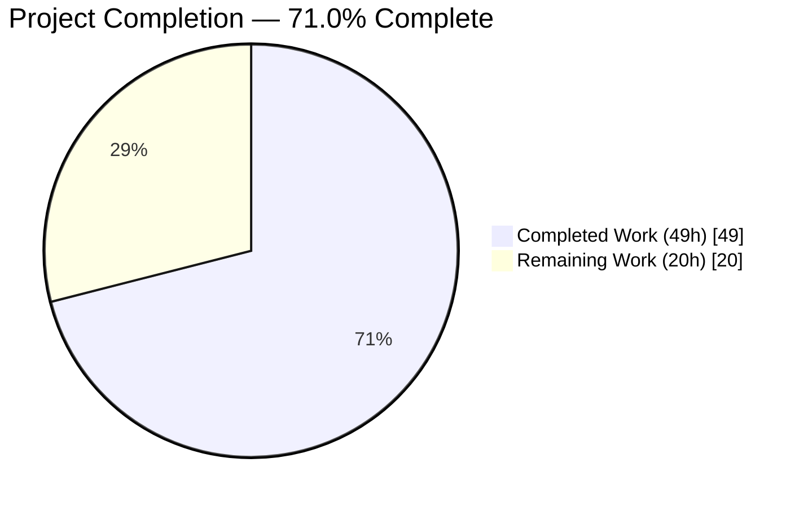
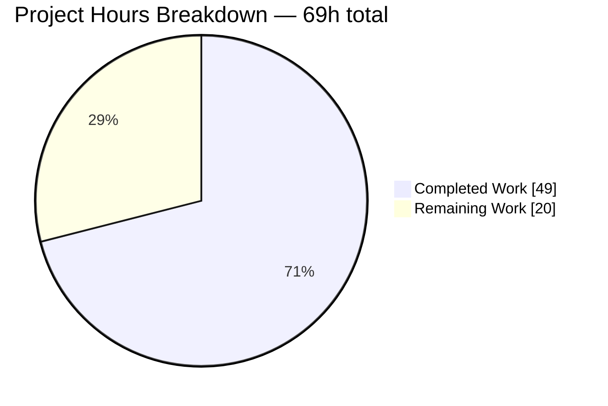
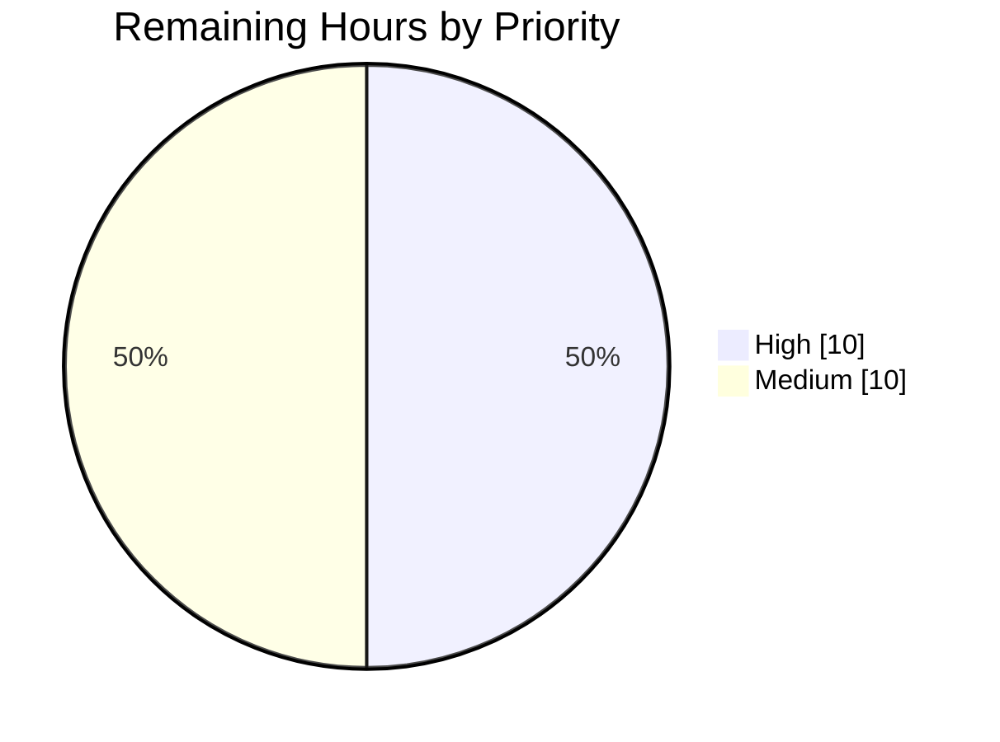

# 1. Executive Summary

## 1.1 Project Overview

`check_billing_sep_01` is a single-file Node.js HTTP service that now answers two routes on TCP 3000: the pre-existing `GET /`, still returning `Hello, World!\n`, and a new `GET /good-evening`, returning `Good evening\n` as `text/plain`. Routing required a framework, so the entry point moved from the Node standard library to Express 5.2.1 — the project's first and only dependency. Consumers are HTTP clients: no user interface, data store or outbound integration exists. The application remains one line in `server.js` beside a three-key manifest.

## 1.2 Completion Status



Completed = Dark Blue `#5B39F3` · Remaining = White `#FFFFFF`

| Metric | Value |
|---|---|
| Total Hours | 69 |
| Completed Hours (AI + Manual) | 49 (AI 49 + Manual 0) |
| Remaining Hours | 20 |
| Percent Complete | **71.0%** (49 ÷ 69) |

All four scoped requirements and all seven binding constraints are delivered and verified. The remaining 20 hours are platform work outside the application: runtime-floor preflight, supply-chain gating, process supervision, monitoring and the release checklist.

## 1.3 Key Accomplishments

- ✅ `GET /good-evening` → 200, 13 bytes, `Content-Type: text/plain`, no charset parameter.
- ✅ `GET /` byte-identical to its pre-migration response: 200, 14 bytes, no `Content-Type`.
- ✅ Express 5.2.1 as the sole dependency, exactly pinned, CommonJS resolution preserved.
- ✅ A failed bind stays fatal: exit 1 with `EADDRINUSE`, no readiness line.
- ✅ Conditional requests never collapse to `304`; neither route emits an `ETag`.
- ✅ Exactly one 41-byte readiness line per start; stderr silent under load.
- ✅ Two tracked paths and one changed line; `README.md` untouched, no prohibited artifact.
- ✅ Installed tree audits clean: 0 vulnerabilities across 68 packages.

## 1.4 Critical Unresolved Issues

Five items remain open or accepted with a caveat, none of them a functional defect. All eleven agreed deliverables — four requirements and seven constraints — are delivered and verified; each item below follows from the agreed scope.

| Issue | Impact | Owner | ETA |
|---|---|---|---|
| Transitive package `raw-body@3.0.2` sits inside advisory AIKIDO-2026-274460's affected range, and `npm audit` structurally cannot see it | Low — the vulnerable function is never invoked (no body parser is mounted and no parser options are passed anywhere); exposure is scanning and compliance, not runtime | Security owner | Upstream watch; revisit when `body-parser` ships `raw-body ≥ 4.0.0` |
| The dependency tree is not reproducible: 28 ranged transitive specifications resolve freshly on every install, and in-tree `npm audit` cannot run without a lockfile | A later install can pick different transitive versions with no repository change | Release owner | 3h (Section 2.2) |
| Express's Node ≥ 18 floor is stated, never enforced anywhere in the repository | A host below Node 18 fails at install or module load with nothing detecting it | Deployment owner | 1.5h (Section 2.2) |
| Resident memory plateaus at ~100–116 MB under sustained load against ~60–63 MB at start-up (descriptors constant at 22, no leak) | The service needs ~120 MB of headroom rather than ~65 MB; no correctness impact | Operations owner | 2h (Section 2.2) |
| No automated test suite or regression harness exists | Nothing re-verifies the two-route contract after a change; every check is run by hand | Repository owner | 2h (Section 2.2) |

## 1.5 Access Issues

**No access issues identified.** Both routes are public: no authentication, session, credential or secret exists, and the application reads no environment variables. The public npm registry — the one external dependency — was reachable, and `express@5.2.1` installed from it. No repository permission or third-party key is needed.

## 1.6 Recommended Next Steps

1. **[High]** Add a Node ≥ 18 preflight to the deploy and start path.
2. **[High]** Script the out-of-tree dependency audit into the release process, blocking on any finding.
3. **[High]** Run the service under a supervisor owning TCP 3000 exclusively, with a restart policy and ~120 MB headroom.
4. **[Medium]** Pair advisory scanning with a non-GitHub-Advisory-Database source and watch `body-parser`/`raw-body` upstream.
5. **[Medium]** Publish the release acceptance checklist — both route contracts, the body digest and both guards.

# 2. Project Hours Breakdown

## 2.1 Completed Work Detail

| Component | Hours | Description |
|---|---:|---|
| Express framework migration (`server.js`) | 4 | Entry point moved from `require('http').createServer` to an Express application with two registered routes; `res.end` retained over `res.send` to keep the responses free of `ETag`/freshness handling, and the readiness log attached to the server's `'listening'` event so a failed bind stays fatal |
| New route `GET /good-evening` | 3 | Route registration with `res.setHeader('Content-Type','text/plain')` (rather than a framework type helper, which appends `; charset=utf-8`) and the exact 13-byte body literal |
| Preserved route `GET /` | 2 | Response call retained verbatim and proven byte-identical against the pre-migration body digest `c98c24b677eff44860afea6f493bbaec5bb1c4cbb209c6fc2bbb47f66ff2ad31` |
| Dependency manifest (`package.json`) | 3 | Closed three-key manifest with `express` pinned exactly to `5.2.1`, `type` deliberately unset to preserve CommonJS resolution; published version and Node floor verified against the registry |
| Dependency provisioning and install contract | 3 | `npm install --no-package-lock` install path established: 68-package tree, no root lockfile produced, hidden lock inside the excluded tree tolerated, install artifacts left untracked |
| Minimal-diff scope closure | 2 | Two tracked paths, one changed line in `server.js`, per-name staging; `README.md` untouched and 25 prohibited paths confirmed absent |
| Functional route-contract and regression-guard verification | 8 | Both route contracts driven over HTTP (status, header set, byte counts, digests), conditional-request guard, fatal-bind guard, restart and concurrency behaviour |
| Configuration and observability verification | 4 | Manifest loaded at runtime, port immutability against `PORT`/`HOST`, the 41-byte single-line readiness contract, empty stderr, no per-request logging, log hygiene sweep |
| Performance and load verification | 5 | Latency distribution and warm latency, throughput drive, keep-alive reuse, 404 cost curve, memory and descriptor stability across a 12,000-request drive |
| Security verification — application surface | 5 | Secrets sweep over tracked files and post-baseline history, injection/traversal/CRLF payloads, method and protocol probing, oversized request line and header handling, header inventory, privacy assessment |
| Supply-chain verification | 4 | Audit of the installed tree, registry origin and sha512 integrity of all 68 packages, install-script and deprecation census, advisory research and reachability measurement of the affected transitive package |
| Constraint and behavioural-delta compliance review | 6 | All seven binding constraints verified element by element (three-key manifest against 16 forbidden keys, 12 forbidden source constructs, 30 must-not-exist paths) plus the full behavioural-delta surface: `HEAD`, `OPTIONS`, case and trailing-slash variants, and unmatched paths and methods |
| **Total** | **49** | |

## 2.2 Remaining Work Detail

| Category | Hours | Priority |
|---|---:|---|
| Runtime-floor preflight — gate install and start on Node ≥ 18 outside the repository | 1.5 | High |
| Per-install supply-chain verification control — scripted out-of-tree audit plus origin, integrity and install-script checks, gating the release | 3 | High |
| Advisory coverage beyond `npm audit` — add a non-GHAD advisory source and an upstream watch on `body-parser`/`raw-body` | 2.5 | High |
| Process supervision and restart policy — exclusive TCP 3000 ownership, restart on fatal bind, no graceful shutdown in the application | 3 | High |
| Deployment packaging and runbook — the now-mandatory `npm install --no-package-lock` step, the never-stage rule for install artifacts, and a caller change notice for the new 404 surface | 3 | Medium |
| External monitoring and health probing — liveness probe against a real route plus stdout/stderr capture, since the application exposes no health endpoint and logs no requests | 3 | Medium |
| Runtime sizing — ~120 MB memory headroom or a supervisor/cgroup ceiling | 2 | Medium |
| Release acceptance checklist — both route contracts, the body digest and both regression guards, run by hand before each deploy | 2 | Medium |
| **Total** | **20** | |

## 2.3 Hours Calculation

- Completed hours: **49** (Section 2.1 total) — all AI-delivered; no manual engineering hours were expended on this branch.
- Remaining hours: **20** (Section 2.2 total).
- Total project hours: 49 + 20 = **69**.
- Completion: 49 ÷ 69 × 100 = **71.0%**.

Every hour traces to a scoped requirement, a binding constraint, or a path-to-production activity required to deploy what was built. No work outside that universe is counted. Confidence is **high** on the completed side — each item has an executable check behind it — and **medium** on the remaining side, where the deployment target's supervisor, monitoring stack and scanning tooling are not yet chosen and would shift individual estimates by an hour or two either way.

# 3. Test Results

This project has no automated test suite, and by agreement none may be created: there is no test file, no runner configuration and no `scripts` key in the manifest. Its verification gate is therefore a set of executable acceptance assertions — `node --check`, Node manifest probes, `npm` dependency probes and `curl` requests against the running service — every one of which was executed against the current branch, with the results below. Coverage instrumentation is not applicable, because there is no suite for a coverage tool to measure.

| Area / Category | Framework | Tests | Passed | Failed | Coverage | What This Proves |
|---|---|---:|---:|---:|---|---|
| Dependency and manifest gate | npm 11.18.0 + Node 22.23.2 probes | 9 | 9 | 0 | n/a | The closed three-key manifest installs cleanly to a 68-package tree with no root lockfile, and the package the application loads is the exact pinned `express@5.2.1` |
| Preserved route `GET /` | curl + sha256sum | 6 | 6 | 0 | n/a | The original response survives the framework migration byte for byte — 200, 14 bytes, no `Content-Type`, no `ETag`, digest `c98c24b6…ad31` |
| New route `GET /good-evening` | curl + `cat -A` | 6 | 6 | 0 | n/a | The new route answers 200 with exactly 13 bytes and the media type `text/plain` with no charset parameter |
| Regression guards | curl + process exit codes | 6 | 6 | 0 | n/a | A conditional request still returns the full body rather than `304`, and a failed bind still kills the process silently instead of reporting readiness |
| Framework-default request surface | curl | 7 | 7 | 0 | n/a | `HEAD`, `OPTIONS`, case and trailing-slash variants and unmatched paths and methods all behave as the agreed behavioural-delta table records |
| Lifecycle and observability | shell stream measurement + `ss` | 5 | 5 | 0 | n/a | Start-up emits exactly one 41-byte readiness line on a single dual-stack socket, adds no output under traffic, and releases the port on shutdown |
| Concurrency | `xargs -P 20` + curl | 1 | 1 | 0 | n/a | 100 parallel requests split across both routes return exactly 50 × `200 13` and 50 × `200 14`, with no interleaving error |
| Repository hygiene and diff closure | git | 3 | 3 | 0 | n/a | The delivered change is exactly `A package.json` + `M server.js`; install artifacts are untracked and nothing is staged |
| **Total** | | **43** | **43** | **0** | **n/a** | |

**Not Covered**

- **No automated regression harness of any kind.** Every assertion above is manual and none re-runs on change. Capture them as a checklist a human executes before release (Section 2.2) — creating test files inside this repository is excluded by the agreed constraints.
- **The IPv6 client path.** The listener is a dual-stack wildcard socket (`*:3000`, `v6only:0`, with no IPv4-only listener), and IPv4, `localhost` and IPv4-mapped clients were all exercised. A direct `[::1]` request cannot be made where IPv6 is disabled at kernel level; repeat one such request on the deployment host if IPv6 clients are expected.
- **The unmatched-request 404 body.** Its status is exercised, but its HTML body and headers are deliberately not asserted as a contract, because they are framework defaults this project does not define. Confirm that no caller parses that page.
- **Sustained-load resource behaviour beyond a 100-request burst** is outside the assertions above. The recorded profile is a plateau at ~100–116 MB with descriptors constant at 22; validate it against the target container's memory limit before release.
- **Everything else delivered is covered** — both route contracts, both regression guards, the dependency and manifest state, the readiness contract and the diff closure all have an executed assertion behind them.

# 4. Runtime Validation & UI Verification

Every item below was observed against a running instance of `server.js` on TCP 3000, started with `node server.js` after `npm install --no-package-lock`.

- ✅ **Start-up** — Operational. One 41-byte line on stdout (`Server running at http://127.0.0.1:3000/`), stderr empty, a single listening socket on `*:3000` with `v6only:0`, and the port released cleanly on shutdown.
- ✅ **`GET /`** — Operational. 200 with five headers (`X-Powered-By`, `Date`, `Connection: keep-alive`, `Keep-Alive: timeout=5`, `Content-Length: 14`), no `Content-Type`, no `ETag`, body digest matching the pre-migration value.
- ✅ **`GET /good-evening`** — Operational. 200, `Content-Type: text/plain` with no charset parameter, `Content-Length: 13`, body `Good evening` plus a single LF.
- ✅ **Conditional requests** — Operational. `If-None-Match: *` returns `200 13` and `200 14` on the two routes; a future-dated `If-Modified-Since` also returns the full body. No `304`, and no `ETag` on either route.
- ✅ **Bind-failure behaviour** — Operational. A second instance on the held port exits 1 with `EADDRINUSE` on stderr, prints zero bytes on stdout, and leaves the first instance serving correctly.
- ✅ **Framework-default surface** — Operational and matching the agreed delta: `HEAD` 200 with no body on both routes, `OPTIONS` 200 with `Allow: GET, HEAD` and a 9-byte body, `/GOOD-EVENING` and `/good-evening/` 200 with 13 bytes, `GET /nope` 404 (143 bytes), `POST /` 404 (140 bytes), and the 404 page carrying `Content-Security-Policy: default-src 'none'` and `X-Content-Type-Options: nosniff`.
- ✅ **Concurrency and load** — Operational. 100 parallel requests across both routes returned exactly the expected split; a 2,000-request drive sustained ~2,300 requests per second with median latency under 0.2 ms, and keep-alive reuse was confirmed (20 requests over one connection).
- ⚠ **Resident memory under sustained load** — Partial. Behaviour is stable and leak-free (plateau reached, deltas decaying to +136 kB, descriptors constant at 22, correctness intact after 12,000 requests), but the plateau sits ~41 MB above start-up. Size the deployment for ~120 MB.
- ✅ **Browser rendering** — Operational. Both routes were driven in headless Chrome: `/` renders `Hello, World!` as inert text with no `Content-Type` and no cookies, `/good-evening` renders `Good evening` with `content-type: text/plain` exactly. The only console error and only ≥400 request in the session is the browser's own automatic `/favicon.ico` probe, answered by the framework's default 404.
- ⚠ **IPv6 client path** — Partial. Socket-level evidence shows the dual-stack wildcard bind, and IPv4, `localhost` and IPv4-mapped clients all succeed; a direct `[::1]` request cannot be made on a host with IPv6 disabled and should be repeated on the deployment host.

There is no user interface in this project, so no screens, forms or navigation flows exist to verify — the browser checks above render the raw route responses. There is no database, message broker, cache or outbound integration, so no external integration was exercised: the only integration surface is inbound HTTP on TCP 3000, and it is fully exercised above.

# 5. Compliance & Quality Review

## 5.1 Compliance Matrix

| # | Deliverable / Constraint | Status | Evidence |
|---|---|---|---|
| 1 | `GET /good-evening` → 200, `Good evening\n` (13 bytes), `Content-Type: text/plain` | ✅ PASS | `server.js:1`; observed 200 / 13 bytes / exact media type with no charset |
| 2 | `GET /` preserved: 200, `Hello, World!\n` (14 bytes), no `Content-Type` | ✅ PASS | `server.js:1`; body digest `c98c24b6…ad31` equals the pre-migration value |
| 3 | `express` the sole dependency, pinned exactly to `5.2.1` | ✅ PASS | `package.json:4-6`; installed version equals the declared pin |
| 4 | Change confined to `server.js`, with `package.json` as the only creation | ✅ PASS | Branch diff is exactly `A package.json` + `M server.js` (8 insertions, 1 deletion) |
| 5 | Single file — no `app.js`, `routes/`, `src/` or module split | ✅ PASS | One tracked `.js` file; no local-path `require`, no exports |
| 6 | Manifest carries only `name`, `version` and the `express` dependency | ✅ PASS | Three keys exactly; 16 forbidden keys individually confirmed absent, including `engines`, `scripts` and `type` |
| 7 | No `package-lock.json` at the repository root | ✅ PASS | Absent from the worktree and from every commit on every branch; the install runs with `--no-package-lock` |
| 8 | `README.md` unmodified; no `.gitignore` or new documentation file | ✅ PASS | `README.md` byte-identical at 22 bytes (`ba2ff234…`); `.gitignore`, `LICENSE`, `CHANGELOG.md` and `docs/` absent |
| 9 | No test suite, runner, fixture or snapshot | ✅ PASS | Zero test artifacts tree-wide; no `scripts` key. This is compliance, and its cost is recorded in Sections 3 and 5.2 |
| 10 | No 404 handler, error middleware, environment configuration or added hardening | ✅ PASS | `app.use`, four-arity handlers, `app.all`, `app.disable`, `process.env` and `'error'` listeners all count zero; no hardening package in source or manifest |
| 11 | Smallest possible diff — one changed line, trailing LF preserved | ✅ PASS | `server.js` remains a single 284-byte line; the unified diff is 1 insertion / 1 deletion |
| 12 | The five response-path and lifecycle decisions the contract depends on | ✅ PASS | `res.end` (not `res.send`), `res.setHeader` (not a type helper), no explicit status call, readiness on the `'listening'` event, hardcoded port with no host argument — each confirmed in source and at runtime |

## 5.2 AAP & Rule Divergences and Gaps

No user-specified rules were provided for this work, so the agreed baseline is the plan itself and its seven binding constraints. Eight divergences were established. Six are sanctioned — the plan or a constraint explicitly required the outcome that departs from the literal request — and two are gaps a human must carry operationally.

| What the AAP/Rule Required | What Was Delivered Instead | Why It Diverged | Impact | Remediation |
|---|---|---|---|---|
| No installed package inside a published advisory's affected range | `raw-body@3.0.2` is installed and inside AIKIDO-2026-274460's inclusive range (`>= 0.0.1 <= 3.0.2`) | No remediation exists inside the agreed constraints; the defect is upstream | Low — the vulnerable function is never invoked; scanning and compliance exposure only | Upstream watch plus a non-GHAD advisory source (2.5h) |
| The `/` response left unchanged | Body and status unchanged; one header added — `X-Powered-By: Express` | Set by framework middleware before any handler; suppression is hardening the constraints exclude. **Sanctioned** | Minor server-identity disclosure | Strip at the edge if policy requires; no repository change |
| Two GET routes, nothing more | Unmatched paths and non-GET methods now return 404 where the baseline returned 200; case and trailing-slash variants of the new path also answer it | Adding handlers or non-default router settings beyond the two routes is excluded by the minimal-diff constraint. **Sanctioned** | Any caller relying on the former unconditional 200 breaks | Caller audit and change notice, inside the deployment runbook (3h) |
| A reproducible dependency installation | An exact direct pin only; 28 ranged transitive specifications resolve freshly on each install | A root lockfile is prohibited by name. **Sanctioned** | A different transitive tree — including a newly vulnerable one — can arrive with no repository diff | Per-install out-of-tree audit and integrity gate (3h) |
| Express's Node ≥ 18 requirement honoured | The floor is stated, never enforced; no `engines`, `.nvmrc` or `.node-version` exists | The manifest is closed at three keys and configuration files are excluded. **Sanctioned** | A sub-18 host fails at install or module load with nothing detecting it | External preflight predicate (1.5h) |
| Regression protection for the delivered contract | No test file, runner or `scripts` key; the contract is verified by executable acceptance commands run by hand | Creating any test artifact is prohibited. **Sanctioned** | Nothing re-verifies the two routes after a change | Manual release acceptance checklist (2h) |
| Resident memory within a few megabytes of the pre-migration baseline | A plateau at ~100–116 MB against ~60–63 MB at start-up; leak-free, descriptors constant at 22 | Every ceiling mechanism — environment options, a `scripts` entry, `engines`, in-source V8 flags — is prohibited | Operational sizing only; no correctness, security or contract impact | Supervisor or cgroup ceiling with ~120 MB headroom (2h) |
| A clean checkout that runs with no package manager | A dependency install is now a prerequisite, and `node_modules/` is permanently untracked with no `.gitignore` permitted | Adopting Express necessarily ends the zero-dependency property. **Sanctioned** | First run fails with `Cannot find module 'express'` until the install runs; install artifacts always show as untracked | Install step in the deployment runbook and never-stage discipline (within the 3h runbook task) |

**`raw-body@3.0.2` inside advisory AIKIDO-2026-274460.** The advisory covers an invalid `limit` option silently disabling body-size enforcement. This project's only repository-side lever is `package.json:5`, two levels above the affected package: `express@5.2.1` declares `body-parser ^2.2.1`, and `body-parser@2.3.0` declares `raw-body ^3.0.2` — a caret that cannot reach the fix in `4.0.0`, which additionally requires Node ≥ 22 and is ESM-only. Overriding the transitive version needs a manifest key the closed three-key list forbids; a lockfile is forbidden; a top-level companion declaration is both forbidden and ineffective (the nested `3.0.2` still wins). Reachability is nil in practice: `server.js` mounts no parser, passes no parser options, and the affected function is never entered. Decide whether the compliance exposure is acceptable, then watch upstream.

**`X-Powered-By` on the preserved route.** The response now carries five headers where it carried four. The header is applied by the framework's application-level middleware before either handler runs, so no choice of response call removes it; `app.disable('x-powered-by')` would, and that is precisely the unrequested hardening the constraints exclude (`server.js:1` contains zero `app.disable` calls). Body and status are untouched, and the route still emits no `Content-Type` and no `ETag`, so the only observable change to a client is the extra header. If your security policy forbids advertising the framework, strip it at a reverse proxy rather than in this repository.

**404 for request shapes the baseline answered.** Before this change the handler never read the request, so every path and method returned 200 with the 14-byte body. Routing necessarily ends that: `app.get` registers `GET` and `HEAD` only, so `GET /nope` and `POST /` now return the framework's 404, while `OPTIONS` is answered automatically and case or trailing-slash variants of `/good-evening` reach the new handler. This retires the former "response is independent of its input" property by design. Audit any client that relied on the old catch-all — health checkers and uptime monitors are the usual casualties — and notify them before deploying.

**No reproducible installation.** The direct pin is exact, but Express declares 28 ranged dependencies and 121 of 124 transitive specifications carry a range, so the physical tree is recomputed from the registry on every install. Today's tree is clean: 68 packages, all registry-sourced with intact sha512 integrity, no install scripts, no deprecations, zero vulnerabilities. Resolving the same manifest against an earlier registry date yields 15 different package versions and three advisories, which is the concrete shape of the exposure. Because in-tree `npm audit` cannot run without a lockfile (`ENOLOCK`), the control has to live in the release process: copy `package.json` to a scratch directory, `npm install --package-lock-only`, audit there, and block on any finding.

**Node floor stated, not enforced.** `express@5.2.1` declares `engines: { node: ">= 18" }`, and no package in the resolved tree raises that floor, so a single `>= 18` gate covers everything. The repository cannot express it: the manifest is closed at `name`, `version` and `dependencies`, and version-pin files are excluded. The host used for verification is Node v22.23.2, so there is no present incompatibility — the risk is a future deployment onto an older runtime, where failure arrives at install or module load rather than as a clear refusal. Add the preflight predicate to your deploy and start scripts; it is one line and lives outside the repository.

**No regression harness.** Creating a test file, runner configuration, fixture or `npm test` script is prohibited, and the manifest has no `scripts` key, so the two-route contract has no automated guard. The substitute is a set of runnable assertions: the two `curl -i` checks, the body digest comparison, and the two guards that catch the failures an ordinary request cannot see — a conditional request collapsing to `304`, and a `listen` callback reporting readiness on a failed bind. Section 9 carries them verbatim. Capture them as a checklist in your release process; treating them as optional is how a future edit silently breaks the contract.

**Resident memory above the pre-migration baseline.** The process settles at ~100–116 MB under sustained load against ~60–63 MB at start-up, with descriptors constant at 22 and growth decaying to +136 kB per batch — a plateau, not a leak. The cause is V8's committed-heap sizing for the 122-module framework stack; a dependency-free control under identical load stayed near 60 MB, and the committed heap was several times the live-object heap, which fell between samples. No ceiling can be set from inside this repository, so size the container for ~120 MB and treat any instance that climbs past that band without plateauing, or exceeds 22 descriptors, as a genuine regression.

**Install prerequisite and untracked artifacts.** The project previously needed two commands and no package manager; `node server.js` was install, build and start. Declaring a dependency ends that, so a clean checkout now fails with `Cannot find module 'express'` until `npm install --no-package-lock` runs. Because a root lockfile and a `.gitignore` are both prohibited, `node_modules/` can never travel with the branch and always appears as untracked content — which means `git add -A` would commit 68 packages. Stage by name only. Put the install step in the runbook so no deployment path assumes the old behaviour.

# 6. Risk Assessment

| Risk | Category | Severity | Probability | Mitigation | Status |
|---|---|---|---|---|---|
| A future edit breaks the two-route contract with nothing to catch it — no automated regression harness exists | Technical | Medium | High | Run the acceptance checklist in Section 9 before every release; the two guards catch the failures an ordinary request cannot see | Open — 2h task |
| Deployment onto a host below Node 18 fails at install or module load, with no repository-side check | Technical | High | Low | One-line preflight predicate in the deploy and start path | Open — 1.5h task |
| A fresh install resolves a different — or newly vulnerable — transitive tree with no repository diff | Security | Medium | Medium | Out-of-tree audit plus origin, integrity and install-script checks gating the release; block on any finding | Open — 3h task |
| `raw-body@3.0.2` remains inside a published advisory range that `npm audit` cannot see | Security | Low | Low | Non-GHAD advisory source and an upstream watch; the affected code path is unreachable in this application | Accepted — monitoring task |
| Start-up fails fatally if anything else holds TCP 3000, and the port is a hardcoded literal with no override | Operational | Medium | Medium | Supervisor with exclusive port allocation and a restart policy; reclaim with `kill "$(lsof -ti :3000)"` after confirming ownership | Open — 3h task |
| No health endpoint, no request logging and no graceful shutdown: liveness must be probed externally and in-flight requests drop on restart | Operational | Medium | Medium | External probe against a real route, log capture at the supervisor, connection draining at the load balancer | Open — 3h task |
| An undersized container OOM-kills the process, which needs ~120 MB rather than the ~65 MB the pre-migration service used | Operational | Low | Medium | Size for ~120 MB or set a supervisor/cgroup ceiling; alert on a non-plateauing climb | Accepted — 2h sizing task |
| Callers that relied on the former unconditional 200 now receive 404 on unmatched paths and non-GET methods | Integration | Medium | Medium | Caller audit and change notice before deploy; the two documented routes are the whole contract | Accepted by agreement |

# 7. Visual Project Status

**Hours split** — Completed = Dark Blue (#5B39F3), Remaining = White (#FFFFFF).



**Remaining work by priority** (Section 2.2, 20h total).



**Remaining hours by category.**

| Category | Hours | Share |
|---|---:|---:|
| Supply chain and advisory control | 5.5 | 27.5% |
| Deployment and process supervision | 6.0 | 30.0% |
| Monitoring and runtime sizing | 5.0 | 25.0% |
| Runtime-floor preflight | 1.5 | 7.5% |
| Release acceptance checklist | 2.0 | 10.0% |
| **Total** | **20.0** | **100%** |

**Requirement status** — every scoped requirement and every binding constraint is delivered; the remaining hours sit entirely outside the application.

| Status | Requirements (4) | Constraints (7) |
|---|---:|---:|
| Completed | 4 | 7 |
| Partially completed | 0 | 0 |
| Not started | 0 | 0 |

# 8. Summary and Recommendations

The requested change is delivered in full. `server.js` is now an Express 5.2.1 application that registers two GET routes: `/` still returns `Hello, World!\n` with a body digest identical to its pre-migration value, and `/good-evening` returns the 13-byte `Good evening\n` with the media type `text/plain` and no charset parameter. `package.json` declares Express as the sole dependency at an exact pin, with `type` left unset so the CommonJS entry point keeps resolving. The whole change is two tracked paths and one changed line; `README.md` is untouched, no lockfile exists in any commit, and none of the thirty prohibited paths is present. Against the scoped work universe — the four requirements, the seven constraints and the path-to-production activities needed to deploy them — the project stands at **71.0% complete (49 of 69 hours)**.

Verification went beyond the two happy paths, because the three properties most likely to break silently are invisible to an ordinary request. A conditional request returns the full body rather than collapsing to `304`, which is what keeps the contract unqualified; a second start on the held port exits 1 with `EADDRINUSE` and prints nothing, which is what keeps a failed bind from masquerading as readiness; and the response headers are exactly the pre-migration set plus one framework header, with no `Content-Type` on `/` and no `ETag` on either route. Alongside those, 43 executed assertions covered the dependency and manifest state, the framework-default surface (`HEAD`, `OPTIONS`, case and trailing-slash variants, unmatched paths and methods), readiness logging, concurrency and diff closure, all passing. Both routes were also rendered in a real browser.

What remains is production plumbing, not application work, and four items are on the critical path. A Node ≥ 18 preflight has to live in the deploy script, because the manifest cannot express the floor Express requires. The dependency audit has to move into the release process, because a root lockfile is prohibited and in-tree `npm audit` therefore cannot run — the same control also watches the one accepted security item, a transitive `raw-body` version inside an advisory range whose vulnerable code path this application never enters. The service needs a supervisor that owns TCP 3000 exclusively, restarts on a fatal bind, and allows ~120 MB of memory rather than the ~65 MB the pre-migration service used. And the acceptance commands in Section 9 need to become a checklist someone actually runs, since no automated harness may exist inside this repository.

Two behavioural changes are worth communicating before deploy rather than discovering afterwards. Requests that the old server answered with a blanket 200 — any unmatched path, and any method other than `GET`, `HEAD` or `OPTIONS` — now receive the framework's 404; uptime monitors and health checkers pointed at arbitrary paths are the usual casualties. And `/` now carries `X-Powered-By: Express`, which can be stripped at a proxy if policy requires but was deliberately left in place here as unrequested hardening.

**Production readiness: ready on the application, not yet on the platform.** The code is complete, byte-exact against its contract, free of placeholders, secrets and request-derived input, and clean on audit today. Nothing in the repository needs further engineering. The gate to production is the 20 hours of preflight, supply-chain gating, supervision, monitoring and release-checklist work in Section 2.2 — after which the success metrics are simple: both routes returning their exact byte counts and media types, one readiness line per start, a clean per-install audit, and a plateauing memory profile under load.

# 9. Development Guide

Every command below was executed against this branch; the stated outputs are the observed ones. Run all of them from the repository root.

## 9.1 System Prerequisites

- **Node.js ≥ 18** — verified on v22.23.2. Express 5.2.1 declares `engines: { node: ">= 18" }` and no package in the resolved tree raises that floor. The repository pins no version, so check the host yourself:
  ```bash
  node -v      # observed: v22.23.2
  npm -v       # observed: 11.18.0
  node -e "process.exit(+process.versions.node.split('.')[0]>=18?0:1)"; echo "preflight exit=$?"   # observed: 0
  ```
- **Network access to `registry.npmjs.org`** for the one-time dependency install.
- **`lsof` or `ss`** for port checks (`lsof -ti :3000`).
- No database, cache, message broker, container runtime, bundler, transpiler or test runner is required or used. Hardware needs are trivial; allow ~120 MB of memory per instance (see Section 6).

## 9.2 Environment Setup

There is nothing to configure. The application reads **zero** environment variables, the port is the hardcoded literal `3000`, and there is no `.env`, `.npmrc` or configuration module. There is no authentication, session or credential — both routes are public.

Install the dependency tree once per checkout:

```bash
npm install --no-package-lock
```

Observed: exit 0, `found 0 vulnerabilities`, 65 top-level entries under `node_modules/` (68 packages in total).

The `--no-package-lock` flag is mandatory. A plain `npm install` writes `package-lock.json` at the repository root, which this project prohibits. `--package-lock=false` is equivalent. npm also writes `node_modules/.package-lock.json`; that file is expected and must be left alone.

`node_modules/` is not ignored — no `.gitignore` exists and none may be created — so it always appears as untracked content:

```bash
git status --porcelain              # observed: ?? node_modules/
git add server.js package.json      # stage BY NAME ONLY — never `git add -A` or `git add .`
```

## 9.3 Build and Compile

There is no build step and the manifest has no `scripts` key, so there is no `npm run build`, `npm start` or `npm test`. The compile and parse gates are:

```bash
node --check server.js                                                    # observed: exit 0, no output
node -e "JSON.parse(require('fs').readFileSync('package.json','utf8'));console.log('manifest parses')"
```

## 9.4 Application Startup

```bash
node server.js        # foreground: prints one line and blocks
```

Observed stdout, exactly one 41-byte line:

```text
Server running at http://127.0.0.1:3000/
```

Detached, so it does not block your shell. Keep the start as its own statement — backgrounding a `cd X && … && node server.js` chain captures the subshell pid rather than the server's — and send the output to a log path outside the checkout so the working tree stays clean:

```bash
LOG="$(mktemp)"
node server.js > "$LOG" 2>&1 &
sleep 1; cat "$LOG"        # observed: Server running at http://127.0.0.1:3000/
```

Stop it by port owner:

```bash
kill "$(lsof -ti :3000)"
```

## 9.5 Verification Steps

```bash
# Step 1 — dependency and manifest state
test ! -e package-lock.json && echo "PASS: no root lockfile"
node -e "const m=require('./package.json'),k=Object.keys(m).sort().join(',');console.log(k==='dependencies,name,version'&&!('type' in m)?'PASS: three keys, no type':'FAIL: '+k)"
node -e "console.log(require('express/package.json').version)"     # observed: 5.2.1

# Step 2 — route contracts
curl -isS http://127.0.0.1:3000/                 # 200, Content-Length: 14, NO Content-Type, no ETag
curl -isS http://127.0.0.1:3000/good-evening     # 200, Content-Type: text/plain (no charset), Content-Length: 13

# Step 3 — non-regression of the preserved body
curl -s http://127.0.0.1:3000/ | sha256sum
# observed: c98c24b677eff44860afea6f493bbaec5bb1c4cbb209c6fc2bbb47f66ff2ad31
curl -s http://127.0.0.1:3000/good-evening | cat -A     # observed: Good evening$

# Step 4 — guard 1: a conditional request must NOT collapse to 304
curl -s -o /dev/null -w '%{http_code} %{size_download}\n' -H 'If-None-Match: *' http://127.0.0.1:3000/good-evening
# observed: 200 13   (never 304 0)

# Step 5 — guard 2: a failed bind must stay fatal and silent
node server.js; echo "second-instance exit=$?"
# observed: exit=1, EADDRINUSE on stderr, zero bytes on stdout, no readiness line

# Step 6 — dependency audit (in-tree `npm audit` cannot work here — see 9.7)
d=$(mktemp -d) && cp package.json "$d"/ && (cd "$d" && npm install --package-lock-only --silent && npm audit); rm -rf "$d"
# observed: found 0 vulnerabilities

# Step 7 — diff closure
git diff --cached --name-status    # must list only server.js and package.json, if anything is staged
```

`X-Powered-By: Express` appears on both responses and is expected. An `ETag` on either route, or `charset=utf-8` on the new route's media type, means the response path was changed — see 9.7.

## 9.6 Example Usage

```bash
$ curl -i http://127.0.0.1:3000/
HTTP/1.1 200 OK
X-Powered-By: Express
Date: Sat, 19 Sep 2026 18:57:35 GMT
Connection: keep-alive
Keep-Alive: timeout=5
Content-Length: 14

Hello, World!

$ curl -i http://127.0.0.1:3000/good-evening
HTTP/1.1 200 OK
X-Powered-By: Express
Content-Type: text/plain
Date: Sat, 19 Sep 2026 18:57:35 GMT
Connection: keep-alive
Keep-Alive: timeout=5
Content-Length: 13

Good evening
```

Other request shapes, all observed:

```bash
curl -s -o /dev/null -w '%{http_code} %{size_download}\n' -X POST http://127.0.0.1:3000/            # 404 140
curl -s -o /dev/null -w '%{http_code} %{size_download}\n' http://127.0.0.1:3000/nope                # 404 143
curl -s -o /dev/null -w '%{http_code} %{size_download}\n' -X OPTIONS http://127.0.0.1:3000/good-evening   # 200 9  (Allow: GET, HEAD)
curl -s -o /dev/null -w '%{http_code} %{size_download}\n' http://127.0.0.1:3000/GOOD-EVENING         # 200 13
```

## 9.7 Troubleshooting

| Symptom | Cause | Resolution |
|---|---|---|
| `Error: Cannot find module 'express'`, exit 1 | The checkout has no `node_modules/`; install artifacts never travel with the branch | `npm install --no-package-lock` |
| `Error: listen EADDRINUSE: address already in use :::3000`, exit 1, no readiness line | Another process holds TCP 3000. This is correct behaviour, not a defect | Identify the owner with `lsof -ti :3000` and `readlink /proc/<pid>/cwd`; if it is yours, `kill "$(lsof -ti :3000)"` |
| `npm error code ENOLOCK … loadVirtual requires existing shrinkwrap file` | `npm audit` needs a lockfile, and a root lockfile is prohibited here. Permanent, by design | Use the out-of-tree audit recipe in 9.5 step 6 |
| A root `package-lock.json` has appeared | The install was run without `--no-package-lock` | `rm package-lock.json` and reinstall with the flag; confirm with `test ! -e package-lock.json` |
| A conditional request returns `304 0`, or an `ETag` appears | The response path was switched to a framework send helper, which generates an `ETag` and applies freshness processing | Restore the direct `res.end(...)` call on both routes |
| The new route returns `Content-Type: text/plain; charset=utf-8` | A framework type helper was used; every one of them appends the charset parameter | Restore `res.setHeader('Content-Type','text/plain')` |
| Readiness is printed even though the port was occupied | A callback was passed to `app.listen`, which the framework invokes with the bind error as its argument | Restore `app.listen(3000).on('listening', …)` |
| `git status` shows dozens of untracked package paths | `node_modules/` is not ignored and cannot be | Stage by name (`git add server.js package.json`); never `git add -A` |
| `ReferenceError: require is not defined in ES module scope` | A `"type": "module"` key was added to the manifest | Remove it — `type` must stay unset for the CommonJS entry point to load |

# 10. Appendices

## A. Command Reference

| Purpose | Command |
|---|---|
| Install dependencies (mandatory flag) | `npm install --no-package-lock` |
| Compile/parse gate | `node --check server.js` |
| Manifest parse gate | `node -e "JSON.parse(require('fs').readFileSync('package.json','utf8'))"` |
| Manifest shape gate | `node -e "const m=require('./package.json'),k=Object.keys(m).sort().join(',');console.log(k==='dependencies,name,version'&&!('type' in m))"` |
| Installed dependency version | `node -e "console.log(require('express/package.json').version)"` |
| Confirm no root lockfile | `test ! -e package-lock.json && echo PASS` |
| Start (foreground) | `node server.js` |
| Start (detached) | `LOG="$(mktemp)"; node server.js > "$LOG" 2>&1 &` |
| Stop by port owner | `kill "$(lsof -ti :3000)"` |
| Port owner lookup | `lsof -ti :3000` then `readlink /proc/<pid>/cwd` |
| Route checks | `curl -i http://127.0.0.1:3000/` · `curl -i http://127.0.0.1:3000/good-evening` |
| Body non-regression | `curl -s http://127.0.0.1:3000/ \| sha256sum` |
| Conditional-request guard | `curl -s -o /dev/null -w '%{http_code} %{size_download}\n' -H 'If-None-Match: *' http://127.0.0.1:3000/good-evening` |
| Fatal-bind guard | `node server.js; echo "exit=$?"` (with an instance already running) |
| Dependency audit (out of tree) | `d=$(mktemp -d) && cp package.json "$d"/ && (cd "$d" && npm install --package-lock-only --silent && npm audit); rm -rf "$d"` |
| Node floor preflight | `node -e "process.exit(+process.versions.node.split('.')[0]>=18?0:1)"` |
| Stage the project's files | `git add server.js package.json` |

## B. Port Reference

| Port | Protocol | Used by | Notes |
|---|---|---|---|
| 3000 | TCP/HTTP | `server.js` | Hardcoded literal with no host argument, so the bind is the IPv6 dual-stack wildcard (`*:3000`, `v6only:0`). No environment override exists; a collision is fatal at start-up |

## C. Key File Locations

| Path | Role |
|---|---|
| `server.js` | The entire application: one 284-byte line holding the Express factory call, both route registrations and the listen/readiness clause. Exports nothing and binds the port on load |
| `package.json` | Dependency manifest: exactly `name`, `version`, `dependencies.express` (`5.2.1`). `type` deliberately unset |
| `README.md` | Project identifier only (22 bytes); no runtime role, untouched by this change |
| `node_modules/` | Local dependency environment created by the install. Untracked, never staged, never committed |
| `node_modules/.package-lock.json` | Hidden lock npm writes regardless of the flag. Expected; leave in place |

## D. Technology Versions

| Component | Version | Notes |
|---|---|---|
| Node.js | v22.23.2 | Verification host; any Node ≥ 18 satisfies the dependency floor |
| npm | 11.18.0 | |
| express | 5.2.1 | Exact pin; `engines: { node: ">= 18" }`; 28 declared dependencies resolving to 68 installed packages |
| CommonJS | — | Module system in use; the manifest must never declare `"type": "module"` |

## E. Environment Variable Reference

**None.** The application contains zero `process.env` references; the port is a hardcoded literal and environment-variable configuration is outside the agreed scope. `PORT`, `HOST` and `SERVER_PORT` have no effect on the bind. No secret, token or credential is read at any point.

## F. Developer Tools Guide

- **Static gate** — `node --check server.js` is the only compile gate; no linter or formatter is configured, and adding one is outside the agreed scope.
- **Dependency inspection** — `npm ls --depth=0` (observed `└── express@5.2.1`), `npm ls --all` for the full tree, and `node -e "console.log(require('express/package.json').engines)"` for the runtime floor.
- **Auditing** — always out of tree (Appendix A); the in-tree command cannot work without a lockfile.
- **Socket inspection** — `ss -ltnp | grep 3000` shows the single dual-stack listener and the owning pid.
- **Load and concurrency** — `seq 1 2000 | xargs -P 10 -I{} curl -s -o /dev/null http://127.0.0.1:3000/good-evening` drives the service without extra tooling (`ab` is not installed).
- **Browser** — both routes render as plain text; there is no UI, no client-side code and no console output of the application's own.

## G. Glossary

| Term | Meaning in this project |
|---|---|
| Golden body digest | `c98c24b677eff44860afea6f493bbaec5bb1c4cbb209c6fc2bbb47f66ff2ad31` — the SHA-256 of the `/` response body recorded before the framework migration; the non-regression reference |
| Readiness line | The single 41-byte stdout line `Server running at http://127.0.0.1:3000/`, emitted once on the server's `'listening'` event |
| Guard 1 | The conditional-request check: `If-None-Match: *` must return the full body, never `304` |
| Guard 2 | The fatal-bind check: a second start must exit 1 with `EADDRINUSE` and print no readiness line |
| Hidden lock | `node_modules/.package-lock.json`, written by npm inside the excluded tree; not the prohibited root lockfile |
| Framework-default surface | Behaviour that arrives with the router rather than being written here: automatic `OPTIONS`, case-insensitive and trailing-slash matching, and the built-in 404 page |
| Two-path diff | The whole delivered change: `package.json` created, `server.js` modified by one line |
| GHAD | The GitHub Advisory Database, the data source behind `npm audit`. An advisory published only elsewhere is invisible to that command, which is why a second advisory source is recommended |
| Out-of-tree audit | Auditing a copy of `package.json` in a scratch directory, because `npm audit` cannot run in a repository with no root lockfile |
