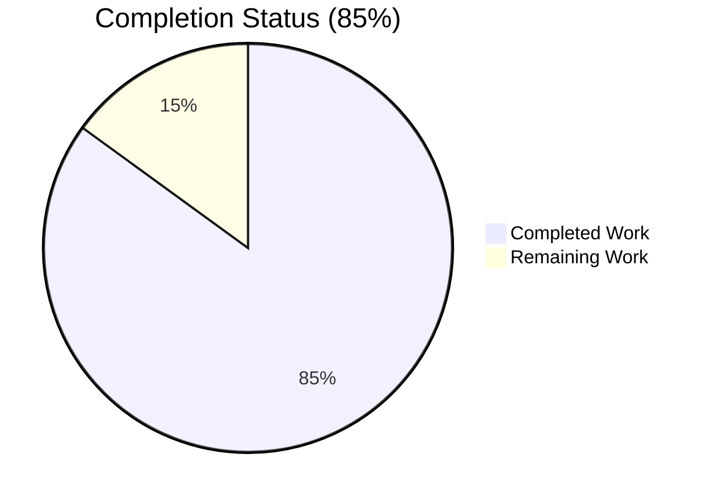
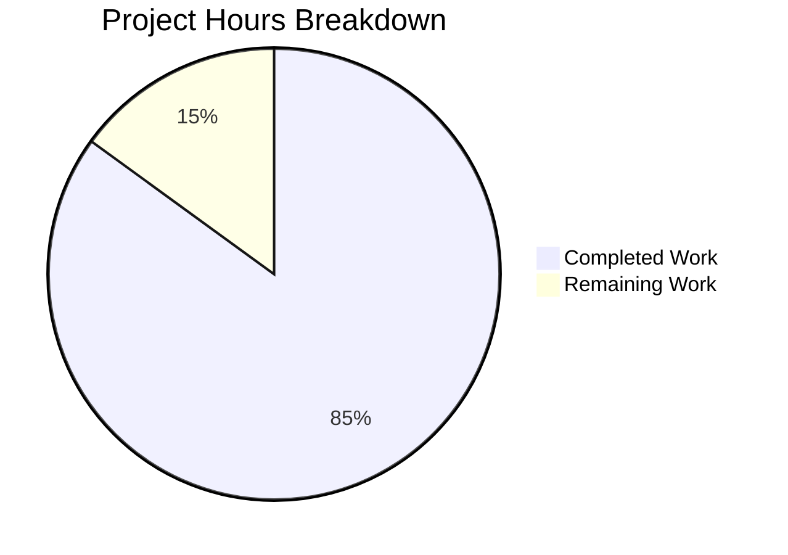
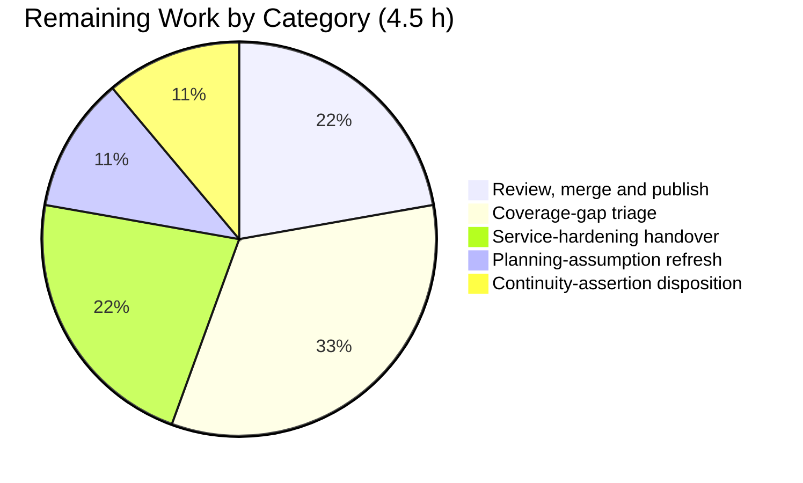

# 1. Executive Summary

## 1.1 Project Overview

`check_billing_sep_01` is a single-file Node.js HTTP service: `server.js` is one 142-byte statement answering every request with a constant greeting on TCP 3000. This project delivers a one-page quality assessment of it, `QA_REPORT.md` at the repository root — an inventory of the test assets the repository lacks, a byte-exact confirmation of the service's response contract against a running instance, and a record of which error conditions were exercised. The service is untouched: `server.js` and `README.md` are byte-identical to baseline, and no dependency, manifest or test asset was introduced.

## 1.2 Completion Status

**85% complete — 25.5 of 30.0 hours delivered.**



Chart colours: Completed = Dark Blue `#5B39F3`, Remaining = White `#FFFFFF`.

| Metric | Value |
|---|---|
| Total Hours | 30.0 |
| Completed Hours (AI + Manual) | 25.5 (25.5 AI + 0.0 Manual) |
| Remaining Hours | 4.5 |
| Percent Complete | 85% |

Calculation: (25.5 ÷ 30.0) × 100 = **85%**, over the ten requirement groups in scope — nine delivered in full, one in part.

## 1.3 Key Accomplishments

- ✅ Response contract confirmed live: `200 OK`, 14-byte body `Hello, World!\n`, SHA-256 `c98c24b6…ff2ad31`, exactly four headers, no `Content-Type`.
- ✅ Path independence shown on a second path, `/billing/invoices?x=1`, returning a byte-identical body.
- ✅ Readiness proven as one 41-byte stdout line, awaited on that line rather than on a timer.
- ✅ Two error paths exercised: bind contention (`EADDRINUSE :::3000`, fatal and unintercepted) and `SIGTERM` with the port released.
- ✅ Every absent test, coverage, CI, linter, manifest and documentation asset established by direct existence checks.
- ✅ Four further error conditions catalogued as untested, and repository integrity held: `git diff --name-status a3cb672` → `A QA_REPORT.md` alone.

## 1.4 Critical Unresolved Issues

One of the ten requirement groups carries an unresolved item; the other nine close with no caveat. One further item is open by design.

| Issue | Impact | Owner | ETA |
|---|---|---|---|
| One of three read-only continuity references cannot be evaluated: a transient untracked working file the plan inventoried is not present on this branch. Preservation itself holds — it was never created and never deleted, and no commit in history touches the path | None on the delivered assessment or on the service; one continuity confirmation of three is unevaluable | Repository owner | 0.5 h |
| No automated check exercises the verified contract. The status code, the 14 response bytes and the four-header set have no regression guard, and neither does the delivered report | A future edit to `server.js` could change the contract with nothing to catch it | Service owner | 1.5 h |

## 1.5 Access Issues

No access issues identified. Every check ran locally against the checkout and a locally started instance; the service consumes no environment variable and no secret, and no credential or third-party endpoint is involved.

## 1.6 Recommended Next Steps

1. **[High]** Review and merge the branch — five commits adding one file, with `server.js` and `README.md` provably untouched (1.0 h).
2. **[Medium]** Settle the coverage question: commission one asserting test for the `200`/14-byte contract, or accept the gap explicitly (1.5 h).
3. **[Medium]** Hand the seven service-hardening items to the owner of `server.js`: authentication, explicit bind host, TLS, `'error'` handling, resource limits, shutdown drain, response headers (1.0 h).
4. **[Low]** Refresh the two stale planning assumptions before any future run (0.5 h).
5. **[Low]** Settle the unevaluable continuity reference — provision it ahead of a run, or drop the presence assertion (0.5 h).

# 2. Project Hours Breakdown

## 2.1 Completed Work Detail

| Component | Hours | Description |
|---|---|---|
| Missing-coverage inventory and testability analysis | 3.5 | Existence checks across manifest, lockfile, runtime-pin, test, coverage, CI, linter and documentation paths; confirmation that the built-in runner and assertion library resolve with no install; structural analysis showing nothing is exported and no `require.main` guard exists, so loading `server.js` binds the port instead of yielding a handler |
| Response-contract confirmation against a live instance | 2.5 | Instance started under a host-wide port lock, readiness awaited on the server's own stdout line, two probes captured and measured: status, exact body bytes, SHA-256, complete header set and the absence of `Content-Type` |
| Error-path exercise and untested-path ledger | 2.0 | Bind contention provoked once and `SIGTERM` termination exercised once, each with its outcome captured; the four remaining error conditions catalogued with what exercising them would show |
| Report authoring, citation discipline and size ceiling | 4.0 | Three-part document with a one-line preamble, 499 words against a 500-word ceiling, 34 lines, six/four/six bullets, one fenced command cited once, and 20 inline citations each pointing at a witness that establishes its claim |
| Repository integrity discipline and verification | 1.5 | Read-only handling of the whole tree, all working output kept outside the checkout, and per-file verification that only the report changed: baseline-to-HEAD diff, blob equality for both pre-existing files, and clean diff gates |
| Quality review across documentation, completeness, security, rules and prose | 5.0 | Claim-by-claim accuracy review against the source and tree, mechanical element counts against the content contract, whole-tree secret sweep with a static security posture read of `server.js`, directive compliance, and prose durability review |
| Runtime verification suite | 5.5 | 981 executed cases covering the response contract, observability, test-asset absence, security posture and final acceptance, over five-plus serialized service lifecycles, 54 HTTP responses and browser-client confirmation |
| Planning-assumption reconciliation | 1.5 | The integrity pass condition and the continuity assertion restated against the tree that exists, verified in a form the branch can exhibit, and carried into the report's preamble |
| **Total** | **25.5** | |

## 2.2 Remaining Work Detail

| Category | Hours | Priority |
|---|---|---|
| Deliverable review, merge and publish | 1.0 | High |
| Coverage-gap triage and automated-check decision | 1.5 | Medium |
| Service-hardening handover to the owner of `server.js` | 1.0 | Medium |
| Planning-assumption refresh for future runs | 0.5 | Low |
| Continuity-assertion disposition | 0.5 | Low |
| **Total** | **4.5** | |

## 2.3 Hours Reconciliation

| Check | Result |
|---|---|
| Section 2.1 total | 25.5 h |
| Section 2.2 total | 4.5 h |
| 2.1 + 2.2 | 30.0 h — equals Total Hours in Section 1.2 |
| Completion | (25.5 ÷ 30.0) × 100 = 85% — the figure used in Sections 1.2, 7 and 8 |
| Section 7 pie chart | Completed 25.5 / Remaining 4.5 — identical to Section 1.2 |

Confidence: **high** for the completed hours, every one of which maps to a delivered artefact or an executed check; **high** for the remaining hours, which are bounded review, decision and handover tasks with no unknown scope.

# 3. Test Results

All results below were executed against the branch as it stands. No count is estimated.

| Area / Category | Framework | Tests | Passed | Failed | Coverage | What This Proves |
|---|---|---|---|---|---|---|
| Static syntax check | `node --check` | 1 | 1 | 0 | 1 of 1 source file | `server.js` parses cleanly — the only compile surface this stack has, since there is no build system, transpiler or type checker |
| Automated test suite | `node --test` (built-in runner) | 0 | 0 | 0 | 0% — no suite exists | The repository contains no automated test at all: the runner exits 0 having discovered and asserted nothing |
| Response contract, live instance | `curl` + shell assertions | 10 | 10 | 0 | Status, body bytes, digest, header set, two paths, log quietness | Every request answers `200` with the same 14 bytes `Hello, World!\n` and the same four headers, with no `Content-Type`, and the process logs nothing per request |
| Lifecycle and exercised error paths | Shell + Node `net.connect` probe | 11 | 11 | 0 | Readiness, bind contention, `SIGTERM`, port release | The service announces readiness on its own stdout, dies outright on bind contention without intercepting the error, and releases port 3000 on termination with no shutdown message |
| Test-asset absence sweep | Shell existence checks + glob search | 37 | 37 | 0 | Whole tree | No manifest, lockfile, runtime pin, test file, coverage config, CI workflow, linter config or testing document exists anywhere in the repository |
| Deliverable content contract | Shell measurement | 14 | 14 | 0 | Every structural and prohibition rule | The report holds inside its one-page ceiling (499 words, 34 lines, six/four/six bullets, two `CHECKED` and four `UNTESTED` markers) and its 20 citation tokens resolve to five real witnesses |
| Repository integrity | `git` | 7 | 7 | 0 | All 3 tracked files | The branch adds one file and changes nothing else; `server.js` and `README.md` are blob-identical to baseline and the tree carries no placeholder marker |
| Verification suite — contract, observability, test assets, security posture, acceptance | `curl` / Node / headless Chrome | 981 | 981 | 0 | 9 of 9 capability areas | Over five-plus serialized service lifecycles and 54 HTTP responses, every measured value reproduced across all five areas with zero contradictions |

**Totals:** 1,061 executed cases, 1,061 passed, 0 failed. Coverage tooling is available on the installed runtime but unconfigured; run against this repository it reports 100% over zero instrumented files, so no percentage is meaningful here — the gap is the absence of any automated check, not a low number.

**Not Covered** — delivered and verified by hand, but exercised by no automated test:

- The response contract itself: status code, the 14 body bytes, the digest and the four-header set have no regression guard. A human should add one asserting test over `GET /` before any change to `server.js`.
- Path independence, startup readiness, log quietness and port release on termination: all confirmed by hand, none guarded.
- The report's own content: no automated check verifies its measured values still match the service.
- Termination with a request in flight: never exercised, so whether work in progress completes or is interrupted is unknown. A human should test this before relying on graceful restarts.
- Request handling beyond two `GET` probes: oversized headers, conflicting framing, `HEAD`, `CONNECT`, malformed requests and any concurrency or load profile were not measured.
- Project script entry points: no manifest exists, so `npm test` cannot run — the path is unavailable rather than passing.
- Exposure, transport and recovery: TLS, interface reachability and supervised restart behaviour were not exercised.

# 4. Runtime Validation & UI Verification

Every line below was driven against a running instance started from `server.js` unmodified, serialized on a host-wide port lock, and stopped afterwards with the port confirmed free.

- ✅ **Startup and readiness** — Operational. One 41-byte stdout line, `Server running at http://127.0.0.1:3000/`, with stderr empty; readiness awaited on that line, spawn-to-ready measured in the 25–56 ms range.
- ✅ **`GET /`** — Operational. `HTTP/1.1 200 OK`, body exactly 14 bytes `Hello, World!\n`, SHA-256 `c98c24b677eff44860afea6f493bbaec5bb1c4cbb209c6fc2bbb47f66ff2ad31`.
- ✅ **`GET /billing/invoices?x=1`** — Operational. Identical status and a byte-identical body; the response does not vary with the path.
- ✅ **Response headers** — Operational. Exactly four: `Date`, `Connection: keep-alive`, `Keep-Alive: timeout=5`, `Content-Length: 14`. No `Content-Type`, no `Server`, no `X-Powered-By`.
- ✅ **Logging surface** — Operational. Stdout stayed at 41 bytes and stderr at 0 across every probe; there is no access log and no log file is written anywhere.
- ✅ **Bind contention** — Operational as designed, and fatal. A second instance exits 1 with an unhandled `'error'` event and `listen EADDRINUSE: address already in use :::3000`, writing nothing to stdout; the incumbent keeps answering 200.
- ✅ **Termination and port release** — Operational. `SIGTERM` gives wait status 143 with no shutdown message, and a follow-up connect is refused (`ECONNREFUSED`).
- ✅ **Browser client** — Operational. Headless Chrome rendered the 14-byte body in its plain-text viewer on both paths with zero console messages and no scripts or stylesheets; screenshots are retained under `blitzy/screenshots/`.
- ⚠ **Health and metrics surface** — Partial. `/health`, `/healthz`, `/metrics`, `/readyz` and `/status` all return the same unconditional 200 with the same greeting, so a degraded process is indistinguishable from a healthy one over HTTP.
- ❌ **Never exercised at runtime** — termination with a request in flight; `HEAD`, `CONNECT` and malformed requests; oversized headers and conflicting framing; load or concurrency profiles; TLS; supervised restart and reboot recovery; and any project script path, since no manifest exists for one to live in.

There is no user interface to verify: the repository contains no HTML, CSS, client-side script or static asset, and the service's only response is 14 bytes of unlabelled text. The browser check above is therefore client-side confirmation of the HTTP contract rather than UI verification.

# 5. Compliance & Quality Review

## 5.1 Compliance Matrix

Each row states where the deliverable stands now, against the requirement group it belongs to.

| # | Deliverable / Requirement | Benchmark | Status | Evidence |
|---|---|---|---|---|
| 1 | Report exists at the repository root under the required name | Correct artefact, correct location | ✅ Pass | `QA_REPORT.md`, tracked, 3,870 bytes |
| 2 | Missing-coverage inventory | Five gaps plus the structural finding, each existence-checked | ✅ Pass | `QA_REPORT.md:7-12`; 37 absence checks, all confirmed |
| 3 | Response confirmation | Status, exact bytes, digest, header set, absent media type | ✅ Pass | `QA_REPORT.md:22-23`; measured 200 / 14 B / four headers |
| 4 | Path independence | A second request to a different path | ✅ Pass | `QA_REPORT.md:25`; byte-identical body on `/billing/invoices?x=1` |
| 5 | Error-path ledger | Six categories, exactly two exercised, four labelled untested | ✅ Pass | `QA_REPORT.md:29-34`; two `CHECKED`, four `UNTESTED`, no third state |
| 6 | Size and structure ceiling | ≤500 words, ~40 lines, ≤6 bullets per section, one preamble line | ✅ Pass | 499 words, 34 lines, bullets 6/4/6, 1 H1 + 3 H2 |
| 7 | Content prohibitions | No severity model, finding identifiers, action-item register, command catalogue, output appendix or recommendation | ✅ Pass | Zero matches across every prohibited form |
| 8 | Evidence traceability | Every claim about the code or checkout carries a resolvable citation | ✅ Pass | 20 citation tokens over five witnesses, all resolving |
| 9 | Read-only handling of pre-existing files | `server.js` and `README.md` untouched | ✅ Pass | Blobs `2886290f…` and `35d275fe…` identical at baseline and HEAD |
| 10 | No new dependency, manifest, lockfile, test, CI, coverage or linter asset | Zero additions to the dependency and tooling surface | ✅ Pass | Tree holds three tracked files; every candidate path absent |
| 11 | Repository integrity condition | The work adds the report and changes nothing else | ✅ Pass | `git diff --name-status a3cb672` → `A QA_REPORT.md` alone; both diff gates exit 0 |
| 12 | Continuity over the three named read-only references | All three present and byte-identical | ⚠ Partial | Two verified byte-identical; the third is a transient untracked working file absent from this branch (see 5.2, row 2) |

## 5.2 AAP & Rule Divergences and Gaps

No user-specified rules govern this work — the rules source records none, confirmed by a paged read to end of file and reproduced independently — so every divergence below is against the AAP.

| What the AAP/Rule Required | What Was Delivered Instead | Why It Diverged | Impact | Remediation |
|---|---|---|---|---|
| §0.3.3: the integrity check passes when `git status --porcelain` differs by exactly one new untracked line, `?? QA_REPORT.md` | The same condition proved as `git diff --name-status a3cb672` → `A QA_REPORT.md` alone, with `git diff --quiet` exiting 0 | The report is tracked and committed on this branch, so the untracked form cannot exist at the moment the check runs. **Sanctioned** — the branch's own instantiation guidance supersedes this wording | None; the substantive condition holds and is now checkable in one command | None |
| §0.2.1 / §0.7.1: a 6,681-byte untracked working file is present in the tree and must be read as a reference and left exactly as found | The file is absent from this branch and was correctly never created; the other two references were verified byte-identical | The plan was written against an earlier checkout where that transient file existed, and untracked content does not travel with a branch | One continuity confirmation of three is unevaluable; nothing in the repository references the file, so no code or claim depends on it | Drop the presence assertion from the plan's inventory, or provision the file before a future run (0.5 h) |
| §0.2.1: asset absences established by working-tree listings | Four report bullets state those absences as tracked-path claims, witnessed by the git index | No file-level witness exists for a working-tree listing, and the citation contract requires each claim to name a witness that establishes it | Claims are narrower than the plan's wording but exactly witnessed; no gap element was lost | None — the working-tree absences still hold and were re-confirmed |
| §0.5.1: probe the instance with `curl -sS -i` | That form is cited once inline in the report; the byte and digest measurements were taken with `-D`/`-o` | `curl -i -o` folds the header block into the body file, producing 137 bytes and a wrong digest | None; 14 bytes and the digest reproduce under both forms | None |
| §0.6.1: the built-in test runner and assertion library may be named as a zero-install facility | The same single mention, carrying a measured runtime attribution | The evidence contract requires every claim to cite a witness; the runtime binary is the only witness for a runtime capability | None; still one mention, still description rather than a proposal | None |
| §0.3.2 / §0.9.2: describe the service as it stands and propose no change to it | Seven verified security and robustness postures in `server.js` were recorded as facts and left unchanged, with no fix proposed | **Sanctioned** — the plan marks `server.js` read-only, its files-to-modify list is empty, and the report is forbidden from carrying recommendations | The service's posture is exactly as it was, and no claim to the contrary is made anywhere | Hand the seven items to the owner of the service (1.0 h) |
| §0.8: confirm the governing rule set through the plan's named retrieval step | The rule set was read from its source of record, paged to end of file, and the zero result independently reproduced | That retrieval step is not exposed in this environment, and the source of record is designated for exactly this purpose | None; the user-rule count is 0 from two independent mechanisms | None |

**Integrity pass form.** The plan fixes the acceptance test for "nothing else changed" as a working-tree status comparison yielding one `?? QA_REPORT.md` line. On this branch the report is tracked and committed across five commits, so that line cannot appear and `git status --porcelain` prints only the pre-existing untracked `blitzy/` evidence directory. The delivered check is stronger and stable: `git diff --name-status a3cb672` returns exactly one row, `A QA_REPORT.md`, with zero modified, renamed or deleted entries, and it cites no HEAD hash so no later commit can stale it. Both diff gates exit 0 and both pre-existing files match their baseline blobs. Nothing is outstanding.

**The absent reference.** The plan's file inventory lists a transient untracked working file alongside `server.js` and `README.md`, and makes its continued presence part of acceptance. It is not on this branch, and no commit in the repository's history has ever touched the path. Preservation itself is satisfied — it was neither created nor deleted — but the "present and byte-identical" half cannot be evaluated, and creating a substitute would have broken the very integrity condition above. Nothing in the tree references it (`QA_REPORT.md` never mentions it). A human should either strike the presence assertion from the inventory or provision the file before a future run; no repository change is appropriate.

**Evidence form for the absence claims.** Four coverage bullets read "the repository tracks no …" rather than "no … is present". The git index witnesses tracked paths exactly, whereas a working-tree listing has no file-level witness to cite, and pointing at the checkout root would have named a directory rather than a file. The claims are therefore narrower than the plan's phrasing but precisely supported, and every named asset still appears: manifest, lockfile, `node_modules`, runtime pins, coverage configuration, CI providers, `Makefile`, linter configuration and testing documents. The stronger working-tree statement remains true and was re-confirmed by a 37-check sweep. A reader who wants that form can reproduce it with one `ls -d`.

**Probe form.** The report cites `curl -sS -i --max-time 5 http://127.0.0.1:3000/` once, inside its single fenced block, immediately above the bullet stating the result — the form the plan prescribed and the shape the content contract requires. Byte-level measurement used separate header and body captures instead, because combining `-i` with `-o` writes the header block into the body file: the body then measures 137 bytes and hashes to something that does not match the contract. Both forms return the same status, the same 14 bytes and the same digest, which is why the cited command reproduces its stated result verbatim. Anyone re-running it should capture headers and body separately before measuring.

**Facility mention.** The plan permits naming the runtime's built-in test runner and assertion library once, as the zero-install facilities a future suite could use. The delivered bullet does exactly that but attributes the capability to the runtime binary rather than leaving it unsourced, because every claim in the report must name a witness a reader can open, and no file in the repository establishes what the runtime provides. The mention stays singular and descriptive: it says the repository invokes neither, which is a measured fact, and it stops short of proposing that a suite be written.

**Service hardening left in place.** Seven postures in `server.js:1` were confirmed present and deliberately not changed: no authentication or authorization on a catch-all handler; a dual-stack wildcard bind while the startup line advertises `127.0.0.1`; cleartext HTTP with no TLS; no `'error'` listener, so bind contention fails startup and prints stack detail to stderr; no timeout, header, connection or rate limit; no signal handler and no `server.close()` to drain in-flight work; and no response headers at all, including no `Content-Type`. Exploitability today is bounded because the body is a constant 14 bytes with zero request reflection. These belong to the service's own repository, where a change is in scope.

**Rule set confirmation.** The plan designates a named retrieval step for the governing rule set and records its result as "no user rules provided". That step is not exposed in this environment, so the rule source of record was paged directly instead — window `[1, 250]`, then `[251, 500]` reaching end of file at line 361 — with rule-bearing lines enumerated mechanically rather than by eye, yielding a count of zero. The same zero was then reproduced independently through the named step elsewhere, so seven sources now concur. Nothing about the delivered work turns on it, and no rule was invented to fill the gap.

# 6. Risk Assessment

Forward-looking risks only. Each concerns what could still go wrong in production, not anything already settled.

| Risk | Category | Severity | Probability | Mitigation | Status |
|---|---|---|---|---|---|
| Nothing guards the response contract — a future edit to `server.js` could change the status code, the 14 body bytes or the header set with no check to catch it | Technical | Medium | High | Add one asserting test over `GET /` covering status, body bytes and the header set; run it before any change ships | Open — adding tests was outside this scope |
| A runner-based quality gate would be green and worthless: the built-in runner exits 0 with zero tests, and coverage reports 100% over zero instrumented files | Technical | Medium | Medium | Require at least one asserting test before wiring any gate or dashboard to the runner | Open — flagged for the owner |
| Every verified value is a point-in-time measurement of this commit; no mechanism detects drift | Technical | Medium | Medium | Re-run the probe sequence in Section 9 after any change to `server.js` and compare against the recorded digest | Open — procedure documented |
| The endpoint is unauthenticated and binds the dual-stack wildcard `::` while the startup line advertises `127.0.0.1`, so an operator reading the log underestimates the exposure | Security | High | Medium | Bind explicitly to the intended interface, align the log text, and restrict reachability at the network boundary | Open — advisory to the service owner |
| Cleartext HTTP with no TLS and no response headers at all: no `Content-Type`, no `nosniff`, no framing or cache policy | Security | Medium | Medium | Terminate TLS at a trusted proxy and set the response headers in the service's own repository | Open — advisory to the service owner |
| No `'error'` listener and no shutdown drain: bind contention kills startup outright and prints stack detail to stderr, termination can drop in-flight work, and nothing supervises restart | Operational | Medium | Medium | Run under a supervisor, handle and sanitise the `'error'` path, and drain active requests on `SIGTERM` with a deadline | Open — advisory to the service owner |
| Port 3000 is a hardcoded literal and the environment is never read, so only one instance can run per host and there is no per-environment configuration | Operational | Medium | High | Read the port from the environment in the service's own repository; until then, treat the port as a host-wide singleton | Open — constraint documented |
| Health is unobservable: `/health`, `/healthz` and `/metrics` all return the same unconditional 200 and no request leaves a log trace, so a degraded process looks healthy to a probe | Operational | Medium | Medium | Add a real health signal and request logging before placing the service behind a load balancer or alerting on it | Open — advisory to the service owner |

**Integration exposure is minimal by construction.** The delivered document adds zero dependencies, zero endpoints and zero configuration, and no code loads it. The service itself has no third-party dependency — its only import is the built-in `http` module — so there is no dependency attack surface to audit and no registry, credential or external service in the path.

# 7. Visual Project Status



Colour key — Completed Work: Dark Blue `#5B39F3` · Remaining Work: White `#FFFFFF` · Headings and accents: Violet-Black `#B23AF2` · Highlights: Mint `#A8FDD9`.

**Remaining hours by category (Section 2.2):**



| Band | Hours | Share |
|---|---|---|
| Completed Work | 25.5 | 85% |
| Remaining Work | 4.5 | 15% |
| **Total** | **30.0** | **100%** |

**Remaining work by priority:** High 1.0 h (1 task) · Medium 2.5 h (2 tasks) · Low 1.0 h (2 tasks).

# 8. Summary & Recommendations

This project delivered one artefact and left the rest of the repository exactly as it found it. `QA_REPORT.md` is a one-page assessment of the single-file HTTP service at the root of `check_billing_sep_01`: what the repository has no automated check for, what the service actually returns measured byte for byte against a running instance, and which error conditions were exercised versus deliberately left alone. The branch carries five commits and a net change of one added file. `server.js` and `README.md` are blob-identical to their baseline, and no manifest, lockfile, test harness, coverage configuration, CI workflow or linter configuration was introduced — all of which was required, since the absence of those assets is the assessment's own subject matter.

The verification behind it is the substantive part of the work. The response contract was confirmed on a live instance rather than read off the source: `200 OK`, a 14-byte body hashing to `c98c24b677eff44860afea6f493bbaec5bb1c4cbb209c6fc2bbb47f66ff2ad31`, exactly four headers with `Content-Type` absent, and a byte-identical body on a second path. Readiness was awaited on the server's own stdout line, bind contention was shown to be fatal and unintercepted, and `SIGTERM` was shown to release the port with no shutdown message. In total 1,061 cases were executed — static checks, live probes, observability and security verification, acceptance measurement and browser-client confirmation — with zero failures and every claimed value reproduced. Against the ten requirement groups in scope, nine are delivered in full and one in part, which puts the project at **85% complete — 25.5 of 30.0 hours**.

Two things remain genuinely open. The first is a continuity reference the plan inventoried — a transient untracked working file — which is absent from this branch and whose presence check therefore cannot be evaluated; nothing in the repository depends on it, and creating a substitute would have broken the integrity condition it was meant to support. The second is open by design: nothing in the repository exercises the verified contract automatically, because adding a test was explicitly outside this scope. A `node --test`-based gate built today would report success while asserting nothing, and coverage tooling would report 100% over zero instrumented files. That is the single most important thing for a reader to internalise before changing `server.js`.

The critical path to production is short and entirely human. Review and merge the branch (1.0 h). Decide the coverage question — commission one asserting test over `GET /`, or accept the gap in writing (1.5 h). Hand the seven service-hardening items to the owner of `server.js`, where a change is in scope: authentication, an explicit bind host to match the loopback the startup line advertises, TLS, `'error'` handling, resource limits, a shutdown drain, and response headers including `Content-Type` (1.0 h). Then close the two low-priority items of planning hygiene (1.0 h). Success is measurable: the probe sequence in Section 9 reproduces the recorded digest, and any change to `server.js` fails a check before it ships.

**Production readiness.** The deliverable is complete, internally consistent and reproducible — every value in it was re-derived against a live instance, and its integrity condition holds per file. The *service* it describes is demonstration-grade: unauthenticated, cleartext, wildcard-bound, with no configuration surface, no graceful shutdown, no meaningful health signal and no tests. Those limitations are the assessment's findings, not defects introduced here, and the plan placed fixing them out of scope. Recommendation: **merge the assessment, then treat its findings as the input to a hardening decision on the service** rather than as work this branch left unfinished.

# 9. Development Guide

Every command below was executed against this branch and produced the output shown.

## 9.1 System Prerequisites

| Requirement | Verified value | Notes |
|---|---|---|
| Node.js | `v22.23.2` at `/usr/bin/node` | The only runtime needed. Nothing to install, no build step, no service to provision |
| npm | `11.18.0` | Present but unusable here — there is no manifest to install from |
| curl | `8.14.1` (OpenSSL 3.5.3) | Used for the HTTP probes |
| TCP port 3000 | Must be free before starting | Hardcoded in `server.js` with no override, so only one instance can run per host |
| OS | Linux x86-64 | No other platform dependency; no container required |

`lsof`, `ss`, `netstat` and `nc` are **not installed**. Port state is checked with a Node `net.connect` probe (below) or by scanning `/proc/net/tcp{,6}` for local port `0BB8` in state `0A`.

```bash
# Confirm the runtime — expect: v22.23.2
node --version
command -v node
```

## 9.2 Environment Setup

There is nothing to bootstrap. The repository has zero third-party dependencies, no manifest, no lockfile, no `node_modules`, no `.env` and no runtime pin.

```bash
cd /path/to/check_billing_sep_01
git ls-files
# QA_REPORT.md
# README.md
# server.js
```

- **Do not create a virtual environment or a manifest.** Neither applies to a zero-dependency Node project, and both are outside this repository's scope.
- **Never run `npm install` or `npm test` inside the checkout.** Both fail with `npm error code ENOENT … Could not read package.json` (exit 254), and `npm install` additionally writes a `package-lock.json` into the repository root — an artefact this repository is not meant to carry.
- Keep scratch output **outside** the checkout, e.g. `mkdir -p "$HOME/qa-scratch"`.
- `blitzy/screenshots/` holds untracked browser evidence. Leave it as found: never commit it and never delete it.

## 9.3 Dependency Installation

None. Zero declared dependencies; `server.js` imports only the built-in `http` module. The built-in test facilities also resolve with no install, which is useful if you decide to add the missing test:

```bash
node -e "require('node:test'); require('node:assert'); console.log('built-in test facilities resolved')"
# built-in test facilities resolved
```

## 9.4 Application Startup

Start the service in the background, capture its output outside the checkout, and wait on its own readiness line — never on a fixed sleep, since an immediate connect is refused.

```bash
S="$HOME/qa-scratch"; mkdir -p "$S"
cd /path/to/check_billing_sep_01
node server.js > "$S/server.out" 2> "$S/server.err" & PID=$!
for i in $(seq 1 100); do [ -s "$S/server.out" ] && break; sleep 0.05; done
[ -s "$S/server.out" ] || { echo "readiness timeout"; kill -TERM "$PID"; exit 1; }
cat "$S/server.out"
# Server running at http://127.0.0.1:3000/
```

Readiness lands in roughly 25–56 ms. The line is 41 bytes, it is the only thing the process ever prints, and stderr stays empty.

## 9.5 Verification Steps

```bash
# Probe the service. Use -D/-o, never -i -o.
curl -sS --max-time 5 -D "$S/h" -o "$S/b" -w 'status=%{http_code}\n' http://127.0.0.1:3000/
# status=200

echo "bytes=$(wc -c < "$S/b")  sha256=$(sha256sum < "$S/b" | cut -d' ' -f1)"
# bytes=14  sha256=c98c24b677eff44860afea6f493bbaec5bb1c4cbb209c6fc2bbb47f66ff2ad31

cat "$S/h"
# HTTP/1.1 200 OK
# Date: <current date>
# Connection: keep-alive
# Keep-Alive: timeout=5
# Content-Length: 14

# Confirm the response does not vary with the path
curl -sS --max-time 5 -o "$S/b2" -w 'status=%{http_code}\n' "http://127.0.0.1:3000/billing/invoices?x=1"
cmp "$S/b" "$S/b2" && echo "bodies byte-identical"
# status=200
# bodies byte-identical
```

```bash
# Stop it and confirm the port is released
kill -TERM "$PID"; wait "$PID"; echo "wait_status=$?"
# wait_status=143      (no shutdown message is printed; stdout stays at 41 bytes)

node -e "const s=require('net').connect(3000,'127.0.0.1');const t=setTimeout(()=>{console.log('TIMEOUT');process.exit(1)},3000);s.on('error',e=>{clearTimeout(t);console.log('port released:',e.code);process.exit(0)});s.on('connect',()=>{clearTimeout(t);console.log('STILL LISTENING');process.exit(1)});"
# port released: ECONNREFUSED
```

```bash
# Per-change gate — the only compile-equivalent this stack has
node --check server.js && echo "syntax ok"
git status --porcelain     # expect nothing beyond the untracked blitzy/ directory
git diff --name-only       # expect only the file you intended to change

# Integrity condition: the branch adds the report and changes nothing else
git diff --name-status a3cb672
# A	QA_REPORT.md
```

```bash
# Test suite — the project's real state, not a broken environment
node --test
# Expected: TAP version 13, a "1..0" plan line, then zero tests, suites, passes and failures. Exit 0.
```

## 9.6 Example Usage

```bash
curl -sS http://127.0.0.1:3000/
# Hello, World!

curl -sS -X POST http://127.0.0.1:3000/anything -d 'ignored=1'
# Hello, World!
```

The handler never reads the request, so method, path, query, headers and body make no difference to an ordinary parsed request.

## 9.7 Troubleshooting

| Symptom | Cause | Resolution |
|---|---|---|
| `Error: listen EADDRINUSE: address already in use :::3000` and the process exits 1 | Another instance already holds port 3000. There is no `'error'` listener, so this is fatal and prints a stack trace to stderr | Stop the incumbent, or serialize your start-probe-stop window: `flock "$HOME/.port3000.lock" -c '<your commands>'`. Do not edit `server.js` to move the port |
| An immediate connect after spawn is refused | The listener is not bound yet | Poll for the readiness line as in 9.4 rather than sleeping a fixed interval |
| Body measures 137 bytes and the digest does not match | `curl -i -o file` folds the header block into the body file | Capture separately with `-D headers -o body` |
| `npm error code ENOENT … Could not read package.json` (exit 254) | There is no manifest; `npm run`, `npm test`, `npm audit` and `npm install` all have nothing to read | Expected. Use `node server.js` and `node --test` directly, and do not create a manifest to silence it |
| `node --test` exits 0 but reports zero tests | No test file exists anywhere in the repository | Expected, and the assessment's headline finding. A gate built on this reports success while asserting nothing |
| `--experimental-test-coverage` prints `100.00 / 100.00 / 100.00` | It instrumented zero files | Ignore the percentage; it is vacuous without a suite |
| `git status` shows `?? blitzy/` | Untracked browser evidence from verification runs | Leave it alone — neither commit it nor delete it |
| `lsof`/`ss`/`netstat`/`nc: command not found` | Not installed on this image | Use the Node `net.connect` probe in 9.5, or read `/proc/net/tcp{,6}` |

# 10. Appendices

## A. Command Reference

| Purpose | Command | Expected result |
|---|---|---|
| Confirm runtime | `node --version` | `v22.23.2` |
| Syntax check (the only compile-equivalent) | `node --check server.js` | Exit 0, no output |
| Run the service | `node server.js` | One 41-byte stdout line, binds TCP 3000 |
| Probe the root path | `curl -sS --max-time 5 -D h -o b -w '%{http_code}\n' http://127.0.0.1:3000/` | `200`, body 14 bytes |
| Measure the body | `wc -c < b` / `sha256sum < b` | `14` / `c98c24b6…ff2ad31` |
| Stop the service | `kill -TERM "$PID"; wait "$PID"` | Wait status 143, no shutdown message |
| Confirm the port is free | Node `net.connect` probe (Section 9.5) | `ECONNREFUSED` |
| Run the test suite | `node --test` | Exit 0, zero tests discovered |
| Coverage attempt | `node --test --experimental-test-coverage` | Exit 0, 100% over zero files — vacuous |
| Integrity condition | `git diff --name-status a3cb672` | `A	QA_REPORT.md` |
| Working-tree state | `git status --porcelain` | `?? blitzy/` only |
| Serialize on the shared port | `flock "$HOME/.port3000.lock" -c '<commands>'` | Runs when the port is free |

## B. Port Reference

| Port | Bound by | Address | Configurable |
|---|---|---|---|
| 3000 | `server.js` | Dual-stack wildcard `::` (the startup line advertises `127.0.0.1`) | No — hardcoded literal; the environment is never read |

Only one instance can run per host. Auxiliary listeners used during verification are unrelated to the service and were released.

## C. Key File Locations

| Path | Role | State |
|---|---|---|
| `server.js` | The entire application — one chained statement: create server, constant response handler, `listen(3000)` with a startup log | Unchanged from baseline, 142 bytes |
| `README.md` | Only pre-existing documentation — a single heading, no run command | Unchanged from baseline, 22 bytes |
| `QA_REPORT.md` | The deliverable: missing coverage, confirmed response contract, error-path ledger | Added on this branch, 3,870 bytes, 34 lines |
| `blitzy/screenshots/` | Untracked browser evidence from verification runs | Leave as found — never commit, never delete |
| `.git/hooks/` | Four Git-LFS shims plus the standard samples | No lint, test or build gate runs on commit or push |

Absent throughout, by design: `package.json`, any lockfile, `node_modules`, `.nvmrc`, `.node-version`, `test/`, `tests/`, `__tests__/`, `spec/`, `e2e/`, `.nycrc`, `.c8rc`, `codecov.yml`, `coverage/`, `lcov.info`, `.github/`, `.gitlab-ci.yml`, `Jenkinsfile`, `.circleci/`, `.travis.yml`, `Makefile`, `Taskfile.yml`, any ESLint/Prettier/TypeScript configuration, `TESTING.md`, `CONTRIBUTING.md`, `QA.md`, `docs/`, `.gitignore`, `.env`.

## D. Technology Versions

| Component | Version | Source |
|---|---|---|
| Node.js | v22.23.2 | `/usr/bin/node --version` |
| npm | 11.18.0 | `/usr/bin/npm --version` (present, unusable — no manifest) |
| curl | 8.14.1 (OpenSSL 3.5.3) | `curl --version` |
| Declared dependencies | 0 | No manifest or lockfile exists |
| Runtime imports | `http` (built-in) | The only `require` in `server.js` |
| Test facilities available | `node --test`, `node:assert` (built-in, zero install) | Resolve on this runtime; nothing in the repository invokes them |

## E. Environment Variable Reference

| Variable | Used by the service? | Effect |
|---|---|---|
| *(none)* | No | `process.env` is never read. Setting `PORT`, `HOST` or anything else changes nothing — the instance still binds 3000 and prints the same startup line |

No secret, credential or configuration value is required to build, run or verify this project.

## F. Developer Tools Guide

- **Syntax gate:** `node --check` is the whole static surface. There is no build system, transpiler, type checker, linter or formatter, and none is expected here.
- **Test runner:** the runtime's built-in runner needs no manifest and no install, so a first asserting test can be added with nothing more than the runtime already present. Until one exists, treat a green run as meaningless.
- **Port tooling:** `lsof`, `ss`, `netstat` and `nc` are unavailable. Use the Node `net.connect` probe, or read `/proc/net/tcp{,6}` looking for local port `0BB8` in state `0A`; a `:0BB8` match in the remote column with state `06` is a `TIME_WAIT` client socket, not a listener.
- **Concurrency:** wrap any start-probe-stop window in `flock` on a shared lock file, because the port cannot be partitioned.
- **Dependency audit:** `npm audit` cannot run without a manifest, and it has nothing to find — the dependency count is zero.

## G. Glossary

| Term | Meaning in this project |
|---|---|
| Response contract | The measured, byte-exact response: status `200`, body `Hello, World!\n` (14 bytes), exactly four headers, no `Content-Type` |
| Readiness line | The single 41-byte stdout line the service prints once it is listening; the only reliable start signal |
| Dual-stack wildcard (`::`) | The address Node binds when `listen()` receives no host, making the service reachable on every interface rather than only loopback |
| CHECKED / UNTESTED | The ledger markers in `QA_REPORT.md`: two error conditions exercised, four catalogued without being provoked |
| Vacuous green | A test run or coverage summary that succeeds while asserting nothing — what this repository's runner and coverage flag produce today |
| Integrity condition | The requirement that the work add the report and change nothing else, verified as `git diff --name-status a3cb672` → `A QA_REPORT.md` |
| Baseline commit | `a3cb672`, the commit this branch measures itself against; both pre-existing files are blob-identical to it |
