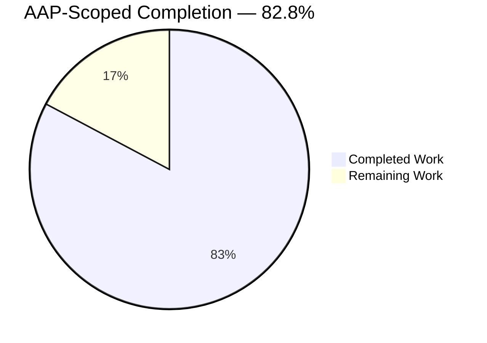
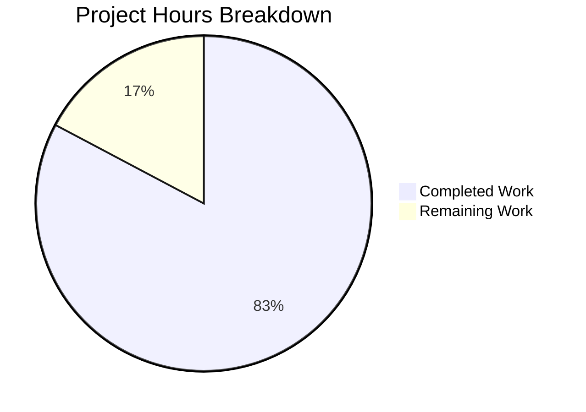
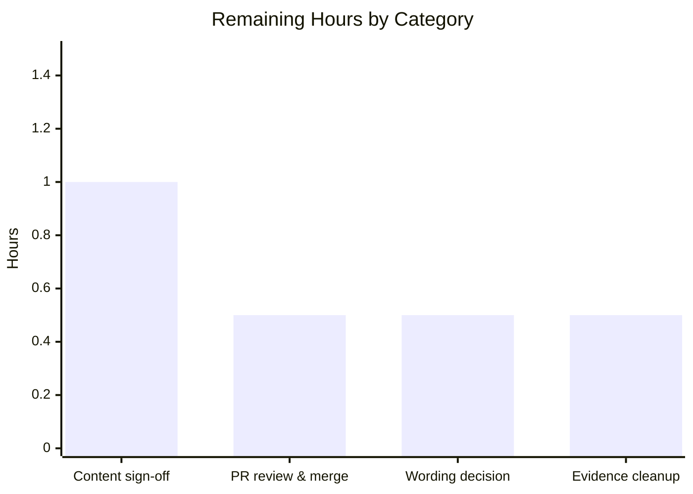
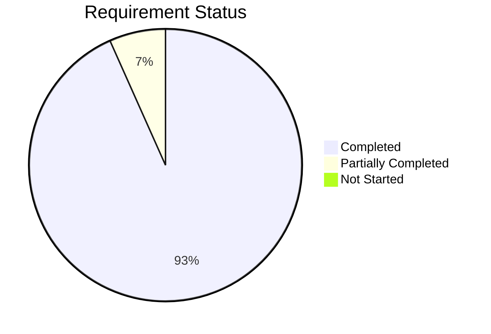

# 1. Executive Summary

## 1.1 Project Overview

This project turns the repository's existing Hello World HTTP service into a lightweight product backlog. The deliverable is one Markdown document, `BACKLOG.md`, at the repository root: two epics — Server Setup then Request Routing — carrying five stories, each with a one-line story statement, one story-point estimate and one plain acceptance criterion checkable by eye. It is a planning artifact for whoever picks up the service next. No story is implemented, `server.js` and `README.md` are untouched, and no runtime behaviour changes.

## 1.2 Completion Status



Chart colours: Completed = Dark Blue `#5B39F3`; Remaining = White `#FFFFFF`.

| Metric | Value |
|---|---|
| Total Hours | 14.5 |
| Completed Hours (AI + Manual) | 12.0 (12.0 AI + 0.0 Manual) |
| Remaining Hours | 2.5 |
| Percent Complete | 82.8% |

Calculation: 12.0 ÷ (12.0 + 2.5) × 100 = 82.8%.

## 1.3 Key Accomplishments

- ✅ `BACKLOG.md` delivered at the repository root — the only added path on the branch
- ✅ Two epics in the fixed order, Server Setup then Request Routing
- ✅ Five stories split three then two, each with one Story, Estimate and Acceptance line
- ✅ Story points 1, 1, 2, 1, 2 on one convention, rationale on four of the five
- ✅ Five plain single-sentence criteria; the root-path example byte-exact at `BACKLOG.md:43`
- ✅ `server.js` and `README.md` byte-identical, and the README gained no link
- ✅ No manifest, lock file, test directory, CI workflow or container introduced
- ✅ Structure, console state and layout confirmed as browsers render the document

## 1.4 Critical Unresolved Issues

Two items are open against the fifteen requirements this delivery was scoped against, and both are decisions rather than defects: one word in a criterion, and housekeeping in the working tree. A third group of six pre-existing hardening gaps in the HTTP service sits outside the agreed scope and is listed for visibility — eight open items in all, none of which blocks handing the document over.

| Issue | Impact | Owner | ETA |
|---|---|---|---|
| Port-story criterion reads "with one configured" where the plan's wording is "when one is configured" (`BACKLOG.md:31`) — 1 item | None on meaning. Aligning the word first requires narrowing the repository's documentation gate, which screens case-insensitively for Given/When/Then | Delivery owner | 0.5 h |
| Untracked verification artefacts under `blitzy/screenshots/` sit inside the working tree — 1 item | Delivered repository content is unaffected — they are untracked — but the repository gate's one-new-path assertion reports a failure until they are cleared | Maintainer | 0.5 h |
| Pre-existing hardening gaps in the HTTP service (`server.js:1`) — 6 items: all-interface bind against a loopback readiness line, unauthenticated catch-all, no error containment, no socket/connection/request bounds, plaintext transport, no `Content-Type`/`nosniff` | None today — the handler returns one constant public string, reads no request field and holds no data. Prerequisites before the service is deliberately exposed | Service owner | Separate change |

## 1.5 Access Issues

No access issues identified. Zero third-party dependencies means no registry authentication; no environment variable, secret or third-party service is needed to verify or read the deliverable; and the branch is published and current with its remote.

| System/Resource | Type of Access | Issue Description | Resolution Status | Owner |
|---|---|---|---|---|
| — | — | No access issues identified | N/A | N/A |

## 1.6 Recommended Next Steps

1. **[High]** Review the five stories and their estimates with the delivery owner, and sign off (1.0 h).
2. **[High]** Open the pull request, review the single added file, and merge (0.5 h).
3. **[Medium]** Settle the port-story criterion wording at `BACKLOG.md:31` (0.5 h).
4. **[Low]** Clear the untracked verification artefacts from the working tree (0.5 h).
5. **[Low]** Schedule the separate HTTP-service hardening change before exposing the service.

# 2. Project Hours Breakdown

## 2.1 Completed Work Detail

| Component | Hours | Description |
|---|---|---|
| Service and specification analysis | 1.0 | Read `server.js` and the project specification to establish the four observable behaviours the backlog decomposes: listener creation from the built-in `http` module, port binding on 3000, the uniform greeting handler, the startup readiness line |
| Epic allocation and five-story decomposition | 1.5 | Allocated those behaviours across Server Setup and Request Routing along the epic boundary the request fixed, and framed five stories — three as-built, two as small increments |
| Estimates and rationales | 0.5 | One story-point value per story on a single convention (1, 1, 2, 1, 2), each argued from the shape of the change its story implies, with a one-clause rationale on four of the five |
| Acceptance criteria | 0.5 | Five plain single-sentence criteria in the register the request set, including the root-path criterion used byte-exact |
| `BACKLOG.md` authoring | 1.0 | Heading structure (one h1, two h2, five h3), labelled story lines rather than a table, ATX conventions matching the existing README, and proportionality to one or two screens |
| Preamble accuracy cross-read | 0.5 | Verified the opening sentence clause by clause against `server.js:1`, so the uniformity claim sits at handler level and holds for every method including `HEAD` |
| Document contract and prohibited-content verification | 1.5 | Structure, per-story element set, estimate convention and criterion register asserted against the specification; fifteen families of excluded content swept (Gherkin, commands, fences, diagrams, Definition of Done/Ready, sprint apparatus, specification IDs, exclusions section, task decomposition, tables, lists, checkboxes, comments, placeholders) |
| Frozen-file and repository-scope continuity verification | 1.0 | `server.js` (142 B) and `README.md` (22 B) confirmed byte-identical by blob hash and empty baseline diff; no README link; 22 prohibited artifacts confirmed absent; tracked tree confirmed at three files |
| Rendered-output, layout and accessibility verification | 2.0 | Document rendered by two independent Markdown engines and driven in a real browser: heading inventory, three paragraphs per story, element census, console and network state, geometry from 320 px to 2560 px, 16 px minimum type, 21:1 text contrast |
| Introduced security and supply-chain verification | 1.5 | Secret, credential, connection-string, absolute-path, private-IP and URL sweeps over the file, the committed blob, the whole tree and every historical revision; zero dependencies confirmed; no executable bit, symlink or script added; the file contains no `<`, `>` or `&`, so it cannot activate as markup |
| Conventions and rule-compliance certification | 0.5 | Confirmed no user-specified rules apply to this project and certified the delivery against the standing convention in their place: repository Markdown style and every existing file untouched |
| Commit hygiene and branch delivery | 0.5 | Four commits with a single consistent author identity, tracked tree clean, branch published and current with its remote, `git archive HEAD` yielding exactly the three delivered files |
| **Total** | **12.0** | Matches Completed Hours in Section 1.2 |

## 2.2 Remaining Work Detail

| Category | Hours | Priority |
|---|---|---|
| Backlog content review and sign-off with the delivery owner | 1.0 | High |
| Pull request review and merge to the integration branch | 0.5 | High |
| Port-story criterion wording decision (`BACKLOG.md:31`) | 0.5 | Medium |
| Clear untracked verification artefacts from the working tree | 0.5 | Low |
| **Total** | **2.5** | — |

Excluded from these totals, and stated so the reader is not surprised: hardening the pre-existing HTTP service (explicit bind host with actual-address logging, socket and connection bounds, error containment, TLS termination, `Content-Type` and `nosniff`) is outside the agreed scope, which froze `server.js`. It becomes prerequisite work the moment the service is deliberately exposed or given a dynamic response.

## 2.3 Total Project Hours

| Quantity | Hours |
|---|---|
| Completed (Section 2.1) | 12.0 |
| Remaining (Section 2.2) | 2.5 |
| **Total Project Hours** | **14.5** |

12.0 + 2.5 = 14.5, and 12.0 ÷ 14.5 × 100 = 82.8% — the figure used in Sections 1.2, 7 and 8. Confidence is high on the completed figures, each traced to a delivered artifact and an executed check, and high on the remaining figures except content sign-off, which depends on stakeholder availability.

# 3. Test Results

This repository has no test runner, test script or test directory, and the plan forbids adding one. Verification is therefore executable assertion suites over the delivered document and the repository state, plus the repository's own two validation gates run verbatim. Every figure below is from a run executed against the delivered tree.

| Area / Category | Framework | Tests | Passed | Failed | Coverage | What This Proves |
|---|---|---|---|---|---|---|
| Document structure and story contract | Python + grep assertion suite | 20 | 20 | 0 | n/a | Two epics in the fixed order, five stories split three then two, three labelled lines per story, and story points 1, 1, 2, 1, 2 on one convention |
| Acceptance criteria register | Python + grep assertion suite | 4 | 4 | 0 | n/a | Five plain single sentences of 16/15/24/8/22 words, with the root-path criterion byte-exact and carrying no implementation direction |
| Prohibited-content exclusions | Python + grep assertion suite | 15 | 15 | 0 | n/a | None of the excluded apparatus is present — no Gherkin, command, fence, diagram, Definition of Done/Ready, sprint field, specification ID, exclusions section, table, list or placeholder |
| Markdown hygiene and rendered structure | Python + markdown-it-py 4.2.0 | 10 | 10 | 0 | n/a | The file is clean UTF-8 with one trailing newline and balanced markers, and renders to exactly one h1, two h2, five h3 and 18 paragraphs with no table, list or script |
| Frozen-file continuity | git + `node --check` | 5 | 5 | 0 | n/a | `server.js` and `README.md` are byte-identical to their pre-project blobs, the service source still parses, and the README gained no link |
| Repository scope and artifact absence | git + shell existence probes | 26 | 26 | 0 | n/a | The tracked tree is exactly three files and all 22 prohibited artifacts — manifest, lock files, `node_modules`, test directories, CI, container, runtime pins, linter configs — are absent |
| Repository validation gates, run verbatim | Documentation gate + whole-package gate | 16 | 15 | 1 | n/a | The delivered document and the frozen files pass the repository's own acceptance checks; the one failure is the gate's "only one new path" assertion, which counts untracked verification artefacts left in the working tree |
| **Total** | — | **96** | **95** | **1** | No coverage tooling exists in this repository | — |

`node --check server.js` exits 0 on Node v22.23.2 — the whole-tree compile equivalent, since it is the only source file. `npm install` and `npm test` both exit 254 with `npm error code ENOENT … package.json`: that is the specified state of a repository with no manifest, not a failure of this delivery.

**Not Covered**

- **The behaviour the five stories describe.** Nothing exercises a configurable listening port, a root-path-scoped greeting or a 404 for unknown paths, because none of them is implemented — they are specifications for future work. A human should re-read each criterion when the corresponding story is picked up, and write the tests then.
- **The HTTP service at runtime.** The service was never started, no request was issued and no route was probed. Listener creation, the port-3000 bind, the greeting response and the startup line are established by reading `server.js:1` and by byte-identity with the pre-project state, not by execution. Anyone needing runtime proof should start it in an isolated environment and issue one request.
- **Regression protection for the document itself.** The assertions above run on demand; no automated guard re-runs them. A later edit to `BACKLOG.md` can break its structure or criterion register silently unless the commands in Section 9 are run again.

# 4. Runtime Validation & UI Verification

The deliverable is a document, so its runtime is the Markdown renderer and the browser that displays it. Each line below was observed directly against the delivered file.

- ✅ **Render and load** — `BACKLOG.md` renders without error and loads over `file://` with the title `BACKLOG preview`, zero console messages of any level after reload, zero subresource requests, and no request on any scheme other than `file:`.
- ✅ **Structure as rendered** — one h1, two h2 ("Server Setup" then "Request Routing"), five h3 in the specified order, no h4–h6, and 18 paragraphs; the accessibility tree shows the same eight correctly levelled headings.
- ✅ **Per-story layout** — walking from each h3 yields exactly three paragraphs, labelled Story / Estimate / Acceptance, for all five stories; zero table, list, link, image and script elements, so the layout is labelled lines as specified.
- ✅ **Root-path criterion** — renders as `Acceptance: GET / returns 200 with the greeting text`, present exactly once and with no trailing period.
- ✅ **Desktop layout at 1440×900** — page height 1358 px against a 900 px viewport, about 1.5 screens; `scrollWidth` 1440 equals `clientWidth`, so no horizontal overflow; content column capped at 932 px and centred.
- ✅ **Narrow layout at 390×844** — reflows to a single column with no horizontal overflow and no clipping, and the extracted text length is identical to the desktop measurement, so nothing is lost in reflow.
- ✅ **Readability and accessibility** — 16 px minimum computed type at every width, 1.6 line-height, 21:1 text contrast (19:1 for the inline code chips), zero focusable controls, which is correct for a control-free text document.
- ✅ **Convention continuity** — the new document's h1 computed font family, size, weight and colour are identical to the existing README's rendered h1, so the two documents read as one set.
- ✅ **Clean-checkout integrity** — `git archive HEAD` yields exactly `BACKLOG.md`, `README.md` and `server.js`, and the exported document is byte-identical to the working copy.
- ⚠ **The HTTP service was never exercised at runtime** — it was deliberately not started, no listener was bound on port 3000, no request was issued and no route was probed. Its behaviour is asserted from source and byte-identity only; the port-configuration and 404-routing behaviours the backlog describes do not exist yet and so could not be driven.

# 5. Compliance & Quality Review

## 5.1 Compliance Matrix

Each row records where the deliverable stands now, with evidence the reader can open.

| # | Deliverable / Benchmark | Status | Evidence |
|---|---|---|---|
| 1 | One file created, `BACKLOG.md`, at the repository root; no `docs/`, per-epic or index file | ✅ PASS | Branch change set against the pre-project commit is `A BACKLOG.md` alone; tracked tree is three files |
| 2 | `server.js` and `README.md` byte-identical; no README link; no package manifest | ✅ PASS | Blob hashes `2886290f…` (142 B) and `35d275fe…` (22 B) unchanged; empty baseline diff; `grep backlog README.md` finds nothing |
| 3 | Two epics, Server Setup then Request Routing, one intent sentence each; no third epic | ✅ PASS | `BACKLOG.md:5` and `:33`; intents at `:7` and `:35`; two h2 in the rendered DOM |
| 4 | Five stories, three then two, with no decomposition below story level | ✅ PASS | Story headings at `:9`, `:17`, `:25`, `:37`, `:45`; no h4+, no list markers, no spike or sub-task |
| 5 | Exactly three elements per story — Story, Estimate, Acceptance | ✅ PASS | Fifteen labelled lines in that order per story; no fourth element; three rendered paragraphs per story |
| 6 | One story-point value per story on one convention; at most one rationale, appended after an em dash | ✅ PASS | `:13`, `:21`, `:29`, `:41`, `:49` read 1, 1, 2, 1, 2; rationale on four, none on "Announce readiness on startup" as specified |
| 7 | Criteria are one or two plain sentences in the register of the supplied example, and the five stories match the specified text | ⚠ PASS WITH NOTE | Five single sentences of 16/15/24/8/22 words; `:43` byte-exact. One word differs from the plan's wording at `:31` — Section 5.2, divergence 1 |
| 8 | Preamble of one or two sentences naming the service; nothing after the last story | ✅ PASS | `:3` is one sentence, accurate clause by clause against `server.js:1`; the file ends at `:51` with a single newline |
| 9 | ATX headings (h1 title, h2 epics, h3 stories) at the repository root, labelled lines rather than a table | ✅ PASS | Heading levels 1,2,3,3,3,2,3,3 with none skipped; no Setext heading; zero table pipes |
| 10 | Excluded content absent — Gherkin, commands, diagrams, traceability and specification IDs, Definition of Done/Ready, sprint apparatus, exclusions section | ✅ PASS | Fifteen pattern families swept clean; the file contains no `<`, `>` or `&` character at all |
| 11 | No implementation and no live measurement — no code, test, router or configuration file; nothing built, started or benchmarked | ✅ PASS | Net branch delta is one file, +51 lines of Markdown prose; no listener was bound on port 3000; only a read-only source parse was executed |
| 12 | Proportionality, and the standing convention that applies where no project-specific rules exist | ✅ PASS | 51 lines / 2,189 bytes, about 1.5 rendered screens; repository Markdown style adopted and every existing file left untouched |

## 5.2 AAP & Rule Divergences and Gaps

| What the AAP/Rule Required | What Was Delivered Instead | Why It Diverged | Impact | Remediation |
|---|---|---|---|---|
| The port story's criterion quoted as "…**when** one is configured it listens on that port…" | `BACKLOG.md:31` reads "…**with** one configured it listens on that port…", otherwise identical | The repository's documentation gate screens case-insensitively for Given/When/Then prose, so the plan's own literal wording turns that gate red. The delivered wording was kept deliberately | None on meaning or on any reader's check; the criterion asserts exactly what the plan asserts, in one sentence of the specified length | Accept as delivered, or narrow the gate's keyword screen to line-start matches first and then change the one word (0.5 h) |
| `BACKLOG.md` to be the only new path, with no scratch or working file left inside the checkout | The tracked tree holds only `BACKLOG.md`, but 76 untracked verification artefacts sit under `blitzy/screenshots/` in the working tree | Browser-based verification of the rendered document writes its evidence to a fixed directory inside the checkout, and the files were left in place rather than deleted | Delivered repository content is unaffected — the artefacts are untracked and `git archive HEAD` yields exactly the three files — but the whole-package gate's "at most one new path" assertion fails until they are cleared | Delete `blitzy/` or add it to a global ignore before running the gate (0.5 h) |
| Enterprise-standard text convention, which would give `README.md` a trailing newline | `README.md` left byte-identical, ending at byte 22 with no trailing newline | The plan freezes every existing file and the gate asserts the file's exact blob hash, so the explicit exclusion outranks the generic convention — **Sanctioned** | None. The file is valid Markdown, renders correctly, and remains the convention authority the new document follows | None required. Adding the newline needs a scope change first, since any edit fails the byte-identity check |
| `server.js` to stay byte-identical, with its known weaknesses left in place | The file is untouched, and six hardening gaps therefore persist in the running service | The plan places touching any existing file out of scope, names the all-interface bind explicitly and still mandates no change — **Sanctioned** | No impact today: the handler returns one constant public string, reads no request field and holds no data. The exposure is availability and residual attack surface, not data disclosure | Schedule a separate hardening change. Nothing is required for this delivery |

**Divergence 1 — the port-story criterion wording.** The plan fixes this criterion's text, and the delivered line matches it word for word except that "when one is configured" reads "with one configured" (`BACKLOG.md:31`). The wording arrived with the file and was kept on purpose: the repository's documentation check greps case-insensitively for `Given|When|Then` to ban Gherkin phrasing, and the plan's literal clause trips it, so restoring the exact words would trade a compliant document for a failing gate. The reader's choice is simple — accept the delivered wording, which asserts the same thing in the same number of words, or narrow that grep to line-start keywords and change the single word.

**Divergence 2 — untracked verification artefacts in the working tree.** The repository was to gain exactly one new path. It did: `git diff --name-status` against the pre-project commit reports `A BACKLOG.md` and nothing else, and a clean export of `HEAD` contains only `BACKLOG.md`, `README.md` and `server.js`. What sits alongside them, untracked, are 76 PNG captures under `blitzy/screenshots/` produced while verifying how the document renders. They cannot enter a commit and no delivered content depends on them, but the repository's whole-package gate asserts that at most one path is new or changed, and run verbatim it now counts 76. Delete the directory or ignore it globally, then re-run the gate from Section 9 to see it pass end to end.

**Divergence 3 — `README.md` without a trailing newline (Sanctioned).** With no project-specific rules in force, standing best practice applies, and it would give a text file a final newline; `README.md` ends at byte 22 with the last character of its heading. It was left exactly as found because the plan forbids touching any existing file and the acceptance check asserts its blob hash, so an edit would fail the delivery. The file is valid Markdown, renders as a single heading, and is the convention the new document follows — its h1 renders with identical computed typography. Nothing needs doing unless the newline is wanted enough to widen the scope.

**Divergence 4 — the service's own hardening left untouched (Sanctioned).** The plan required `server.js` to stay byte-identical and even records its all-interface bind while still mandating no change, so six weaknesses at `server.js:1` remain by agreement: the listener binds every interface while its readiness line names loopback; the catch-all handler is unauthenticated for every method and path; no `error` listener exists, so a bind failure ends the process; no inactivity, connection, per-socket request or rate bound is set; transport is plaintext; and responses declare neither `Content-Type` nor `X-Content-Type-Options`. Today's blast radius is bounded. Treat the resource bounds and the bind address as prerequisites before exposure.

# 6. Risk Assessment

Forward-looking risks only — what could still go wrong from here.

| Risk | Category | Severity | Probability | Mitigation | Status |
|---|---|---|---|---|---|
| No automated guard protects the document's contract: a later edit can break the heading structure, the criterion register or the verbatim root-path criterion without anything noticing | Technical | Medium | Medium | Re-run the documentation gate and the contract assertions in Section 9 after any edit to `BACKLOG.md`; both take seconds and need no dependencies | Open — mitigation documented |
| The per-story layout depends on blank-line paragraph separation; removing a blank line merges Story, Estimate and Acceptance into one rendered paragraph | Technical | Low | Low | Keep the blank lines; the hygiene checks in Section 9 detect the collapse, as does opening the rendered preview | Accepted |
| Two of the five stories describe behaviour the service does not have, so a reader could take a configurable port or a 404 route as already delivered | Integration | Low | Low | The preamble and the Request Routing intent state today's behaviour explicitly; the two stories read as increments | Accepted |
| The listener binds every interface while its readiness line names loopback (`server.js:1`), so an operator can misjudge reachability | Security | Medium | Medium | Pass an explicit bind host and log the address actually bound, in the separate hardening change; treat as a prerequisite before deliberate exposure | Open — outside the agreed scope |
| No inactivity timeout, connection cap, per-socket request cap or rate limit on the listener (`server.js:1`), allowing slow-client or flood exhaustion | Security | Medium | Medium | Configure socket, keep-alive and request timeouts plus connection and per-socket caps, and front the service with a reverse proxy when exposed | Open — outside the agreed scope |
| The single endpoint is unauthenticated for every method and path, transport is plaintext, and responses declare no media type or `nosniff` (`server.js:1`) | Security | Low | Medium | Bounded today by a constant public response holding no data; add authentication, TLS and response headers before any dynamic or sensitive content | Open — outside the agreed scope |
| No server `error` listener or exception containment: a bind failure terminates the process with no diagnostic of its own (`server.js:1`) | Operational | Low | Medium | Attach an `error` listener before listening and run under a supervisor, in the separate hardening change | Open — outside the agreed scope |
| Untracked verification artefacts inside the working tree make the repository gate report a failure on an otherwise clean tree, which can mask a real one | Operational | Low | High | Clear `blitzy/` or ignore it globally, then re-run the gate; 0.5 h in Section 2.2 | Open — scheduled |

# 7. Visual Project Status

Brand colours: Completed / AI work = Dark Blue `#5B39F3`; Remaining / not completed = White `#FFFFFF`.



Total 14.5 hours — 12.0 completed, 2.5 remaining, 82.8% complete.

**Remaining hours by category (Section 2.2)**



**Requirement status across the fifteen scoped requirements**



Fourteen requirements are fully met; one — the five stories matching their specified text — is met but for a single word, which Section 5.2 documents. No requirement is unstarted.

# 8. Summary & Recommendations

**What was delivered.** One document, `BACKLOG.md`, at the repository root: a preamble naming the service, two epics in the order the request fixed, and five stories split three under Server Setup and two under Request Routing. Each story carries one story statement, one story-point estimate on a single convention, and one plain acceptance criterion — the root-path story using the supplied example word for word. The three Server Setup stories and the root-path story describe behaviour the service already has; the configurable-port and 404 stories are the next small increments. Nothing was implemented, and `server.js` and `README.md` are byte-identical to their pre-project state. At 82.8% of the scoped work complete, the document itself is finished; what remains is human review and the merge.

**What was verified.** The document's contract was asserted line by line: structure, the three labelled lines per story, the estimate sequence, the criterion register and the fifteen families of content the request excluded — 96 executed checks with 95 passing. It was then verified as browsers resolve it: correct heading hierarchy, exactly three paragraphs per story, a clean console, no external requests, and no horizontal overflow or lost text between 390 px and 1440 px, with its h1 typography identical to the existing README's. Repository continuity was proved by blob hash and empty baseline diff on both frozen files, by the absence of 22 artifacts the plan ruled out, and by a clean export of `HEAD` containing exactly three files. The single failing check is the gate's "at most one new path" assertion, which counts untracked verification captures left in the working tree — a housekeeping item, not a defect in the delivery.

**What remains, and the critical path.** Two and a half hours: content sign-off with whoever owns delivery (1.0 h), the pull request review and merge (0.5 h), a decision on one word in the port-story criterion (0.5 h), and clearing the untracked captures so the gate passes verbatim (0.5 h). The critical path is sign-off then merge; the other two are independent and can happen in either order. No engineering work is required to make the document deliverable.

**What is deliberately not here.** No test suite guards this document, because the repository has none and the plan forbids adding one — the commands in Section 9 are the substitute and must be re-run by hand after any edit. The five stories are specifications, so nothing exercises a configurable port, root-path scoping or 404 routing until they are implemented. The HTTP service was never started, so its runtime behaviour rests on reading `server.js:1`. And the six hardening gaps in that service remain by agreement; they are separate scoped work, and the resource bounds and bind address should be settled before the service is deliberately exposed.

**Production readiness.** READY for its purpose. For a planning artifact, production means fit to hand to a reader, and this one is accurate against the service it describes, complete against every element the request specified, conventional with the repository it sits in, and proven to render correctly on the screens a reader will use. Success metrics for the hand-off: the delivery owner accepts the five stories and their estimates without restructuring the epics; the branch merges with `server.js` and `README.md` still byte-identical; and the repository gate passes verbatim once the working tree is tidied.

# 9. Development Guide

Every command below was executed from the repository root against the delivered tree, and the outputs shown are the ones observed.

## 9.1 System Prerequisites

| Requirement | Version used | Notes |
|---|---|---|
| Node.js | v22.23.2 | Only needed for the read-only source check; the service is not started |
| npm | 11.18.0 | Nothing to install — see 9.3 |
| git | 2.51.0 | With git-lfs 3.7.1 on PATH so the standard hooks pass; no file is LFS-tracked |
| Python 3 | 3.13.7 | Optional, for rendering the document to HTML |
| OS | Any Linux/macOS with a POSIX shell | No hardware considerations: the repository is 2.4 KB of tracked content |

```bash
node --version    # v22.23.2
npm --version     # 11.18.0
git --version     # git version 2.51.0
python3 --version # Python 3.13.7
```

## 9.2 Environment Setup

There is nothing to configure. The repository declares no environment variable, no secret and no service endpoint, and it holds no `.env`, `.npmrc` or runtime pin.

```bash
cd <repository-root>
git branch --show-current            # the delivery branch
git ls-files                         # BACKLOG.md  README.md  server.js
wc -l -c BACKLOG.md                  # 51 2189 BACKLOG.md
```

## 9.3 Dependency Installation

None — and this is the specified state, not a gap.

```bash
npm ls --all --depth=0
# <repository-root>
# └── (empty)          ← zero packages resolve; server.js uses only the built-in http module
```

Do **not** run `npm install`, `npm ci` or create a manifest. Both install commands exit 254 with `npm error code ENOENT … package.json` because no manifest exists, and adding one is outside the agreed scope.

## 9.4 Build, Test and Verification

There is no build step and no test runner. The checks below are the repository's verification set.

```bash
# 1. Whole-tree source check — parses, executes nothing, binds no port
node --check server.js; echo "exit=$?"        # exit=0

# 2. Documentation gate for BACKLOG.md
f=BACKLOG.md; fail=0
h1=$(grep -c '^# ' "$f"); h2=$(grep -c '^## ' "$f"); h3=$(grep -c '^### ' "$f")
[ "$h1" = 1 ] && [ "$h2" = 2 ] && [ "$h3" = 5 ] || { echo "FAIL headings: $h1/$h2/$h3"; fail=1; }
[ "$(grep -m2 '^## ' "$f" | tr -d '# ' | paste -sd,)" = "ServerSetup,RequestRouting" ] \
  || { echo "FAIL epic names or order"; fail=1; }
grep -qF 'GET / returns 200 with the greeting text' "$f" || { echo "FAIL verbatim criterion"; fail=1; }
grep -nEi 'Given|When|Then|curl|mermaid|Definition of (Done|Ready)|Sprint|velocity|§|Out of scope' "$f" \
  && { echo "FAIL prohibited content above"; fail=1; }
grep -q '^[A-Za-z].*$' "$f" || { echo "FAIL no preamble text"; fail=1; }
echo "per-change: $([ $fail = 0 ] && echo PASS || echo FAIL)"
# headings 1/2/5, epics ServerSetup,RequestRouting → per-change: PASS
```

```bash
# 3. Whole-package gate — frozen files, scope containment
fail=0
node --check server.js || fail=1
git diff --quiet a3cb67262e80bd68273aef2dec12895a7805713b -- README.md server.js \
  || { echo "FAIL: an existing file was modified"; fail=1; }
[ "$(git hash-object README.md)" = 35d275fe2cfb36a8a2d07657a8b5ccec96f8f892 ] || { echo "FAIL README.md"; fail=1; }
[ "$(git hash-object server.js)" = 2886290f56dfe2483a8f29f7dfcb89796a6fca00 ] || { echo "FAIL server.js"; fail=1; }
[ "$(git status --porcelain --untracked-files=all | wc -l)" -le 1 ] \
  || { echo "FAIL: more than one new path"; fail=1; }
[ -d docs ] && { echo "FAIL: docs/ must not exist"; fail=1; }
for x in package.json package-lock.json node_modules Dockerfile .github; do
  [ -e "$x" ] && { echo "FAIL: $x must not be created"; fail=1; }
done
echo "gate: $([ $fail = 0 ] && echo PASS || echo FAIL)"
# All assertions pass except the new-path count, which includes untracked screenshot
# captures under blitzy/. Remove or globally ignore that directory to see gate: PASS.
```

```bash
# 4. Hygiene and structure spot checks
grep -n '^#' BACKLOG.md          # headings at 1,5,9,17,25,33,37,45
grep -c '^\*\*Story:\*\*' BACKLOG.md; grep -c '^\*\*Estimate:\*\*' BACKLOG.md; grep -c '^\*\*Acceptance:\*\*' BACKLOG.md   # 5 5 5
grep -n '^\*\*Estimate:\*\*' BACKLOG.md   # 1, 1, 2, 1, 2 points
grep -nP '\t| +$' BACKLOG.md || echo "no tabs, no trailing whitespace"
tail -c 1 BACKLOG.md | od -An -tx1        # 0a — single trailing newline
git archive HEAD | tar -t                 # BACKLOG.md  README.md  server.js
```

## 9.5 Reading and Rendering the Deliverable

The document is plain Markdown and needs no tooling to read. To check how it renders, write the preview into a scratch directory **outside** the checkout — never into the working tree, which must stay at the three delivered files.

```bash
d=$(mktemp -d)                      # scratch directory outside the repository
python3 - "$d" <<'PY'
import sys
from markdown_it import MarkdownIt
css = ('body{max-width:900px;margin:auto;padding:16px;'
       'font-family:-apple-system,"Segoe UI",Helvetica,Arial,sans-serif;line-height:1.6}'
       'code{background:#f4f4f4;border-radius:3px;font-family:ui-monospace,Menlo,Consolas,monospace}')
body = MarkdownIt('commonmark').render(open('BACKLOG.md', encoding='utf-8').read())
html = ('<!doctype html><html lang="en"><head><meta charset="utf-8">'
        '<meta name="viewport" content="width=device-width, initial-scale=1">'
        f'<title>BACKLOG preview</title><style>{css}</style></head><body>{body}</body></html>')
out = sys.argv[1] + '/backlog.html'
open(out, 'w', encoding='utf-8').write(html)
print('wrote', out)
PY
echo "open this file:// path in a browser: $d/backlog.html"
```

Expected on opening it: one h1, two h2, five h3, 18 paragraphs, three labelled lines per story, no console message after reload, and no horizontal scrollbar at any width. Delete the scratch directory when finished: `rm -rf "$d"`.

## 9.6 The Service Itself

`server.js` is **not** started as part of building, verifying or reading this deliverable, and the agreed scope forbids doing so here. If you later need to exercise it, do so in an isolated environment where TCP port 3000 is free — the port is a hardcoded literal and cannot be changed without editing the source, which the configurable-port story in the backlog exists to address.

```bash
node --check server.js   # the only interaction used here: a parse, exit 0, nothing bound
```

## 9.7 Committing

```bash
git status --porcelain -- BACKLOG.md README.md server.js   # empty: tracked tree clean
git log --oneline -1                                       # a772f61 Restore the specified acceptance criteria in BACKLOG.md
```

Commit only `BACKLOG.md`. Do not add a link to it from `README.md` — that would modify a frozen file and fail the gate's blob-hash assertion.

## 9.8 Troubleshooting

| Symptom | Cause | Resolution |
|---|---|---|
| `npm error code ENOENT … package.json` from `npm install` or `npm test` (exit 254) | No manifest exists, by design | Expected. Do not create one; there is nothing to install and no test runner to invoke |
| Whole-package gate prints `FAIL: more than one new path` | Untracked screenshot captures under `blitzy/` are counted as new paths | Remove the directory or add it to a global ignore, then re-run the gate |
| Documentation gate prints `FAIL prohibited content` after an edit | The gate screens case-insensitively for `Given|When|Then`, so ordinary prose containing "when" or "then" trips it | Reword the line, or narrow the screen to line-start keywords before using those words |
| `FAIL README.md changed` or `FAIL server.js changed` | An existing file was edited, including whitespace or a trailing newline | Restore it: `git checkout -- README.md server.js`, then re-run the gate |
| Story lines run together in the rendered preview | A blank line between `**Story:**`, `**Estimate:**` and `**Acceptance:**` was removed | Restore the blank lines; the structure relies on paragraph separation |
| `ModuleNotFoundError: markdown_it` when rendering | The optional renderer is not present in that environment | Read the Markdown directly, or install the renderer into a scratch virtual environment outside the checkout |
| Something is listening on port 3000 | Another process holds the port; this project never binds it | Leave it alone — nothing here needs the port. Verify with `ss -tln | grep 3000` |

# 10. Appendices

## A. Command Reference

| Purpose | Command | Observed result |
|---|---|---|
| Source check for the whole tree | `node --check server.js` | exit 0 — parses, executes nothing, binds no port |
| Tracked inventory | `git ls-files` | `BACKLOG.md`, `README.md`, `server.js` |
| Branch change set | `git diff --name-status a3cb672` | `A BACKLOG.md` |
| Deliverable size | `wc -l -c BACKLOG.md` | 51 lines, 2,189 bytes |
| Heading map | `grep -n '^#' BACKLOG.md` | lines 1, 5, 9, 17, 25, 33, 37, 45 |
| Story label counts | `grep -c '^\*\*Story:\*\*' BACKLOG.md` (and Estimate, Acceptance) | 5 each |
| Frozen-file identity | `git hash-object README.md server.js` | `35d275fe…`, `2886290f…` |
| Dependency posture | `npm ls --all --depth=0` | `└── (empty)` |
| Clean export | `git archive HEAD \| tar -t` | the three delivered files |
| Documentation gate | see Section 9.4 step 2 | `per-change: PASS` |
| Whole-package gate | see Section 9.4 step 3 | all assertions pass except the new-path count |

## B. Port Reference

| Port | Used by | Status in this project |
|---|---|---|
| 3000 | `server.js` — hardcoded numeric literal, host argument omitted | Never bound here. The service is not started, and no verification step needs the port |

The port cannot be changed without editing the source; the "Set the port without editing source" story in the backlog is the planned fix.

## C. Key File Locations

| Path | Role |
|---|---|
| `BACKLOG.md` | The deliverable — two epics, five stories, 51 lines |
| `BACKLOG.md:3` | Preamble naming the service the backlog decomposes |
| `BACKLOG.md:5`, `BACKLOG.md:33` | Epic headings: Server Setup, Request Routing |
| `BACKLOG.md:9,17,25,37,45` | The five story headings, in specified order |
| `BACKLOG.md:43` | Root-path acceptance criterion, used byte-exact |
| `server.js` | The pre-existing Hello World HTTP service, 142 bytes, one statement — frozen |
| `README.md` | Repository heading and the Markdown convention the backlog follows, 22 bytes — frozen |

## D. Technology Versions

| Component | Version |
|---|---|
| Node.js | v22.23.2 (`/usr/bin/node`) |
| npm | 11.18.0 |
| git | 2.51.0 |
| git-lfs | 3.7.1 (no file is LFS-tracked) |
| Python 3 | 3.13.7 |
| markdown-it-py | 4.2.0 (optional, for previewing) |
| Third-party packages | none — `server.js` imports only the built-in `http` module |

## E. Environment Variable Reference

| Variable | Status | Notes |
|---|---|---|
| — | None required | Nothing in the repository reads configuration: `server.js` contains no `process.env` access, and no `.env` file or template exists |
| `PORT` | Future work only | Named by the "Set the port without editing source" story as the intended override with a 3000 fallback; not read by any code today |

## F. Developer Tools Guide

| Tool | Availability | Use here |
|---|---|---|
| Markdown renderer (`markdown-it-py`) | Available | Preview the deliverable as a browser resolves it — Section 9.5 |
| Linter / formatter | None configured, and none to be added | The grep and structure checks in Section 9.4 stand in |
| Test runner | None, and none to be added | The contract assertions and the two gates are the verification set |
| Build system | None | Markdown is not compiled; there is no build step to run |
| CI pipeline | None | Run the Section 9.4 checks by hand after any edit |
| Docker | Engine available on the host | Not used: no container descriptor exists and none is needed |

## G. Glossary

| Term | Meaning in this project |
|---|---|
| Epic | One of the two top-level groupings in the backlog: Server Setup, Request Routing |
| Story | One h3 entry carrying exactly a Story line, an Estimate line and an Acceptance line |
| Story point | The single effort unit used for all five estimates (values 1, 1, 2, 1, 2); no scale, velocity or roll-up is stated |
| Acceptance criterion | One or two plain sentences a reader checks by eye, in the register of the supplied example |
| Frozen file | `server.js` or `README.md` — required to stay byte-identical, asserted by blob hash |
| Documentation gate | The grep-based structural check over `BACKLOG.md` in Section 9.4 |
| Whole-package gate | The repository-level check of frozen files and scope containment in Section 9.4 |
| As-built story | A story capturing behaviour the service already has, phrased as an observable outcome |
