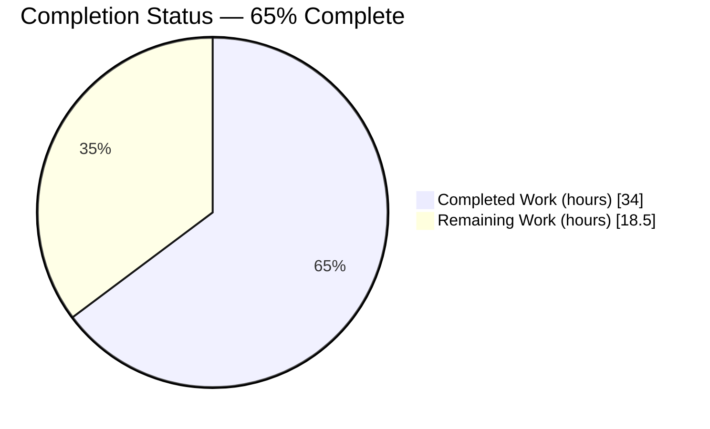
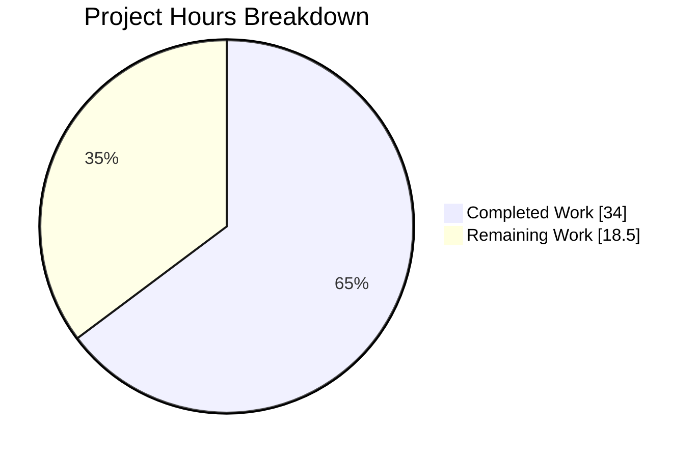
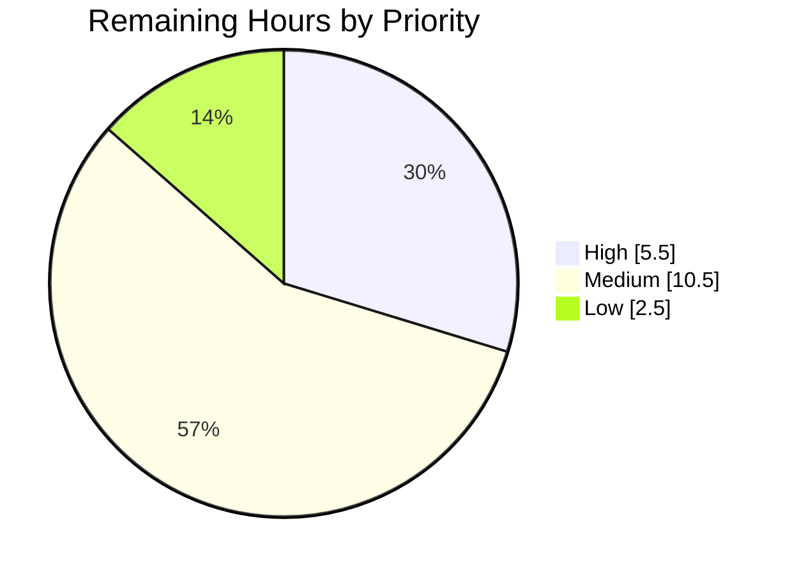

# 1. Executive Summary

## 1.1 Project Overview

This project reimplements the repository's Node.js HTTP one-liner (`server.js`) as a Python 3 Flask application in one new file, `app.py`, at the repository root. The service answers every path and all nine standard HTTP methods with an identical 14-byte body — `Hello, World!` plus a line feed — on HTTP 200, listens on the hardcoded TCP port 3000, and prints one exact startup line per process. Four contract values had to match the original byte for byte, and `server.js` is retained unchanged as the behavioural source of truth. Consumers are loopback HTTP clients.

## 1.2 Completion Status

**34.0 of 52.5 hours complete — 65%** (34.0 ÷ 52.5 = 64.8%). All 16 scoped requirements are implemented and verified; the remaining hours are the path to production plus two deferred decisions.



Completed = Dark Blue `#5B39F3`; Remaining = White `#FFFFFF`.

| Metric | Value |
|---|---|
| Total Hours | 52.5 |
| Completed Hours (AI + Manual) | 34.0 |
| Remaining Hours | 18.5 |
| Percent Complete | 65% |

## 1.3 Key Accomplishments

- 14-byte body with `Content-Length: 14` on every non-HEAD response; HEAD returns 200, no body.
- Status 200 on every method, path and query string — 441 assertions, no non-200 on a well-formed request.
- Listener fixed on TCP 3000; `PORT`, `FLASK_RUN_PORT` and dotenv files cannot move it.
- Startup line byte-exact, first on stdout, printed once per process, never repeated by traffic.
- One view answers every path — root, deep, query, trailing-slash, `/static/…`, control-character — with no 404 handler.
- All nine standard verbs reach the view on both URL rules, CONNECT and TRACE included.
- Five URLs render correctly in a real browser: zero console errors, zero failed requests.
- `server.js` unchanged at 142 bytes; both implementations agree on every path tested.

## 1.4 Critical Unresolved Issues

**2 of the 16 scoped requirements carry an open item; the other 14 are closed with no caveat.** Both are documented decisions, detailed in Section 5.2.

| Issue | Impact | Owner | ETA |
|---|---|---|---|
| A stdout reader that closes after fewer lines than the process writes (for example `python3 app.py \| head -1`) kills the process before the socket binds, so nothing listens on 3000. `node server.js` survives the same harness. | Medium — a supervisor or shell wrapper that reads only a readiness line gets a server that never starts. No contract value is affected when stdout goes to a terminal, a file, or any reader that drains it. | Service owner (ranking decision) | 2 h |
| `app.run` is called with only the port argument, as specified, so an exported `FLASK_DEBUG=1` or a reachable `.env`/`.flaskenv` enables debug mode: `/console` then serves Werkzeug's code-evaluation debugger (200, 1563 bytes), a debugger PIN is written to stderr, and the startup line prints twice. | High if the variable is ever set in the runtime environment — remote code evaluation on the contract port. Behaviour is identical to the pinned form when no such variable or file is present. | Service owner + platform | 2 h |

## 1.5 Access Issues

No access issues identified — the service needs no credential, secret, database, broker or network egress; the toolchain is local and was exercised directly.

| System/Resource | Type of Access | Issue Description | Resolution Status | Owner |
|---|---|---|---|---|
| Application runtime | None required | Reads no configuration and holds no credential; starts from a scrubbed environment | Not applicable | — |
| Python/Flask toolchain | Local interpreter | Flask 3.1.3 / Werkzeug 3.1.8 resolve on the system interpreter and in a clean virtual environment | Verified working | Platform |
| Reference implementation | Local Node.js | Node.js v22.23.2 runs `server.js` for parity comparison | Verified working | Platform |

## 1.6 Recommended Next Steps

1. **[High]** Rank the supervised-start behaviour: authorise the construct that restores parity, or require stdout to be drained (2 h).
2. **[High]** Close the debug-mode exposure — pin debug off, or enforce the absence of `FLASK_DEBUG` and dotenv files (2 h).
3. **[High]** Pin Flask 3.1.3 / Werkzeug 3.1.8 and the supported interpreter range (1.5 h).
4. **[Medium]** Choose the production serving posture and re-run the path and method matrices on it (4 h).
5. **[Medium]** Add an automated regression suite for the contract values and reach matrices (4 h).

# 2. Project Hours Breakdown

## 2.1 Completed Work Detail

Every component below traces to a specific scoped requirement: the four contract values, the six implicit requirements they entail, the structural and scope constraints, the documented-behaviour verification the specification mandates, and the nine acceptance criteria.

| Component | Hours | Description |
|---|---|---|
| Source-of-truth analysis and behaviour contract extraction | 1.5 | Read `server.js` (142 bytes, one line) and established the four contract values byte for byte: the 14-byte body, the implicit 200, the literal port 3000, and the 41-byte startup line |
| Documented-behaviour verification of the four contract points | 2.0 | Confirmed against Flask 3.1.3 that a returned string becomes the body with status 200, that the `path` converter accepts slashes, that `port` overrides the default, that the static rule is registered only when a static folder is set, and that `use_reloader` follows `debug` |
| Flask application implementation | 2.0 | `app.py`: application object with `static_folder=None`, the nine-verb method tuple on one line, one view returning the contract literal under two URL rules, and the guarded startup print plus run call — zero comments (commit `ad0a46d`) |
| Total path reach: widened path converter | 3.0 | Diagnosed that Werkzeug's stock `path` converter cannot match a line feed, then gave the catch-all a converter whose regex admits it, so one view answers every path with no 404 handler (`app.py:6-10`, commit `6e502ff`) |
| Startup and run-call configuration behaviour | 2.0 | Established how `Flask.run` resolves debug from dotenv files, the environment and the argument, measured the trade in both directions, and aligned the call with the specification's literal form (`app.py:23`, commit `439acaa`) |
| Static quality verification | 3.0 | Compile and import checks, lint-equivalent sweeps, AST/tokenizer structural census, forbidden-token and placeholder sweeps, and file-scope and continuity hashing of `server.js` and `README.md` |
| HTTP contract runtime verification | 5.0 | Path × method matrices in-process and over raw sockets, response-header census, HEAD and OPTIONS semantics, and the unconditional-handler proof under every request shape |
| Process lifecycle, configuration immunity and observability verification | 3.5 | Startup-line assertions under traffic, port immunity across environment variables and dotenv files, signal handling with port release, stdout/stderr stream separation, and access-log correctness |
| Security verification | 4.0 | Hostile payloads through path, query, body and headers; traversal and source-disclosure probes; debug-surface probes; log-hygiene sweeps with planted secrets; header, CORS and cookie posture; dependency advisory assessment of the seven-package closure |
| Performance and stability verification | 2.5 | Latency distribution, 50-way concurrency, sustained load with memory/descriptor/thread tracking, wire efficiency, and the converter's cost profile under long control-character paths |
| Browser-client verification | 1.5 | Headless-Chrome navigations over root, deep-with-query, `/static/…`, a control-character path and `/console`, asserting status, headers, DOM text, element census and console output |
| Differential parity and reference continuity | 2.0 | Side-by-side comparison with `server.js` on status, body length, body bytes and `Content-Length`, and re-verification that the reference still starts, prints its single line and serves |
| Delivery integration and repository hygiene | 2.0 | Branch integration on three commits, and confirmation that `app.py` is the only file added, with no bytecode, log, manifest or dotenv artifact anywhere in the checkout |
| **Total** | **34.0** | Matches Completed Hours in Section 1.2 |

## 2.2 Remaining Work Detail

| Category | Hours | Priority |
|---|---|---|
| Lifecycle robustness decision — rank and close the early-closing-stdout behaviour (Section 5.2, divergence 5) | 2.0 | High |
| Debug-console exposure control — authorise pinning debug off, or enforce the variable's absence in the runtime environment (Section 5.2, divergence 2) | 2.0 | High |
| Dependency pinning and clean-environment install verification (Section 5.2, divergences 6 and 7) | 1.5 | High |
| Specification ratification of the delivered file's structural shape (Section 5.2, divergence 1) | 0.5 | Medium |
| Production serving posture: run under a production WSGI host and re-run the path and method matrices there | 4.0 | Medium |
| Process supervision, restart policy and log handling that drains stdout | 2.0 | Medium |
| Automated regression suite for the contract values and reach matrices, wired into CI | 4.0 | Medium |
| Deployment runbook and liveness monitoring approach | 1.5 | Low |
| Network exposure decision — loopback-only bind versus the reference implementation's all-interfaces bind (Section 5.2, divergence 8) | 1.0 | Low |
| **Total** | **18.5** | High 5.5 · Medium 10.5 · Low 2.5 |

## 2.3 Hours Calculation

The work universe is the 16 scoped requirements plus the standard path-to-production activities needed to deploy them. Every requirement is implemented and verified, so no requirement contributes partial or unstarted hours; the remaining total is path-to-production work and two owner decisions the specification explicitly defers.

```
Completed Hours  = 34.0   (16 of 16 requirements, fully verified)
Remaining Hours  = 18.5   (path to production + 2 deferred decisions)
Total Hours      = 34.0 + 18.5 = 52.5
Completion       = 34.0 / 52.5 x 100 = 64.8%  ->  reported as 65%
```

Confidence is high on the completed figure — every component is anchored to code in the tree and to checks executed against it. Confidence on the production serving posture (4.0 h) is medium: the reach matrix must be re-run on the chosen host, and the routing that answers `/static/…` is application-level, so a host that adds its own static handling changes the result.

# 3. Test Results

This repository contains no test suite and no test runner — by design, the single-file scope forbids adding one — so the executable gate is the contract matrix: the module driven in-process through Flask's test client, and the running server driven over raw sockets and `curl` on the contract port. Every figure below was executed against the current tree and observed directly.

**544 checks executed · 541 passed · 3 failed · pass rate 99.4%**

| Area / Category | Framework | Tests | Passed | Failed | Coverage | What This Proves |
|---|---|---|---|---|---|---|
| Static/compile gate | CPython `compile`, `node --check` | 2 | 2 | 0 | Not instrumented | The module and the reference file both parse cleanly with no bytecode written into the checkout |
| Routing and contract, in-process | Flask 3.1.3 test client | 183 | 183 | 0 | Not instrumented | 19 path families × 9 methods all return the contract response; the URL map holds exactly two rules, no static rule, no error handler and no hooks |
| HTTP contract matrix, over the wire | Raw sockets on TCP 3000 | 270 | 270 | 0 | Not instrumented | 30 path families × 9 methods return 200 with `Content-Length: 14`; HEAD is bodyless; traversal and source paths return the constant, disclosing nothing |
| Concurrency | Threaded HTTP client, 8 workers | 64 | 64 | 0 | Not instrumented | 64 simultaneous requests produce exactly one distinct result — the handler is stateless and reads nothing |
| Startup line and log streams | Shell assertions on captured streams | 8 | 8 | 0 | Not instrumented | The 41-byte literal is first on stdout and printed once, before and after traffic; 338 access-log lines carry no 4xx, 5xx or traceback |
| Port and configuration immunity | Environment-variable runs + socket probes | 3 | 3 | 0 | Not instrumented | The listener stays on 3000 with `PORT` and `FLASK_RUN_PORT` set to 8080; both 8080 and 5000 refuse connections |
| Process lifecycle under an early-closing stdout reader | Pipe harness, 3 trials + control | 4 | 1 | 3 | Not instrumented | The failure is deterministic and confined to readers that close early; a reader that drains stdout binds and serves normally |
| Reference parity and repository hygiene | Node.js v22.23.2 + git/md5 checks | 10 | 10 | 0 | Not instrumented | `server.js` is unchanged and serves the same bytes on the same paths; `app.py` is the only file added, with no stray artifact |

No coverage instrumentation exists in this project — there is no test runner to attach it to — so coverage is reported as not instrumented rather than estimated.

**Not Covered**

- **Automated regression protection — nothing at all.** No test file, runner, configuration or pipeline exists, so every check above is a manual run that nothing will repeat on a future edit or dependency bump. A human should add a suite asserting the four contract values and the path/method matrices before the file is changed again (Section 2.2, 4.0 h).
- **Production WSGI hosting.** The every-path-200 contract has only ever been exercised on Werkzeug's development server, which is what `app.run()` starts. The routing that makes `/static/…` answerable is application-level, so the matrices must be re-run on whichever production host is chosen (Section 2.2, 4.0 h).
- **Non-loopback reachability.** The listener binds `127.0.0.1` only, so no check has been made from another interface or another host. Verify reachability from the consumer's network position before cutover (Section 2.2, 1.0 h).
- **Sustained multi-hour operation.** Stability was exercised in bursts and sustained rounds, not over hours or days; a long-running soak under the eventual serving posture is untested.
- **HTTP verbs outside the standard nine.** Exotic parser verbs are out of scope to register and to exercise; the framework answers them with 405, which is the expected behaviour rather than a gap.

# 4. Runtime Validation &amp; UI Verification

The service was started with `python3 app.py` from the repository root and driven live on `http://127.0.0.1:3000/`; the reference implementation was run separately for comparison. This service has no user interface — its only rendered surface is the 14-byte text body — so browser verification consists of real navigations in headless Chrome with the DOM, console and network inspected.

- ✅ **Lifecycle** — `ss` shows `LISTEN 127.0.0.1:3000` owned by the launched process; the process exits on signal and the port is immediately free (`connect_ex` returns 111); a second instance against an occupied port prints the contract line once, exits 1 with `Address already in use`, and leaves the running instance serving.
- ✅ **Body and status contract** — `curl` returns `Hello, World!` at 14 bytes with `Content-Length: 14` and `HTTP/1.1 200 OK`; `od -c` confirms the trailing line feed; HEAD returns 200 with zero bytes downloaded.
- ✅ **Total path reach** — root, `/api/v1/users/42`, query-string, trailing-slash, `/static/app.js`, `/health`, `/metrics`, `/favicon.ico`, `/console`, control-character, unicode, dot-segment, duplicate-slash and 2 KB paths all return the contract response.
- ✅ **Nine-method reach** — GET, POST, PUT, DELETE, PATCH, OPTIONS and TRACE driven with `curl`, HEAD with `curl -I`, and CONNECT over a raw socket (`HTTP/1.1 200 OK` plus the 14 bytes).
- ✅ **Browser rendering** — five navigations plus five automatic favicon fetches: 10 requests, all HTTP 200 with `content-length: 14`, `document.body.innerText` exactly `Hello, World!` on every page; `/static/app.js` shows no 404, no download prompt and no file viewer; `/console` contains only `html`, `head` and `body` with zero inputs, forms or scripts; zero console errors, warnings or exceptions and zero failed requests (one informational quirks-mode notice per page, expected for a DOCTYPE-less body).
- ✅ **Configuration immunity** — with `PORT=8080 FLASK_RUN_PORT=8080` exported, the listener still serves on 3000 and both 8080 and 5000 refuse connections.
- ✅ **Observability streams** — stdout stays at 3 lines / 87 bytes with the byte-exact 41-byte contract line first and printed once; the development-server warning, `* Running on http://127.0.0.1:3000`, `Press CTRL+C to quit` and one access line per request go to stderr; 338 access lines were recorded with no 4xx, 5xx or traceback.
- ✅ **Reference-implementation parity** — `node server.js` starts, prints its single 41-byte line with the identical digest, and serves the same 14 bytes, including on control-character paths, so both implementations agree on every path exercised.
- ❌ **Supervised start with an early-closing stdout reader** — `python3 app.py | head -1` prints the contract line and then dies before the bind; three of three trials left nothing listening, where the reference implementation survives. A reader that drains stdout (`| cat`) binds and serves normally.
- ⚠ **Debug-mode environment sensitivity** — with `FLASK_DEBUG=1` exported, `/console` returns a 1563-byte Werkzeug debugger console instead of the contract body, the startup line prints twice, and a debugger PIN appears on stderr. With the variable unset and no dotenv file present, `/console` returns the contract body and debug mode is off.

**Never exercised at runtime:** the application under a production WSGI host (only the framework's development server has ever served it); reachability from any non-loopback address; and any multi-hour soak. External integrations, authentication flows, persistence and background work do not exist in this project, so there is nothing of that kind to drive.

# 5. Compliance &amp; Quality Review

## 5.1 Compliance Matrix

Each row is the verified state of a scoped deliverable as the code stands now.

| # | Deliverable | Status | Evidence |
|---|---|---|---|
| 1 | Single new file `app.py` at the repository root; no decomposition | ✅ Pass | 23 lines, flat root; branch diff against the base is `A app.py`, +23/−0 |
| 2 | G1 — 14-byte body `Hello, World!` + LF on every non-HEAD request, `Content-Length: 14` | ✅ Pass | `app.py:19`; observed on 441 in-process, wire and browser responses |
| 3 | G1 — HEAD returns 200 with no wire body | ✅ Pass | 200 with 0 bytes downloaded and the header still present, on root and a deep path |
| 4 | G2 — status 200 for every method, path and query string | ✅ Pass | Distinct in-contract status set is `[200]`; no non-200 on any well-formed request |
| 5 | G3 — listener on TCP 3000, no override | ✅ Pass | `app.py:23`; `LISTEN 127.0.0.1:3000`; `PORT`/`FLASK_RUN_PORT` ignored, 8080 and 5000 refused |
| 6 | G4 — startup line byte-exact, first on stdout, once per process | ✅ Pass | `app.py:22`; 41-byte first line, count 1 before and after traffic |
| 7 | Unconditional response — the view reads nothing from the request | ✅ Pass | `app.py:18-19`; identical response across every method, header set and body; 64 concurrent requests gave one result |
| 8 | Total path reach from the routing rules alone, no 404 handler | ✅ Pass | `app.py:6-16`; 30 wire path families answered; error-handler registry empty |
| 9 | Nine standard methods declared explicitly on both rules, one compact line | ✅ Pass | `app.py:12` (90 characters); all nine verified on both rules; a tenth verb yields 405 |
| 10 | Flask's implicit static route removed | ✅ Pass | `app.py:3`; no static rule in the URL map; `/static/app.js` returns the contract body in the browser |
| 11 | `server.js` retained byte-for-byte and still functional | ✅ Pass | 142 bytes, digest unchanged, zero diff against the base; starts and serves |
| 12 | Structural and absence constraints — zero comments, no handlers, no configuration, no manifest, no tests, no documentation changes | ⚠ Partial | Zero comments and zero docstrings; the forbidden-construct sweep is empty; `README.md` untouched. The file carries one structural element beyond the specified shape — see divergence 1 |

## 5.2 AAP &amp; Rule Divergences and Gaps

No user-specified rules were provided for this project, so no user rule could be departed from; the authoritative rule source returns no rules, and that was confirmed independently. Eight divergences from the plan are recorded below. Two are open items that also appear in Section 1.4; six are sanctioned by the plan itself, and the four of those that need human work appear in Section 2.2.

| What the AAP/Rule Required | What Was Delivered Instead | Why It Diverged | Impact | Remediation |
|---|---|---|---|---|
| 1. `app.py` holds "exactly these six things … and no seventh" | Seven module-level constructs: a `TotalPathConverter` subclass and its registration sit between the application object and the route decorators (`app.py:6-10`) | The same plan requires one view to answer **every** path with a 404 handler forbidden. Werkzeug's stock `path` converter cannot match a line feed, so the six-element form returns 404 on a whole path family | None at runtime — every path tested returns 200 with the contract body. The divergence is descriptive | Ratify the seven-construct shape in the specification (0.5 h) |
| 2. `app.run(port=3000)` with no `debug`, `use_reloader` or other option | Complied with exactly (`app.py:23`) — which leaves `FLASK_DEBUG` and dotenv files able to enable debug mode | The directive is explicit and stated three times; honouring it re-admits the environment's influence over debug mode | High if the variable is ever set: `/console` serves a code-evaluation debugger and the startup line prints twice | Authorise pinning debug and the reloader off, or enforce the variable's absence operationally (2.0 h) |
| 3. G4 — the startup line follows a successful bind, as in the Node original | The line is printed immediately before `app.run`, so it also appears when the port cannot be taken (`app.py:22-23`) | Flask offers no post-bind callback; reaching the original ordering needs bind-detection machinery the plan forbids | None on the contract value; a failed start still prints the line, then reports the bind failure on stderr | None required — sanctioned by the plan |
| 4. Node's stdout holds the one 41-byte line alone | Stdout holds three lines: the contract line first, then Flask's two banner lines | Suppressing the banner requires logging configuration or output redirection, which the plan lists as absent by design | None on the contract value; consumers that parse stdout must tolerate three lines | None required — sanctioned by the plan |
| 5. Parity with `server.js`, which survives a stdout reader that closes early | The process dies with an unhandled broken-pipe error before the bind, so nothing listens on 3000 | Every available remedy is forbidden by name, and the two obvious ones were measured ineffective because the failure precedes the bind | Medium — a supervisor reading only a readiness line gets a server that never starts | Rank the trade-off; the only construct measured to restore parity is redirecting stdout after the contract print (2.0 h) |
| 6. No dependency manifest of any kind | Complied with — no manifest exists, so Flask 3.1.3 / Werkzeug 3.1.8 are an environment fact | The plan authorises `app.py` alone and records the one-line manifest as a proposal it deliberately did not act on | The verified behaviour is not reproducible elsewhere by construction; a future Flask major could change a default the contract rests on | Pin the versions outside the single-file constraint and verify a clean install (1.5 h) |
| 7. Behaviour verified on Python 3.14.6 | Delivered and verified on Python 3.13.7 | Python 3.14 is not packaged for this operating system release, so the interpreter was unavailable | None observed — the file uses no version-specific syntax and Flask's declared floor is 3.9 | Record the supported interpreter range alongside the pinned versions (included in the 1.5 h above) |
| 8. Accept framework defaults outside the four contract points | Accepted — including Flask's loopback default, where `server.js` bound all interfaces | Passing `host` is forbidden, and the loopback default agrees with the address in the startup literal | Strictly narrower exposure than the original; a consumer that reached the old server off-host will not reach this one | Decide the exposure and front it with a proxy if required (1.0 h) |

**1. Structural shape.** The plan describes `app.py` as six constructs and no seventh, and the delivered file has seven: `class TotalPathConverter(app.url_map.converters["path"])` with a regex that admits a line feed, plus the line that registers it (`app.py:6-10`). Removing it was measured against the plan's own literal form: that form answers `/a%0Ab` with a 404 page, while the delivered file answers it with 200 and the 14 bytes, and the browser confirms the decoded path really carries the line feed. Because the same plan makes total path reach a requirement and forbids a 404 handler, the shape yields to the behaviour — the same reasoning the plan itself uses when it removes Flask's static route so that reach actually holds. A human need only ratify the wording; no code change is warranted.

**2. Debug-mode sensitivity.** The plan states three times that the run call passes nothing but `port`, and the delivered line is exactly `app.run(port=3000)` (`app.py:23`). Flask resolves debug from dotenv files and then from `FLASK_DEBUG` before it considers the argument, so with the argument absent the environment has the last word. Measured on this tree: `FLASK_DEBUG=1 python3 app.py` yields `/console` at 200 with a 1563-byte "Console // Werkzeug Debugger" page, four stdout lines with the contract line twice, and a debugger PIN on stderr. With no such variable and no reachable `.env`/`.flaskenv`, `/console` returns the contract body and debug mode is off. The decision is which matters more: the literal directive, or immunity in every environment.

**3. Pre-bind ordering of the startup line.** The Node original emits its line from the listen callback, so it appears only after a successful bind; the port prints it on the line before `app.run` (`app.py:22-23`). Flask exposes no equivalent hook and blocks inside `run`, so matching the ordering would mean wrapping or replacing the run call with bind detection — exactly the machinery the plan rules out. The observable consequence is narrow and was exercised deliberately: a second instance started against an occupied port prints the contract line once, then exits 1 with `Address already in use` on stderr, leaving the first instance untouched. The plan sanctions this and names the ranking as the owner's to settle; nothing needs fixing.

**4. Stdout occupancy.** Node's stdout carries one 41-byte line and nothing else; here it carries three lines — the contract literal first, then ` * Serving Flask app 'app'` and ` * Debug mode: off` — with the development-server warning, the `Running on` line and the per-request access log on stderr. The contract properties all hold: the literal is byte-exact, first, and written once per process, before and after traffic. Silencing the banner needs logging configuration or output redirection, which the plan lists as absent by design. The practical consequence for the reader is that anything parsing this stdout must tolerate three lines — and, as divergence 5 shows, must not close the stream after reading one.

**5. Early-closing stdout reader.** Running the service with stdout piped into a consumer that closes after one line prints the contract line and then kills the process with an unhandled broken-pipe error raised from Flask's banner write, which happens before the socket is bound: three of three trials left nothing listening (`connect_ex` 111, `curl` exit 7), while `node server.js` under the identical harness stays up and serves the 14 bytes. Draining readers are unaffected — `| cat` binds and serves. Wrapping the call in an exception guard and resetting the pipe signal were both measured to leave nothing listening, because the throw precedes the bind; only redirecting stdout after the contract print restored parity, and that is the output suppression the plan forbids. This remains open pending the owner's ranking.

**6. No dependency manifest.** The repository declares no manifest in any language, and the plan authorises `app.py` alone while recording a one-line pin of Flask as a proposal it chose not to act on. The consequence is that the behaviour verified here rests on the interpreter that happens to be installed: Flask 3.1.3 and Werkzeug 3.1.8 on Python 3.13.7, confirmed through `importlib.metadata`. Those versions carry no applicable advisory, but nothing in the repository holds them there, and the contract leans on two framework defaults — a returned string becoming a 200 response, and the semantics of the `path` converter — that a future major release could legitimately change. Pin them outside the single-file constraint and verify a clean-environment install.

**7. Interpreter version.** The plan records Python 3.14.6 as the interpreter its behaviour was verified on, while the delivered code was implemented and verified on Python 3.13.7, because 3.14 is not packaged for this operating system release. Nothing in `app.py` uses version-specific syntax, Flask 3.1.3 declares a floor of 3.9, and the plan's own stated compatibility floor is also 3.9, so the substitution is within the agreed range; every contract behaviour was re-confirmed on 3.13.7 rather than assumed. The action for a human is bookkeeping rather than code: state the supported interpreter range next to the pinned dependency versions so the next environment is built deliberately.

**8. Bind interface.** `server.js` binds every interface, so it was reachable from any address on the host; the port passes no `host` argument, which the plan requires, so Flask's loopback default applies and the listener is `127.0.0.1:3000` only — narrower than the original and in agreement with the address in the startup literal. This is a security improvement, but it is still a behaviour change at the integration boundary: any consumer that reached the Node server over a non-loopback address will not reach this one, and no check has been made from another interface. Decide the intended exposure before cutover and front the service with a reverse proxy if off-host access is required.

# 6. Risk Assessment

These are forward-looking exposures for whoever runs this service, ordered by the attention they need.

| Risk | Category | Severity | Probability | Mitigation | Status |
|---|---|---|---|---|---|
| Debug mode reachable from the environment — an exported `FLASK_DEBUG=1` or a reachable `.env`/`.flaskenv` turns `/console` into a code-evaluation debugger on the contract port | Security | High | Low–Medium | Guarantee the variable is unset and no dotenv file is reachable from the working directory, or authorise pinning debug and the reloader off at the run call | Open — accepted by design (Section 5.2, divergence 2) |
| Service never binds under a supervisor whose stdout reader closes after a readiness line | Operational | Medium | Medium | Send stdout to a file or a draining reader; verified working with `\| cat` and `\| head -5` | Open — pending an owner decision (Section 5.2, divergence 5) |
| Development-server serving posture — no worker model, process supervision or TLS, and the framework prints its own production warning on every start | Operational | Medium | High if deployed as-is | Run under a production WSGI host behind a proxy, then re-run the path and method matrices on that host | Open by design — matches the reference implementation's posture |
| Unpinned dependencies — the contract leans on the string-return 200 default and the `path` converter semantics, which a future Flask major could change | Technical | Medium | Medium | Pin Flask 3.1.3 / Werkzeug 3.1.8 and the supported interpreter range; verify a clean-environment install | Open (Section 5.2, divergence 6) |
| No automated regression protection — nothing re-checks the four contract values after an edit or a dependency bump | Technical | Medium | Medium | Add a regression suite covering body, status, port, startup line and the reach matrices, and run it on every change | Open |
| Loopback-only bind where the reference implementation bound all interfaces | Integration | Medium | Medium at cutover | Decide the intended exposure; front the service with a reverse proxy if off-host access is required | Open decision (Section 5.2, divergence 8) |
| Hardcoded port with no override — two instances cannot coexist on one host, so blue/green and side-by-side runs need external namespacing | Operational | Low | Medium | Containerise or namespace per instance; the port literal is a contract value and must not be parameterised | Accepted by design |
| Unauthenticated plain-HTTP surface with no security headers, TLS or rate limiting | Security | Low while the response is a fixed constant | Low | Keep the service on loopback or behind a proxy; introduce access control before it ever returns request-derived data | Accepted by design — identical to the reference implementation |

# 7. Visual Project Status



Colours: Completed Work = Dark Blue `#5B39F3`; Remaining Work = White `#FFFFFF`; headings and accents = Violet-Black `#B23AF2`; highlights = Mint `#A8FDD9`.

**Completed 34.0 h · Remaining 18.5 h · Total 52.5 h · 65% complete**

Remaining hours by priority:



Remaining hours by category (Section 2.2):

| Category | Hours |
|---|---|
| Production serving posture | 4.0 |
| Automated regression suite and CI | 4.0 |
| Lifecycle robustness decision | 2.0 |
| Debug-console exposure control | 2.0 |
| Process supervision and log handling | 2.0 |
| Dependency pinning | 1.5 |
| Deployment runbook and liveness monitoring | 1.5 |
| Network exposure decision | 1.0 |
| Specification ratification of the file's shape | 0.5 |
| **Total** | **18.5** |

# 8. Summary &amp; Recommendations

The migration is delivered. `app.py` is a 23-line Flask application at the repository root that reproduces the Node one-liner's behaviour on all four contract points: every non-HEAD response is the same 14 bytes with `Content-Length: 14`, every well-formed request returns 200 regardless of method, path or query string, the listener binds the hardcoded TCP port 3000 and cannot be moved off it, and the exact startup literal is written first on stdout once per process. `server.js` is retained byte for byte and still runs, and the two implementations now answer identically on every path exercised — including the control-character paths that needed a widened URL converter to reach. The file carries no comments, no error handler, no environment lookup and no hardening, exactly as scoped, and it is the only file the branch adds.

Verification was executed against the current tree rather than inferred: 544 checks, 541 passing, across a static gate, a 183-check in-process routing matrix, a 270-check raw-socket contract matrix, a 64-request concurrency burst, startup and observability assertions, configuration-immunity runs, a lifecycle harness and reference-parity checks — plus a headless-browser pass over five URLs with zero console errors and zero failed requests. The three failures are the three trials of one open behaviour, not three separate problems: when stdout is piped into a reader that closes after one line, the process dies before it binds. That is the single functional item still open, and the specification itself defers the trade-off to the service owner because every remedy inside the agreed constraints was measured either ineffective or forbidden.

Against the scoped work the project stands at **65% complete — 34.0 of 52.5 hours**. All 16 scoped requirements are implemented and verified, so the completed side is finished; the remaining 18.5 hours are the path to production plus two deferred decisions. In priority order: rank the supervised-start behaviour (2 h), close the debug-mode exposure that comes with the literal run call (2 h), pin the dependency set so the verified behaviour is reproducible (1.5 h), choose a production serving posture and re-run the reach matrices on it (4 h), add supervision (2 h), and add a regression suite so nothing silently breaks the contract later (4 h). The two low-priority items are a deployment runbook with a liveness approach (1.5 h) and the network-exposure decision (1 h).

Two properties deserve an explicit decision rather than quiet acceptance. Because the run call passes only the port — which is what the specification requires — an exported `FLASK_DEBUG=1` or a reachable dotenv file turns `/console` into Werkzeug's code-evaluation console on the contract port; that is a remote-code-execution surface in any environment where the variable might be set, and it is either closed in code with a specification amendment or guaranteed away operationally. Separately, the service runs on the framework's development server by directive — the same posture as the Node original, but not a production one — and its reach contract has never been exercised on any other host.

**Production readiness: ready as the scope defines this deliverable, not ready as a production HTTP service.** The contract is met and verified, the code is clean and free of placeholders, the security surface is structurally inert because the handler reads nothing from the request, the dependency closure carries no applicable advisory, and the bind is narrower than the original's. Before real traffic, close the two open decisions, pin the dependencies, and put the application behind a production server with supervision — roughly 11.5 hours of the remaining work, after which the regression suite and runbook can follow.

# 9. Development Guide

Every command below was executed against this repository and produced the output shown. Logs and scratch files go to `$HOME/flask-port` because `app.py` must remain the only file added to the checkout.

## 9.1 System Prerequisites

| Requirement | Verified version | Notes |
|---|---|---|
| Python | 3.13.7 | Any interpreter from 3.9 up satisfies Flask 3.1.3's declared floor; 3.13.7 is what the behaviour was verified on |
| Flask | 3.1.3 | Supplies the application object, URL rules and the string-return-to-response conversion |
| Werkzeug | 3.1.8 | Resolved as Flask's dependency; supplies the `path` converter and the development server |
| Node.js | v22.23.2 | Only needed to run or syntax-check the reference `server.js` |
| curl | 8.x | Used for the verification steps below |
| Free TCP port | 3000 | Hardcoded contract value; the service cannot be moved off it |

Operating system: any Linux with the above toolchain. No database, message broker, container runtime, credential or environment variable is required — the application reads nothing from its environment.

## 9.2 Environment Setup

```bash
cd <repository-root>
mkdir -p "$HOME/flask-port"
python3 -c "import importlib.metadata as m; print('Flask', m.version('flask'), 'Werkzeug', m.version('werkzeug'))"
# Flask 3.1.3 Werkzeug 3.1.8
```

If the interpreter does not already resolve Flask, build an isolated environment **outside** the repository:

```bash
python3 -m venv "$HOME/flask-port/venv"
"$HOME/flask-port/venv/bin/python" -m pip install "Flask==3.1.3"
"$HOME/flask-port/venv/bin/python" -c "import importlib.metadata as m; print('Flask', m.version('flask'), 'Werkzeug', m.version('werkzeug'))"
# Flask 3.1.3 Werkzeug 3.1.8
```

Then run the application with that interpreter (`"$HOME/flask-port/venv/bin/python" app.py`) instead of `python3`.

## 9.3 Build and Static Checks

There is no build system, manifest or compile step. The equivalent gate is a syntax check that writes no bytecode into the checkout:

```bash
cd <repository-root>
PYTHONDONTWRITEBYTECODE=1 python3 -c "compile(open('app.py').read(),'app.py','exec')" && echo OK
# OK
node --check server.js && echo OK        # the reference implementation still parses
# OK
```

A fast behavioural check that needs no port at all — useful on every edit:

```bash
PYTHONDONTWRITEBYTECODE=1 python3 -c "import sys; sys.path.insert(0,'.'); from app import app; c=app.test_client(); [print(p, c.open(p).status_code, c.open(p).data) for p in ('/','/api/v1/users/42','/static/anything.txt','/foo/','/billing/invoices?x=1&y=2','/a%0Ab')]; print(sorted(str(r) for r in app.url_map.iter_rules()))"
# / 200 b'Hello, World!\n'
# /api/v1/users/42 200 b'Hello, World!\n'
# /static/anything.txt 200 b'Hello, World!\n'
# /foo/ 200 b'Hello, World!\n'
# /billing/invoices?x=1&y=2 200 b'Hello, World!\n'
# /a%0Ab 200 b'Hello, World!\n'
# ['/', '/<path:path>']
```

`/static/anything.txt` returning the contract body is the observable proof that no static-file route is registered, and the two-rule URL map is the proof that nothing else was added.

## 9.4 Running the Application

```bash
cd <repository-root>
PYTHONDONTWRITEBYTECODE=1 python3 app.py > "$HOME/flask-port/app.log" 2> "$HOME/flask-port/app.err" &
pid=$!
sleep 1
head -1 "$HOME/flask-port/app.log"
# Server running at http://127.0.0.1:3000/
```

Capture the two streams **separately**: the contract line and Flask's two banner lines go to stdout, while the development-server warning, the `Running on` line and the per-request access log go to stderr. Do not pipe stdout into a reader that closes early — see Troubleshooting.

Stop it with the pid you captured:

```bash
kill "$pid"
lsof -ti :3000 || echo FREE
# FREE
```

## 9.5 Verification Steps

```bash
curl -sS http://127.0.0.1:3000/                       # Hello, World!
curl -sS http://127.0.0.1:3000/ | wc -c               # 14
curl -sS http://127.0.0.1:3000/ | od -c | head -1     # H e l l o ,   W o r l d !  \n
curl -sSI http://127.0.0.1:3000/ | tr -d '\r' | grep -E 'HTTP/|Content-Length'
# HTTP/1.1 200 OK
# Content-Length: 14

# HEAD: 200 with no body on the wire
curl -sS -o /dev/null -w 'HEAD=%{http_code} downloaded=%{size_download}\n' -I http://127.0.0.1:3000/
# HEAD=200 downloaded=0

# every path shape answers the same way
for p in / /api/v1/users/42 /static/app.js /foo/ '/billing/invoices?x=1&y=2' /health; do
  printf '%s -> %s\n' "$p" "$(curl -sS -o /dev/null -w '%{http_code}' "http://127.0.0.1:3000$p")"
done
# each line ends in 200

# the startup line is printed exactly once, and traffic never adds to stdout
grep -c '^Server running at http://127\.0\.0\.1:3000/$' "$HOME/flask-port/app.log"   # 1
wc -lc "$HOME/flask-port/app.log"                                                    # 3 87
```

## 9.6 Example Usage

```bash
# the seven verbs curl can drive directly
for m in GET POST PUT DELETE PATCH OPTIONS TRACE; do
  printf '%s=%s ' "$m" "$(curl -sS -o /dev/null -w '%{http_code}' -X "$m" http://127.0.0.1:3000/)"
done; echo
# GET=200 POST=200 PUT=200 DELETE=200 PATCH=200 OPTIONS=200 TRACE=200
```

CONNECT cannot be expressed by curl, so drive it over a socket:

```bash
python3 - <<'PY'
import socket
s = socket.create_connection(('127.0.0.1', 3000), timeout=5)
s.sendall(b"CONNECT / HTTP/1.1\r\nHost: 127.0.0.1:3000\r\nConnection: close\r\n\r\n")
data = b''
while True:
    chunk = s.recv(4096)
    if not chunk: break
    data += chunk
print(data.split(b'\r\n')[0].decode(), '| body:', data.rpartition(b'\r\n\r\n')[2])
PY
# HTTP/1.1 200 OK | body: b'Hello, World!\n'
```

Compare against the reference implementation (run one at a time — both want port 3000):

```bash
node server.js > "$HOME/flask-port/node.log" 2> "$HOME/flask-port/node.err" &
npid=$!; sleep 1
curl -sS http://127.0.0.1:3000/ | wc -c   # 14 — identical bytes
kill "$npid"
```

## 9.7 Troubleshooting

| Symptom | Cause | Resolution |
|---|---|---|
| `Address already in use` / `Port 3000 is in use by another program…` on stderr and the process exits 1 (stdout still shows the contract line once) | Another listener holds TCP 3000. The startup line is printed just before the bind, so it appears even on a failed start | `lsof -ti :3000` to find the holder; stop the process you own, then start again. Never change the port literal — it is a contract value |
| The process prints the contract line and dies with a broken-pipe traceback; nothing listens | Stdout is piped into a reader that closes after fewer lines than the process writes (`\| head -1`, `$(… \| read)`, a supervisor reading only a readiness line) | Redirect stdout to a file, or use a reader that drains it (`\| cat`, `\| head -5`). This is a known open item — see Sections 1.4 and 5.2 |
| `/console` returns a 1563-byte Werkzeug debugger page instead of `Hello, World!`, and the startup line appears twice | `FLASK_DEBUG=1` is exported, or a `.env`/`.flaskenv` reachable from the working directory sets it | Unset the variable and remove the dotenv file from the start-up path; confirm with `grep -c 'Debug mode: off' "$HOME/flask-port/app.log"` returning 1. Never run this service with debug mode enabled |
| `ModuleNotFoundError: No module named 'flask'` | The interpreter in use does not have Flask installed | Use an interpreter that does, or build the isolated environment in Section 9.2 and run it with that interpreter |
| A `__pycache__` directory appears inside the checkout | `python3 -m py_compile app.py` writes bytecode into the current directory even with `PYTHONDONTWRITEBYTECODE=1`; that variable only suppresses implicit import-time writes | Use `python3 -c "import py_compile; py_compile.compile('app.py', cfile='$HOME/flask-port/app.pyc', doraise=True)"`, or remove the directory afterwards — `app.py` must remain the only file added |
| The service is unreachable from another host or interface | The listener binds `127.0.0.1` only, and no `host` argument may be passed | Reach it from the same host, or place a reverse proxy in front — see Section 5.2, divergence 8 |

# 10. Appendices

## A. Command Reference

| Purpose | Command |
|---|---|
| Syntax check (writes nothing) | `PYTHONDONTWRITEBYTECODE=1 python3 -c "compile(open('app.py').read(),'app.py','exec')"` |
| Reference file syntax check | `node --check server.js` |
| In-process contract check | `PYTHONDONTWRITEBYTECODE=1 python3 -c "import sys; sys.path.insert(0,'.'); from app import app; c=app.test_client(); print(c.get('/').status_code, c.get('/').data)"` |
| Inspect the URL map | `python3 -c "import sys; sys.path.insert(0,'.'); from app import app; print(sorted(str(r) for r in app.url_map.iter_rules()))"` |
| Start the service | `PYTHONDONTWRITEBYTECODE=1 python3 app.py > "$HOME/flask-port/app.log" 2> "$HOME/flask-port/app.err" & pid=$!` |
| Stop the service | `kill "$pid"` |
| Confirm the port is free | `lsof -ti :3000 \|\| echo FREE` |
| Body size check | `curl -sS http://127.0.0.1:3000/ \| wc -c` |
| Header check | `curl -sSI http://127.0.0.1:3000/` |
| Startup-line assertion | `grep -c '^Server running at http://127\.0\.0\.1:3000/$' "$HOME/flask-port/app.log"` |
| Access-log error scan | `grep -cE '" (4[0-9][0-9]\|5[0-9][0-9]) ' "$HOME/flask-port/app.err"` |
| Installed dependency versions | `python3 -c "import importlib.metadata as m; print(m.version('flask'), m.version('werkzeug'))"` |
| Repository scope check | `git status --porcelain && git diff --name-status <base>..HEAD` |

## B. Port Reference

| Port | Bound by | Interface | Notes |
|---|---|---|---|
| 3000 | `app.py` (`app.run(port=3000)`) and `server.js` | `127.0.0.1` for `app.py`; all interfaces for `server.js` | Hardcoded contract value — no environment variable or flag can move it. Only one of the two implementations can run at a time |
| 5000 | Nobody | — | Flask's own default, explicitly overridden; connections are refused |

## C. Key File Locations

| Path | Role | Size |
|---|---|---|
| `app.py` | The entire Flask application: application object with no static folder, widened `path` converter, nine-verb method tuple, one view under two URL rules, guarded startup print and run call | 555 bytes, 23 lines |
| `server.js` | The Node.js reference implementation and behavioural source of truth — read-only, unchanged | 142 bytes, 1 line |
| `README.md` | Repository title only — untouched by this work | 22 bytes |

Notable lines in `app.py`: `:1` the sole import · `:3` application object with `static_folder=None` · `:6-10` the widened `path` converter and its registration · `:12` the nine-verb method tuple · `:15-16` the two route registrations · `:18-19` the view and its return literal · `:21-23` the `__main__` guard, the startup print and the run call.

## D. Technology Versions

| Component | Version | Source |
|---|---|---|
| Python | 3.13.7 | System interpreter, `/usr/bin/python3` |
| Flask | 3.1.3 | Installed distribution metadata |
| Werkzeug | 3.1.8 | Installed as Flask's dependency |
| Jinja2 / MarkupSafe | 3.1.6 / 3.0.3 | Flask dependencies — installed, never invoked (no template is rendered) |
| itsdangerous / click / blinker | 2.2.0 / 8.5.0 / 1.9.0 | Flask dependencies |
| Node.js | v22.23.2 | Runs the reference implementation |
| pip | 25.3 | Only needed to build an isolated environment |

No version is pinned in the repository — see Section 5.2, divergence 6.

## E. Environment Variable Reference

The application reads no environment variable; it starts and serves correctly from a fully scrubbed environment. Two variables nonetheless influence the process through the framework:

| Variable | Effect | Required setting |
|---|---|---|
| `FLASK_DEBUG` | If set truthy (or set by a reachable `.env`/`.flaskenv`), enables debug mode: `/console` serves a code-evaluation debugger, the reloader duplicates the startup line, and a debugger PIN is written to stderr | Must remain unset |
| `PYTHONDONTWRITEBYTECODE` | Suppresses implicit bytecode writes so no `__pycache__` appears in the checkout | Recommended `1` |
| `PORT`, `FLASK_RUN_PORT`, `FLASK_APP`, `FLASK_RUN_HOST` | No effect — verified ignored; the listener stays on `127.0.0.1:3000` | Irrelevant |

## F. Developer Tools Guide

- **Reading the two streams.** Always redirect stdout and stderr to separate files. The contract line is the first line of stdout; the access log and the development-server warning are on stderr. Assertions about "the first line" are meaningless on a merged stream.
- **Testing without the port.** Flask's test client exercises the full routing and response path in-process, so the contract can be checked without binding TCP 3000 — useful when something else holds the port.
- **Proving the static route is absent.** Request `/static/anything.txt`. The contract body means no static route is registered; a 404 would mean one is.
- **Driving CONNECT and TRACE.** `curl` cannot express CONNECT; use a raw socket as shown in Section 9.6. TRACE works with `curl -X TRACE`.
- **Keeping the checkout clean.** `app.py` is the only file this project adds. Write scratch files, logs and bytecode outside the repository, and prefer the compile form in Section 9.3 over `python3 -m py_compile`.
- **Comparing with the reference.** Run `node server.js` and `python3 app.py` one at a time on port 3000 and compare status, body length and body bytes; they match on every path exercised.

## G. Glossary

| Term | Meaning in this project |
|---|---|
| Contract values | The four behaviours that had to match the Node original exactly: the 14-byte body, status 200, TCP port 3000, and the startup line |
| Catch-all rule | `"/<path:path>"`, the URL rule that matches every non-root path, paired with `"/"` for the root |
| `path` converter | The Werkzeug URL converter behind the catch-all. The delivered subclass widens its regex so paths containing control characters also match |
| Static route | The `/static/<path:filename>` rule Flask registers automatically. Constructing the application with `static_folder=None` prevents it, so nothing shadows the catch-all |
| Unconditional handler | The view never reads the request; every response is the same constant, which is why injection classes are structurally inert |
| Development server | The server `app.run()` starts. Functional and used for all verification here, but not a production HTTP server |
| Startup line | `Server running at http://127.0.0.1:3000/` — 41 bytes including the line feed, written first on stdout once per process |
