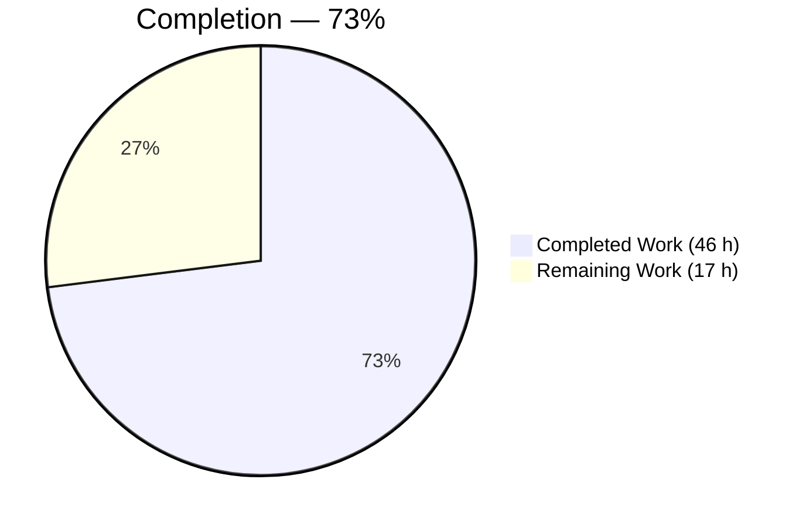
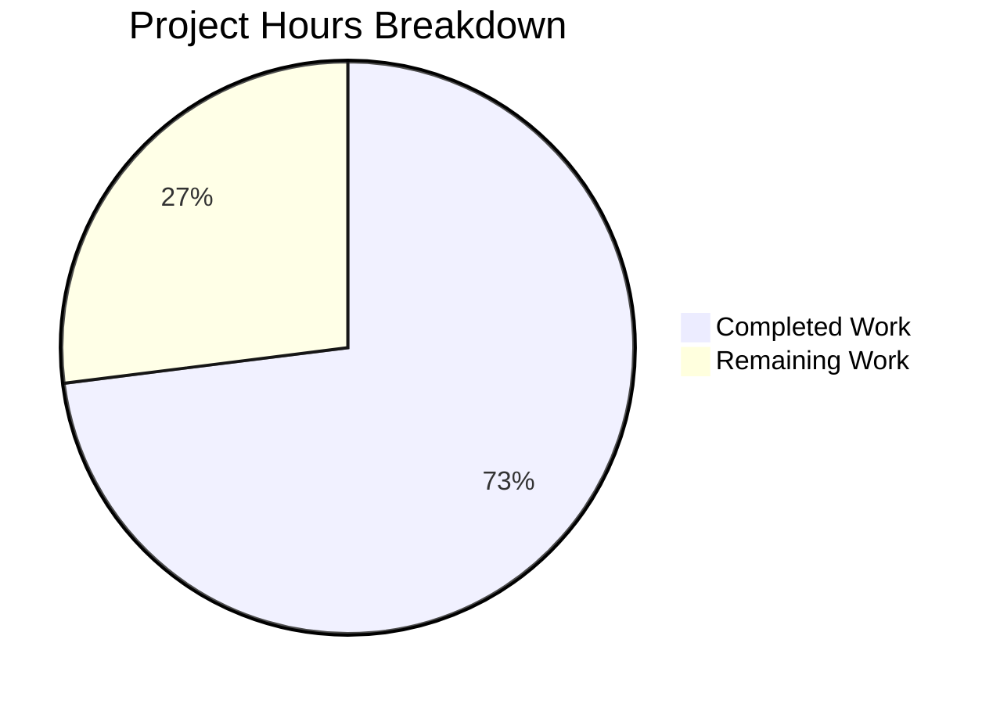
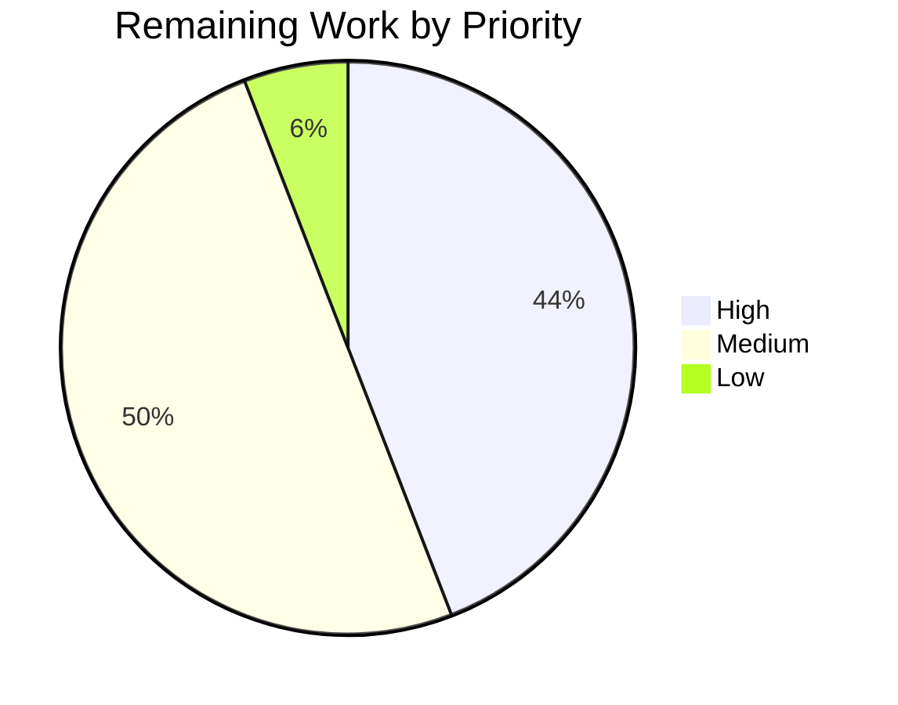

# 1. Executive Summary

## 1.1 Project Overview

`check_billing_sep_01` is a single-file, zero-dependency Node.js HTTP service that answers requests on TCP 3000 with a fixed 14-byte greeting. It had no resilience behaviour: a bind collision killed the process with an unhandled-event stack trace, a signal terminated it mid-exchange and lost the reply, every method was answered `200`, and the listener was freed only by the process dying. This work adds all four behaviours — method validation, error handling with process-level fatal handlers, a signal-driven graceful drain, and deliberate listener release — inside `server.js` alone, leaving the supported `GET` and `HEAD` responses byte-identical. Its consumers are operators and HTTP clients.

## 1.2 Completion Status



Completed = Dark Blue `#5B39F3`; Remaining = White `#FFFFFF`.

| Metric | Value |
|---|---|
| **Total Hours** | **63.0** |
| Completed Hours (AI + Manual) | 46.0 (46.0 AI, 0.0 manual) |
| Remaining Hours | 17.0 |
| **Percent Complete** | **73%** |

Calculation: 46.0 / (46.0 + 17.0) × 100 = **73.0%** — scoped deliverables plus the path-to-production work to deploy them.

## 1.3 Key Accomplishments

- ✅ Unsupported methods get `405` + `Allow: GET, HEAD`, body drained so the connection stays reusable (`server.js:2-6`).
- ✅ A bind collision reports one line and exits 1, with no stack trace (`server.js:25-28`).
- ✅ An uncaught exception or unhandled rejection reports one line, drains, exits 1 (`server.js:19-23`).
- ✅ `SIGTERM`/`SIGINT` run one idempotent drain; an in-flight request completes, exit 0 (`server.js:10-17`).
- ✅ The listener is released by `close()`, with a 5 s unreferenced backstop (`server.js:15-16`).
- ✅ `GET` and `HEAD` are byte-identical to the previous service, `Content-Type` still absent.
- ✅ Node's own `400`, `408` and `431` client-error replies remain intact.
- ✅ One file changed, none created or deleted, zero dependencies, `README.md` untouched.

## 1.4 Critical Unresolved Issues

**1 of the 4 resilience areas named in the request carries an open item; the other 3 are closed.** Four more are open on the path to production — 5 in total.

| Issue | Impact | Owner | ETA |
|---|---|---|---|
| Method contract does not reach `CONNECT` or unsatisfiable-`Expect` requests — a raw `CONNECT` is closed with no reply and an `Expect`-bearing unsupported method gets `417`, not `405` (input validation area; see §5.2) | A client cannot distinguish an unsupported `CONNECT` from an unreachable server; the supported path is unaffected | Service owner (decision) | 2.5 h |
| No automated regression protection exists — no test suite, CI workflow or linter, and none may be added to the repository | A future edit to `server.js` can change the contract with nothing to catch it | Platform engineering | 3.0 h |
| Runtime is unpinned; five accepted behaviours come from Node defaults | Behaviour may drift on a different Node version | Platform engineering | 1.5 h |
| Network exposure is unconstrained — the listener binds `*:3000` while the only log line advertises `127.0.0.1`, and the port is a fixed literal | Reachable on every interface; one instance per host | Platform engineering | 2.0 h |
| Host writes core dumps containing process memory and inherited environment variables on crash | A crash could persist secrets to disk outside the service's control | Platform engineering | 1.0 h |

## 1.5 Access Issues

No access issues identified. The repository, branch and toolchain are available and were used throughout; the endpoint needs no credentials and the project has no external dependency to authenticate against.

| System/Resource | Type of Access | Issue Description | Resolution Status | Owner |
|---|---|---|---|---|
| Repository and branch | Read/write | None — commits applied and verified locally | ✅ No issue | — |
| Node runtime and HTTP tooling | Local execution | None — v22.23.2 present, the specified target | ✅ No issue | — |
| External services / package registry | Not required | Zero dependencies; nothing to fetch or authenticate | ✅ Not applicable | — |

## 1.6 Recommended Next Steps

1. **[High]** Settle the method contract for `CONNECT` and unsatisfiable-`Expect` requests (2.5 h).
2. **[High]** Pin the runtime at Node ≥ v22.23.2; stop with `SIGTERM`/`SIGINT` on a grace period above 6 s (3.0 h).
3. **[High]** Constrain the wildcard bind and map the fixed port 3000 (2.0 h).
4. **[Medium]** Stand up repeatable regression protection — the four behaviour checks and two capture diffs (3.0 h).
5. **[Medium]** Package, deploy, and run the acceptance gate against the deployed artifact (4.0 h).

# 2. Project Hours Breakdown

## 2.1 Completed Work Detail

| Component | Hours | Description |
|---|---|---|
| Defect diagnosis and pre-change baseline | 3.0 | Reproduced all four failures against the original one-line service and established a behavioural baseline (`SIGTERM` → exit 143, truncated reply) used later as the regression oracle |
| Input validation vertical | 1.5 | `GET`/`HEAD` allow-list, `405` + `Allow: GET, HEAD` + `Content-Length: 0`, `req.resume()` body drain (`server.js:2-6`) |
| Graceful shutdown vertical | 2.5 | Idempotent latched `stopServer`, both signal handlers, exit through an emptied event loop with no `process.exit()` (`server.js:10-17, 30-31`) |
| Error handling vertical | 2.5 | Server `'error'` listener and the shared `fatal(label)` factory for uncaught exceptions and unhandled rejections, with exit-code discipline (`server.js:19-28, 32-33`) |
| Resource cleanup vertical | 1.5 | Instance captured in `const server`, deliberate `server.close()`, 5 s unreferenced `closeAllConnections()` backstop (`server.js:1, 15-16`) |
| Preserved contract and source form | 1.5 | Byte-identical `GET`/`HEAD` responses, unchanged startup line and port literal, CommonJS retained, four inline comments and single trailing newline |
| Compile, source-integrity and scope hygiene | 3.5 | `node --check`, layout and byte-level integrity gates, invariant-absence sweeps, style audit, secret sweep, dependency inventory, forbidden-artifact sweep across the tree |
| Behaviour gate and regression acceptance | 4.0 | The four behaviour checks (error handling, shutdown, validation, cleanup) plus both `Date`-stripped response-capture diffs against the pre-change baseline |
| Lifecycle and resilience runtime validation | 4.0 | Fatal paths driven to completion, latch idempotency under simultaneous and late signals, backstop timing, listener-descriptor release, rolling-restart behaviour |
| HTTP contract and connection management | 4.5 | Full method sweeps, `405` shape across methods and body framings, request-target forms, keep-alive reuse, pipelining |
| Process output-contract validation | 3.0 | Whole-session stdout/stderr ledgers across sustained traffic, request-path silence, and the four exit-status pairings |
| Performance and resource accounting | 3.5 | Concurrency batches, descriptor and memory accounting under load, large rejected-body handling, drain under load |
| Security assessment and adversarial testing | 5.0 | Injection, request-smuggling and oversized-input batteries, CORS and fingerprint-header posture, access model, disclosure sweeps, runtime advisory review |
| Independent-client verification | 1.0 | Real browser driven against the endpoint: status, complete header set, rendered text, network activity and console output |
| Protocol-event contract analysis | 2.5 | Established how `CONNECT` and unsatisfiable-`Expect` requests reach the runtime ahead of the request listener, and settled the method policy on a single guard site (§5.2) |
| Compliance review and acceptance judgement | 2.5 | Requirement-by-requirement compliance matrices, rule-scope verdict, scope ledger and final acceptance |
| **Total** | **46.0** | Matches Completed Hours in §1.2 |

## 2.2 Remaining Work Detail

| Category | Hours | Priority |
|---|---|---|
| Settle the method-contract position for `CONNECT` and unsatisfiable-`Expect` requests (§5.2) | 2.5 | High |
| Pin the deployment runtime at Node ≥ v22.23.2 and plan the move off the 22.x maintenance line | 1.5 | High |
| Configure process supervision: `SIGTERM`/`SIGINT` stop signal, termination grace above ~6 s | 1.5 | High |
| Constrain network exposure for the wildcard bind and map the fixed port 3000 | 2.0 | High |
| Establish repeatable regression protection for future edits, outside the frozen source scope | 3.0 | Medium |
| Package and roll out the service (unit or container definition, rollout and rollback) | 2.5 | Medium |
| Wire external liveness probing and log capture (no health endpoint exists) | 1.5 | Medium |
| Harden the host against core dumps containing process memory | 1.0 | Low |
| Run the acceptance gate against the deployed artifact | 1.5 | Medium |
| **Total** | **17.0** | Matches Remaining Hours in §1.2 and the §7 chart |

## 2.3 Hours Reconciliation

| Check | Value | Result |
|---|---|---|
| §2.1 completed total | 46.0 | ✅ equals §1.2 Completed Hours |
| §2.2 remaining total | 17.0 | ✅ equals §1.2 Remaining Hours and the §7 chart |
| §2.1 + §2.2 | 63.0 | ✅ equals §1.2 Total Hours |
| Completion percentage | 46.0 / 63.0 × 100 = 73.0% | ✅ the figure used in §1.2, §7 and §8 |
| Priority split of remaining work | High 7.5 · Medium 8.5 · Low 1.0 | ✅ sums to 17.0 |

# 3. Test Results

The project has no test runner and no test suite — the repository contains no test file, CI workflow, linter or coverage tooling, and the specification forbids adding any. The verification gate is therefore executed by hand: `node --check` for the compile step, `curl` and raw-socket `node -e` clients for behaviour, signal delivery with exit-status capture for the lifecycle, and a real browser as an independent HTTP client. Every row below was executed against the delivered `server.js` and its result observed directly.

| Area / Category | Framework | Tests | Passed | Failed | Coverage | What This Proves |
|---|---|---|---|---|---|---|
| Source and compile integrity | `node --check` v22.23.2, `git`, byte inspection | 5 | 5 | 0 | n/a — no coverage tooling | The delivered source parses as CommonJS on the target runtime and is the exact 35-line file it is meant to be |
| Input validation and method policy | `curl` 8.14.1 | 15 | 15 | 0 | n/a | Only `GET` and `HEAD` are served; every other ordinary method gets `405` + `Allow: GET, HEAD` + a zero-length body, and the connection survives the rejection for reuse |
| Graceful shutdown and signal handling | `node -e` raw socket + signal delivery | 9 | 9 | 0 | n/a | A request in flight when `SIGTERM` or `SIGINT` arrives completes normally and the process exits 0, where it previously lost the reply and exited 143 |
| Error handling and fatal paths | `node`, stream and exit-status capture | 11 | 11 | 0 | n/a | A bind collision, an uncaught exception and an unhandled rejection each report one line and exit 1 — no stack trace, no listener left held |
| Resource cleanup and port release | `net.createServer` bind probe, timing | 6 | 6 | 0 | n/a | The listener is released by `close()` on a clean exit rather than by the process dying, and a still-busy connection is dropped by the 5 s backstop |
| Preserved response contract | `curl` capture-and-diff vs the pre-change service | 9 | 9 | 0 | n/a | `GET` and `HEAD` are byte-identical to the original service — same status, same four headers, no `Content-Type`, same 14-byte body |
| Runtime-default replies (client errors and protocol events) | `curl` + raw socket | 8 | 8 | 0 | n/a | Node's own `400`/`431` replies and its `CONNECT`/`Expect` handling are intact and the process survives each, because no `'clientError'` or protocol listener displaces them |
| Independent browser client | Headless Chrome (network + console inspection) | 8 | 8 | 0 | n/a | A real browser reaches the endpoint, renders the greeting from a `Content-Type`-less body, and raises no console message or failed request |
| **Total** | | **71** | **71** | **0** | **n/a** | |

**Not Covered**

- **No delivered capability has automated regression protection.** There is no test suite, CI workflow or linter in the repository and none may be added, so every check above is manual. A human must re-run the four behaviour checks and both response-capture diffs (§9) by hand before accepting any future edit to `server.js`.
- **Coverage instrumentation is impossible here.** A coverage tool would require a manifest and dependencies, both forbidden, so no line or branch coverage figure exists for any area.
- **The incomplete-headers `408` path was not exercised in this pass.** It takes roughly 90 seconds to appear because the runtime checks expiry on a 30-second interval; a human should confirm it in the deployment environment if slow clients are expected.
- **Signals other than `SIGTERM` and `SIGINT` are outside the delivered scope and were not exercised as drain paths.** `SIGHUP`, `SIGQUIT` and `SIGUSR2` fall through to the runtime's default termination with no drain line — verify the supervisor's stop signal before deployment.
- **No sustained-soak or long-duration run was performed in this pass.** Concurrency and descriptor behaviour were exercised, but multi-hour stability under production traffic patterns remains for the deployment environment to confirm.

# 4. Runtime Validation & UI Verification

The service was started, driven and stopped repeatedly during validation. Each line below records a flow that was actually driven and what was observed.

- ✅ **Operational — Start-up.** `node server.js` binds TCP 3000 and prints exactly one line, `Server running at http://127.0.0.1:3000/`, only after the bind succeeds. Nothing is written to stderr.
- ✅ **Operational — Supported request path.** `GET /` returns `200` with `Connection: keep-alive`, `Keep-Alive: timeout=5`, `Content-Length: 14` and the body `Hello, World!\n`; `HEAD /` returns `200` with the same headers, no `Content-Length` and no body. Both are byte-identical to the pre-change service with the `Date` header excluded.
- ✅ **Operational — Rejection path.** `DELETE`, `POST`, `PUT`, `PATCH`, `OPTIONS` and `TRACE` each return `405 Method Not Allowed` with `Allow: GET, HEAD` and `Content-Length: 0`. A rejected `POST` followed by a `GET` reuses the same connection (`num_connects` 1 then 0), so the body drain leaves the socket usable.
- ✅ **Operational — Graceful shutdown.** With a request mid-exchange, `SIGTERM` produces `Shutting down: SIGTERM`, the client receives its complete `HTTP/1.1 200 OK`, and the process exits 0. `SIGINT` behaves identically. Three signals delivered at once produce exactly one shutdown line.
- ✅ **Operational — Bind-failure reporting.** A second instance against a held port writes exactly `Server error: listen EADDRINUSE: address already in use :::3000` to stderr and exits 1, with no unhandled-event text and no stack frame, while the first instance keeps serving `200`.
- ✅ **Operational — Fatal paths.** An uncaught exception and an unhandled rejection each write one labelled line to stderr, print `Shutting down: <label>`, exit 1, and leave the port free.
- ✅ **Operational — Listener release.** A bind probe reports `EADDRINUSE` while the service runs and `PORT_FREE` after a signalled exit 0, with a follow-up request failing to connect — the port is released by `close()`, not by process death. A connection still mid-request at signal time is dropped by the 5 s backstop, exit remaining 0.
- ✅ **Operational — Runtime-owned failure replies.** A malformed request line returns `400 Bad Request` and a 20,000-byte header block returns `431 Request Header Fields Too Large`; the process survives both and answers `200` immediately afterwards.
- ⚠ **Partial — Protocol-level request paths.** A raw `CONNECT` is closed with zero response bytes and a non-`GET`/`HEAD` request carrying an unsatisfiable `Expect` header is answered `417`, both by the runtime rather than by the method policy. This is the divergence recorded in §5.2; behaviour matches the pre-change service.
- ✅ **Operational — Browser client (no UI surface).** A headless browser loaded `/` and `/health`: both returned `200`, both rendered exactly `Hello, World!` (a single 14-character text node), the complete header set on both was `Date`, `Connection`, `Keep-Alive`, `Content-Length` with `Content-Type` **absent**, and the browser MIME-sniffed the body to `text/plain`. Four requests including two automatic `/favicon.ico` fetches all returned `200`, with zero console messages of any level and no failed request. Evidence: `blitzy/screenshots/endpoint-root-greeting.png`, `blitzy/screenshots/endpoint-health-path.png`.

**Not exercised at runtime:** nothing in the delivered code is unexercised — all four resilience behaviours, both process-level fatal handlers and the connection backstop were driven directly. The service has no user interface, no authentication, no database, no outbound integration and no configuration surface, so there are no such flows to drive; `PORT=3999` was confirmed inert, since the port is a literal with no environment override.

# 5. Compliance & Quality Review

## 5.1 Compliance Matrix

| # | Deliverable / Benchmark | Status | Progress | Verified By |
|---|---|---|---|---|
| 1 | Input validation — `GET`/`HEAD` allow-list, `405` + `Allow` + empty body, body drained | ✅ PASS | ████████░░ 90% | `server.js:2-6`; method sweep and reuse check; the remaining 10% is the protocol-path gap in §5.2 |
| 2 | Error handling — server `'error'` listener, one-line report, exit 1, no rethrow | ✅ PASS | ██████████ 100% | `server.js:25-28`; bind-collision run with zero stack-trace markers |
| 3 | Error handling — `uncaughtException` and `unhandledRejection` through one fatal path | ✅ PASS | ██████████ 100% | `server.js:19-23, 32-33`; both driven to exit 1 with the drain line |
| 4 | Graceful shutdown — idempotent latched drain on `SIGTERM`/`SIGINT`, exit 0, no `process.exit()` | ✅ PASS | ██████████ 100% | `server.js:10-17, 30-31`; in-flight completion on both signals, one line under simultaneous signals |
| 5 | Resource cleanup — captured instance, `close()`, 5 s unreferenced backstop | ✅ PASS | ██████████ 100% | `server.js:1, 15-16`; port released on clean exit, busy connection dropped at ~5 s |
| 6 | Supported response contract preserved byte for byte | ✅ PASS | ██████████ 100% | Both `Date`-stripped capture diffs empty against the pre-change service |
| 7 | Source form — exact 35-line block, one trailing newline, four inline comments, no refactor | ✅ PASS | ██████████ 100% | 35 lines / 1237 bytes; comments at lines 3, 15, 16, 22; no block comment; style counts unchanged |
| 8 | Scope ledger — one file modified, none created or deleted, `README.md` untouched | ✅ PASS | ██████████ 100% | `git diff a3cb672..HEAD --name-status` = `M server.js`, +35/−1; `README.md` unchanged at 22 bytes |
| 9 | Exclusions — no dependency, manifest, lockfile, test, CI, config or env artifact | ✅ PASS | ██████████ 100% | Tracked tree is `README.md` and `server.js` only; all 24 forbidden artifacts absent; `npm ls --all` empty |
| 10 | Invariants — no `'clientError'`, `closeIdleConnections()`, `process.exit()`, `process.env`, `Content-Type` or timeout override | ✅ PASS | ██████████ 100% | 16 absence sweeps over the source, every count 0 |
| 11 | Code quality — no placeholder, stub, dead branch or hardcoded credential | ✅ PASS | ██████████ 100% | Zero `TODO`/`FIXME`/`XXX`/`HACK`/placeholder markers; all nine callable units have complete bodies; secret sweep clean |
| 12 | Security posture — no injection, reflection, disclosure or dependency exposure | ✅ PASS | ██████████ 100% | `req.method` is the only untrusted value read and is compared to literals; injection, smuggling and disclosure batteries all clean; zero dependencies |

## 5.2 AAP & Rule Divergences and Gaps

Three divergences were established. No user-specified rules govern this project — the rule count is zero, settled independently during delivery — so there are no rule divergences to report.

| What the AAP/Rule Required | What Was Delivered Instead | Why It Diverged | Impact | Remediation |
|---|---|---|---|---|
| Every method other than `GET`/`HEAD` is answered `405` with `Allow: GET, HEAD` and an empty body | The guard lives only in the request listener (`server.js:2-6`), so a raw `CONNECT` is closed with zero response bytes and a non-`GET`/`HEAD` request carrying an unsatisfiable `Expect` header is answered `417` | Two requirements conflict: the source is fixed as an exact 35-line block and no capability beyond the four named fixes is permitted, but covering those two request paths needs listeners the block does not contain — and registering them displaces the runtime's own defaults | A client cannot distinguish an unsupported `CONNECT` from an unreachable server; an `Expect`-bearing unsupported method sees `417` rather than `405`. No effect on the supported path and no security consequence | Decide: record both paths as outside the contract, or authorise a revised block and re-run the behaviour gate (2.5 h, §2.2) |
| One file changes; nothing created, nothing deleted | The commit ledger is exactly that, but the working tree also carries seven untracked evidence images under `blitzy/screenshots/`, so `git status` reports `?? blitzy/` | **Sanctioned** — that directory is the designated location for untracked browser-evidence artifacts, which are required to stay uncommitted | None on the tracked ledger, the build or the runtime | None required; delete the directory or leave it untracked |
| Exit status on `SIGTERM`/`SIGINT` is 0 | True once the handlers are installed, and observed as 0 on both signals; a signal arriving inside the process's start-up window, before the handler registrations evaluate, still takes the runtime's default termination | **Accepted** — handlers cannot be installed before the interpreter has loaded the module, so the window is a property of the runtime, not of this code | A supervisor that signals immediately after spawn may see a non-zero status and no drain line | None in code; allow the process to print its startup line before signalling |

**Method contract versus protocol-level request paths.** Node's `http.Server` is a multi-entry dispatcher: a `CONNECT` request goes to the server's `connect` event, and a request whose `Expect` header cannot be satisfied is answered by the runtime before the request listener runs. The guard at `server.js:2` never sees either. Measured live, a raw `CONNECT` receives zero response bytes and `Expect: bogus-expectation` on `DELETE` receives `417`. Covering them needs `connect` and `checkExpectation` listeners that the fixed source excludes and that would displace the runtime defaults — the same reason the specification gives for declining a `'clientError'` listener. Commit `a772402` records that decision; both paths behave exactly as they did before this work. The owner decides: narrow the contract wording, or reopen the source.

**Untracked evidence artifacts in the working tree.** The scope ledger holds in the history: `git diff a3cb672..HEAD --name-status` reports exactly `M server.js` across all three commits, with no addition, deletion or rename, and `git ls-files` still lists only `README.md` and `server.js`. What a reader will notice is `git status` reporting `?? blitzy/` — seven PNG screenshots captured while driving the endpoint with a browser, held in the directory designated for exactly that purpose and deliberately never committed. They are not source, are referenced by no code path, and affect neither the build (`node --check`) nor the runtime. Deleting `blitzy/` restores a completely clean `git status`; leaving it keeps the browser evidence beside the code.

**Exit-status contract inside the start-up window.** `process.on('SIGTERM')` and `process.on('SIGINT')` are registered at `server.js:30-31`, reached only once the interpreter has loaded and evaluated the module. A signal arriving before that point takes Node's default disposition, which terminates the process at once — non-zero status, no `Shutting down:` line, streams empty. Nothing inside the file can close that window; it exists for every Node program. In practice it is invisible: the process reaches line 35 and prints its startup line within a few hundred milliseconds, and every signal delivered after that line appeared produced exit 0 with a completed in-flight request. The operational rule is to wait for the startup line, or a successful request, before signalling.

# 6. Risk Assessment

These are forward-looking exposures for the deployed service. Each was assessed against the delivered code and the environment it runs in.

| Risk | Category | Severity | Probability | Mitigation | Status |
|---|---|---|---|---|---|
| No automated regression protection — nothing in the repository re-runs the behaviour gate, so a future edit to `server.js` can change the contract silently | Technical | High | High | Run the four behaviour checks and both response-capture diffs (§9) before accepting any change to `server.js`; hold a harness for them outside the frozen source scope | Open — accepted for this delivery |
| Runtime is unpinned while five accepted behaviours are runtime defaults (`400`, `408`, `431`, `100 Continue`, `Keep-Alive: timeout=5`); `closeAllConnections()` needs Node ≥ 18.2.0 and `close()`'s idle-socket reaping ≥ 19.0.0 | Technical | Medium | Medium | Pin the deployment image at Node ≥ v22.23.2 (the version this was validated on) and plan the move off the 22.x maintenance line | Open |
| Wildcard bind — `listen(3000)` takes no host argument, so the service accepts on every interface while its only log line advertises `127.0.0.1` | Security | Medium | High | Restrict at the network layer (firewall, namespace or ingress); the port and message literals are fixed by specification | Open — deployment layer |
| Public, unauthenticated, read-only endpoint with no rate limiting or TLS | Security | Medium | Medium | Confidentiality exposure is nil (there is nothing to disclose); front the service with a proxy that terminates TLS and applies rate limits. The runtime's 16 KiB header cap and 60 s/300 s timeouts give partial bounds | Accepted by design |
| Termination grace shorter than the 5 s backstop — a connection still mid-request at signal time delays exit to ~5 s, and a shorter grace would force-kill and lose the in-flight completion this work delivers | Operational | Medium | Medium | Set the supervisor's termination grace period above ~6 s | Open |
| Fixed port with no environment override — two instances cannot share a host, so scaling needs per-instance network isolation or a mapping layer | Operational | Medium | Medium | Map the port at the container or ingress layer and keep one instance per host | Open |
| No health endpoint or telemetry beyond four log lines — liveness cannot be asked of the application, and the drain line is the only positive shutdown signal | Operational | Low | High | Use an external TCP or `GET /` probe and capture the four output lines; note that every path returns the same greeting, so `/health` is not a real health check | Accepted by design |
| Remaining deployment-environment exposures — signals other than `SIGTERM`/`SIGINT` take the runtime's default termination with no drain; host core dumps are enabled, so a crash writes a large core containing process memory and inherited environment variables; the absent `Content-Type` leaves non-sniffing clients with no declared type; `CONNECT` and unsatisfiable-`Expect` sit outside the method contract | Integration / Operational | Medium | Medium | Configure the supervisor stop signal, set `ulimit -c 0` or a restricted `core_pattern`, keep the endpoint off browser-facing paths, and settle the protocol-event contract position (§5.2) | Open |

# 7. Visual Project Status

**Overall progress — 73% complete (46.0 of 63.0 hours).** Completed = Dark Blue `#5B39F3`; Remaining = White `#FFFFFF`.



**Remaining work by priority (17.0 hours).**



**Remaining hours per category (§2.2).**

| Category | Hours | Bar |
|---|---:|---|
| Method-contract decision (`CONNECT` / `Expect`) | 2.5 | █████ |
| Runtime pin and upgrade plan | 1.5 | ███ |
| Process supervision and shutdown grace | 1.5 | ███ |
| Network exposure control and port mapping | 2.0 | ████ |
| Repeatable regression protection | 3.0 | ██████ |
| Deployment packaging and rollout | 2.5 | █████ |
| External liveness probing and log capture | 1.5 | ███ |
| Host core-dump hardening | 1.0 | ██ |
| Acceptance gate on the deployed artifact | 1.5 | ███ |
| **Total** | **17.0** | |

**Delivered capability status.**

| Capability | State |
|---|---|
| Input validation — method allow-list and `405` path | ✅ Delivered and verified (protocol-path gap in §5.2) |
| Error handling — server listener and process fatal handlers | ✅ Delivered and verified |
| Graceful shutdown — latched drain on both signals | ✅ Delivered and verified |
| Resource cleanup — deliberate release with bounded backstop | ✅ Delivered and verified |
| Preserved `GET`/`HEAD` contract | ✅ Byte-identical to the pre-change service |
| Deployment, supervision and regression protection | ⬜ Remaining — §2.2 |

# 8. Summary & Recommendations

**What was delivered.** `server.js` grew from a single 142-byte statement into a 35-line CommonJS program that keeps the same job and adds the four resilience behaviours it never had. The request handler now admits only `GET` and `HEAD` and answers everything else `405` with `Allow: GET, HEAD` and a zero-length body, draining the rejected body so the connection stays usable. The server instance is captured, so a signal can release the listener deliberately: `SIGTERM` and `SIGINT` run one idempotent drain in which a request already in flight completes, the process exits 0, and a connection still busy after five seconds is dropped by an unreferenced backstop. A bind failure is now a single reported line and a deliberate exit 1 instead of an unhandled-event stack trace, and an uncaught exception or unhandled rejection takes the same drain path rather than dying with the listener still held. The change is confined to one file: nothing was created, nothing was deleted, no dependency was introduced, and `README.md` is untouched.

**What was verified.** All four behaviours were driven at runtime, not merely read: the port collision, the malformed-request survival, the in-flight completion on both signals, the latch under simultaneous signals, the fatal paths to exit 1, the listener release proven by a bind probe before and after a clean exit, and the five-second backstop with a connection held mid-request. The property that mattered most — that none of this changed the service clients already depend on — was settled by capture-and-diff rather than inspection: `GET` and `HEAD` responses taken from the pre-change service and from the delivered one are byte-identical once the `Date` header is excluded, `Content-Type` is still absent, `Keep-Alive: timeout=5` is intact, and the body is still the same 14 bytes. A real browser confirmed the same header set independently and raised no console message. Seventy-one checks were executed across eight areas with no failure.

**What is still open.** One item sits inside the delivered scope: the promise that every method other than `GET`/`HEAD` receives `405` does not reach two request paths the runtime handles before the request listener — a raw `CONNECT`, which is closed with no reply, and a request whose `Expect` header cannot be satisfied, which receives `417`. Both behave exactly as they did before this work, and closing the gap needs an owner's decision rather than a bug fix, because it means either narrowing the contract wording or reopening a source file the specification freezes. The other four open items are environmental: the runtime is unpinned while five accepted behaviours come from Node defaults, the listener binds every interface while advertising loopback, the port is a fixed literal so one host holds one instance, and the host writes core dumps that would capture process memory.

**The critical path to production.** Settle the method-contract position first, since it is a decision that gates acceptance rather than work that can be parallelised. Then configure the environment the service assumes: pin Node at v22.23.2 or later, set the stop signal to `SIGTERM` or `SIGINT` with a termination grace period above six seconds so the backstop can complete, and constrain the wildcard bind while mapping the fixed port. With that in place, stand up repeatable regression protection — the four behaviour checks and the two response-capture diffs, held outside the frozen source scope — because it is the only thing standing between a future edit and a silent contract change. Package, deploy, then re-run the acceptance gate against the deployed artifact. Success metrics are unambiguous and already have observed baselines: both capture diffs empty, exit 0 on a signalled stop with the shutdown line present, exit 1 with one line on a bind collision, `405` with `Allow: GET, HEAD` on an unsupported method, and the port free immediately after a clean exit.

**Production readiness.** At **73% of the scoped work complete (46.0 of 63.0 hours)**, the code is ready and the environment is not. The delivered service is correct for its stated purpose, holds its previous contract byte for byte, carries no placeholder or unfinished path, and has no dependency surface to audit. What remains is entirely outside the file: seventeen hours of deployment configuration, supervision, exposure control and regression tooling, none of which could be placed in the repository because the specification forbids every artifact that would carry it. Deploying without the supervision and runtime-pinning work would leave the two behaviours this project exists to provide — a clean drain and a deliberate release — dependent on defaults nobody has set.

# 9. Development Guide

Every command below was run in this checkout and produced the output shown.

## 9.1 System Prerequisites

| Requirement | Version validated | Notes |
|---|---|---|
| Node.js | v22.23.2 | The target runtime. `closeAllConnections()` requires ≥ 18.2.0 and `close()`'s idle-socket reaping ≥ 19.0.0, so do not run this below Node 19; 22.x is what it was validated on |
| curl | 8.14.1 | Used for every HTTP check below |
| git | 2.51.0 | For history and capture comparisons |
| OS | Linux (any) | No platform-specific call is made |
| Hardware | Nominal | One process, constant-size responses, no persistence |

There is **nothing to provision**: no package manager step, no virtual environment, no `node_modules`, no build, no bundler, no transpiler, no environment variable and no configuration file. The service reads no configuration at all.

```bash
node --version          # v22.23.2
curl --version | head -1
git --version
```

## 9.2 Environment Setup

```bash
cd <your-checkout-root>
node --check server.js   # prints nothing, exits 0 — this is the entire build step
```

Do **not** run `npm install`: there is no manifest, the project has zero dependencies, and the install would create files the specification forbids. For reference, the absence is verifiable — `npm ls --all` prints `(empty)` and `npm test` fails with `enoent` (exit 254), neither of which changes the tree.

## 9.3 Running the Service

```bash
# 1. Confirm TCP 3000 is free (nc, netstat and lsof are unavailable; use a bind probe)
node -e "const s=require('net').createServer();s.on('error',e=>{console.log('PORT_IN_USE:',e.code);process.exitCode=1});s.listen(3000,()=>{console.log('PORT_FREE');s.close()})"
# -> PORT_FREE

# 2. Start it as a PLAIN background command, then capture the pid
node server.js & SRV=$!
sleep 1
# -> Server running at http://127.0.0.1:3000/

# 3. Stop it cleanly
kill -TERM $SRV; wait $SRV; echo "exit=$?"
# -> Shutting down: SIGTERM
# -> exit=0
```

⚠ **Never write `cd dir && node server.js &`.** The `&&` compound is what gets backgrounded, so `$!` is the subshell's pid. A later `kill` ends the subshell, Node is reparented and keeps holding TCP 3000 indefinitely. Use `cd` as its own command, then background `node server.js` alone.

## 9.4 Verification Steps

```bash
# Supported path — 200 with four headers, no Content-Type, 14-byte body
curl -s -i http://127.0.0.1:3000/
# HTTP/1.1 200 OK
# Date: ...
# Connection: keep-alive
# Keep-Alive: timeout=5
# Content-Length: 14
#
# Hello, World!

# HEAD — 200, no body, no Content-Length
curl -s -i -I http://127.0.0.1:3000/

# Rejection path — 405 with Allow and an empty body
curl -s -i -X DELETE http://127.0.0.1:3000/ | head -3
# HTTP/1.1 405 Method Not Allowed
# Allow: GET, HEAD
# Content-Length: 0

# The rejection leaves the connection reusable
curl -s -o /dev/null -w 'POST=%{http_code} connects=%{num_connects}\n' -X POST -d x=1 http://127.0.0.1:3000/ \
  --next -s -o /dev/null -w 'GET=%{http_code} connects=%{num_connects}\n' http://127.0.0.1:3000/
# POST=405 connects=1
# GET=200 connects=0
```

**The response-contract gate (run this before and after any edit to `server.js`; both diffs must be empty).** Keep the captures outside the checkout so no file is added to the repository.

```bash
CAP="$HOME/server-captures"; mkdir -p "$CAP"

# BEFORE the edit, with the current service running:
curl -s -i    http://127.0.0.1:3000/ | grep -v '^Date:' > "$CAP/get_before.txt"
curl -s -i -I http://127.0.0.1:3000/ | grep -v '^Date:' > "$CAP/head_before.txt"

# AFTER the edit, with the new service running:
curl -s -i    http://127.0.0.1:3000/ | grep -v '^Date:' > "$CAP/get_after.txt"
curl -s -i -I http://127.0.0.1:3000/ | grep -v '^Date:' > "$CAP/head_after.txt"

diff "$CAP/get_before.txt"  "$CAP/get_after.txt"  && echo "GET  contract unchanged"
diff "$CAP/head_before.txt" "$CAP/head_after.txt" && echo "HEAD contract unchanged"
```

**The four behaviour checks.** Each starts its own server and leaves the port free, so they can be run in any order.

```bash
# 1. Error handling — collide on the port, then send a malformed request
node server.js & SRV=$!; sleep 1
node server.js; echo "second instance exit=$?"        # Server error: listen EADDRINUSE ... / exit=1
node -e "const s=require('net').connect(3000,'127.0.0.1',()=>s.write('GET / BOGUS/9.9\r\nHost: x\r\n\r\n'));let d='';s.setEncoding('utf8');s.on('data',c=>d+=c);s.on('close',()=>console.log('REPLY: '+d.split('\r\n')[0]));setTimeout(()=>s.destroy(),1000);"
curl -s -o /dev/null -w 'still serving: %{http_code}\n' http://127.0.0.1:3000/
kill -TERM $SRV; wait $SRV                            # REPLY: HTTP/1.1 400 Bad Request / still serving: 200

# 2. Graceful shutdown — signal while a request is in flight
node server.js & SRV=$!; sleep 1
node -e "const s=require('net').connect(3000,'127.0.0.1',()=>{s.write('GET / HTTP/1.1\r\nHost: x\r\n');setTimeout(()=>{process.kill($SRV,'SIGTERM');setTimeout(()=>s.write('\r\n'),150);},150);});let d='';s.setEncoding('utf8');s.on('data',c=>d+=c);s.on('close',()=>console.log(d?'COMPLETED: '+d.split('\r\n')[0]:'TRUNCATED: no response'));"
wait $SRV; echo "server exit=$?"                      # COMPLETED: HTTP/1.1 200 OK / exit=0

# 3. Input validation — the method sweep
node server.js & SRV=$!; sleep 1
for m in GET HEAD POST PUT PATCH DELETE OPTIONS TRACE; do printf '%s=' $m; curl -s -o /dev/null -w '%{http_code} ' -X $m http://127.0.0.1:3000/; done; echo
kill -TERM $SRV; wait $SRV                            # GET=200 HEAD=200 POST=405 PUT=405 PATCH=405 DELETE=405 OPTIONS=405 TRACE=405

# 4. Resource cleanup — the port is held, then released by close()
node server.js & SRV=$!; sleep 1
node -e "const s=require('net').createServer();s.on('error',e=>console.log('PORT_IN_USE:',e.code));s.listen(3000,()=>{console.log('PORT_FREE');s.close()})"
kill -TERM $SRV; wait $SRV; echo "server exit=$?"
node -e "const s=require('net').createServer();s.on('error',e=>console.log('PORT_IN_USE:',e.code));s.listen(3000,()=>{console.log('PORT_FREE');s.close()})"
curl -s -o /dev/null -w 'status=%{http_code}\n' --max-time 3 http://127.0.0.1:3000/; echo "curl rc=$?"
# PORT_IN_USE: EADDRINUSE / exit=0 / PORT_FREE / status=000 / curl rc=7
```

## 9.5 Running Several Instances at Once

The port is the literal `3000` with no environment override, so two instances cannot share a host network. Give each one its own network namespace:

```bash
unshare -n bash -c 'ip link set lo up; cd <your-checkout-root>; node server.js & SRV=$!; sleep 1; curl -s -i http://127.0.0.1:3000/; kill -TERM $SRV; wait $SRV'
```

A fresh namespace starts with loopback **down** — omit `ip link set lo up` and the bind succeeds while every request fails with `rc=7`, which looks like a server fault and is not one.

## 9.6 Troubleshooting

| Symptom | Cause | Resolution |
|---|---|---|
| `Server error: listen EADDRINUSE: address already in use :::3000`, exit 1 | Another process holds TCP 3000 | `ss -ltnp \| grep ':3000'` to find the pid, `readlink /proc/<pid>/cwd` to confirm it is yours, then `kill -TERM <pid>` |
| The port stays held after `kill` | The `cd … && node server.js &` pitfall — the signal went to the subshell | Find and kill the real holder as above, then start with `cd` and `node server.js &` as separate commands |
| Bind succeeds but every request returns `rc=7` / `http=000` | Loopback is down inside a fresh network namespace | Run `ip link set lo up` before starting the service |
| Exit status 143 or 130 instead of 0, with no `Shutting down:` line | The signal arrived before the handlers were installed | Wait for `Server running at http://127.0.0.1:3000/` — or a successful request — before signalling |
| Shutdown takes about five seconds | A connection was still mid-request at signal time, so the `closeAllConnections()` backstop fired | Expected behaviour, not a hang. Allow more than six seconds of termination grace |
| `431 Request Header Fields Too Large` | The request header block exceeded the runtime's 16 KiB cap | Expected; the cap is a runtime default this service deliberately does not override |
| `npm test` fails with `enoent` | There is no manifest and no test suite, by design | Use the behaviour checks in §9.4; do not create a manifest |

# 10. Appendices

## A. Command Reference

| Purpose | Command |
|---|---|
| Build / parse check (the whole build) | `node --check server.js` |
| Start the service | `node server.js & SRV=$!` |
| Stop it cleanly | `kill -TERM $SRV; wait $SRV` |
| Port availability probe | `node -e "const s=require('net').createServer();s.on('error',e=>console.log('PORT_IN_USE:',e.code));s.listen(3000,()=>{console.log('PORT_FREE');s.close()})"` |
| Identify the port holder | `ss -ltnp \| grep ':3000'` then `readlink /proc/<pid>/cwd` |
| Supported-path check | `curl -s -i http://127.0.0.1:3000/` |
| Rejection-path check | `curl -s -i -X DELETE http://127.0.0.1:3000/` |
| Connection-reuse check | `curl -s -o /dev/null -w '%{http_code} %{num_connects}\n' -X POST -d x=1 http://127.0.0.1:3000/ --next -s -o /dev/null -w '%{http_code} %{num_connects}\n' http://127.0.0.1:3000/` |
| Response-contract capture | `curl -s -i http://127.0.0.1:3000/ \| grep -v '^Date:' > get.txt` |
| Change scope since the pre-change commit | `git diff a3cb672..HEAD --name-status` |
| Source shape | `wc -l -c server.js` · `md5sum server.js` · `tail -c 2 server.js \| od -An -tx1` |
| Isolated instance | `unshare -n bash -c 'ip link set lo up; node server.js & …'` |

## B. Port Reference

| Port | Protocol | Purpose | Configurable |
|---|---|---|---|
| 3000 | TCP / HTTP | The only listener. Bound as `*:3000` (all interfaces) while the startup line advertises `http://127.0.0.1:3000/` | **No** — a bare literal at `server.js:35`; no environment override exists |

## C. Key File Locations

| Path | Role |
|---|---|
| `server.js` | The entire application — 35 lines, 1237 bytes, CommonJS. Validation lines 2-6; shutdown 10-17 and 30-31; error handling 19-23, 25-28 and 32-33; cleanup 1 and 15-16; listener and startup log 35 |
| `README.md` | Project identifier heading, 22 bytes, unchanged |
| `blitzy/screenshots/` | Untracked browser-evidence images from endpoint verification; never committed |

## D. Technology Versions

| Component | Version | Notes |
|---|---|---|
| Node.js | v22.23.2 | The validated runtime; unpinned in the repository (no manifest, `engines` or `.nvmrc` may exist) |
| curl | 8.14.1 | Verification client |
| git | 2.51.0 | History and comparisons |
| Runtime dependencies | **0** | Declared, third-party and transitive — the single module edge is the built-in `http` |
| Runtime defaults relied on (not overridden) | `keepAliveTimeout` 5000 ms · `headersTimeout` 60000 ms · `requestTimeout` 300000 ms · `maxHeaderSize` 16384 bytes | `Keep-Alive: timeout=5` is echoed in every response, so these must not be changed |

## E. Environment Variable Reference

The service reads **no** environment variable. `process.env` does not appear in the source, and starting it with `PORT=3999` was confirmed to have no effect — the listener still binds 3000.

| Variable | Used | Effect |
|---|---|---|
| *(none)* | — | All behaviour is fixed in source: port, greeting, startup message and the 5 s shutdown backstop |

## F. Developer Tools Guide

| Tool | Availability | Use |
|---|---|---|
| `node --check` | Present | The complete compile/lint gate; no linter exists or may be added |
| `curl` | Present | Every HTTP behaviour check |
| `node -e` raw sockets | Present | Malformed requests, in-flight-signal probes, `CONNECT`, bind probes |
| `ss` | Present | Listener and port-holder inspection |
| Headless browser | Present | Independent HTTP client; the service has no UI, so unstyled plain text is the correct rendering |
| `nc`, `socat`, `netstat`, `lsof`, `jq` | **Absent** | Use `ss` or a `node -e` bind probe instead |
| Test runner, linter, coverage, CI | **None** | No test suite, `package.json`, workflow or config file exists, and none may be created |

## G. Glossary

| Term | Meaning |
|---|---|
| Supported path | A `GET` or `HEAD` request, answered `200` with the fixed 14-byte greeting. Preserved byte for byte by this work |
| Rejection path | Any other parser-accepted method, answered `405` with `Allow: GET, HEAD` and a zero-length body |
| Drain / graceful shutdown | `SIGTERM` or `SIGINT` stops acceptance via `server.close()`, lets in-flight requests finish, and exits 0 through an emptied event loop |
| Latch | The `stopping` flag that makes the shutdown path idempotent, so repeated signals cannot start a second teardown |
| Backstop | The 5 s unreferenced timer that calls `closeAllConnections()` for a connection still busy after `close()`; being unreferenced, it can never hold the process open |
| Fatal path | An uncaught exception or unhandled rejection: one labelled report, the same drain, exit 1, never resuming |
| Response-contract gate | Capturing `GET` and `HEAD` responses before and after a change, stripping `Date`, and requiring both diffs to be empty |
| Protocol-level request path | A request the runtime dispatches before the request listener — `CONNECT`, or an unsatisfiable `Expect` header — which the method guard therefore never sees (§5.2) |
