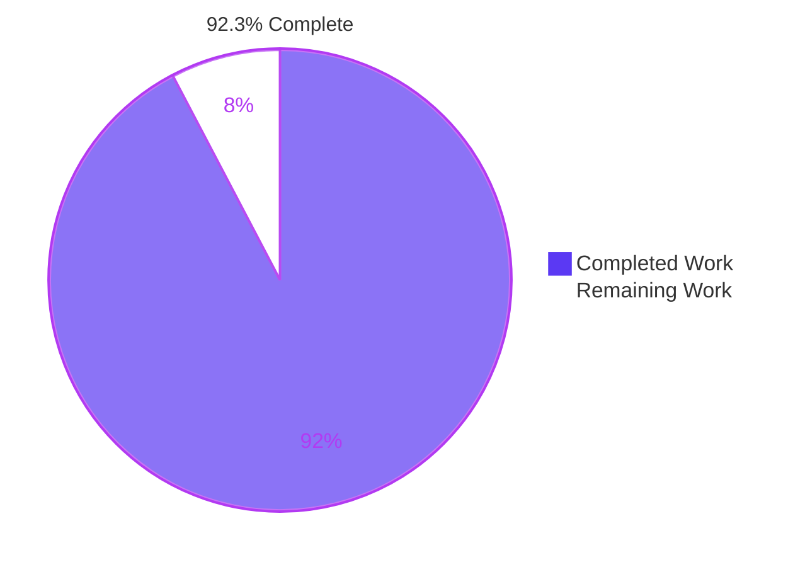
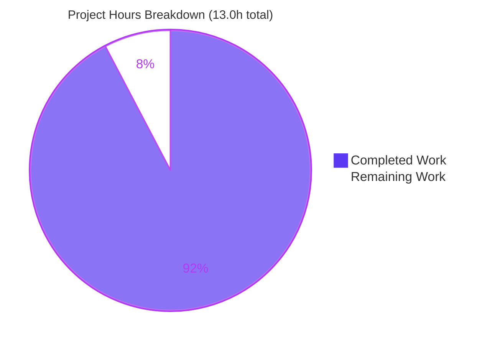
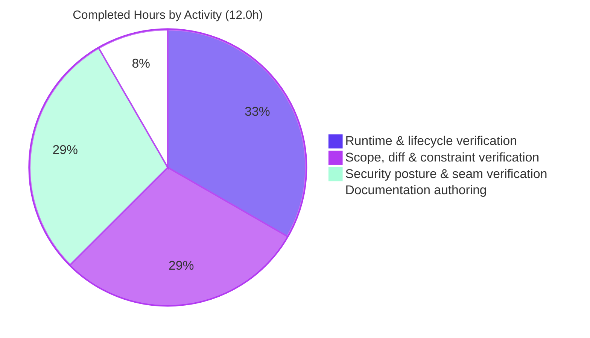

# 1. Executive Summary

## 1.1 Project Overview

`check_billing_sep_01` is a two-file Node.js repository: a single-statement HTTP script that answers every request on port 3000 with the plain-text body `Hello, World!`, and its README. This project made it self-describing at the minimum viable level — one JSDoc summary above the request handler in `server.js`, and a short `README.md` giving the project name, the install position and the run command. Nothing executable changed. The audience is any developer or operator opening the repository for the first time.

## 1.2 Completion Status



| Metric | Value |
|---|---|
| Total Hours | 13.0 |
| Completed Hours (AI + Manual) | 12.0 |
| Remaining Hours | 1.0 |
| Percent Complete | **92.3%** |

12.0 completed / (12.0 + 1.0 remaining) = **92.3%**. Completed = Dark Blue `#5B39F3`, Remaining = White `#FFFFFF`.

## 1.3 Key Accomplishments

- ✅ `server.js:1` carries a one-line JSDoc summary of the request handler.
- ✅ `README.md` gives the project name, no-install position and run command in 11 lines.
- ✅ `server.js:2` is byte-identical to its pre-change form (sha256 `7ea2abcb…ccaa`).
- ✅ Smallest possible diff: `+12/−1` across two files, nothing created or renamed.
- ✅ The README's run command was executed, not assumed: `node server.js` starts the service.
- ✅ The no-install claim is proven — built-in `http` is the only module loaded.
- ✅ Every method on every path returns 200 with the same 14-byte body.
- ✅ Tracked files are exactly the two permitted; no image, test or dependency on any branch.

## 1.4 Critical Unresolved Issues

**0 of the 2 requested deliverables carries an open issue** — both are byte-exact and verified at runtime. Seven items are open around them; none blocks release.

| Issue | Impact | Owner | ETA |
|---|---|---|---|
| Working-tree hygiene (**1 item**): 11 untracked PNG screenshots from validation tooling sit under `blitzy/screenshots/`, and the repository intentionally carries no `.gitignore`, so `git add -A` would stage image assets the specification forbids. The committed tree is unaffected — no image exists on any branch. | Low — publish hygiene only | Repository owner | 0.5h, before publishing |
| Production-posture conditions left in the frozen server statement (**5 items**): all-interface bind while the startup line advertises loopback; no rate limit, connection cap or inactivity timeout; no request-local exception boundary or graceful shutdown; plaintext HTTP only; no `Content-Type`/`nosniff`. Each was verified present and is accepted — the specification forbids changing `server.js` behaviour (see 5.2 D1). | Medium if this service is ever exposed; none for its declared purpose | Platform/infra owner | Separately authorized change |
| Runtime currency (**1 item**): Node 22.23.2 is the current patched floor for its line, but 22.x is Maintenance LTS while 24.x is Active LTS. No patched CVE class is reachable from code that loads only `http`. | Low | Environment owner | Next runtime review |

## 1.5 Access Issues

**No access issues identified.** The remote is reachable and the branch is published at the local tip (`a7c0d3e`). The application reads no environment variable, secret or credential — a `PORT` override was confirmed ignored — and there is no database, broker, container or third-party API. No install step exists that could be blocked.

## 1.6 Recommended Next Steps

1. **[High]** Remove the untracked validation screenshots (`rm -rf blitzy`) and commit named paths, not `git add -A`. *(0.5h)*
2. **[High]** Review the two documentation commits (`01e0afe`, `a7c0d3e`) and merge to the default branch. *(0.5h)*
3. **[Medium]** Settle the deployment posture before exposing this service: loopback bind or reverse proxy with TLS, rate limits, and a supervisor.
4. **[Medium]** Decide whether to authorize a regression gate — a minimal test, or the Section 9 checklist.
5. **[Low]** Plan the runtime move from Node 22.x Maintenance LTS to Active LTS.

# 2. Project Hours Breakdown

## 2.1 Completed Work Detail

| Component | Hours | Description |
|---|---|---|
| Request-handler JSDoc (R1) | 0.5 | Authored and placed the single-line summary at `server.js:1`, column 0 — one clause, no block tags, no usage example |
| README body (R2) | 0.5 | Authored the 11-line body at `README.md:1-11`: project name heading preserved verbatim, install position, run command in an `sh` fence |
| Minimal-diff and byte-identity discipline | 1.5 | Established that `server.js:2` is byte-identical to its pre-change form (sha256 `7ea2abcb…ccaa`), the diff is `+1/−0` for `server.js` and `+11/−1` for `README.md`, and both files are UPDATE operations with no rename or mode change |
| Documentation element and constraint verification | 1.0 | Line and byte counts, heading and fence structure, em-dash encoding, final newline, and sweeps proving no contributing/license/testing/deployment/architecture section, no table of contents, and no link, badge or diagram |
| Scope-boundary verification | 1.0 | Probed 29 prohibited paths (manifests, all lockfiles, `node_modules`, test directories, CI, container, linter and doc-generator configs) as absent; swept every branch for image assets; swept both files for placeholders and for forbidden behaviour-change constructs |
| Documentation-to-code seam and zero-install proof | 1.5 | Extracted the run command from the README's own fence and executed it; proved the no-install claim by booting from a directory holding only the two files with nothing installed, and by a module trace showing built-in `http` as the only load |
| HTTP contract and process-lifecycle verification | 3.0 | Method × path matrices, response header contract, exact body bytes, malformed and oversize request framing, keep-alive and pipelining, concurrency and held connections, aborted clients, restart, second-instance behaviour, signal handling and port release |
| Security posture verification of the delivered surface | 2.0 | Injection, traversal, XSS, CRLF and request-smuggling payloads across path, query, header and body; information-disclosure checks on every error response; log and environment hygiene sweeps; supply-chain posture |
| Browser client verification | 1.0 | Loaded the endpoint in a real browser across three loads, confirmed the body renders inline as MIME-sniffed text, that no script executes and no dialog is raised, and captured the rendered evidence |
| **Total** | **12.0** | |

## 2.2 Remaining Work Detail

| Category | Hours | Priority |
|---|---|---|
| Working-tree hygiene: remove the untracked validation screenshots and commit named paths only, so no image asset can be staged into the two-file repository (see §5.2 D3) | 0.5 | High |
| Human review and merge of the two documentation commits to the default branch | 0.5 | High |
| **Total** | **1.0** | |

## 2.3 Hours Reconciliation

| Check | Value |
|---|---|
| Section 2.1 completed total | 12.0 |
| Section 2.2 remaining total | 1.0 |
| Total Project Hours (§1.2) | 13.0 |
| Percent complete | 12.0 / 13.0 = 92.3% |

Confidence is **high**: the scope is two hand-written documentation edits whose acceptance criterion is byte-exactness against a fully specified body, and both bodies match. The remaining hour is review and publish hygiene, not implementation. Production hardening, a test suite and CI are deliberately excluded from these totals — the specification forbids adding them in this project, so they are recorded as recommendations in §1.6 and §6 rather than as remaining scope.

# 3. Test Results

Every row below was executed against this branch at commit `a7c0d3e` on Node v22.23.2, and the counts are the observed results. This project has no test framework, no linter, no formatter, no CI and no coverage tooling — the specification forbids adding any of them — so the gates that stand in their place are the syntax check, the documentation constraint checks, the byte-identity comparison and the live HTTP gate.

| Area / Category | Framework | Tests | Passed | Failed | Coverage | What This Proves |
|---|---|---|---|---|---|---|
| Automated unit / integration suite | `node --test` (built-in runner) | 0 | 0 | 0 | none | No automated suite exists in this repository; the runner reports `1..0`, tests 0 |
| Syntax / build gate | `node --check` | 1 | 1 | 0 | 1 of 1 JavaScript file | `server.js` parses cleanly — the parse is this project's entire build step |
| Documentation constraints | `wc -l`, structural greps | 2 | 2 | 0 | `README.md` (11 lines) | The README stays inside its 15-line cap and carries only the three required items |
| Frozen-statement byte identity | `sha256sum` vs `git show a3cb672:server.js` | 2 | 2 | 0 | `server.js:2` | The executable statement is unchanged to the byte, so the added comment altered no behaviour |
| HTTP contract matrix | `curl` (6 methods × 4 paths) | 24 | 24 | 0 | the single request handler | Every method on every path returns 200 with the identical 14-byte body `Hello, World!` |
| Response contract and error framing | `curl -i`, raw socket probe | 2 | 2 | 0 | GET response block, parser rejection path | Exactly four headers are emitted — `Date`, `Connection`, `Keep-Alive`, `Content-Length: 14`, with no `Content-Type` and no server-identifying header — and a bogus request line yields a bare 47-byte `400` that discloses no path or stack trace |
| Startup and port lifecycle | `node server.js` + bind probe | 3 | 3 | 0 | startup log, bind, release | The documented command starts the service, logs exactly one 41-byte line with silent stderr, and releases port 3000 on stop |
| **Totals** | | **34** | **34** | **0** | | |

### Not Covered

- **No automated test covers either delivered file, or any behaviour of the service.** There is no test suite, and the specification forbids adding one. Every result above is a manual gate that a human must re-run by hand after any future edit — Section 9 carries the exact commands.
- **The README's prose is not asserted by any check.** Its line count, structure and the executability of its run command are verified; the wording of the project name and the install statement is not machine-checked and should be re-read by eye if either is ever edited.
- **No performance, soak or capacity test exists.** Request latency was observed at roughly 3 ms and short concurrency bursts were served without descriptor leaks, but no sustained-load threshold has been established.
- **TLS, authentication, authorization, session handling, database access and outbound integrations are untested because the service has none of them.** If any is ever added, it arrives with no coverage behind it.
- **No deployment configuration is tested.** The service has never been exercised behind a supervisor, reverse proxy, container or orchestrator; before release a human should test it in whichever of those the deployment will use.

# 4. Runtime Validation & UI Verification

The service was started with the documented command and driven as a live system. Status legend: ✅ Operational | ⚠ Partial | ❌ Failing.

- ✅ **Service startup** — `node server.js` from the checkout root binds TCP 3000, prints exactly one 41-byte line `Server running at http://127.0.0.1:3000/` to stdout, and leaves stderr silent.
- ✅ **HTTP catch-all contract** — every method exercised on every path returns 200 with the identical 14-byte body; keep-alive connections are reused and the advertised `timeout=5` idle expiry is honoured.
- ✅ **Response framing** — GET carries `Content-Length: 14`; HEAD returns 200 with no body and omits `Content-Length` (Node's documented default); no `Content-Type` is sent.
- ✅ **Malformed and oversize requests** — bogus request lines, missing `Host`, unregistered method tokens and a TLS handshake sent to the plaintext port each yield a bare 47-byte `400`; oversize URLs and header sets yield a bare 67-byte `431`. No response leaks a path, stack trace or version.
- ✅ **Hostile-input inertness** — SQL, command-injection, traversal, XSS, CRLF, request-smuggling and prototype-pollution payloads delivered through path, query, header and body all return byte-identical responses with nothing reflected, nothing executed and no header injected.
- ✅ **Browser rendering** — a real browser loads the endpoint across repeated loads, renders `Hello, World!` inline as MIME-sniffed plain text, executes no script, raises no dialog and logs zero console messages, including when the URL carries a `<script>` payload.
- ✅ **Zero-install posture** — the service starts in a directory holding only the two files with nothing installed; the only module the process loads is built-in `http`, and no manifest, lockfile or `node_modules` exists anywhere above it.
- ✅ **Process lifecycle** — restart serves and logs identically; a second instance exits with `EADDRINUSE` while the first keeps serving unaffected; `SIGTERM` and `SIGINT` release the port cleanly.
- ⚠ **Operational visibility** — the one startup line is the entire log surface. There is no per-request logging, no metrics and no health semantics: `/health`, `/healthz`, `/readyz` and `/livez` answer as ordinary paths, so an orchestrator liveness probe would report healthy unconditionally.
- ⚠ **Network exposure** — the listener takes no host argument and binds all interfaces, answering on non-loopback addresses, while its own startup line advertises `http://127.0.0.1:3000/`.

**Never exercised at runtime.** The service was never run behind a supervisor, reverse proxy, container or orchestrator, and never under sustained load beyond short concurrency bursts. TLS, authentication, authorization, cookies, caching, database access and outbound calls were never exercised because the service implements none of them — a fact established by a module trace and a file-descriptor audit rather than assumed. There is no user interface, template, stylesheet or client asset in this repository, so no UI verification beyond the browser rendering above applies.

# 5. Compliance & Quality Review

## 5.1 Compliance Matrix

| # | Deliverable / Requirement | Status | Evidence | Progress |
|---|---|---|---|---|
| 1 | One single-line JSDoc summary above the request handler | ✅ PASS | `server.js:1`, 89 bytes including the newline, single `/** … */` line at column 0 | 100% |
| 2 | Summary carries one clause, no block tags, no usage example | ✅ PASS | Block-tag count 0; one sentence-ending period outside the quoted payload | 100% |
| 3 | Summary is accurate about the code beneath it | ✅ PASS | Runtime confirms every request is answered with the plain-text body `Hello, World!` | 100% |
| 4 | Executable statement left byte-identical | ✅ PASS | `server.js:2` sha256 `7ea2abcb…ccaa`, identical to the pre-change file, 142 bytes | 100% |
| 5 | README states the project name, install position and run command | ✅ PASS | `README.md:1`, `:3-5`, `:7-11`; heading preserved verbatim from the pre-existing file | 100% |
| 6 | README under 15 lines with only those three items | ✅ PASS | 11 lines / 145 bytes; no fourth item and no second prose paragraph | 100% |
| 7 | No contributing, license, testing, deployment or architecture section; no table of contents | ✅ PASS | Structural sweeps return zero matches for each | 100% |
| 8 | No links, badges, images or diagrams in the documentation | ✅ PASS | Link, badge, image and diagram inventories all 0 | 100% |
| 9 | Smallest possible diff; no refactor, reformat or rename | ✅ PASS | `+12/−1` across 2 files, both UPDATE; no rename, copy or mode change | 100% |
| 10 | No behaviour change or hardening in `server.js` | ✅ PASS | Error-handler, shutdown, header, routing, environment-read and rate-limit constructs all absent; behaviour byte-identical at runtime | 100% |
| 11 | No test suite, test file, lockfile, dependency or tooling added | ✅ PASS | 29 prohibited paths probed absent; the only module resolved is built-in `http` | 100% |
| 12 | Repository stays at exactly the two permitted files | ⚠ PARTIAL | Tracked files are exactly `README.md` and `server.js` with no image on any branch; the working tree additionally holds 11 untracked validation screenshots (see 5.2 D3) | 95% |

## 5.2 AAP & Rule Divergences and Gaps

| # | What the AAP/Rule Required | What Was Delivered Instead | Why It Diverged | Impact | Remediation |
|---|---|---|---|---|---|
| D1 | §0.10 — "enterprise-standard best practice applies" | Five production-posture conditions remain in the server statement: all-interface bind while the log advertises loopback; no rate limit, connection cap or inactivity timeout; no request-local exception boundary or graceful shutdown; plaintext HTTP only; no `Content-Type`/`nosniff` | **Sanctioned.** §0.8.2 names "no hardening" and "no behaviour change of any kind", and §0.8.1 limits `server.js` to the comment alone — the specific prohibition governs the general best-practice clause | Production-readiness only; no correctness impact for the declared purpose | Separately authorized change, or network-layer controls |
| D2 | §0.8.2 — no test suite, test file, lockfile or dependency; §0.7 defines no verification step | No automated test, linter, formatter, CI or coverage tooling exists; acceptance rests on byte-exactness plus manual gates | **Sanctioned.** Explicit prohibition; adding any of them would itself have violated scope | Future edits to either file have no automated gate behind them | Re-run the Section 9 gates after any edit, or authorize a minimal suite |
| D3 | §0.8.1 — exactly two files; §0.8.2 — no image assets | The committed tree is exactly the two files with no image on any branch, but the working tree holds 11 untracked PNG screenshots under `blitzy/screenshots/` | Validation tooling writes its evidence into a directory inside the checkout, while §0.8.2 forbids the `.gitignore` that would mask it; the directory is re-created, so deleting it is not durable | `git add -A` would stage forbidden image assets into the repository | Delete `blitzy/` before publishing and commit named paths only *(0.5h, Section 2.2)* |

**D1 — best practice versus the no-hardening boundary (Sanctioned).** The plan applies enterprise best practice in the absence of user rules, yet forbids every change that would deliver it here. Both were honoured by leaving `server.js:2` untouched: it calls `.listen(3000, …)` with no host argument, so the socket binds every interface and answered on non-loopback addresses while the startup log reads `http://127.0.0.1:3000/`; it sets no rate limit, connection cap or inactivity timeout; it registers no `'error'` handler, so one unexpected throw ends the process; it requires `http`, not `https`; and it sets no response headers. Each was verified present. Treat this file as a demonstration script and settle the deployment posture before exposing it.

**D2 — no automated verification exists (Sanctioned).** `node --test` reports zero tests, and there is no `package.json` to hang a script from, no lint configuration and no CI definition; `npm test` fails for the absent manifest. The plan makes the exact file contents the acceptance criterion, and that criterion is met byte for byte. The consequence is structural rather than latent: nothing will catch a regression if either file is edited again — not a broken run command, not a README that drifts from the code, not an accidental edit to the executable line. Section 9 lists the four gates that stand in for a suite; adopting them as a pre-merge checklist is worth deciding now.

**D3 — working-tree file census exceeds the two-file scope (Open, non-blocking).** `git ls-files` returns exactly `README.md` and `server.js`, and a sweep of every branch shows no image asset was ever committed, so the delivered artifact satisfies the two-file cap. On disk the checkout holds 13 files: the two deliverables plus 11 untracked PNG screenshots captured while the endpoint was verified in a browser. Because the plan forbids a third file, no `.gitignore` masks them and `git check-ignore` confirms nothing is ignored — so `git add -A` would pull image assets into a repository that permits none. The fix is `rm -rf blitzy` plus committing named paths.

# 6. Risk Assessment

These are forward-looking risks to running this repository, not a record of work done. Every one is a property of the pre-existing service that this documentation change deliberately left untouched, or of the verification posture the project is permitted to have.

| Risk | Category | Severity | Probability | Mitigation | Status |
|---|---|---|---|---|---|
| The listener binds all interfaces while the startup line advertises `http://127.0.0.1:3000/`, so on a multi-homed or internet-facing host an unauthenticated endpoint is reachable without the operator being told | Security | Medium | Medium | Bind loopback explicitly, or constrain exposure with a firewall, reverse proxy or container network policy, in a separately authorized change | Open — accepted (§5.2 D1) |
| No rate limit, connection cap or socket inactivity timeout is configured, so enough concurrent or slow connections can exhaust sockets, descriptors and event-loop capacity | Operational | Medium | Medium | Reverse-proxy rate and connection limits plus explicit timeouts before any exposed deployment | Open — accepted (§5.2 D1) |
| A single unhandled `'error'` event terminates the process, and `SIGTERM`/`SIGINT` do not drain in-flight requests | Operational | Medium | Medium | Run under a supervisor with restart and health monitoring; add an error boundary in an authorized change | Open — accepted (§5.2 D1) |
| Traffic is plaintext HTTP and the response declares no media type or `nosniff`, so clients MIME-sniff the body | Security | Low | Low | Terminate TLS at a proxy; declare `text/plain; charset=utf-8` and `nosniff` in an authorized change. Impact is bounded today because the body is a constant with no attacker-controlled bytes — it rises if the body ever becomes dynamic | Open — accepted (§5.2 D1) |
| No automated gate stands behind either file, so a future edit could break the run command, the documented claims or the executable line unnoticed | Technical | Medium | High | Adopt the §9 command set as a pre-merge checklist, or authorize a minimal test suite | Open (§5.2 D2) |
| Every path returns 200, including `/health`, `/healthz`, `/readyz` and `/livez`, so an orchestrator liveness or readiness probe can never fail | Operational | Medium | Medium | Health-check externally on response content, or add a real health route in an authorized change | Open — accepted |
| Untracked validation screenshots sit inside the checkout and no ignore rule is permitted, so `git add -A` would commit image assets the specification forbids | Integration | Low | Medium | Remove `blitzy/` and commit named paths only; write validation evidence outside the checkout | Open (§5.2 D3) |
| The runtime is Node 22.x, which is Maintenance LTS, rather than 24.x Active LTS — 22.23.2 is the current patched floor for its line | Technical | Low | Low | Track the 22.x line or plan a move to Active LTS at the environment level. No CVE class patched in 22.23.2 is reachable from code that loads only `http` | Open — monitored |

# 7. Visual Project Status

### Overall Progress



Completed = Dark Blue `#5B39F3` · Remaining = White `#FFFFFF`.

### Completed Effort by Activity



### Remaining Work by Category

| Category | Hours | Share of Remaining | Priority |
|---|---|---|---|
| Working-tree hygiene before publish | 0.5 | 50% | High |
| Human review and merge | 0.5 | 50% | High |
| **Total** | **1.0** | **100%** | |

### Status at a Glance

| Dimension | Position |
|---|---|
| Requested deliverables complete | 2 of 2, both byte-exact |
| AAP requirements: Completed / Partial / Not Started | 9 / 0 / 2 (the two Not Started are review and publish hygiene) |
| Open items | 7, none release-blocking |
| Divergences | 3 (2 sanctioned, 1 open) |
| Automated test coverage | none — forbidden in this project |
| Percent complete | **92.3%** |

# 8. Summary & Recommendations

**What was delivered.** Both requested pieces of documentation are in place and byte-exact against the specification. `server.js:1` now carries a one-line JSDoc summary stating that the handler responds to every incoming HTTP request with the plain-text body `Hello, World!` — one clause, no block tags, at column 0 — and the executable statement beneath it is byte-identical to its pre-change form, confirmed by digest against the original blob. `README.md` is an 11-line document giving the project name, an explicit statement that no install step is required, and the run command in a shell fence. The whole change is `+12/−1` across two files in two commits (`01e0afe`, `a7c0d3e`), with no file created, renamed or deleted, and no dependency, manifest, test file or tooling introduced. At **92.3% complete** (12.0 of 13.0 hours), what remains is a review and one cleanup command, not implementation.

**What was verified.** The documentation was checked against the code it describes rather than merely proofread. The README's run command was extracted from its own fenced block and executed: the service starts from the checkout root, binds port 3000, prints a single 41-byte startup line and leaves stderr silent. Its no-install claim was proven by booting from a directory holding only the two files with nothing installed, with a module trace confirming built-in `http` as the only module the process loads. The JSDoc's claim was proven by driving the endpoint: every method on every path returns 200 with the identical 14-byte body, malformed and oversize requests are rejected with bare, leak-free 400 and 431 responses, hostile payloads across path, query, header and body are returned unreflected, a real browser renders the body inline without executing anything, and the process survives concurrency, aborted clients, restarts and a competing second instance without leaking descriptors.

**What remains and what is open.** Two tasks totalling one hour: clear the untracked validation screenshots so `git add -A` cannot stage image assets into a repository capped at two files, then review and merge the branch. Beyond that, seven items are open around the deliverables and none blocks this change: five production-posture conditions the specification required be left in place, the artifact-census condition above, and the fact that Node 22.x is Maintenance LTS. The most consequential point for the reader is not a defect but an absence — **this project has no automated test, linter or CI, and may not have one.** Nothing will catch the next regression in either file automatically.

**Critical path to production.** For the documentation change itself the path is short: `rm -rf blitzy`, commit named paths, review the two-commit diff, merge. For the *service* the path is longer and sits outside this project's remit. Before this endpoint is exposed anywhere beyond a developer's machine, someone must settle the deployment posture — an explicit loopback bind or a reverse proxy with TLS, rate and connection limits, and a supervisor that restarts the process after an unhandled error — because the code deliberately provides none of these, and every path answering 200 means an orchestrator health probe cannot detect failure.

**Production readiness.** Judged as *complete, correct and safe for its declared purpose*, this deliverable is ready: the two files are exactly what was specified, the parse gate passes, behaviour is provably unchanged, and the attack surface is genuinely minimal — the handler reads no request data, touches no filesystem, executes no command and persists no state, with one built-in module and no third-party dependency to audit. Judged as *an internet-facing service*, it is not ready, and was never intended to be by this change. Success metrics for sign-off: the two digests in Appendix C still match at merge time, `node --check` exits 0, the run command in the README starts the service, and `git ls-files` returns exactly two paths.

# 9. Development Guide

Every command below was executed against this branch, and the outputs shown are the observed ones. Run them from the checkout root.

### System Prerequisites

| Requirement | Verified Version | Notes |
|---|---|---|
| Node.js | v22.23.2 | Any 22.12.0 or newer release on the 22.x line works; no other runtime is needed |
| npm | 11.18.0 | Present but unused — this project has no manifest and installs nothing |
| git | 2.51.0 | Optional, for history and publishing |
| git-lfs | 3.7.1 | Optional; the repository's hooks are LFS shims and need no setup |
| Operating system | Any Linux, macOS or Windows host with Node on `PATH` | No platform-specific dependency |
| Hardware | Negligible — a single process, no build, no data | |

```bash
node --version   # v22.23.2
npm --version    # 11.18.0
```

### Environment Setup

There is nothing to set up.

- **No install step.** There is no `package.json`, no lockfile and no `node_modules`; the script resolves only Node's built-in `http` module. Do **not** run `npm install` — it would install nothing and would create an unwanted lockfile.
- **No virtual environment**, no container, no database, no message broker, no cache.
- **No environment variables or secrets.** The application reads none; a `PORT` override has no effect because the port is hardcoded to 3000.
- **One host-global resource:** TCP port 3000, which must be free before the service starts.

```bash
git clone <repository-url>
cd check_billing_sep_01
# nothing further — proceed straight to the run step
```

### Dependency Installation

None. This section exists only to say so explicitly, because the absence is deliberate and is what `README.md` documents.

```bash
ls package.json package-lock.json node_modules 2>/dev/null   # prints nothing: none exist
```

### Application Startup

**Foreground (simplest):**

```bash
node server.js
# Server running at http://127.0.0.1:3000/
```

Stop it with `Ctrl-C`. The process exits without draining in-flight requests — expected, by design.

**Background, with the pid captured for a clean stop:**

```bash
LOG=$(mktemp)
node server.js > "$LOG" 2>&1 &
PID=$!
sleep 1
cat "$LOG"               # Server running at http://127.0.0.1:3000/
# ... exercise the service ...
kill "$PID"
```

Run this form directly in your shell, not inside a subshell or under `nohup`. Wrapping it makes `$!` the wrapper's pid rather than the listener's; the recovery is in Troubleshooting below. Keep the log outside the working tree so it cannot be committed into a repository capped at two files.

**Check the port is free first** (essential on a shared host, and the reason never to stop a process by name):

```bash
node -e "const s=require('net').createServer();s.once('error',e=>{console.log(e.code);process.exit(1)});s.listen(3000,()=>{console.log('free');s.close()})"
# free            -> safe to start
# EADDRINUSE      -> something else holds port 3000; wait, or stop that process by its own pid
```

### Verification Steps

These four gates are what this project has in place of a test suite. Run all four after any edit to either file.

```bash
# 1. Syntax / build gate — the parse is the entire build step
node --check server.js && echo "OK: parses"          # exits 0, prints nothing of its own

# 2. Documentation constraint — the README must stay under 15 lines
wc -l README.md                                       # 11 README.md

# 3. The executable statement must remain byte-identical to its original form
tail -n +2 server.js | sha256sum
git show a3cb672:server.js | sha256sum
# both -> 7ea2abcb0805c59850e394c643ba07919e2086f7b04d367f5dc804dc47c8ccaa

# 4. Live HTTP gate (needs port 3000)
LOG=$(mktemp); node server.js > "$LOG" 2>&1 & PID=$!; sleep 1
curl -sS -o /dev/null -w 'status=%{http_code} bytes=%{size_download}\n' http://127.0.0.1:3000/
#   status=200 bytes=14
curl -sS http://127.0.0.1:3000/                       # Hello, World!
cat "$LOG"                                            # Server running at http://127.0.0.1:3000/
kill "$PID"
```

The test runner is also available and reports the honest result:

```bash
node --test          # TAP version 13 / 1..0 / # tests 0 — no suite exists in this project
```

### Example Usage

```bash
# Full response, headers included
curl -sS -i http://127.0.0.1:3000/
# HTTP/1.1 200 OK
# Date: <timestamp>
# Connection: keep-alive
# Keep-Alive: timeout=5
# Content-Length: 14
#
# Hello, World!

# Any method, any path — the same response
curl -sS -X POST http://127.0.0.1:3000/anything        # Hello, World!
curl -sS http://127.0.0.1:3000/favicon.ico             # Hello, World!

# HEAD returns the status and headers with no body, and omits Content-Length
curl -sS -I http://127.0.0.1:3000/

# Exact body bytes: 14, ending in a newline
curl -sS http://127.0.0.1:3000/ | od -c | head -2
```

In a browser, open `http://127.0.0.1:3000/`. The body renders inline as plain text; because no `Content-Type` is sent, the browser determines the type by sniffing the content. That is existing behaviour, not a fault.

### Troubleshooting

| Symptom | Cause | Resolution |
|---|---|---|
| `Error: listen EADDRINUSE :::3000` on startup | Another process already holds port 3000 — including a previous instance of this service | Probe with the port check above, then stop the holder **by its own pid**. Never `pkill node` or `pkill -f server.js` on a shared host |
| `kill "$PID"` runs but the port stays busy | The command was wrapped in a subshell or `nohup`, so `$!` captured a wrapper rather than the listener | Resolve the real owner: `awk '$4=="0A" && $2 ~ /:0BB8$/ {print $10}' /proc/net/tcp /proc/net/tcp6` gives the socket inode; find the pid whose `/proc/<pid>/fd/*` links to `socket:[<inode>]` and stop that. Port 3000 is hex `0BB8`, LISTEN is state `0A` |
| `lsof -i :3000` / `ss -ltnp` not found | Neither tool is installed on this image | Use the `/proc` method above, or the Node bind probe |
| `npm test`, `npm run build` or `npx eslint` fails or does nothing useful | There is no manifest, no build step and no linter in this project, by design | Use the four gates under Verification Steps instead. Avoid `npx <tool>` — it downloads a package you do not need |
| `git status` shows `?? blitzy/` | Validation screenshots were written into the checkout, and this repository has no `.gitignore` by design | `rm -rf blitzy`, and commit named paths (`git add README.md server.js`) rather than `git add -A` |
| Browser shows the text but `Content-Type` is missing in devtools | The service sets no response headers beyond Node's defaults | Expected behaviour. See Section 6 for the production consideration |
| `PORT=3999 node server.js` still binds 3000 | The port is a literal in the source; the application reads no environment variable | Expected behaviour |
| A second instance prints a stack trace and exits 1 | No error handler is registered, so the `'error'` event is unhandled | Expected behaviour. The first instance is unaffected and keeps serving |

# 10. Appendices

## A. Command Reference

| Purpose | Command | Observed Result |
|---|---|---|
| Start the service | `node server.js` | `Server running at http://127.0.0.1:3000/` on stdout, stderr silent |
| Start detached with pid captured | `LOG=$(mktemp); node server.js > "$LOG" 2>&1 & PID=$!` | `$!` is the listener when run directly in the shell |
| Syntax / build gate | `node --check server.js` | exit 0, no output |
| Test runner | `node --test` | `TAP version 13`, `1..0`, tests 0 |
| README line-count check | `wc -l README.md` | `11 README.md` |
| Frozen-statement digest | `tail -n +2 server.js \| sha256sum` | `7ea2abcb…ccaa` |
| Original-blob digest | `git show a3cb672:server.js \| sha256sum` | `7ea2abcb…ccaa` |
| Port availability probe | `node -e "const s=require('net').createServer();s.once('error',e=>{console.log(e.code);process.exit(1)});s.listen(3000,()=>{console.log('free');s.close()})"` | `free` or `EADDRINUSE` |
| Smoke request | `curl -sS -o /dev/null -w 'status=%{http_code} bytes=%{size_download}\n' http://127.0.0.1:3000/` | `status=200 bytes=14` |
| Full response with headers | `curl -sS -i http://127.0.0.1:3000/` | 200 with four headers, body `Hello, World!` |
| Resolve the port-3000 owner | `awk '$4=="0A" && $2 ~ /:0BB8$/ {print $10}' /proc/net/tcp /proc/net/tcp6` | socket inode, then match under `/proc/*/fd` |
| Scope census | `git ls-files` | `README.md`, `server.js` |
| Clean validation artifacts | `rm -rf blitzy` | working tree back to two files |

## B. Port Reference

| Port | Protocol | Bound By | Configurable | Notes |
|---|---|---|---|---|
| 3000 | TCP / HTTP | `server.js` | **No** — the value is a literal in the source and the application reads no environment variable | The listener takes no host argument, so it binds all interfaces even though the startup line advertises `http://127.0.0.1:3000/`. It is the single host-global resource this project uses; probe it free before starting |

## C. Key File Locations

| Path | Role | Size | sha256 |
|---|---|---|---|
| `server.js` | The entire application: line 1 the JSDoc summary, line 2 the HTTP server statement | 2 lines / 231 bytes | `19eb42f81ef9da67f90ab40b63d3b8820823d0f7407a8802656b450de69a96fc` |
| `server.js:2` | The frozen executable statement, unchanged from before this project | 142 bytes | `7ea2abcb0805c59850e394c643ba07919e2086f7b04d367f5dc804dc47c8ccaa` |
| `README.md` | Project name, install position, run command | 11 lines / 145 bytes | `6ba56eb5bf404a1f4a4ddba374bae4a7006bcdca12d7d8bec2dadd91d0c48c8e` |
| `blitzy/screenshots/` | Untracked validation screenshots; not part of the repository (see 5.2 D3) | 11 files | — |

Commits carrying this change: `01e0afe` (JSDoc summary) and `a7c0d3e` (README install and run instructions), both on top of `a3cb672`.

## D. Technology Versions

| Component | Version | Source |
|---|---|---|
| Node.js | v22.23.2 | `/usr/bin/node` — Maintenance LTS line, current patched release for 22.x |
| npm | 11.18.0 | Present, unused by this project |
| git | 2.51.0 | Host install |
| git-lfs | 3.7.1 | Host install; the repository's only active hooks are its shims |
| Runtime dependencies | **none** | The only module loaded is Node's built-in `http` |
| Module system | CommonJS | `require('http')`; no ESM, no exports |

## E. Environment Variable Reference

| Variable | Required | Effect |
|---|---|---|
| — | — | **None.** The application reads no environment variable, no secret and no configuration file. `PORT` in particular has no effect: the port is a literal in the source. No `.env` file exists or is expected |

## F. Developer Tools Guide

| Tool | Available Here | Guidance |
|---|---|---|
| `node --check` | ✅ | The project's build and syntax gate; run it after any edit to `server.js` |
| `node --test` | ✅ | Runs and correctly reports zero tests; no suite exists in this project |
| `curl` | ✅ 8.14.1 | The primary way to exercise the endpoint |
| `od` / `hexdump` | ✅ | Use for byte-exact body inspection (`xxd` is not installed) |
| `/proc/net/tcp`, `/proc/net/tcp6` | ✅ | Use for listener and port-ownership inspection — `lsof`, `ss`, `netstat` and `nc` are all absent on this image |
| ESLint / Prettier | ❌ | Not installed and not configured; adding either is out of scope for this project. Avoid `npx eslint`, which downloads a package you do not need |
| `npm install` / `npm test` / `npm run build` | ❌ | No manifest exists, so these do nothing useful and `npm install` would create an unwanted lockfile |
| CI / coverage / security scanners | ❌ | None is configured or bound to any gate in this project |

## G. Glossary

| Term | Meaning in this project |
|---|---|
| Catch-all handler | The single inline request handler at `server.js:2`. There is no routing: every method and every path reaches it and receives the same response |
| Frozen statement | `server.js:2`, the pre-existing executable line that had to survive this change byte for byte |
| Zero-install posture | The property that the service runs straight from source with no dependency, manifest, lockfile or `node_modules` — the claim `README.md` makes and this project proved |
| Startup line | The single 41-byte stdout line `Server running at http://127.0.0.1:3000/`; the entire log surface of the application |
| MIME sniffing | How a browser determines the response type here, since no `Content-Type` header is sent |
| Maintenance LTS | The Node.js support stage of the 22.x line: security and critical fixes only, with 24.x as the Active LTS line |
