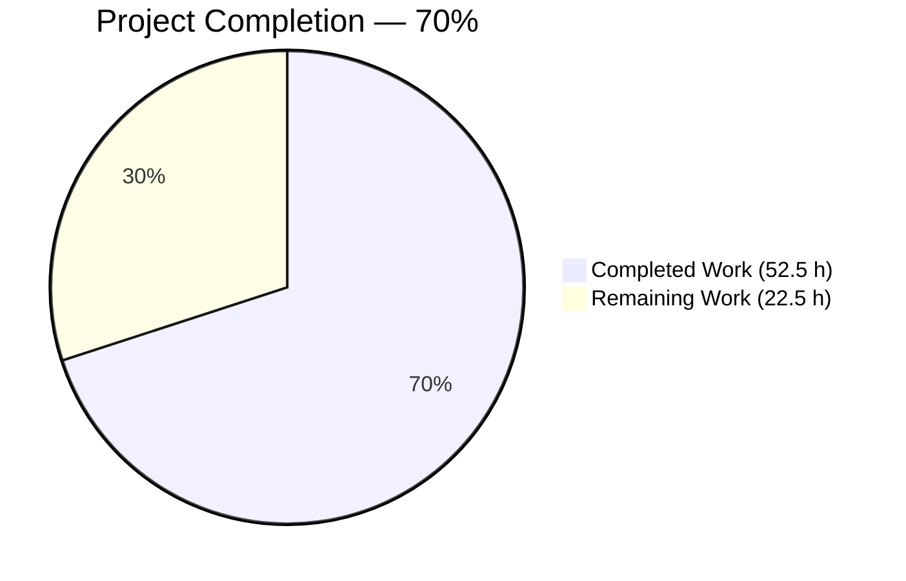
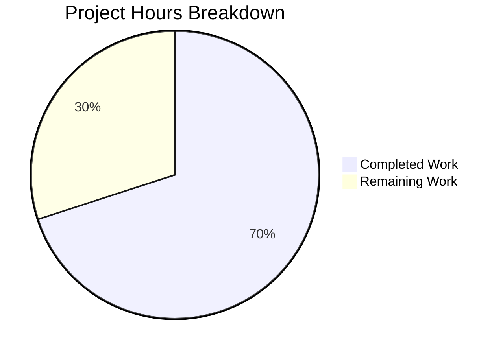
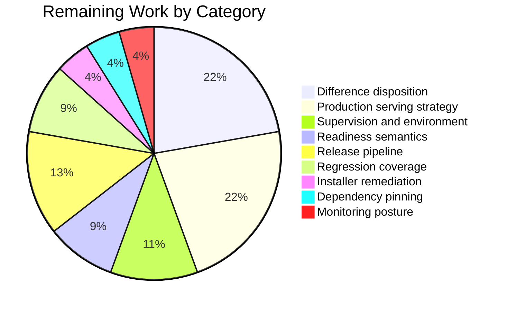

# 1. Executive Summary

## 1.1 Project Overview

This project ports the repository's Node.js HTTP server to Python 3 and Flask as one new module, `app.py`, with a single pinned dependency in `requirements.txt`. It must answer exactly as the Node process did: HTTP 200 with the 14-byte body `Hello, World!\n` for every path and method, zero body bytes for `HEAD`, port 3000 on the dual-stack wildcard, one startup line on stdout. Delivery is additive — `server.js` and `README.md` are untouched — so both implementations coexist and the Node server stays the reference the port is measured against.

## 1.2 Completion Status



Completed = Dark Blue `#5B39F3`; Remaining = White `#FFFFFF`.

| Metric | Value |
|---|---|
| Total Hours | 75.0 |
| Completed Hours (AI + Manual) | 52.5 (52.5 AI + 0.0 manual) |
| Remaining Hours | 22.5 |
| Percent Complete | **70.0%** — 52.5 / 75.0 × 100 |

All 14 in-scope deliverables are complete and verified; the remaining 22.5 hours are path to production.

## 1.3 Key Accomplishments

- ✅ Single-module Flask port in `app.py` (20 statements, one import) plus `requirements.txt` pinning `Flask==3.1.3`.
- ✅ Every path answers 200 with the exact 14 bytes, `/static/*` and encoded paths included.
- ✅ Every method answers 200; `HEAD` answers 200 with zero body bytes.
- ✅ Byte-exact parity with the live Node reference: 160 of 160 path × method pairs identical.
- ✅ Port 3000 bound on the dual-stack wildcard, as the reference binds it.
- ✅ Startup line emitted exactly once per run, ambient debug state notwithstanding.
- ✅ Additive delivery proven: two files added, none modified, `server.js` unchanged.
- ✅ Clean install from the manifest resolves Flask 3.1.3 / Werkzeug 3.1.8 and runs the service.

## 1.4 Critical Unresolved Issues

**Twelve items are open**, none of them an in-scope deliverable (0 of 14 outstanding). All twelve sit below or outside the parity contract.

| Issue | Impact | Owner | ETA |
|---|---|---|---|
| Development-server protocol edges, **5 items**: the pre-dispatch 400 echoes the sender's request line; `HTTP/9.9`, HTTP/0.9-resolved and leading-blank-line requests return status-line-free or zero-byte responses; conflicting `Content-Length` + `Transfer-Encoding` is accepted with 200; ≥100 request header fields draw `431`; `Expect: 100-continue` draws two interim responses | Differs from the Node reference on malformed traffic; a desync hazard if a caching or fronting proxy is introduced. Closing any of them in the module needs the single-import and fixed-statement constraints relaxed | Backend owner | 5.0 h |
| Process lifecycle and ambient environment, **2 items**: `WERKZEUG_RUN_MAIN=true` in the environment makes the process print its startup line then exit 1 with nothing bound; `SIGINT` is ignored when inherited as `SIG_IGN` | False readiness for a supervisor, and a process that a `SIGINT`-based stop leaves running | Platform owner | 2.5 h |
| Response-header posture, **1 item**: every response carries `Server: Werkzeug/3.1.8 Python/3.12.14`, which the Node reference does not send | Framework and interpreter versions visible to unauthenticated clients | Platform owner | Folded into serving strategy (5.0 h) |
| Environment installer advisories, **1 item**: a fresh environment re-seeds `pip 25.0.1`, carrying six published advisories (highest required fix 26.2); `requirements.txt` itself audits clean | An environment-auditing release gate fails; the installer is not reachable from the request surface | DevOps owner | 1.0 h |
| Decisions referred to you, **3 items**: the startup line is printed before the socket binds; unknown verbs such as `FOO` and `CONNECT` receive 200 where Node answers 400 or nothing; the transitive closure resolves unpinned (`Werkzeug>=3.1.0`) | Readiness signalling, method-edge behaviour and future dependency drift each need an explicit decision | Product / backend owner | 4.0 h |

## 1.5 Access Issues

**No access issues identified.** The project needs no credential, registry login, VPN or external service.

| System/Resource | Type of Access | Issue Description | Resolution Status | Owner |
|---|---|---|---|---|
| Package index (PyPI) | Read, anonymous | None — `pip install -r requirements.txt` completes and resolves Flask 3.1.3 | ✅ Verified working | DevOps owner |
| Repository and runtimes | Local filesystem | None — Python 3.12.14, Node 22.23.2 and the verification tooling are present | ✅ Verified working | Backend owner |

## 1.6 Recommended Next Steps

1. **[High]** Decide the disposition of the seven recorded differences below the application layer (5.0 h).
2. **[High]** Stand up the production serving strategy — reverse proxy or production WSGI server — and re-verify parity through it; it closes four open items (5.0 h).
3. **[High]** Settle readiness and shutdown: probe the port, stop with `SIGTERM`, exclude `WERKZEUG_RUN_MAIN` (4.5 h).
4. **[Medium]** Wire the parity check into a release pipeline and upgrade the installer to ≥ 26.2 in every deployment environment (4.0 h).
5. **[Medium]** Decide whether the resolved closure should be pinned, since `Werkzeug` resolves without a ceiling (1.0 h).

# 2. Project Hours Breakdown

## 2.1 Completed Work Detail

| Component | Hours | Description |
|---|---|---|
| Flask application module | 5.0 | `app.py` re-expresses the Node server's four responsibilities — create the application, handle the request, bind the port, log one line — as one module with a single import, one view, two URL rules and a `__main__` guard (`app.py:1–183`) |
| Framework-default reconciliation | 4.0 | Each Flask default that differs from the Node behaviour is overridden by exactly one documented argument: `static_folder=None` (`app.py:11`) so no framework route outranks the catch-all, `methods=None` on both rules, a separate `/` rule for the empty path, `host="::"`, `port=3000` and `debug=False` (`app.py:183`) |
| Universal path coverage | 4.0 | Two rules cover the root and arbitrary depth, and a URL-map converter subclass (`app.py:47–54`) widens the catch-all's character class so line-feed-bearing paths reach the view like any other path |
| Universal method coverage and `HEAD` semantics | 2.0 | Both rules are registered with no method list, so every dispatched verb reaches the view; `HEAD` answers 200 with zero body bytes |
| Byte-exact parity harness and comparison runs | 7.0 | Both implementations run one at a time on port 3000 under network isolation and are compared pair by pair on status line and body bytes across the path × method matrix |
| Listening socket and interface scope | 1.5 | Dual-stack wildcard bind confirmed from the kernel socket table (`LISTEN *:3000`) and by reachability from loopback and from a non-loopback address; Flask's default port 5000 confirmed unoccupied |
| Startup-line-once and ambient-state independence | 2.5 | Anchored counts of the startup literal across repeated runs, with ambient debug state set and unset, a stripped environment and decoy dotenv files |
| Dependency manifest and clean install | 1.5 | `requirements.txt` is exactly `Flask==3.1.3\n` (13 bytes); a clean environment built from it alone resolves Flask 3.1.3, Werkzeug 3.1.8, Jinja2 3.1.6, MarkupSafe 3.0.3, click 8.5.0, itsdangerous 2.2.0, blinker 1.9.0 and runs the service |
| Security assessment and dependency advisory review | 8.0 | Injection, CRLF, traversal, NUL, oversized-input and request-smuggling probing; debugger-surface probing with debug off; secret sweep; entry-point and sink enumeration (zero sinks); advisory review of every resolved distribution |
| Performance, concurrency and resource verification | 4.0 | Latency distributions, concurrency at 20 and 50, repeated bursts and sustained traffic with file-descriptor, thread and RSS sampling, measured against the Node baseline |
| Browser-based runtime verification | 2.0 | Real headless Chrome across root, nested, `/static/*`, XSS-payload and CRLF paths, inspecting rendered body, response headers, cookies, DOM script count and the console |
| Static conformance, style and hygiene | 3.0 | Compilation, linting, 79-column conformance, single-import and prohibited-construct sweeps, placeholder sweep, file modes, and confirmation that no bytecode or stray artefact enters the checkout |
| Pre-dispatch and process-level difference investigation | 6.0 | Root-cause tracing of the seven recorded differences into the standard library's HTTP machinery and the development server, feasibility measurement of every candidate remedy, and the in-file record of each with its measured values |
| Write-set, rule-compliance and continuity certification | 2.0 | Change set proven to be two additions and zero modifications; `server.js` and `README.md` re-verified by hash; governing-rule set established and certified against both delivered files |
| **Total** | **52.5** | Matches Completed Hours in Section 1.2 |

## 2.2 Remaining Work Detail

| Category | Hours | Priority |
|---|---|---|
| Disposition of the seven recorded pre-dispatch and process-level differences (accept as recorded, or authorise and implement the in-module remedy, then re-verify) | 5.0 | High |
| Production serving strategy: reverse proxy or production WSGI server, with parity re-verified through it (also closes the response-header posture) | 5.0 | High |
| Service supervision and environment preconditions: `SIGTERM` stop, `WERKZEUG_RUN_MAIN` excluded, bind scope restricted at the network layer | 2.5 | High |
| Readiness semantics decision, and the post-bind announcer if approved | 2.0 | High |
| Release pipeline that builds the environment from `requirements.txt` and runs the parity check as the release gate | 3.0 | Medium |
| Automated regression coverage for the port, maintained outside the repository | 2.0 | Medium |
| Installer remediation in deployment and CI environments (≥ 26.2) with a closure re-audit | 1.0 | Medium |
| Transitive-dependency pinning decision (`Werkzeug` resolves without a ceiling) | 1.0 | Low |
| Operational monitoring and health-check posture decision | 1.0 | Low |
| **Total** | **22.5** | Matches Remaining Hours in Section 1.2 and Section 7 |

## 2.3 Hours Reconciliation

- Completed hours (Section 2.1 total): **52.5**
- Remaining hours (Section 2.2 total): **22.5**
- Total project hours: 52.5 + 22.5 = **75.0**, matching Section 1.2
- Completion: 52.5 / 75.0 × 100 = **70.0%**, the figure used in Sections 1.2, 7 and 8
- Split by origin: 52.5 hours of agreed-scope delivery and its verification, all complete; 22.5 hours of path-to-production work and open scope decisions, none started

# 3. Test Results

Every figure below was produced by executing the check against the delivered tree. The repository carries no unit-test suite and none may be added under the current scope, so the whole-package parity check is the project's test gate; the remaining rows are the harnesses run alongside it.

| Area / Category | Framework | Tests | Passed | Failed | Coverage | What This Proves |
|---|---|---|---|---|---|---|
| Whole-package parity gate | Project parity check (bash + curl + `od` + `cmp`) | 20 | 20 | 0 | n/a — no coverage tooling in project | The port and the Node reference answer the contract probes identically, the startup line is emitted once, and the routing table holds exactly the two all-method rules |
| Cross-runtime request matrix | Raw-socket harness (Python stdlib) against the live Node reference | 160 | 160 | 0 | 16 paths × 10 methods | Every path and method pair returns 200 with the same body bytes as Node — one distinct body (`48656c6c6f2c20576f726c64210a`) across all non-`HEAD` requests, zero bytes for `HEAD`, and no `Set-Cookie` on any response |
| Startup emission and ambient debug state | Anchored count over captured stdout | 4 | 4 | 0 | n/a | Exactly one startup line per run, with ambient debug state set and unset, and with no reloader child process |
| Pre-dispatch protocol and process/environment edges | Raw-socket and process harness against the live Node reference | 9 | 0 | 9 | 7 recorded differences over 9 request/process shapes | Confirms each recorded difference from the Node reference reproduces exactly as documented — malformed request line, invalid version, leading blank line, unknown verb, conflicting framing, the header-count ceiling, the doubled interim response and the ambient-marker startup failure. These are the open items in Section 1.4, not regressions |
| Static conformance and compilation | CPython `py_compile` plus mechanical source sweeps | 10 | 10 | 0 | n/a | The module compiles, holds exactly one import, contains no environment read, error handler, blueprint, logging, threading, socket or placeholder construct, stays inside 79 columns (longest line 77), and carries all three mandated literals verbatim |
| Repository integrity and write set | `sha256sum` and `git diff` | 6 | 6 | 0 | n/a | The change set is two additions and zero modifications; `server.js` (142 bytes, `7ea2abcb…c8ccaa`) and `README.md` are byte-unchanged; no bytecode or stray artefact is left in the checkout |
| **Total** | — | **209** | **200** | **9** | — | 200 checks pass; the 9 that do not match the Node reference are the recorded open items in Section 1.4 |

**Not Covered**

- **No automated test suite exists in the repository**, and the current scope prohibits adding one. Nothing runs on a future change unless the parity check is invoked deliberately, so a regression in any delivered behaviour would not be caught automatically. A human should stand this coverage up outside the repository before further change (Section 2.2).
- **The parity check itself probes five path/method pairs.** The wider matrix, `HEAD` semantics, line-feed-bearing paths, repeated and trailing slashes, and the protocol edges are exercised only by the harnesses run alongside it — none of which is a repository artefact.
- **Concurrency, sustained load and browser rendering** were exercised against the running service but by no repeatable check, so behaviour under load is not re-proved on change.
- **In-file commentary** — 149 of the module's 183 lines — carries the measured record of every difference from the Node reference. No test can assert prose, so a claim that drifts from the code will not be detected.
- **Formatting and file-mode conventions** are verified by manual sweeps only; the repository holds no linter configuration, CI pipeline or pre-commit hook.
- **Authentication, persistence, TLS and outbound integrations** have nothing to test: the service has none by design, matching the Node reference.

# 4. Runtime Validation &amp; UI Verification

Both implementations were started and driven on port 3000 — one at a time, inside a private network namespace, since both hard-code the port.

- ✅ **Start-up and bind** — `python -u app.py` prints `Server running at http://127.0.0.1:3000/` once and binds the dual-stack wildcard (`LISTEN 0 128 *:3000`). Flask's default port 5000 stays unoccupied. `SIGTERM` stops it cleanly and releases the port.
- ✅ **Root and arbitrary-depth paths** — `/`, `/a/b/c`, nine-segment paths, `//foo`, `/a//b`, `/foo/`, query strings and percent-encoded UTF-8 all return 200 with the 14-byte body and no redirect.
- ✅ **Framework-route paths** — `/static`, `/static/`, `/static/foo`, `/static/foo.css`, `/static/a/b` and `/favicon.ico` return the contract body rather than a framework 404.
- ✅ **Line-feed-bearing paths** — `/a%0ab`, `/x/y%0az` and `/%0d%0aSet-Cookie:%20pwned=1` return 200 with the contract body; no `Set-Cookie` appears on any response and the access log records the target percent-encoded.
- ✅ **All methods** — `GET, POST, PUT, PATCH, DELETE, OPTIONS, TRACE, PROPFIND, MKCOL` return 200 with the body; `HEAD` returns 200 with zero body bytes. No 405 on any target.
- ✅ **Byte-exact parity with the live Node reference** — 160 of 160 path × method pairs identical in status and body bytes, with one distinct body hex across the run and zero tracebacks in the server output.
- ✅ **Browser client** — real headless Chrome across root, nested, `/static/*`, XSS-payload and CRLF paths: every request 200 with `content-length: 14`, body text `Hello, World!\n`, zero script elements, no dialog, empty `document.cookie`, and no console errors.
- ✅ **Load and resources** — sustained and concurrent traffic (concurrency 20 and 50, repeated bursts, thousands of requests) with zero non-200 responses, zero refused connections, no file-descriptor leak and bounded memory.
- ⚠ **Pre-dispatch protocol edges** — a malformed request line draws a 400 that echoes the request line; `HTTP/9.9`, HTTP/0.9-resolved requests and a leading blank line draw status-line-free or zero-byte responses; conflicting `Content-Length`/`Transfer-Encoding` is accepted with 200; ≥100 header fields draw `431`; `Expect: 100-continue` draws two interim responses. Every response also carries a `Server` header the Node reference does not send.
- ⚠ **Process lifecycle and ambient environment** — with `WERKZEUG_RUN_MAIN=true` present the process prints its startup line, then exits 1 with nothing bound; `SIGINT` is ignored when inherited as `SIG_IGN`, so only `SIGTERM` stops it in that context.

**Never exercised at runtime:** the service behind a reverse proxy or a production WSGI server (no such deployment exists yet), multi-worker or multi-process serving, TLS, authenticated access and any persistence layer — the port has none of these by design. There is no user interface to verify: the entire output is a 14-byte plaintext body and one line on stdout.

# 5. Compliance &amp; Quality Review

## 5.1 Compliance Matrix

| # | Deliverable / Benchmark | Status | Evidence | Progress |
|---|---|---|---|---|
| 1 | Single-module Flask application at the repository root | ✅ PASS | `app.py:1–183`; one module, one import, 20 statements | 100% |
| 2 | Manifest declares exactly one pinned dependency | ✅ PASS | `requirements.txt` — 13 bytes, `Flask==3.1.3`, no comment, index URL, hash or extras marker | 100% |
| 3 | Response body is the exact 14 bytes, `HEAD` bodiless | ✅ PASS | `app.py:19`; one distinct body hex across 160 probes; `HEAD` 0 bytes | 100% |
| 4 | Status code 200 on every request that reaches the application | ✅ PASS | 160 of 160 probes returned 200 | 100% |
| 5 | Every path covered, including framework-route paths | ✅ PASS | `app.py:11, 47–54, 66–76`; `/static/*`, `/favicon.ico`, slash and encoding variants all 200 | 100% |
| 6 | Every method covered | ✅ PASS | Both rules registered without a method list; 10 verbs verified, no 405 | 100% |
| 7 | Port 3000 on the Node reference's interface scope | ✅ PASS | `app.py:183`; `LISTEN *:3000`; port 5000 unoccupied | 100% |
| 8 | Startup line emitted exactly once, immune to ambient debug state | ✅ PASS | `app.py:83`; anchored count 1 with the variable set and unset | 100% |
| 9 | No prohibited construct: error handler, blueprint, environment configuration, logging, hardening | ✅ PASS | Source sweeps return zero hits for each | 100% |
| 10 | No prohibited artefact: tests, documentation, ignore file, lockfile-equivalent, second manifest | ✅ PASS | Tracked tree is exactly four files | 100% |
| 11 | Additive delivery, read-only references intact | ✅ PASS | Two additions, zero modifications; `server.js` 142 bytes at `7ea2abcb…c8ccaa`; `README.md` unchanged | 100% |
| 12 | Statement shape and order as planned | ⚠ PARTIAL | Nine top-level statements against seven planned; the two extra are the URL-map converter and its registration (`app.py:47–54`) — see divergence 1 | 95% |

## 5.2 AAP &amp; Rule Divergences and Gaps

No user-specified rules were supplied for this project — the governing rule set is empty and was certified as such against both delivered files — so every divergence below is against the agreed plan for the work.

| What the Plan/Rule Required | What Was Delivered Instead | Why It Diverged | Impact | Remediation |
|---|---|---|---|---|
| 1. The module holds the planned statement list, "with no additional statements" (§0.3.1) — seven statements at module level | Nine top-level statements: the seven planned, plus a URL-map converter subclass and its registration (`app.py:47–54`) | The planned statements alone failed the plan's headline requirement — the routing layer could not match a percent-decoded line feed past the first path character, so those paths returned a framework 404 instead of 200 | Positive: the every-path contract now holds for that input class. No import, handler, configuration surface or dependency added, and the routing table is still the two declared rules | None required. If the statement list is read literally, the alternative is to accept 404 responses on line-feed-bearing paths |
| 2. Parity with the Node reference on every request the application sees (§0.5.2) | Five pre-dispatch differences remain: request-line echo in the 400, status-line-free and zero-byte shapes, accepted `Content-Length`/`Transfer-Encoding` conflict, `431` at ≥100 header fields, doubled `100 Continue` | Every remedy is an error handler or suppression code, which §0.2.2 and §0.5.2 exclude, and needs a second import, which §0.6.2 excludes. The requests are decided before WSGI dispatch, so the view cannot intercept them | Differs from Node on malformed traffic; a desync hazard behind a caching or fronting proxy; version and stack fingerprinting via the standard library error page | Terminate HTTP at a proxy or production WSGI server that normalises 4xx bodies, or authorise one request-handler subclass in the module |
| 3. The process behaves as the Node reference does under ambient state and signals | `WERKZEUG_RUN_MAIN=true` makes it exit 1 with nothing bound after printing its startup line; `SIGINT` is ignored when inherited as `SIG_IGN` | No argument to the bind call reaches the development server's descriptor-inheritance branch, and the signal module is unreachable without a second import, which §0.6.2 excludes | A supervisor that exports that variable kills the service after it has announced readiness; a `SIGINT`-based stop leaves it serving | Keep the variable out of the service environment and stop with `SIGTERM`, or authorise a second import |
| 4. HTTP 200 on "any method" (§0.5.2, §0.8.1) | Unknown verbs such as `FOO` receive 200 where Node answers a bodiless 400, and `CONNECT` receives 200 where Node answers nothing | A deliberate plan decision: the instruction was 200 on any method, and reproducing the source parser's rejections would add status paths never asked for | Two request classes answer differently from the Node reference; no state or sink makes this exploitable | Accept, or add a verb allowlist in the view that answers 400 outside it — recorded as reversible on request |
| 5. The startup line is a readiness signal, as it is in Node's listen callback (§0.8.1) | The line is printed before the bind (`app.py:83` precedes `app.py:183`), so it appears even when the bind then fails | The plan flagged this as the one item awaiting your decision and declined to build the post-bind announcer, which would add a thread and a self-connection the source never makes | A consumer treating the line as readiness can connect too early, or see readiness from a process that then dies — exactly what happens in divergence 3 | Probe the port for readiness, or approve the announcer with its own acceptance check |
| 6. Match the Node reference's response headers | Every response carries `Server: Werkzeug/… Python/…` and `Content-Type: text/html; charset=utf-8`, where Node sends neither | §0.5.2 accepts framework-added headers outright and states that no code is added to suppress them | Framework and interpreter versions are visible to unauthenticated clients | Strip or override the header at a reverse proxy, or run behind a production WSGI server that does not advertise versions |
| 7. A clean dependency posture for the delivered environment | The manifest is unchanged and audits clean, but a fresh environment re-seeds an installer carrying six published advisories (highest required fix 26.2) | §0.6.1 fixes the manifest at one pinned line and §0.2.2 excludes a second manifest, a constraints file, a lockfile-equivalent, a container file and documentation — so no permitted repository file can carry the pin or the runbook | No effect on the running service (the installer is not reachable from the request surface), but an environment-auditing release gate fails | Upgrade the installer to ≥ 26.2 in deployment and CI environments, create environments with `--upgrade-deps`, or build them without an installer |
| 8. No documentation, and comments condensed to durable rationale (§0.2.2) | 149 of the module's 183 lines are comments — roughly 7.5 lines of prose per statement — including a measured record of every difference from the Node reference and citations to plan clause numbers | The only permitted disposition for the differences in divergences 2–3 was to accept and record them, and the module is the only file the project may write | Maintainability: the module is 81% commentary, and a reader without the plan cannot resolve the clause citations. No behavioural effect — the statements are unchanged | Optional: relocate the record to a document outside the module once the scope permits one, or leave it as the only in-repository account of the differences |

**1 — Two statements beyond the planned list.** The plan enumerated the module's statements and forbade additions, but the routing layer's own pattern for the catch-all rule excludes a line feed: a percent-decoded `0x0A` anywhere past the first path character matched neither rule, and the request drew a framework 404 page for every verb where the Node reference answers 200 with the payload. The delivered module subclasses the converter the map already holds and widens the trailing character class to a strict superset (`app.py:47–51`), then registers it under the existing name (`app.py:54`) so the rules and the routing table are unchanged. The behavioural requirement governs the statement list, which exists to serve it. Nothing is needed from you unless you want the literal statement list restored, which reopens the 404s.

**2 — Five pre-dispatch protocol differences.** These are decided by the standard library's HTTP machinery and the development server before the application is called, so the view provably cannot reach them: a request line that is not three tokens draws a 400 carrying that line in the reason phrase and an escaped HTML body (646/624/586-byte responses against Node's bodiless 47-byte 400); `HTTP/9.9` draws a 340-byte page with no status line; HTTP/0.9-resolved requests draw the payload alone; a leading blank line draws nothing at all where Node answers 200; conflicting framing is accepted with 200; 100 or more header fields draw `431`; `Expect: 100-continue` draws two interim responses. The echo is measured non-exploitable — characters escaped, text node only, no tag or header injection — and the smuggled request never reaches the access log. Decide between an edge that normalises these and authorising one request-handler subclass in the module.

**3 — Ambient-state and signal behaviour.** Started with `WERKZEUG_RUN_MAIN=true` in its environment, the process prints `Server running at http://127.0.0.1:3000/`, then raises `KeyError: 'WERKZEUG_SERVER_FD'` and exits 1 with nothing listening; the Node reference serves normally under the same variable. The development server reads that marker before any argument passed at the bind call, and `use_reloader=False` was measured ineffective because the read sits ahead of the check that argument reaches. Separately, the module installs no signal handling, so an inherited `SIG_IGN` leaves `SIGINT` ignored and only `SIGTERM` stops the process. Both are environment and supervision decisions: exclude the variable, stop with `SIGTERM`, or authorise a second import.

**4 — Method edges the Node parser rejects.** The plan's instruction was 200 on any method, and the delivered rules carry no method list, so every verb the server dispatches reaches the view — including `PROPFIND` and `MKCOL`, where an enumerated list would answer 405. Two classes then differ from the reference rather than matching it: `FOO /weird` receives 200 with the payload where Node answers a bodiless 400, and `CONNECT` receives 200 where Node answers nothing. Both requests do reach the view, so either could be special-cased; the plan declined because reproducing the parser's rejections would add status paths the instruction never mentioned. Accept it, or ask for a verb allowlist — the change is confined to the view.

**5 — Readiness ordering.** In the Node reference the line is logged inside the listen callback, so it appears only after the socket is bound and never appears if the bind fails. In the port it is printed first (`app.py:83`, with the bind at `app.py:183`), which the plan disclosed and deliberately left for you: the alternative needs a thread and a polling loop that opens a TCP connection to the service's own port, which the source never does. The cost is concrete rather than theoretical — divergence 3 is precisely the case where a supervisor watching stdout sees readiness from a process that is already dead. Use a port probe, or approve the announcer with the acceptance check the plan specifies: start with the port occupied and expect no line and a non-zero exit.

**6 — Framework response headers.** A returned string becomes a 200 response with a `text/html` content type, and the development server adds `Server: Werkzeug/3.1.8 Python/3.12.14`, `Date` and `Connection`; the Node reference sends only `Date`, `Connection` and `Content-Length`, and no `Server` header at all. The plan accepted framework-added headers in one sentence and forbade suppression code, so the port carries them. The practical consequence is version disclosure to any unauthenticated client, which is one of the things a reverse proxy in front of the service removes at no cost to parity — the same action recommended for divergence 2, which is why both point at the serving-strategy decision in Section 2.2.

**7 — Installer advisories in the environment.** `requirements.txt` audits clean and no advisory touches any resolved distribution: Flask 3.1.3, Werkzeug 3.1.8, Jinja2 3.1.6, MarkupSafe 3.0.3, click 8.5.0, itsdangerous 2.2.0, blinker 1.9.0. The exposure is the installer a fresh environment inherits from the interpreter — `pip 25.0.1`, with six published advisories whose highest required fix is 26.2. No permitted repository file can hold the pin or the runbook, so the remediation is an operator action, and three forms were verified: upgrading the installer in place (26.2.1 observed clean), creating the environment with `--upgrade-deps`, or creating it without an installer at all and installing from the manifest externally. The installer is absent from the running process's loaded modules, so nothing on the request path is affected.

**8 — Commentary volume.** The module is 183 lines: 20 statements, 149 comment lines and 14 blanks. The bulk is the measured record of the differences in divergences 2–6, which was the only disposition the scope allowed — the comments add no behaviour, no import and no file. The cost is that the file reads as a specification annex rather than a 20-statement script, and several passages cite plan clause numbers (`§0.2.2`, `§0.3.1`, `§0.5.2`, `§0.6.1`, `§0.6.2`) that a reader without that document cannot resolve. Nothing breaks either way; decide whether the record should move to a document outside the module once the scope permits one, and note that no check can detect the prose drifting from the code.

# 6. Risk Assessment

| Risk | Category | Severity | Probability | Mitigation | Status |
|---|---|---|---|---|---|
| A development-grade server carries production traffic: no rate limiting, no request-size limits, and a wildcard bind that answers on every interface (`app.py:183`) | Technical / Operational | High | Medium | Terminate HTTP at a production WSGI server or reverse proxy and restrict the bind at the network layer; the framework's own documentation states this server is not intended for production | Open — accepted by scope, which prohibits a production server in the manifest |
| Status-line-free and zero-byte responses become a desync or cache-poisoning hazard once an intermediary is placed in front of the service | Integration | Medium | Medium | Do not front the service with a caching or fronting proxy until those shapes are normalised at the edge; the edge that normalises them also closes three other differences | Open |
| Conflicting `Content-Length` and `Transfer-Encoding` accepted with 200 where the Node reference rejects the framing | Security | Medium | Low | Reject the framing at an edge proxy before any intermediary joins the path. Bounded today: one response per connection, and the smuggled request never reaches the application or the access log | Open |
| The pre-dispatch 400 returns the sender's own request line, raw in the reason phrase and escaped in an HTML body | Security | Low | Medium | Normalise 4xx bodies at an edge proxy, or authorise one request-handler subclass. Measured non-exploitable: characters escaped, text node only, no tag or header injection, and the echo is confined to the sender's own connection | Open |
| False readiness: the startup line precedes the bind, and with the development server's reloader marker in the environment the process announces readiness then exits with nothing bound | Operational | Medium | Medium | Probe the port rather than stdout for readiness, and keep `WERKZEUG_RUN_MAIN` out of the service environment | Open |
| A `SIGINT`-based stop leaves the process serving when the signal is inherited as `SIG_IGN` | Operational | Low | Medium | Stop the service with `SIGTERM`, which was verified to exit cleanly and release the port | Open |
| The transitive closure resolves unpinned — `Werkzeug` has no ceiling — so a future environment build can pick up different routing and serving behaviour than was verified | Technical / Integration | Medium | Medium | Pin the resolved closure outside the repository, or re-run the parity check on every environment build so drift is caught immediately | Open |
| Fresh environments re-seed an installer with six published advisories, failing any release gate that audits the environment rather than the manifest | Security / Operational | Medium | High | Upgrade the installer to ≥ 26.2, create environments with `--upgrade-deps`, or build them without an installer; all three were verified to leave the closure clean | Open — remedies verified, not yet applied to deployment environments |

# 7. Visual Project Status

**Project hours — 70.0% complete** (Completed = Dark Blue `#5B39F3`, Remaining = White `#FFFFFF`)



**Remaining hours by category** (22.5 h total, matching Section 2.2)



**Remaining work by priority**

| Priority | Hours | Share of remaining |
|---|---|---|
| High | 14.5 | 64% |
| Medium | 6.0 | 27% |
| Low | 2.0 | 9% |
| **Total** | **22.5** | **100%** |

**Delivery scope at a glance**

| Dimension | Value |
|---|---|
| In-scope deliverables complete | 14 of 14 |
| In-scope deliverables outstanding | 0 |
| Open items outside the parity contract | 12 |
| Files added / modified / deleted | 2 / 0 / 0 |
| Lines added to the repository | 184 |

# 8. Summary &amp; Recommendations

**What was delivered.** The Node HTTP server now has a Python equivalent in one module. `app.py` holds the whole application — a single `from flask import Flask`, an application object constructed without a static folder, one view returning the 14-byte literal, two URL rules covering the root and arbitrary depth with no method restriction, and a `__main__` guard that prints the Node startup line and binds port 3000 on the dual-stack wildcard. `requirements.txt` declares one pinned dependency. The delivery is additive and provably so: two files added, no existing file modified, and `server.js` still 142 bytes at its original hash, which is what lets the port be measured against the running original rather than against a description of it.

**What was verified.** Both implementations were run one at a time on port 3000 and compared byte for byte: 160 of 160 path × method pairs returned identical status lines and identical body bytes, with a single distinct body across every non-`HEAD` request and zero bytes for `HEAD`. The whole-package parity check passes, the startup line is emitted exactly once with ambient debug state set and unset, the routing table holds exactly the two all-method rules, and the module compiles with one import and no environment read, error handler, blueprint or placeholder construct. Beyond the contract, the service was driven under sustained and concurrent load with no failed request and no descriptor or memory growth, probed with injection, CRLF, traversal, oversized-input and smuggling payloads, and traversed in a real browser with no console error and no cookie set. The figure that matters for planning is 70.0% of 75.0 hours: 52.5 hours of agreed scope delivered and verified, 22.5 hours outstanding.

**What remains.** Nothing in the agreed scope is unfinished; the remaining 22.5 hours are the path to production plus decisions the plan deliberately referred to you. Twelve items are open, all of them below or outside the application layer. Five are differences in the development server's pre-dispatch HTTP handling — the request-line echo in a 400, status-line-free and zero-byte responses on malformed framing, an accepted `Content-Length`/`Transfer-Encoding` conflict, a `431` above 99 header fields, and a doubled interim response. Two are process-level: the service exits without binding if a Werkzeug reloader marker is present in its environment, and it ignores `SIGINT` when the signal arrives already ignored. One is the `Server` version header. One is the installer a fresh environment inherits, which carries six published advisories even though the manifest itself audits clean. The last three are the decisions: readiness ordering, method-edge behaviour on verbs the Node parser rejects, and whether the transitive closure should be pinned.

**The critical path.** One action closes the most ground: choose the serving strategy. Terminating HTTP at a reverse proxy or a production WSGI server normalises the malformed-request bodies, removes the status-line-free shapes from the wire, rejects the conflicting framing and drops the version header — four of the twelve open items — and it is the step the framework's own guidance requires before this server takes production traffic. Then settle supervision and readiness together: probe the port instead of trusting the printed line, stop with `SIGTERM`, and keep the reloader marker out of the service environment. After that, wire the parity check into a release pipeline that builds the environment from the manifest, upgrade the installer in every deployment environment, and stand up regression coverage outside the repository so the verified behaviour is re-proved on change rather than on request.

**Production readiness.** The port is functionally complete and behaviourally faithful: as an application it answers exactly as the process it replaces, and that is established by measurement rather than by inspection. It is not yet production-ready, and the reason is the serving tier rather than the code — a development-grade server, bound to every interface, with no rate or size limits, which the plan required and the framework warns against. Treat the deliverable as ready for integration behind a production edge, and gate release on the four High-priority items in Section 2.2 (14.5 hours). Success is measurable with what already exists: the parity check passing in the pipeline, the same 160-pair comparison clean through the chosen edge, one startup line per deployment, and an environment audit that reports nothing outstanding.

# 9. Development Guide

Every command below was executed against this repository and its output observed. Run them from the repository root unless stated otherwise.

## 9.1 System Prerequisites

| Requirement | Version used | Notes |
|---|---|---|
| CPython | 3.12.14 | Flask 3.1.3 requires Python ≥ 3.9. A system Python 3.13 may be externally managed (PEP 668), so prefer an explicit 3.12 interpreter or a virtual environment |
| Node.js | 22.23.2 | Needed only to run `server.js`, the read-only reference the port is compared against |
| Shell tooling | `curl`, `od`, `cmp`, `diff`, `ss`, `unshare`, `flock` | Used by the verification steps below |
| Services | none | No database, broker, container runtime, credential or environment variable is required |

## 9.2 Environment Setup

```bash
# From the repository root. Create the environment OUTSIDE the checkout: the
# change set is exactly app.py + requirements.txt and no ignore file exists,
# so a virtual environment inside the checkout would show up as pollution.
python3.12 -m venv "$HOME/.venvs/flask-port"
source "$HOME/.venvs/flask-port/bin/activate"

python3 --version        # → Python 3.12.14
node --version           # → v22.23.2
```

If an environment already exists, activate it and confirm what it holds:

```bash
python -c "import importlib.metadata as m; print(m.version('flask'), m.version('werkzeug'))"
# → 3.1.3 3.1.8
```

## 9.3 Dependency Installation

```bash
pip install -r requirements.txt
# → Successfully installed Flask-3.1.3 Werkzeug-3.1.8 Jinja2-3.1.6 MarkupSafe-3.0.3 \
#   blinker-1.9.0 click-8.5.0 itsdangerous-2.2.0
# (a no-op if the environment already satisfies it)

pip list --format=freeze
# Flask==3.1.3 / Jinja2==3.1.6 / MarkupSafe==3.0.3 / Werkzeug==3.1.8
# blinker==1.9.0 / click==8.5.0 / itsdangerous==2.2.0
```

A new environment is seeded with the interpreter's bundled installer, which currently carries published advisories. Upgrade it — either form works, and both were verified to leave the closure clean:

```bash
pip install -U pip                                        # → pip 26.2.1
# or, at creation time:
python3.12 -m venv --upgrade-deps "$HOME/.venvs/flask-port"  # → pip 26.2.1 already present
```

## 9.4 Application Startup

```bash
python -u app.py
# → Server running at http://127.0.0.1:3000/
# →  * Serving Flask app 'app'
# →  * Debug mode: off
# →  * Running on all addresses (0.0.0.0) / http://[::1]:3000
```

The Node reference uses the same hard-coded port, so run one at a time:

```bash
node server.js
# → Server running at http://127.0.0.1:3000/
```

To run both at once, or alongside anything else holding port 3000, isolate or serialise instead of stopping a listener you did not start:

```bash
unshare -n bash -c 'ip link set lo up; python -u app.py & sleep 3; \
  curl -s http://127.0.0.1:3000/; kill %1'

flock "$HOME/.port3000.lock" -c 'python -u app.py & sleep 3; \
  curl -s http://127.0.0.1:3000/; kill %1'
```

Stop the service with `SIGTERM`. `SIGINT` is ignored when it is inherited as `SIG_IGN` — for example when the process is a background job of a non-interactive shell:

```bash
kill -TERM "$APP_PID"
```

## 9.5 Verification Steps

```bash
# 1. The module compiles. Redirect the bytecode cache: py_compile writes
#    __pycache__ into the checkout and ignores PYTHONDONTWRITEBYTECODE.
PYTHONPYCACHEPREFIX="$HOME/.pycache" python -m py_compile app.py && echo OK

# 2. The manifest is exactly one pinned line.
wc -c requirements.txt     # → 13
cat -A requirements.txt    # → Flask==3.1.3$

# 3. The read-only reference is untouched.
sha256sum server.js
# → 7ea2abcb0805c59850e394c643ba07919e2086f7b04d367f5dc804dc47c8ccaa
```

**Whole-package behavioural parity.** This is the project's release gate: it runs each implementation in turn on port 3000, compares the responses byte for byte, and counts the startup line. Save it outside the checkout and run it from the repository root with the environment activated.

```bash
#!/usr/bin/env bash
set -u
WORK="$(mktemp -d)"; PORT=3000
SPECS="GET:/ GET:/a/b/c GET:/static/foo POST:/anything PROPFIND:/dav"

probe() {                                    # $1 = implementation label
  for spec in $SPECS; do
    verb="${spec%%:*}"; path="${spec#*:}"
    slug="$(printf '%s%s' "$verb" "$path" | tr -c 'A-Za-z0-9' _)"
    printf '%s %s -> ' "$verb" "$path"
    curl -s -X "$verb" -o "$WORK/$1.$slug.body" \
         -w '%{http_code} %{size_download}\n' "http://127.0.0.1:$PORT$path"
  done
}

node server.js > "$WORK/node.out" 2>&1 & NODE_PID=$!
trap 'kill $NODE_PID 2>/dev/null' EXIT; sleep 2
probe node | tee "$WORK/node.probe"
kill $NODE_PID; wait $NODE_PID 2>/dev/null; trap - EXIT

python -u app.py > "$WORK/flask.out" 2>&1 & FLASK_PID=$!
trap 'kill $FLASK_PID 2>/dev/null' EXIT; sleep 3
probe flask | tee "$WORK/flask.probe"
kill $FLASK_PID; wait $FLASK_PID 2>/dev/null; trap - EXIT

echo "startup lines (expect 1): $(grep -c '^Server running at http://127\.0\.0\.1:3000/$' "$WORK/flask.out")"
for f in "$WORK"/flask.*.body; do
  printf '%s ' "$(basename "$f")"; od -An -tx1 -v "$f" | tr -d ' \n'; echo
  cmp -s "$f" "${f/flask./node.}" || echo "BODY MISMATCH: $f"
done
diff "$WORK/node.probe" "$WORK/flask.probe" && echo STATUS-AND-SIZE-IDENTICAL
rm -rf "$WORK"
```

Observed output — both implementations print the same five probe lines, every body dumps as the 14 contract bytes, and the comparison is clean:

```text
GET / -> 200 14
GET /a/b/c -> 200 14
GET /static/foo -> 200 14
POST /anything -> 200 14
PROPFIND /dav -> 200 14
startup lines (expect 1): 1
flask.GET_.body 48656c6c6f2c20576f726c64210a
...
STATUS-AND-SIZE-IDENTICAL
```

Re-run the startup count with ambient debug state set, since that is the one trigger the module cannot see; it must still be `1`:

```bash
FLASK_DEBUG=1 python -u app.py > server.log 2>&1 & sleep 3; kill $!
grep -c '^Server running at http://127\.0\.0\.1:3000/$' server.log   # → 1
```

With the service running, the response contract can also be checked directly:

```bash
curl -s -w ' [%{http_code} %{size_download}]\n' http://127.0.0.1:3000/
# → Hello, World!
# →  [200 14]

curl -s http://127.0.0.1:3000/ | od -An -tx1 -v | tr -d ' \n'
# → 48656c6c6f2c20576f726c64210a        (14 bytes, ending 0a)

curl -sI -w '[%{http_code} %{size_download}]\n' http://127.0.0.1:3000/ | tail -1
# → [200 0]                             HEAD is bodiless, as in the reference

curl -s -X PROPFIND -w ' [%{http_code}]\n' http://127.0.0.1:3000/dav
# → Hello, World!  [200]                no method restriction

curl -s -w ' [%{http_code}]\n' http://127.0.0.1:3000/static/foo
# → Hello, World!  [200]                no framework static route intercepts

ss -ltn | grep 3000
# → LISTEN 0 128 *:3000                 dual-stack wildcard
```

## 9.6 Example Usage

```bash
# Every path and every method answer identically — this is the whole contract.
for path in / /a/b/c /static/foo.css /favicon.ico '/%C3%A9t%C3%A9' /a%0ab; do
  printf '%-22s ' "$path"
  curl -s -g --path-as-is -o /dev/null -w '%{http_code} %{size_download}\n' \
    "http://127.0.0.1:3000$path"
done
# → each line: 200 14

for verb in GET POST PUT PATCH DELETE OPTIONS TRACE PROPFIND MKCOL; do
  printf '%-9s ' "$verb"
  curl -s -X "$verb" -o /dev/null -w '%{http_code} %{size_download}\n' \
    http://127.0.0.1:3000/anything
done
# → each line: 200 14
```

## 9.7 Troubleshooting

| Symptom | Cause | Resolution |
|---|---|---|
| `GET / → 404` | The rule covering the root path is gone; the catch-all cannot match an empty path | Restore the second rule with its empty-path default (`app.py:66–70`) |
| `200 13` instead of `200 14` | The body literal lost its trailing newline | Restore `return "Hello, World!\n"` (`app.py:19`) — the newline is part of the payload |
| `/static/foo → 404` with an HTML body | The application was constructed with a static folder, so a framework route outranks the catch-all | Restore `static_folder=None` (`app.py:11`) |
| `PROPFIND → 405` | A rule carries an enumerated method list | Restore both rules with no method list (`app.py:66–76`) |
| Startup line counted twice | The reloader is active because the explicit debug argument was dropped | Restore `debug=False` (`app.py:183`) |
| Serves on 5000, not 3000 | The port argument was dropped; the framework default is 5000 | Restore `port=3000` (`app.py:183`) |
| Unreachable from another host | The host argument was dropped; the framework default is loopback only | Restore `host="::"` (`app.py:183`) |
| `Address already in use` | Another process holds port 3000 — possibly not yours | Isolate with `unshare -n` or serialise with `flock`; identify the owner with `lsof -ti :3000` before stopping anything |
| Startup line printed, then `KeyError: 'WERKZEUG_SERVER_FD'`, exit 1, nothing listening | `WERKZEUG_RUN_MAIN=true` is present in the environment; the development server then expects to inherit a listening socket | Unset the variable in the service environment. No argument at the bind call reaches that branch |
| `kill -INT` leaves the process serving | The signal was inherited as `SIG_IGN` and the module installs no handler | Stop with `kill -TERM` |
| `431 Too many headers` | The request carried 100 or more header fields; the standard library's reader budget is 100 lines including the blank terminator | Cap header counts at the edge; 99 fields are served normally |
| `__pycache__` appears in the checkout | `py_compile` writes it explicitly and ignores the no-bytecode variable | Redirect with `PYTHONPYCACHEPREFIX` and delete the stray directory; no ignore file exists to hide it |

# 10. Appendices

## A. Command Reference

| Purpose | Command |
|---|---|
| Create an environment outside the checkout | `python3.12 -m venv "$HOME/.venvs/flask-port" && source "$HOME/.venvs/flask-port/bin/activate"` |
| Install the declared dependency | `pip install -r requirements.txt` |
| Upgrade the installer | `pip install -U pip` (or `python3.12 -m venv --upgrade-deps <dir>`) |
| Run the port | `python -u app.py` |
| Run the Node reference | `node server.js` |
| Run both / share the port safely | `unshare -n bash -c 'ip link set lo up; …'` or `flock "$HOME/.port3000.lock" -c '…'` |
| Compile check | `PYTHONPYCACHEPREFIX="$HOME/.pycache" python -m py_compile app.py` |
| Manifest check | `wc -c requirements.txt && cat -A requirements.txt` |
| Reference integrity | `sha256sum server.js` |
| Whole-package parity gate | The script in Section 9.5 — expects five `200 14` probe lines per implementation, `startup lines: 1` and `STATUS-AND-SIZE-IDENTICAL` |
| Body bytes | `curl -s http://127.0.0.1:3000/ \| od -An -tx1 -v \| tr -d ' \n'` |
| Socket scope | `ss -ltn \| grep 3000` |
| Startup-line count | `grep -c '^Server running at http://127\.0\.0\.1:3000/$' <logfile>` |
| Stop the service | `kill -TERM <pid>` |

## B. Port Reference

| Port | Used by | Notes |
|---|---|---|
| 3000 | Both the Flask port and the Node reference | Hard-coded in both implementations and not configurable; run one at a time, or isolate the network namespace |
| 5000 | Nobody | The framework's documented default, deliberately overridden and verified unoccupied |

## C. Key File Locations

| Path | Role |
|---|---|
| `app.py` | The entire Flask application: import, application object, view, converter subclass, two URL rules, startup line, bind call (183 lines, 20 statements) |
| `requirements.txt` | The only dependency manifest — one pinned line, 13 bytes |
| `server.js` | Read-only Node reference and behavioural contract — 142 bytes, `7ea2abcb0805c59850e394c643ba07919e2086f7b04d367f5dc804dc47c8ccaa` |
| `README.md` | Pre-existing, untouched |

Key lines in `app.py`: `1` the single import · `11` the application object without a static folder · `14–19` the view and the body literal · `22` the endpoint registration · `47–54` the URL-map converter and its registration · `66–70` the root rule · `74–76` the catch-all rule · `79` the `__main__` guard · `83` the startup line · `183` the bind call.

## D. Technology Versions

| Component | Version |
|---|---|
| Python | 3.12.14 |
| Flask | 3.1.3 (pinned) |
| Werkzeug | 3.1.8 (resolved, unpinned `>=3.1.0`) |
| Jinja2 / MarkupSafe | 3.1.6 / 3.0.3 |
| click / itsdangerous / blinker | 8.5.0 / 2.2.0 / 1.9.0 |
| Node.js (reference only) | 22.23.2 |
| Installer in a fresh environment | 25.0.1 as seeded — upgrade to ≥ 26.2 (26.2.1 verified) |

## E. Environment Variable Reference

The application reads no environment variable: the module contains no `os.environ` or `os.getenv`, and the port, host and debug state are literals. Three variables nevertheless affect the process, and all three belong to the runtime rather than to the application.

| Variable | Effect | Recommended setting |
|---|---|---|
| `FLASK_DEBUG` | None on this service — the explicit debug argument wins, the reloader stays off and the startup line is emitted once whatever the value | Leave unset; verified harmless either way |
| `WERKZEUG_RUN_MAIN` | If set to `true`, the development server expects to inherit a listening socket: the process prints its startup line, then exits 1 with nothing bound | **Must be absent** from the service environment |
| `PYTHONPYCACHEPREFIX` | Redirects bytecode out of the checkout during compile checks | Any writable directory outside the repository, for example `"$HOME/.pycache"` |

`.env` and `.flaskenv` files are not read: no dotenv support is declared and none is installed.

## F. Developer Tools Guide

| Task | Tool | Invocation |
|---|---|---|
| Behavioural parity (the release gate) | `curl`, `od`, `cmp`, `diff` driving both implementations in turn | The script in Section 9.5 — expect `STATUS-AND-SIZE-IDENTICAL` and a startup count of 1 |
| Cross-runtime comparison of wider input classes | Raw sockets against both implementations, one at a time | Compare status line and body bytes pair by pair; expect `48656c6c6f2c20576f726c64210a` on every non-`HEAD` response |
| Style and static checks | `ruff`, `pycodestyle --max-line-length=79`, `pyflakes` | Install into an environment outside the checkout; the manifest must stay at one line, so no tool is added to it |
| Socket inspection | `ss -ltn`, `/proc/net/tcp6` | Expect `LISTEN *:3000` — the dual-stack wildcard |
| Dependency audit | `pip-audit -r requirements.txt` | Expect no known vulnerabilities for the declared manifest; audit the environment closure separately |
| Port isolation | `unshare -n`, `flock` | Required whenever something else may hold port 3000 |

## G. Glossary

| Term | Meaning in this project |
|---|---|
| The reference | `server.js`, the untouched Node implementation the port is measured against |
| Parity | Identical status line and identical body bytes for the same request, measured on the wire rather than inferred from source |
| The contract body | `Hello, World!\n` — 14 bytes ending `0a`, hex `48656c6c6f2c20576f726c64210a` |
| Catch-all rule | `/<path:path>`, the rule matching every non-empty path at arbitrary depth; the separate `/` rule exists because that pattern cannot match an empty path |
| All-method rule | A URL rule registered with no method list, so every dispatched verb reaches the view instead of drawing a 405 |
| Pre-dispatch | Decided by the standard library's HTTP machinery or the development server before the application is called, so the view cannot intercept it |
| Startup line | `Server running at http://127.0.0.1:3000/`, printed once on stdout — reproduced character-for-character from the reference |
| Additive delivery | Two files added, none modified or deleted, so both implementations coexist |
