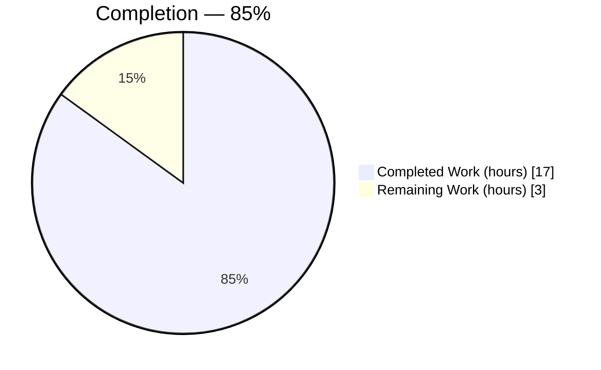
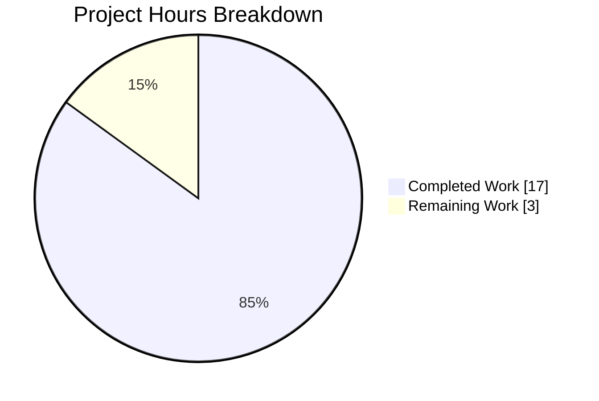
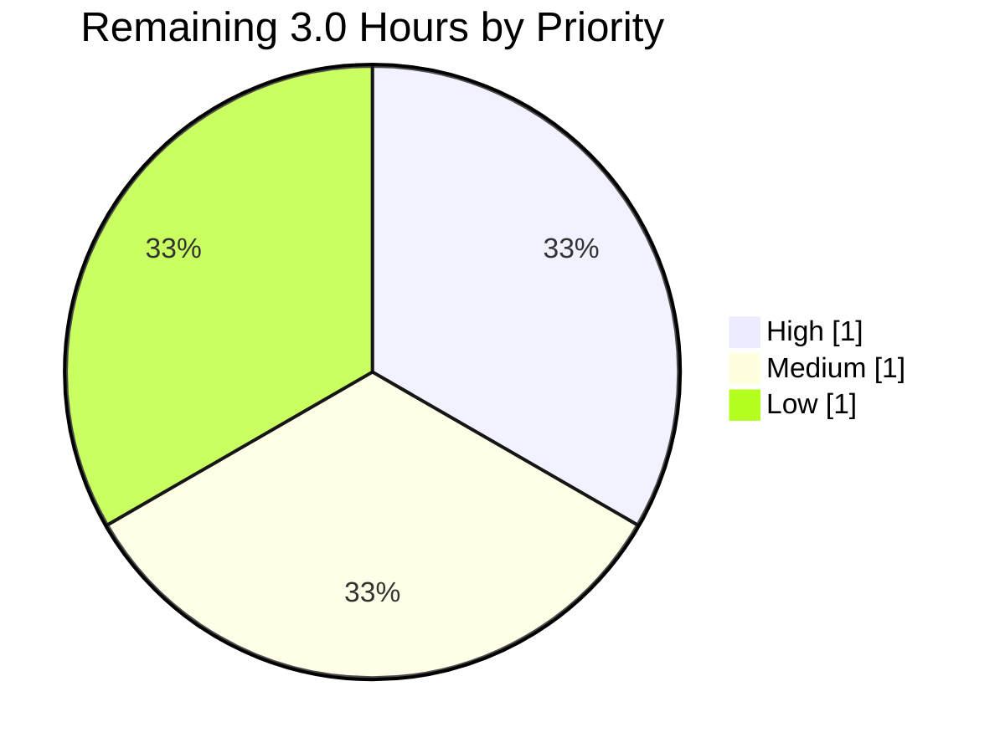

# 1. Executive Summary

## 1.1 Project Overview

This project measures the runtime cost of the repository's hello-world HTTP server (`server.js`) from the outside. Two files deliver it: `perf-check.js`, a 19-line standard-library-only client that drives 200 requests at concurrency 1 and 200 at concurrency 50 and prints elapsed time, latency, throughput and two memory snapshots to the console; and `performance-report.md`, a 21-line report carrying those numbers with their limits. It answers, for the engineer who owns this codebase, what a request costs to an order of magnitude. The server is untouched, so the figures describe it as it stands.

## 1.2 Completion Status

**17.0 hours completed out of 20.0 total hours = 85% complete.**



Completed = Dark Blue `#5B39F3`; Remaining = White `#FFFFFF`.

| Metric | Value |
|---|---|
| Total Hours | 20.0 |
| Completed Hours (AI + Manual) | 17.0 (17.0 autonomous + 0.0 manual) |
| Remaining Hours | 3.0 |
| Percent Complete | 85% |

## 1.3 Key Accomplishments

- ✅ `perf-check.js` runs in about 100 ms, prints four labelled console lines and exits 0, leaving nothing behind.
- ✅ Both levels genuinely exercised — one socket in flight at level 1, fifty at level 50, 200 requests each.
- ✅ Every derived figure reproduces exactly from its own printed elapsed time, unrounded.
- ✅ Failure never masquerades as speed: refused, non-200 or dropped responses exit non-zero, printing no measurement line.
- ✅ Memory attributed to the measuring client, twice, so it cannot be read as the server's.
- ✅ Every number in the 21-line report traces to a printed line, derived figures showing their arithmetic.
- ✅ The subject is provably unchanged: no commit touches `server.js` or `README.md`.
- ✅ Zero-install property intact — no manifest, lock file or `node_modules`.

## 1.4 Critical Unresolved Issues

**0 of 11 binding acceptance directives** and **0 of 3 in-scope deliverables** are open. The six items below are accepted limitations and uncovered areas, not defects.

| Issue | Impact | Owner | ETA |
|---|---|---|---|
| Measurement target is an interpretation, not a confirmed fact — the request named a file this repository does not contain, so `server.js` was measured as the only server source | If a different artefact was intended, every figure describes the wrong subject | Project owner | 0.5 h |
| Single unrepeated run — no variance characterised, no percentile computed | A single figure should not be treated as stable; the ratio between the two levels moves materially between runs | Project owner | 0.5 h |
| Throughput is a lower bound on server capacity, not its ceiling | No saturation or capacity conclusion can be drawn from any figure | Accepted (mandated dispatch) | — |
| The server's own memory was not measured | No server footprint figure exists anywhere in the deliverable | Accepted (measuring it needs server instrumentation) | — |
| No automated test covers either deliverable | No regression guard if the runtime or environment changes | Project owner | 0.5 h |
| The client's non-200 rejection branch cannot be reached against this server | Exercised only against a substitute responder, never against the delivered subject | Project owner | included above |

## 1.5 Access Issues

**No access issues identified.** No credential, token or environment variable is required or consulted, and there is no authentication surface; zero declared dependencies mean nothing to install. External prerequisites: a Node.js runtime on `PATH` and port 3000 free.

| System/Resource | Type of Access | Issue Description | Resolution Status | Owner |
|---|---|---|---|---|
| — | — | No access issue identified | N/A | — |

## 1.6 Recommended Next Steps

1. **[High]** Confirm `server.js` is the intended subject — the request named a file this repository does not contain.
2. **[High]** Sign off `performance-report.md` and its six interpretation limits.
3. **[Medium]** Decide whether one unrepeated run is sufficient evidence.
4. **[Medium]** Decide whether `perf-check.js` stays in the tree.
5. **[Low]** Decide whether a minimal smoke check should be permitted.

# 2. Project Hours Breakdown

## 2.1 Completed Work Detail

| Component | Hours | Description |
|---|---|---|
| Measurement target resolution & repository scope discovery | 1.0 | Established the measurable subject and its constraints: `server.js` as the only server source, port 3000 as a hardcoded literal with no override, the absence of any manifest, lock file, CI descriptor or test tree, and the readiness signal the server emits |
| Runtime API research | 0.5 | Settled the two API details a correct figure depends on — that `process.memoryUsage()` describes only its calling process, and that the default HTTP agent on this runtime imposes no per-host socket cap (`maxSockets: Infinity`, keep-alive on), so no explicit agent or options object is needed |
| `perf-check.js` measurement instrument | 3.0 | The 19-line CommonJS client: one `require('http')`, a single async IIFE, one uniform loop over `[1, 50]`, 200 requests per level dispatched in `Promise.all` waves of the level's width with the request promise inline, `res.resume()` with resolution on the response `end` event, rejection on non-200 and on request- or response-stream errors, and exactly two labelled memory snapshots |
| Console evidence contract & three derivation formulas | 1.0 | Four logical lines in a fixed order, every value carrying a label and a unit; `elapsed` from `process.hrtime.bigint()` with the BigInt subtraction performed before conversion, amortized latency as elapsed ÷ 200 and throughput as 200 ÷ (elapsed ÷ 1000), all printed raw and unrounded so the numbers re-derive exactly |
| Measurement run execution | 1.0 | The run itself under its own procedure: TCP-acceptance port precondition, out-of-band server start, readiness gated on an observable signal rather than a sleep, the script executed once, the console read, signal teardown, and the port confirmed released against a captured working-tree baseline |
| `performance-report.md` authoring | 2.0 | 21 lines of unstructured prose carrying 18 quoted figures, three derived figures each showing its division, a ratio-driven bottleneck statement framed conditionally, six interpretation limits and one labelled suggestions line — with no heading below the title, no table and no fenced block |
| Figure traceability & arithmetic verification | 1.0 | Every numeral in the report traced to a printed console value, a visible derivation or a structural constant of the method, with all seven derivations recomputed to the last digit under the producer's own number semantics |
| Instrument behavioural verification | 3.0 | Failure injection across refused connections, five non-200 statuses, mid-run resets, truncated and aborted bodies, header floods and non-HTTP garbage; the resolve-on-`end` invariant proven by a delayed-chunk responder inflating serial elapsed time roughly 170×; dispatch width proven externally at 1 socket then 50; memory attribution proven across three distinct processes; clean self-exit with no socket held |
| Subject HTTP contract & lifecycle verification | 2.0 | Seven methods and eleven path shapes returning the same byte-exact 14-byte body, the four-header response block with its documented absence of `Content-Type`, indifference to request bodies up to 1 MB, fatal port contention with the incumbent unaffected, signal teardown with immediate port release, and repeated rebinds |
| Security & supply-chain posture verification | 1.5 | Zero-dependency audit confirmed at the loader level, hostile-responder probing for terminal-escape and counterfeit-figure injection, credential and absolute-path hygiene over all output and the report, argument and environment injection probes, file-descriptor and memory bounds under multi-gigabyte drains, and the runtime's advisory status against the code paths actually reachable |
| Ceiling/directive compliance audit & repository continuity | 1.0 | Every acceptance ceiling checked against the diff — line counts, memory-call occurrence count, comment count, require inventory, absence of any argument, environment or configuration surface — plus byte-identity of both reference files and the verified absence of every prohibited artefact |
| **Total** | **17.0** | |

## 2.2 Remaining Work Detail

| Category | Hours | Priority |
|---|---|---|
| Confirm the measurement target is the intended subject | 0.5 | High |
| Owner sign-off of the report and its interpretation limits | 0.5 | High |
| Decide whether a single unrepeated run is sufficient evidence | 0.5 | Medium |
| Decide the long-term disposition of `perf-check.js` | 0.5 | Medium |
| Align the surrounding specification wording with the observed wire behaviour | 0.5 | Low |
| Decide whether to permit a minimal smoke check for the instrument | 0.5 | Low |
| **Total** | **3.0** | |

## 2.3 Hours Reconciliation

| Check | Value |
|---|---|
| Section 2.1 completed hours | 17.0 |
| Section 2.2 remaining hours | 3.0 |
| Total project hours (2.1 + 2.2) | 20.0 |
| Completion formula | (17.0 ÷ 20.0) × 100 = **85%** |

Every hour above traces to a scoped deliverable — the measurement instrument, the report, the measurement run and its acceptance — or to the verification those deliverables required. Confidence is high for the delivered components, which are small, fully specified and directly observable; it is high for the remaining items too, since each is a bounded human decision rather than an engineering unknown. No hours are attributed to work outside that scope: percentiles, repeated trials, extra concurrency levels, server-side instrumentation and any reusable benchmarking apparatus are excluded by the project's own constraints and are not estimated here.

# 3. Test Results

Verification for this project is behavioural: the deliverable is a measurement, so what had to be proven is that the instrument reports the truth and the subject behaves as the report says it does. The rows below aggregate every check executed against the delivered tree, grouped by the capability it establishes.

| Area / Category | Framework | Tests | Passed | Failed | Coverage | What This Proves |
|---|---|---|---|---|---|---|
| Parse & package gate | `node --check`, `node --test` | 3 | 3 | 0 | n/a — no coverage tool configured | Both sources parse cleanly under the installed runtime and the whole-package gate is green |
| Automated regression suite | `node:test` | 0 | 0 | 0 | n/a — no coverage tool configured | Nothing: the repository declares no automated tests, so no behaviour is guarded by one |
| Script invocation & configuration surface | `node` runtime probes | 62 | 62 | 0 | n/a — no coverage tool configured | The instrument runs from any directory, self-terminates in under 100 ms, writes nothing to disk, and cannot be redirected or reconfigured by any argument or environment variable |
| Measurement integrity & console contract | `node` + external responder fixtures | 112 | 112 | 0 | n/a — no coverage tool configured | Every printed figure derives exactly from the run's own nanosecond clock, the two levels really dispatch at width 1 and width 50, and the memory figures are the client's own process and provably cannot be the server's |
| Client↔server integration & failure injection | `node` responder fixtures, raw TCP sockets | 51 | 51 | 0 | n/a — no coverage tool configured | A failed, dropped or non-200 response is never counted as a fast success, and each request resolves only after its body is fully drained rather than on headers |
| Subject HTTP contract & lifecycle | `curl`, raw TCP sockets | 161 | 161 | 0 | n/a — no coverage tool configured | The server answers every accepted method and path with the same byte-exact 14-byte body, and its startup, port contention and teardown behave exactly as the report describes |
| Security & hostile-input assessment | `node` fixtures, `curl`, dependency audit | 382 | 382 | 0 | n/a — no coverage tool configured | No response content, credential, absolute path or terminal control byte can reach the evidence, resource use stays bounded under multi-gigabyte drains, and the third-party dependency surface is empty |
| Final acceptance re-verification | Full start → measure → teardown sequence | 178 | 178 | 0 | n/a — no coverage tool configured | The delivered tree satisfies every acceptance directive at runtime, with the instrument, the report's figures and the untouched subject all verified together |

**Totals: 949 checks executed, 949 passed, 0 failed.** No coverage percentage exists for any file: this repository configures no coverage, lint, type-check or mutation tooling, and adding any is outside the project's constraints.

### Not Covered

- **Neither deliverable is covered by an automated test.** `node --test` reports zero tests, and the project's constraints forbid adding a test artefact. Before relying on the instrument again — particularly after a runtime upgrade — a human should run the parse gate and then the full start → readiness → `node perf-check.js` → teardown sequence and confirm four labelled console lines and exit 0.
- **The client's non-200 rejection branch is unreachable against this server**, which answers every request the runtime accepts with an implicit 200. It was exercised only against a substitute responder, never against the delivered subject. A human should re-drive it with a deliberately failing responder if that path ever matters operationally.
- **The report's prose cannot be asserted on by any test.** Markdown is not executable, so its factual claims were verified by re-deriving each one from live behaviour and from the printed figures. Any future edit to the report needs the same manual re-derivation.
- **No variance, percentile or repeated-trial statistic exists.** The committed figures come from one run, and the run-to-run spread on a shared host is wide. A human deciding anything load-sensitive should commission repeated trials rather than treating a single figure as stable.
- **The server's own memory is not covered by any measurement.** Both snapshots describe the measuring client; obtaining the server's footprint would require instrumenting it.

# 4. Runtime Validation & UI Verification

Every flow below was driven against a live server and observed directly. There is no user interface in this project — `server.js` sends no `Content-Type` and returns a bare 14-byte text body, so the console is the only presentation surface and no browser verification applies or was attempted.

- ✅ **Operational — Server start-up and readiness.** `node server.js` prints exactly `Server running at http://127.0.0.1:3000/` (one 41-byte line per process lifetime) and accepts TCP within a few hundred milliseconds of spawn; readiness was gated on that observable signal, never on a sleep.
- ✅ **Operational — Primary request path.** `GET /` returns `200` with the 14-byte body `Hello, World!\n`; seven methods and eleven path shapes return the same byte-exact response, `HEAD` correctly returning 200 with zero body bytes.
- ✅ **Operational — Response header contract.** Exactly `Date`, `Connection: keep-alive`, `Keep-Alive: timeout=5` and `Content-Length: 14`. No `Content-Type` — a pre-existing property of the subject, observed and left in place.
- ✅ **Operational — The measurement run end to end.** `node perf-check.js` against the running server exits 0 in about 100 ms, printing the idle memory snapshot, the `concurrency=1` line, the `concurrency=50` line and the post-load memory snapshot, then self-terminating with no socket or process left behind.
- ✅ **Operational — Failure paths.** With nothing listening the run exits 1 with `Error: connect ECONNREFUSED 127.0.0.1:3000` and zero measurement lines; against a non-200 responder it exits 1 with `Error: unexpected status 500` after exactly one request has been dispatched, confirming fail-fast with no retry.
- ✅ **Operational — Concurrency behaviour.** Level 1 holds one socket and one request in flight; level 50 opens 50 simultaneous sockets with dozens of requests genuinely in flight, and 400 requests complete over 51 connections against a control of 401 when reuse is refused.
- ✅ **Operational — Lifecycle and port release.** `SIGTERM` terminates immediately with no drain (`wait` status 143), the listening socket disappears, and the port re-probes free with no cool-down; repeated stop/start cycles rebind immediately.
- ✅ **Operational — Port contention.** A second instance exits 1 on an unhandled `'error'` event with `listen EADDRINUSE: address already in use :::3000`, prints no readiness line, and leaves the incumbent serving `200`/14 bytes unaffected.
- ✅ **Operational — Zero-install runnability.** Both files run on the installed runtime with no manifest, lock file or `node_modules` present and no install command issued; no module-resolution error occurred in any run.
- ⚠ **Partial — Stalled-listener handling.** A listener that accepts a connection and never answers stalls a run indefinitely: no socket timeout is configured, which the project's constraints exclude. Resource use stays flat and no figure is ever fabricated, but the operator must interrupt the run. This is the only runtime behaviour that requires human intervention rather than resolving itself.

**Never exercised at runtime:** the client's non-200 rejection branch against the delivered server (unreachable — it answers 200 for every accepted request, so this path was driven only against a substitute responder), and the report's prose, which is not executable and was instead re-derived claim by claim from the observed behaviour above.

# 5. Compliance & Quality Review

## 5.1 Compliance Matrix

Each row records where the deliverable stands now, with the evidence a reader can open.

| # | Deliverable / Benchmark | Status | Progress | Verified By |
|---|---|---|---|---|
| 1 | Measurement instrument delivered at the repository root | ✅ PASS | ██████████ 100% | `perf-check.js`, 19 lines, parses clean and runs to exit 0 |
| 2 | Instrument structural ceilings | ✅ PASS | ██████████ 100% | 19 lines of a 30-line ceiling; one `require`, and it names the built-in `http`; no named function, options object, `process.argv` or `process.env`; sole array literal `[1, 50]`; exactly two `process.memoryUsage()` occurrences; no `fs` import; zero comment lines |
| 3 | Dispatch contract — 200 requests per level in `Promise.all` waves of the level's width | ✅ PASS | ██████████ 100% | `perf-check.js:5-8`; externally counted at 400 total requests with 1 socket open at level 1 and 50 at level 50 |
| 4 | Measurement honesty — drain and resolve on `end`, reject on non-200 and on stream errors, fail fast | ✅ PASS | ██████████ 100% | `perf-check.js:9-14`; a delayed-chunk responder inflates serial elapsed time roughly 170×, and twelve injected failure modes each exit non-zero with no measurement line printed |
| 5 | Console evidence contract — four labelled, unit-carrying logical lines and three raw derivation formulas | ✅ PASS | ██████████ 100% | `perf-check.js:4,16,18`; observed live, in contract order, at full unrounded precision |
| 6 | Report delivered at the repository root within its ceilings | ✅ PASS | ██████████ 100% | `performance-report.md`, 21 lines of a 25-line ceiling, one title heading, no sub-heading, no fenced block, no table |
| 7 | Report content contract — both levels, memory attribution, shown ratio, conditional conclusion, six limits, one suggestions line | ✅ PASS | ██████████ 100% | `performance-report.md:3-21`; the concurrency-50 figure is expressly denied as a per-request latency and the wave makespan is named an upper bound |
| 8 | Figure traceability — every number quoted from the console or shown as arithmetic over printed values | ✅ PASS | ██████████ 100% | All 32 numerals resolve: 19 console-quoted, 3 derived with the division visible, 10 structural constants of the method, 0 untraceable; all seven derivations recompute to the last digit |
| 9 | Measurement run procedure — port precondition, out-of-band start, observable readiness, signal teardown, port released | ✅ PASS | ██████████ 100% | Re-executed end to end: probe free → readiness line → `200`/14 → exit 0 with four lines → `wait` 143 → probe free |
| 10 | Prohibited-artefact absence and the zero-install property | ✅ PASS | ██████████ 100% | `package.json`, four lock-file names, `node_modules`, three version-pin files, CI descriptors, `Makefile`, `Dockerfile` and every test/bench directory verified absent; no raw-output, result or log file exists; a clean checkout runs with no install step |
| 11 | Measured subject and readme left untouched | ✅ PASS | ██████████ 100% | No commit on this branch touches `server.js` or `README.md`; both retain their baseline blobs (`2886290f`, `35d275fe`); the branch diff is exactly two added files and 40 inserted lines |
| 12 | Quality gates | ⚠ PARTIAL | ████░░░░░░ 40% | The parse and package gate is green (`node --check` on both files, then `node --test`, exit 0). No automated test, lint, type-check, coverage or mutation gate exists, and the project's constraints forbid adding one — so the gate is a parse check plus a manual runtime sequence |

## 5.2 AAP & Rule Divergences and Gaps

Seven divergences were established. Three are sanctioned by the user's own instruction, one by the delivery plan's explicit reasoning, and three await an owner decision. No user-specified rules were provided for this work — the rule count is zero and no artefact is rule-mandated — so enterprise-standard practice was the governing standard for everything the request did not specify.

| What the AAP/Rule Required | What Was Delivered Instead | Why It Diverged | Impact | Remediation |
|---|---|---|---|---|
| Measure the server named `Hello_World_Node.js` | `server.js` was measured — the repository's only server source | No file of that name exists here, and nothing was created or renamed to match it | If a different artefact was intended, every figure describes the wrong subject | Owner confirms the target (0.5 h, High) |
| Characterise the subject as answering the fixed body with an implicit 200 "for every method and path" | The report scopes that claim to the handler and names the runtime parser's `400`/`431` rejections and the unanswered `CONNECT` | The parser answers unparseable requests below the application handler, which no code change can alter | None on behaviour; the surrounding specification text, left as written, overstates the wire contract | Align that wording; no code change (0.5 h, Low) |
| One *throwaway* measurement script | A 19-line script left in the tree, with no runner, manifest entry or CI hook | Its ceilings are acceptance criteria checkable against the diff, which presupposes the file appears in it | The repository carries a file the owner did not explicitly ask to keep; no prohibition is breached | Decide whether to keep or remove it after acceptance (0.5 h, Medium) |
| No permanent benchmark suite, result schema or reproducibility harness — and no test artefact | Neither deliverable is covered by any automated test | The prohibition forbids the artefact a regression guard would require | No regression guard; a runtime change could alter the instrument silently | Decide whether to permit a minimal smoke check (0.5 h, Low) |
| Dispatch the batches with `Promise.all` | Exactly that — with the resulting figures framed as a lower bound rather than a capacity ceiling | **Sanctioned** — the mechanism was named explicitly in the request, and its synchronisation barrier was recorded as a limit rather than engineered around | No saturation or capacity conclusion can be drawn from any figure | None required unless a capacity number is wanted |
| Two `process.memoryUsage()` calls, one at idle and one after load | Exactly two — both describing the measuring client's process, with the server's memory not measured at all | **Sanctioned** — that API describes only its calling process, and obtaining the server's would require instrumenting `server.js`, which the request prohibits | No server footprint figure exists anywhere in the deliverable | None unless server instrumentation is sanctioned |
| Install the documented supported runtime and work inside an isolated environment | The installed Node.js v22.23.2 was used directly, with those steps marked inapplicable | **Sanctioned** — the repository documents no supported version and declares no dependencies, so there is nothing to resolve or isolate, and creating a manifest or pin file is prohibited | The figures are tied to one runtime, with no documented basis for choosing another | None available within the constraints; the owner may choose to pin |

**Measurement target.** The request named `Hello_World_Node.js`, and no such file exists: a case-insensitive search for anything matching "hello" returns nothing, and the base commit tracked only `README.md` and `server.js`. `server.js` was therefore measured as the single object the request could have been describing — its response body is literally `Hello, World!\n` (`server.js:1`) — and no file was created or renamed to fit the name. This is the one assumption underpinning the entire deliverable, and it was not confirmed with a human before measuring. The owner should either confirm `server.js` was meant, or name the intended artefact, in which case the figures must be re-taken against it.

**Subject wire contract.** The specification that scoped this work describes the subject as returning the fixed body with an implicit 200 for every method and path. Driven at the wire, the subject is narrower: an unrecognised method token, a missing `Host` on HTTP/1.1, a malformed request line and an oversized header block each draw a `400 Bad Request` or `431 Request Header Fields Too Large`, and a `CONNECT` is closed unanswered. A control experiment against a bare server reproduced the identical `400` with its handler never invoked, and the handler's 14-byte body is absent from every rejection — the runtime's parser answers below the application code. `performance-report.md:3` states this correctly; `server.js` is correct and frozen. Only the surrounding wording needs aligning.

**Script disposition.** The request called for a "throwaway" script, which reads naturally as something discarded after use. It was kept, because the acceptance criteria it must satisfy — under 30 lines, built-in `http` only, exactly two memory calls, at most one comment — are checks against the diff, and a deleted file cannot be checked. "Throwaway" was therefore read as design intent: single purpose, no reuse, no configuration surface. Nothing hooks it — a tree-wide search finds no reference to `perf-check.js` anywhere, and there is no manifest to register it in — so no prohibition on permanent apparatus is breached. The owner should decide whether to keep it as the reproducible instrument or remove it once the report is accepted.

**Absent test coverage.** The request forbids a permanent benchmark suite, a result-file schema and a reproducibility harness, and forbids adding a test artefact. Honouring that leaves both deliverables with no automated cover at all: `node --test` reports zero tests, and markdown prose is not executable in any case. What guards the work instead is the parse gate on both sources plus the documented manual sequence — start the server, gate on readiness, run the instrument, confirm four labelled lines and exit 0, tear down, confirm the port released. That is adequate for a one-shot measurement and inadequate as a standing guarantee. The owner should decide whether a minimal smoke check is worth relaxing the constraint for.

**Dispatch barrier (sanctioned).** `Promise.all` was mandated by name in the request, and it imposes a synchronisation barrier: the next wave cannot start until the slowest request in the current one resolves, which caps achieved throughput below what the server could sustain under a continuously saturated client. The explicit instruction was honoured rather than engineered around, and the consequence is carried as an interpretation limit at `performance-report.md:17`. Read the throughput figures as a floor on server capacity, never a ceiling, and treat the sub-proportional gain between the two levels as consistent with either the server or the co-resident client being the limiter — the run does not localise which.

**Memory attribution (sanctioned).** The request asked for one `process.memoryUsage()` call at idle and one after the load batch. That API describes only the process that calls it, so two calls placed in the measuring client describe the client and can say nothing about the server; obtaining the server's footprint would mean editing `server.js`, which the request prohibits. Both console lines are labelled `script process` and the report states the attribution twice, at `performance-report.md:11` and again in its sixth limit. This matters because the two processes' resident sizes sit within a few percent of each other, so an unlabelled figure would have been read as the server's.

**Unpinned runtime (sanctioned).** Standard practice would install the runtime version a project documents as supported and work inside an isolated environment. This repository documents none — no `engines` field, `.nvmrc`, `.node-version` or `.tool-versions` exists — and it declares no dependencies, so there is no manifest from which an isolated environment could be populated and nothing to install. Creating either is prohibited. The installed Node.js v22.23.2 was used directly, and it is the patched release of the most recent advisory for its line with none of the affected subsystems reachable from this code. The figures are properly read as measured *on* that runtime, not as a property the repository guarantees.

# 6. Risk Assessment

These are forward-looking: what could still go wrong when this work is relied upon or re-run.

| Risk | Category | Severity | Probability | Mitigation | Status |
|---|---|---|---|---|---|
| A single unrepeated run is treated as a stable value. The level-50/level-1 throughput ratio moves materially between runs on a shared host, sometimes falling below 1 | Technical | Medium | High | The report states this as an explicit limit; treat the figures as an order-of-magnitude sanity check, and commission repeated trials before any load-sensitive decision | Accepted caveat |
| No automated test guards either deliverable, and no coverage, lint or type tooling is configured | Technical | Medium | Medium | The parse gate plus the documented start → readiness → run → teardown sequence is the whole regression check; run it after any runtime upgrade | Open by design |
| The request count `200` is hardcoded in both the divisor and the printed label. It is exact today because 1 and 50 both divide 200 without remainder; a level that did not would overshoot while still printing `requests=200` | Technical | Low | Low | Adding a level is outside the project's constraints, so the coupling is inert; anyone reviving the script must change the divisor and the label together | Documented |
| Port 3000 is a hardcoded source literal with no override, so only one instance can run per network namespace and contention is fatal rather than degrading — a second start exits 1 on an unhandled `'error'` event | Operational | Medium | High on a shared host | Probe the port before every run, and run inside a private network namespace or under a shared advisory lock; resolve contention by the port's owning pid, never by process name | Pre-existing, unchanged |
| No graceful shutdown and no request logging: `SIGTERM` severs in-flight requests with no drain, and the server emits one startup line and nothing else, so nothing about a run is recoverable afterwards | Operational | Low | Medium | Read the console during the run; the report is the only durable record of its figures | Pre-existing, unchanged |
| The server binds the dual-stack wildcard although its startup line names loopback, so on a shared network it answers unauthenticated on every interface | Security | Medium | Medium | Run it only in an isolated namespace or a loopback-only environment; nothing is exposed but a fixed 14-byte body, no request input is read and no state exists | Pre-existing, unchanged |
| The runtime version is the only uncontrolled supply-chain variable — nothing in the repository pins it, and creating a pin is outside the constraints | Security | Low | Low | The installed v22.23.2 is the patched release for its line with no affected subsystem reachable from this code; re-check advisory status before relying on the figures again | Accepted |
| The instrument sets no socket timeout, so a listener that accepts and never answers stalls a run indefinitely with no bound and no feedback | Integration | Low | Low | Run it in the foreground and interrupt it if it does not finish in about a second; resource use stays flat and no figure is ever fabricated | Accepted by design |

# 7. Visual Project Status

**Hours: 17.0 completed of 20.0 total — 85% complete.** Completed = Dark Blue `#5B39F3`; Remaining = White `#FFFFFF`.



Remaining hours by priority, the three groups summing to the 3.0 hours in Sections 1.2 and 2.2:



| Deliverable | Status | Hours Completed | Hours Remaining |
|---|---|---|---|
| Measurement instrument (`perf-check.js`) | Complete and verified | 8.5 | 0.5 |
| Findings report (`performance-report.md`) | Complete and verified | 4.0 | 1.0 |
| Measurement run and its evidence | Complete and verified | 3.0 | 0.5 |
| Compliance, continuity and acceptance | Verified; acceptance outstanding | 1.5 | 1.0 |
| **Total** | **85% complete** | **17.0** | **3.0** |

# 8. Summary & Recommendations

What was asked for has been built, run and verified. Two files were added and nothing else changed: `perf-check.js`, a 19-line standard-library-only client that drives 200 requests at concurrency 1 and 200 at concurrency 50 against the running server and prints four labelled console lines; and `performance-report.md`, a 21-line report carrying those figures with their interpretation. The branch adds exactly 40 lines across those two files, and no commit on it touches `server.js` or `README.md` — so the numbers describe the server precisely as it stands. On an AAP-scoped basis the project stands at **85% complete: 17.0 of 20.0 hours**, with every scoped deliverable finished and the remaining 3.0 hours being owner decisions no autonomous work can make.

The verification behind that claim is behavioural rather than test-suite-based, because the deliverable is a measurement and what mattered was whether the instrument tells the truth. It does. Every printed figure re-derives exactly from the run's own nanosecond clock at full precision, with no rounding anywhere. The two levels genuinely differ in width — one socket in flight at level 1, fifty simultaneous sockets at level 50, counted from outside the client process. A failed, dropped or non-200 response can never be counted as a fast success: twelve injected failure modes each produced a non-zero exit with no measurement line printed, and a delayed-chunk responder inflated serial elapsed time roughly 170-fold, proving each request resolves only after its body is drained. The memory figures are demonstrably the client's own and are labelled as such, which matters because the two processes' resident sizes sit within a few percent of each other. 949 checks were executed against the delivered tree and all passed.

Three gaps are worth the owner's attention, and the first is the only one that could invalidate the work. The request named a file this repository does not contain, so `server.js` was measured as the only server source it could have meant — a sound inference, but an unconfirmed one, and if a different artefact was intended every figure describes the wrong subject. Second, the figures come from one unrepeated run, and the spread between runs on a shared host is wide enough that the ratio between the two levels can invert; the report says so, and anyone making a load-sensitive decision should commission repeated trials rather than trust a single number. Third, neither deliverable is covered by an automated test, because the project's constraints forbid the artefact one would require — the parse gate plus a manual run sequence is the whole standing guarantee.

The critical path to acceptance is short and entirely human: confirm the measurement target, then read the 21-line report and its six interpretation limits. Those two steps take an hour and unblock everything else. The remaining four decisions — single-run sufficiency, the script's long-term disposition, aligning the surrounding specification wording with the observed wire behaviour, and whether to permit a smoke check — can follow in any order and none of them blocks use of the figures. Success looks like this: an owner who, having read the report, can state the server's per-request cost to an order of magnitude and knows exactly which claims the evidence does and does not support.

**Production readiness: ready to hand over, subject to target confirmation.** This deliverable is evidence plus interpretation rather than shippable runtime software, so readiness means the report is fit to be read and relied upon — and it is: every number traces to a printed line or shows its arithmetic, every limitation is stated rather than buried, and no claim outruns what a single batched run can establish. The instrument runs clean and leaves nothing behind. The repository's zero-install property is intact, and the measured subject's pre-existing characteristics — no `Content-Type`, a wildcard bind, fatal port contention, no graceful shutdown, no request logging — were observed and deliberately left in place, since changing any of them would have invalidated the measurement. The only thing standing between this work and full acceptance is a human confirming it measured the right server.

# 9. Development Guide

Every command below was executed in this repository and produces the output shown. Run them from the repository root unless stated otherwise.

## 9.1 System Prerequisites

- **Node.js** on `PATH`. Verified on **v22.23.2**. The repository pins no version, so this is the version the work was tested on rather than one it guarantees.
- **TCP port 3000 free** in your network namespace. The port is a hardcoded integer literal in `server.js` — no environment variable, CLI flag or config file can change it.
- **Nothing to install.** There is no `package.json`, no lock file, no `node_modules` and no build step. A clean checkout is immediately runnable.
- Optional helpers used below, all already present: `curl`, `lsof`, `unshare`, `flock`, `ip`.

```bash
node --version    # v22.23.2
npm --version     # 11.18.0
git --version     # git version 2.51.0
```

> **Do not run `npm install`, and do not create `package.json`.** There is nothing to install, a lock file must not be introduced, and a manifest declaring `"type": "module"` would break `require` in `server.js` outright. `npm test` and `npm run build` do not work here and are not meant to.

## 9.2 Environment Setup

No environment variables, secrets or credentials are required, and neither file reads any. The only setup is confirming the port is free:

```bash
node -e "require('net').connect({port:3000,host:'127.0.0.1'}).on('connect',function(){console.log('OCCUPIED');this.destroy()}).on('error',e=>console.log('FREE',e.code))"
```

- `FREE ECONNREFUSED` → nothing is listening; proceed.
- `OCCUPIED` → stop. Find the owner and stop **that pid**, never a process selected by name:

```bash
lsof -ti :3000            # prints the owning pid
kill "$(lsof -ti :3000)"  # only if the process is genuinely yours
```

This probe tests TCP acceptance rather than HTTP on purpose: an HTTP probe reports the same failure for a refused connection as for a listener that accepts and never answers, and any non-200 responder still occupies the port.

## 9.3 Static Gate

There is no build system — Node executes the CommonJS sources directly. The parse and package gate is the whole static check:

```bash
node --check server.js && node --check perf-check.js && node --test
```

Expected: both parse checks silent, then

```
# tests 0
# suites 0
# pass 0
# fail 0
```

and exit 0. **Zero tests is the correct result** — this repository has no test suite by design.

## 9.4 Application Startup and the Measurement Run

The server must be started out of band; the measurement script never spawns it. Readiness comes from an observable signal, never a fixed sleep — spawn-to-ready measures in the mid-twenty-millisecond range, so any sleep shorter than about 30 ms fails deterministically.

**Two-terminal flow (simplest for a manual run).** Terminal 1:

```bash
node server.js
# wait for: Server running at http://127.0.0.1:3000/
```

Terminal 2:

```bash
node perf-check.js
```

Then return to terminal 1 and press Ctrl-C.

**Private network namespace (preferred when the host port may be contended).** This gives the run its own `127.0.0.1:3000`. `ip link set lo up` is mandatory — a fresh namespace has loopback down.

```bash
REPO_DIR=$PWD
timeout 180 unshare --net bash -c '
  ip link set lo up
  cd "$1"
  node server.js &                 # background as its OWN statement so $! is the node pid
  SRV=$!
  for i in $(seq 1 100); do
    kill -0 "$SRV" 2>/dev/null || { echo "server exited before readiness"; wait "$SRV"; echo "exit=$?"; exit 1; }
    node -e "require(\"net\").connect({port:3000,host:\"127.0.0.1\"}).on(\"connect\",function(){this.destroy();process.exit(0)}).on(\"error\",()=>process.exit(1))" 2>/dev/null && break
    sleep 0.1
  done
  node perf-check.js
  kill "$SRV"; wait "$SRV" 2>/dev/null
' _ "$REPO_DIR"
```

The `kill -0` guard matters: it detects a server that died on a bind failure instead of polling a port it will never bind.

**Serialized flow (when a client outside the namespace must reach the server).** Wrap the whole start → measure → stop sequence in one advisory lock that every caller shares. A full run is about 130 ms, so taking turns costs seconds:

```bash
flock "$HOME/.port-3000.lock" bash -c '<the same start / readiness / run / teardown sequence>'
```

Keep that one lock file shared between callers — making it per-caller defeats the lock.

## 9.5 Verification Steps

**The server serves:**

```bash
curl -i http://127.0.0.1:3000/
```

```
HTTP/1.1 200 OK
Date: <rfc1123 date>
Connection: keep-alive
Keep-Alive: timeout=5
Content-Length: 14

Hello, World!
```

Note there is **no `Content-Type`** header, and **no routing**: every method and every path — including `/health` and `/favicon.ico` — returns that same 200 body. There is no health or readiness endpoint.

**The measurement run:** `node perf-check.js` exits 0 in roughly 100 ms and prints four logical lines — the idle memory snapshot, the `concurrency=1` line, the `concurrency=50` line, and the post-load memory snapshot. A representative run:

```
idle memory, script process: {
  rss: 47235072,
  heapTotal: 5611520,
  heapUsed: 4442384,
  external: 1690124,
  arrayBuffers: 10767
}
concurrency=1 requests=200 elapsed=33.785441ms amortized_latency=0.168927205ms throughput=5919.709616932335req/s
concurrency=50 requests=200 elapsed=25.515027ms amortized_latency=0.127575135ms throughput=7838.518062316767req/s
post-load memory, script process: {
  rss: 57069568,
  heapTotal: 10330112,
  heapUsed: 6317904,
  external: 1704286,
  arrayBuffers: 23753
}
```

**Your figures will differ from these and from the committed report's — that is expected.** The report quotes its own run, so never substitute figures from a new run into `performance-report.md`.

**Acceptance ceilings**, each checkable in one command:

```bash
wc -l < perf-check.js                                      # 19  (ceiling: under 30)
wc -l < performance-report.md                              # 21  (ceiling: under 25)
grep -o 'process\.memoryUsage()' perf-check.js | wc -l     # 2   (must be exactly 2)
grep -c '^[[:space:]]*/' perf-check.js                     # 0   (ceiling: at most 1)
```

The memory-call check counts **occurrences** rather than lines on purpose: `grep -c` counts matching lines, so two calls on one line would pass a line check while breaking the requirement.

## 9.6 Teardown

```bash
kill "$SRV"; wait "$SRV"
```

`SIGTERM` with no drain — `wait` returns 143 and in-flight requests are severed rather than completed. The port frees immediately with no cool-down, so re-probing returns `FREE ECONNREFUSED` straight away. Never leave a listener behind.

## 9.7 Troubleshooting

| Symptom | Cause | Resolution |
|---|---|---|
| `Error: listen EADDRINUSE: address already in use :::3000`, exit 1, under `throw er; // Unhandled 'error' event`, with no readiness line | Something already holds port 3000. The server registers no `'error'` listener, so contention is fatal rather than degrading. The incumbent is unaffected and keeps serving | Probe first. Find the owner with `lsof -ti :3000` and stop that pid, or use a private network namespace / the shared lock |
| `Error: connect ECONNREFUSED 127.0.0.1:3000`, exit 1, zero measurement lines printed | The script ran with nothing listening. The idle memory line still appears — it precedes any request — but no measurement line does | Start the server and gate on readiness before running the script |
| `Error: unexpected status 500`, exit 1, zero measurement lines | Whatever answered port 3000 returned a non-200. Exactly one request is dispatched before the whole batch aborts | Confirm the listener is `server.js` and not another process that happens to hold the port |
| The run never finishes and prints nothing after the idle line | A listener accepted the connection and never answered. No socket timeout is configured | Interrupt it (Ctrl-C). Resource use stays flat and no figure is fabricated |
| `FREE ECONNREFUSED` immediately after starting the server | Polled before the listener bound | Use the `kill -0`-guarded TCP-acceptance poll; never a fixed sleep |
| Nothing in the server's output about individual requests | By design — the server emits one 41-byte startup line per process lifetime and never logs a request | Read the console during the run; the report is the only durable record |
| Connection refused inside `unshare --net` even with the server running | A fresh namespace has loopback down | Run `ip link set lo up` as the first command inside the namespace |

# 10. Appendices

## A. Command Reference

| Purpose | Command | Expected Result |
|---|---|---|
| Runtime version | `node --version` | `v22.23.2` |
| Port precondition probe | `node -e "require('net').connect({port:3000,host:'127.0.0.1'}).on('connect',function(){console.log('OCCUPIED');this.destroy()}).on('error',e=>console.log('FREE',e.code))"` | `FREE ECONNREFUSED` when clear |
| Identify the port's owner | `lsof -ti :3000` | The owning pid, or nothing |
| Parse check | `node --check server.js` / `node --check perf-check.js` | Silent, exit 0 |
| Package gate | `node --check server.js && node --check perf-check.js && node --test` | `# tests 0 / # pass 0 / # fail 0`, exit 0 |
| Start the server | `node server.js &` then `SRV=$!` | `Server running at http://127.0.0.1:3000/` |
| Confirm it serves | `curl -i http://127.0.0.1:3000/` | `200` with the 14-byte body `Hello, World!\n` |
| Run the measurement | `node perf-check.js` | Four logical console lines, exit 0, about 100 ms |
| Stop the server | `kill "$SRV"; wait "$SRV"` | `wait` status 143, port freed immediately |
| Instrument line ceiling | `wc -l < perf-check.js` | `19` |
| Report line ceiling | `wc -l < performance-report.md` | `21` |
| Memory-call count | `grep -o 'process\.memoryUsage()' perf-check.js \| wc -l` | `2` |
| Comment-line count | `grep -c '^[[:space:]]*/' perf-check.js` | `0` |
| Branch change set | `git diff --stat a3cb672..HEAD` | 2 files changed, 40 insertions(+) |

## B. Port Reference

| Port | Bound by | Configurable? | Notes |
|---|---|---|---|
| 3000 | `server.js` | **No** — a hardcoded integer literal with no environment, CLI or config override | One listener per network namespace; contention exits 1 on an unhandled `'error'` event. The startup line names `127.0.0.1`, but `listen()` receives no host argument, so the listener answers on every interface |

The measurement client hardcodes `http://127.0.0.1:3000/` to match, and reads neither arguments nor environment, so no channel exists through which a different port could be supplied.

## C. Key File Locations

| Path | Lines | Role |
|---|---|---|
| `server.js` | 1 | The measured subject: an HTTP server answering every accepted request with a fixed 14-byte `Hello, World!\n` body on port 3000. Reference only — never modified |
| `perf-check.js` | 19 | The measurement client. CommonJS, one `require('http')`, a single async IIFE, one loop over `[1, 50]`, 200 requests per level in `Promise.all` waves, two labelled `process.memoryUsage()` snapshots |
| `performance-report.md` | 21 | The findings report: the run's figures, the throughput ratio with its division shown, the conditional bottleneck statement, six interpretation limits and one labelled suggestions line |
| `README.md` | 1 | Project title only. Reference — deliberately not updated with a run command |

Layout is flat: four tracked files, zero tracked subdirectories.

## D. Technology Versions

| Component | Version | Source |
|---|---|---|
| Node.js | v22.23.2 | The installed runtime on `PATH`; the repository pins no version |
| npm | 11.18.0 | Present but unused — there is nothing to install |
| Module system | CommonJS | No manifest declares otherwise, so `.js` is CommonJS; this is why the client needs a single `async` IIFE (no top-level `await`) |
| Third-party dependencies | **none** | No `package.json`, lock file or `node_modules`; the only import in the whole repository is the built-in `http` module |
| Default HTTP agent | keep-alive on, `maxSockets: Infinity` | Accepted as-is, so 50 concurrent requests open 50 sockets rather than queueing behind a cap |

## E. Environment Variable Reference

**None.** Neither file reads `process.env` or `process.argv`, and no `.env`, config file or CI descriptor exists. Arguments and environment variables passed to either file are inert: the port stays 3000 and the concurrency levels stay 1 and 50 regardless. There are no credentials, tokens or secrets to supply, and none are missing.

## F. Developer Tools Guide

| Tool | Configured? | Notes |
|---|---|---|
| Build system | No | Node executes the CommonJS sources directly; there is no build step and no build output |
| Test runner | No test files | `node --test` runs and reports zero tests. Adding a test artefact is outside the project's constraints |
| Linter / formatter / type checker | No | No `.eslintrc*`, `eslint.config.js`, `.prettierrc` or `tsconfig.json`. `node --check` is the substituting static gate |
| Coverage / mutation tooling | No | No `.nycrc`, `.c8rc` or equivalent, so no coverage percentage exists for any file |
| CI / containers | No | No `.github/`, `.gitlab-ci.yml`, `Jenkinsfile`, `Makefile` or `Dockerfile`; nothing hooks the measurement script |
| Git hooks | Yes | Four Git LFS hooks (`pre-push`, `post-checkout`, `post-commit`, `post-merge`) are present and pass; no action needed |
| Isolation helpers | Available | `unshare --net` for a private `127.0.0.1:3000`, or `flock` on one shared lock path to serialize runs |

## G. Glossary

| Term | Meaning in this project |
|---|---|
| **Amortized latency** | Batch elapsed time divided by the request count. At concurrency 1, where requests are strictly serial, this is a genuine mean per-request latency. At concurrency 50 it is simply the reciprocal of throughput — mean amortized service time — and says nothing about what any individual request experienced |
| **Wave** | One `Promise.all` batch of requests, as wide as the concurrency level. Concurrency 50 over 200 requests is four waves of fifty |
| **Wave makespan** | Mean wave duration, derived as elapsed time divided by the wave count. A wave ends when its slowest request ends, so this bounds the typical request from above rather than measuring it |
| **Wave barrier** | The synchronisation `Promise.all` imposes: the next wave cannot start until the slowest request in the current one resolves. This is why the throughput figures are a lower bound on server capacity |
| **Lower bound** | The throughput figures are a floor on what the server can sustain, not a ceiling. No saturation or capacity conclusion follows from them |
| **`script process`** | The label on both memory snapshots, marking them as the measuring client's own footprint. The server's memory was not measured; `process.memoryUsage()` reports only the process that calls it |
| **Readiness signal** | The single stdout line `Server running at http://127.0.0.1:3000/`, or equivalently a successful TCP connect on port 3000 — both become true at the same instant. There is no health or readiness endpoint |
| **Fail fast** | `Promise.all` rejecting on the first failed request, so the run exits non-zero with no measurement line printed rather than counting a failure as a fast success |
