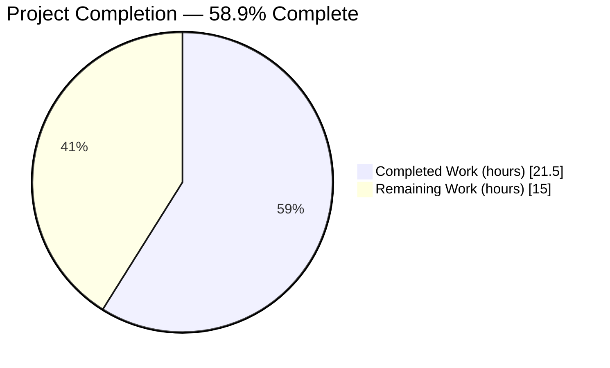
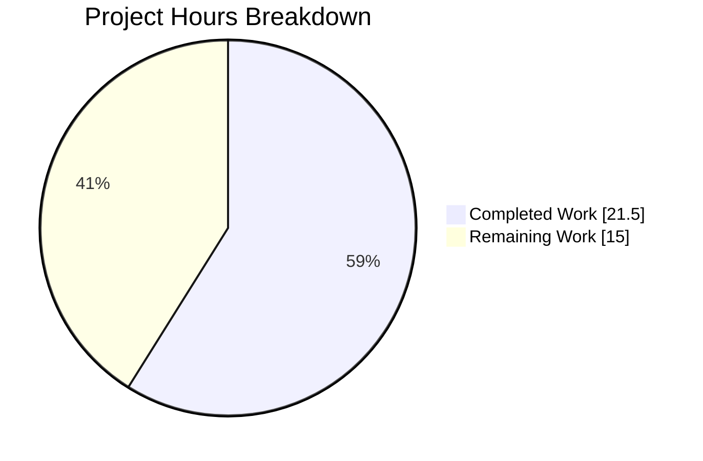
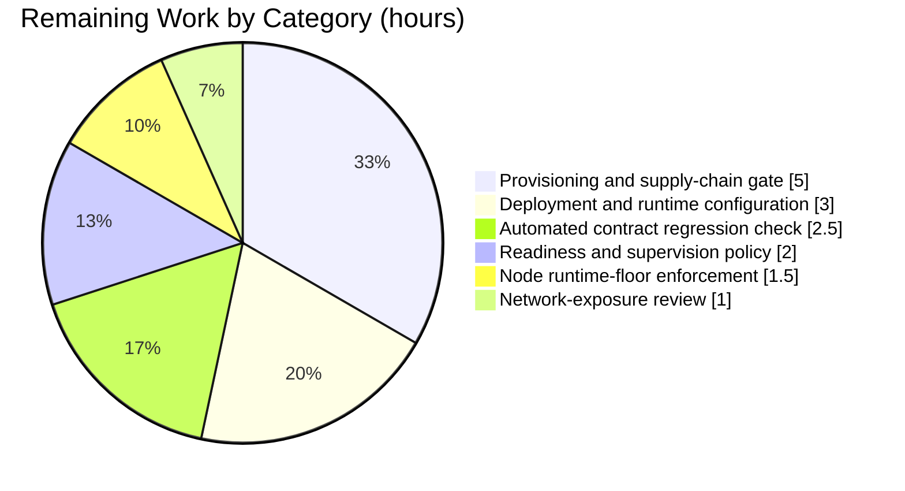
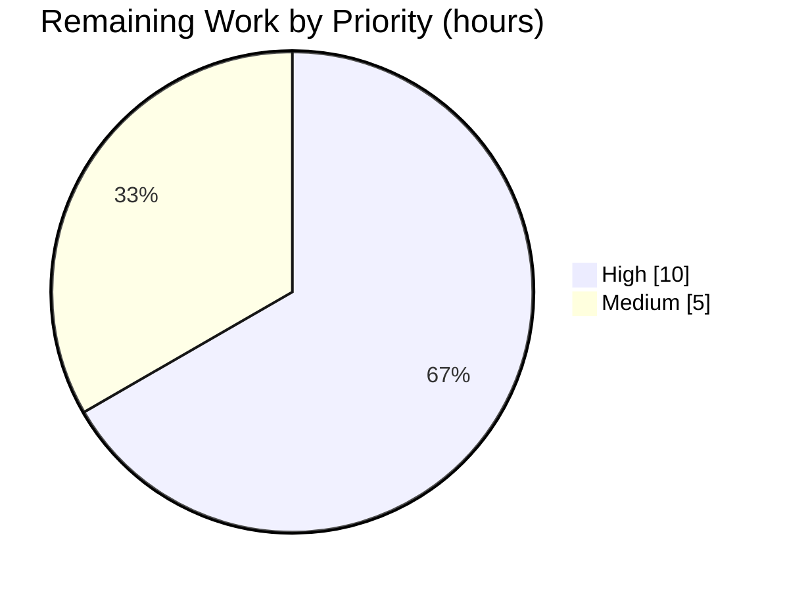

# 1. Executive Summary

## 1.1 Project Overview

`check_billing_sep_01` is a minimal Node.js HTTP greeting service. This work published a second endpoint, `GET /good-evening`, and moved routing onto Express while keeping the existing `GET /` response, the port-3000 bind and the startup message byte-for-byte identical. Its consumers call the two endpoints directly; the value is a second endpoint delivered with the smallest possible change. Technical scope is two files at the repository root: `server.js`, now five statements of Express routing, and a new three-field `package.json` declaring `express` as the project's first third-party dependency.

## 1.2 Completion Status



Chart colours: Completed = Dark Blue `#5B39F3`; Remaining = White `#FFFFFF`.

| Metric | Value |
|---|---|
| Total Hours | 36.5 |
| Completed Hours (AI + Manual) | 21.5 (21.5 AI + 0 Manual) |
| Remaining Hours | 15.0 |
| Percent Complete | **58.9%** (21.5 / 36.5 × 100) |

All 8 planned requirements are delivered and verified. The remaining 15.0 hours are path-to-production work — provisioning, deployment, supervision and regression coverage — outside the agreed two-file scope.

## 1.3 Key Accomplishments

- `GET /good-evening` answers `200` with `Good evening\n` (13 bytes) as `text/plain; charset=utf-8`, set by the handler rather than inferred (`server.js:4`).
- `GET /` still answers `200` with `Hello, World!\n` (14 bytes), byte-identical to before (`server.js:3`).
- `express` is the sole dependency at `^5.0.0` in a three-field manifest with no `type`, so `require` resolves.
- A clean checkout provisions and runs via `npm install --no-package-lock`, writing no lockfile.
- The listener binds the `3000` literal on the wildcard address and prints the original 41-byte startup line (`server.js:5`).
- A start against an occupied port exits `1` with `EADDRINUSE` rather than reporting success.
- Every excluded item stayed excluded: no lockfile, tests, middleware, hardening, documentation change or new module.

## 1.4 Critical Unresolved Issues

No scoped requirement is unmet — 0 of 8 (R1–R4, I1–I4). Eight residual items remain open: three need controls outside this repository, five are sanctioned absences. None is a defect in the delivered code.

| Issue | Impact | Owner | ETA |
|---|---|---|---|
| Dependency provisioning controls (3 items): installs are not byte-reproducible; the Node floor is undeclared; no advisory/signature gate runs per install | A later install of this same commit can resolve a different closure; an unsupported runtime can be selected with no repository-side signal | Platform / DevOps | 6.5 h |
| Process supervision and network exposure (2 items): no readiness or liveness endpoint and no graceful shutdown; the startup text advertises loopback while the bind is the wildcard address | Health must be gated on an external check, in-flight requests drop on stop, and reachability is wider than the log implies | DevOps / Security | 3.0 h |
| HTTP hardening posture (2 items): both routes are unauthenticated and the `200` responses carry no security headers (framework fingerprinting via `X-Powered-By`, weak `ETag`, default 404) | Safe while both routes return public constants; needs a decision before any route carries sensitive data or privilege | Security | Needs authorized scope |
| Automated regression coverage (1 item): no test exercises the route contract | Any future edit to `server.js` must be re-verified by hand | Engineering | 2.5 h |

## 1.5 Access Issues

No access issues identified. Repository read and write access is confirmed, the npm registry responds `HTTP 200`, and no credentials or secrets are needed.

| System/Resource | Type of Access | Issue Description | Resolution Status | Owner |
|---|---|---|---|---|
| Git repository (`origin`) | Read / write | None — refs list successfully and the branch is published | ✅ Verified | — |
| npm registry | Read (package download) | None — `registry.npmjs.org` returns `HTTP 200`; `npm install` completes with 0 vulnerabilities | ✅ Verified | — |
| Runtime host | Local execution | None — Node v22.23.2 and npm 11.18.0 are present and satisfy the framework's `node >= 18` floor | ✅ Verified | — |

## 1.6 Recommended Next Steps

1. **[High]** Stand up the external provisioning gate: capture the resolved closure per install, re-check advisories and signatures, and fail on drift (5.0 h).
2. **[High]** Configure the deployment runtime: process manager or container, port 3000 exposure, restart policy (3.0 h).
3. **[High]** Gate readiness on an external TCP/HTTP check rather than process output (2.0 h).
4. **[Medium]** Add assertions for the two contract rows and the startup line; this needs the no-test constraint relaxed (2.5 h).
5. **[Medium]** Enforce `node >= 18` in the deployment image and decide the wildcard bind's network exposure (2.5 h combined).

# 2. Project Hours Breakdown

## 2.1 Completed Work Detail

Every row traces to a specific planned requirement. Total matches Completed Hours in Section 1.2.

| Component | Hours | Description |
|---|---|---|
| [R2/I1/I2] Express adoption, manifest, CommonJS preservation | 2.5 | `express` declared at `^5.0.0` as the sole dependency in a three-field `package.json`; `type` deliberately omitted so `require('express')` keeps resolving; lockfile-free install path settled |
| [R1/I3] `GET /good-evening` with explicit media type | 1.5 | New route registered at `server.js:4`; `res.type('text/plain')` chained before `.send('Good evening\n')` so the media type is a property of the code rather than of framework inference |
| [R4] `GET /` preserved through the rewrite | 1.0 | Existing catch-all handler's body literal carried across to the `/` route registration at `server.js:3`, byte-for-byte |
| [I4] Bind, startup message and failure signalling | 3.0 | Port `3000` literal and the 41-byte startup string carried across with the host argument still omitted; the listener wired so the message is emitted only on a real bind and a failed bind exits non-zero |
| [0.5] Route-contract verification | 3.5 | Both contract rows verified byte-exact on the wire and in a real browser, including header sets, media types, conditional requests and framework-default handling of every other method and path |
| [0.4/I4] Lifecycle and robustness verification | 3.0 | Startup line, wildcard bind, restart determinism, concurrency, sustained load, malformed-input battery and shutdown behaviour exercised against the running service |
| [0.3] Provisioning and module-resolution verification | 2.5 | Clean-checkout install proven sufficient; lockfile absence, CommonJS negative controls and configuration-by-literal (no environment override) all exercised |
| [Security] Supply-chain and HTTP surface assessment | 3.0 | Dependency closure assessed for advisories, authenticity and install-time execution; the running surface probed for exposure, traversal, injection, header injection and disclosure |
| [0.1.2/0.7.2] Directive and exclusion compliance | 1.5 | The eight binding directives and seven exclusion groups checked against the tree: no lockfile, no tests, no hardening, no documentation change, no new module, range untouched |
| **Total** | **21.5** | |

## 2.2 Remaining Work Detail

Every row is path-to-production work required to deploy the delivered service. Total matches Remaining Hours in Section 1.2 and the pie chart in Section 7.

| Category | Hours | Priority |
|---|---|---|
| External provisioning and supply-chain gate — per-install SBOM capture, advisory re-check and registry-signature verification, failing on drift | 5.0 | High |
| Deployment and runtime configuration — process manager or container, port 3000 exposure, restart policy | 3.0 | High |
| Readiness/liveness check and supervision policy — external TCP/HTTP probe in place of the absent health endpoint | 2.0 | High |
| Automated route-contract regression check — assertions for both rows and the startup line; requires relaxing the no-test constraint | 2.5 | Medium |
| Node runtime-floor enforcement — pin `node >= 18` (Node 22 line) in the deployment image or CI matrix | 1.5 | Medium |
| Network-exposure review and sign-off — decide and scope the wildcard bind before untrusted-network exposure | 1.0 | Medium |
| **Total** | **15.0** | |

## 2.3 Hours Calculation

```
Completed Hours  = 2.5 + 1.5 + 1.0 + 3.0 + 3.5 + 3.0 + 2.5 + 3.0 + 1.5 = 21.5
Remaining Hours  = 5.0 + 3.0 + 2.0 + 2.5 + 1.5 + 1.0               = 15.0
Total Hours      = 21.5 + 15.0                                      = 36.5
Percent Complete = 21.5 / 36.5 × 100                                = 58.9%
```

Confidence is **high** on the completed figures: the scope is two files, and every requirement was verified against the built tree and the running service. Confidence is **medium** on the remaining figures, because the provisioning-gate and deployment rows depend on hosting and platform choices the owner has not yet made; a container-based target sits at the lower end of those estimates and a bespoke CI pipeline at the upper end.

# 3. Test Results

The repository contains no test framework and no test files: `npm test` exits `1` with `Missing script: "test"` and `node --test` exits `0` reporting `# tests 0 / # fail 0`. Verification is therefore an executed command battery run against the built tree and the running service, which is the acceptance mechanism the plan prescribes. Every figure below is from a run executed against the current branch tip on `node v22.23.2` / `npm 11.18.0` / `express 5.2.1`, with port-3000 runs serialized under an advisory lock.

| Area / Category | Framework | Tests | Passed | Failed | Coverage | What This Proves |
|---|---|---|---|---|---|---|
| Static gate, manifest shape and provisioning | `node --check`, `npm`, Node loader | 25 | 25 | 0 | n/a | The tree compiles, the manifest is exactly three fields with no `type`, `express@5.2.1` resolves under CommonJS, a clean install produces no lockfile and reports 0 vulnerabilities, and every excluded artifact is absent |
| Route contract — `GET /` and `GET /good-evening` | `curl` + `cmp` byte comparison | 10 | 10 | 0 | n/a | Both published endpoints return the exact agreed status, media type and byte count, and neither is affected by query input |
| Response-header and caching posture | `curl` header capture | 5 | 5 | 0 | n/a | The sanctioned framework headers are present and unsuppressed, the weak `ETag` revalidates to `304`, and no security or authentication header was silently introduced |
| Startup signalling and listener bind | Process capture + `/proc/net/tcp6` | 7 | 7 | 0 | n/a | The service prints the original 41-byte startup line exactly once with a clean stderr and holds a single wildcard LISTEN socket on port 3000 |
| Framework-default request handling | `curl` method × path sweep | 8 | 8 | 0 | n/a | Unmatched paths and methods answer `404`, `OPTIONS` answers `200` with `Allow: GET, HEAD`, `HEAD` returns headers with an empty body, and no request produces a `5xx` |
| Load, malformed input and exposure probes | `curl` (50 parallel, 100 sequential), raw socket | 12 | 12 | 0 | n/a | Concurrent and sustained traffic returns one identical body with zero non-`200` responses and no log growth; malformed escapes, an 8,000-character URL, traversal and source-file probes answer client-visibly with no file content leaked; a raw bad request line answers `400` and both routes stay byte-exact |
| Bind failure, shutdown and restart | Process lifecycle capture | 11 | 11 | 0 | n/a | A start against an occupied port exits `1` with `EADDRINUSE` and prints no success line while the incumbent is untouched; `SIGTERM` exits `143`, releases the port immediately, and a restart is byte-identical |
| **Total** | | **78** | **78** | **0** | **n/a** | |

Coverage is not measurable for this project: there is no test suite to instrument and no coverage tooling is installed or permitted.

### Not Covered

- **No automated test exercises the delivered contract.** The two route rows, the media types and the startup line are verified only by the executed battery above; nothing in the repository will re-verify them on a future change. A human should add assertions for `GET /` (200 / `text/html; charset=utf-8` / 14 bytes), `GET /good-evening` (200 / `text/plain; charset=utf-8` / 13 bytes) and the startup line before the next edit to `server.js` — this requires relaxing the constraint that currently forbids test files.
- **No test exercises the service behind a proxy or load balancer.** All verification dialled the listener directly on `127.0.0.1` and on the host's non-loopback addresses. Header rewriting, path normalisation and trailing-slash handling at an edge are untested, and the framework's default case-insensitive, trailing-slash-tolerant matching means `/Good-Evening` and `/good-evening/` also answer `200` — confirm this is acceptable before fronting the service.
- **No test covers the service over IPv6 loopback.** The listener is an IPv6 wildcard socket, but this host has no IPv6 address configured, so `[::1]` could not be dialled. Verify on a dual-stack host if IPv6 clients are expected.
- **No sustained soak or performance baseline exists.** Load verification was short bursts (50 parallel, 100 sequential) sufficient to prove correctness under concurrency, not a throughput or latency baseline. Establish one if the service will carry real traffic.

# 4. Runtime Validation &amp; UI Verification

Every line below was observed against the running service on the current branch tip.

- ✅ **Operational — Service start-up.** `node server.js` prints `Server running at http://127.0.0.1:3000/` (41 bytes, one line, stderr empty) and holds exactly one IPv6 wildcard LISTEN socket on port 3000.
- ✅ **Operational — `GET /`.** `200`, `Content-Type: text/html; charset=utf-8`, `Content-Length: 14`, body byte-identical to `Hello, World!\n`.
- ✅ **Operational — `GET /good-evening`.** `200`, `Content-Type: text/plain; charset=utf-8`, `Content-Length: 13`, body byte-identical to `Good evening\n`; the media type survives an `Accept: text/html` request, confirming it is set rather than inferred.
- ✅ **Operational — Framework-default handling.** `/nope`, `POST /` and `PUT /good-evening` answer `404`; `OPTIONS /` answers `200` with `Allow: GET, HEAD`; `HEAD /` answers `200` with headers and no body; a 15-cell method × path sweep produced only `200` and `404`, never a `5xx`.
- ✅ **Operational — Caching and conditional requests.** The weak `ETag` on `/` is stable across requests and an `If-None-Match` round trip returns `304` with a zero-byte body.
- ✅ **Operational — Bind-failure signalling.** A second start against the occupied port exits `1`, prints no startup line and emits `Error: listen EADDRINUSE: address already in use :::3000`; the incumbent stays alive, keeps its single socket and still answers `200`.
- ✅ **Operational — Shutdown and restart.** `SIGTERM` exits `143`, the port is released immediately (subsequent connections refused, zero LISTEN rows), and a restart reproduces the startup line and both bodies byte-identically.
- ✅ **Operational — Concurrency, load and log silence.** 50 parallel requests to `/good-evening` returned one distinct 13-byte body; 100 sequential requests to `/` produced zero non-`200` responses; the process log stayed at exactly 41 bytes throughout, confirming no request logging was added.
- ✅ **Operational — Robustness and exposure.** A malformed percent escape, an 8,000-character URL, a traversal path and a probe for `/package.json` all answered `404` with no file content returned; a raw malformed request line answered `400 Bad Request`; the process survived every case and both routes remained byte-exact afterwards.
- ✅ **Operational — Dependency provisioning at runtime.** `npm install --no-package-lock` from the committed manifest resolves `express@5.2.1`, reports 0 vulnerabilities and writes no lockfile; the service then boots and serves both routes. A run with no installed tree fails loudly with `MODULE_NOT_FOUND`.

**Not exercised at runtime.** There is no user interface, no client application, no stylesheet and no asset pipeline in this project, so there is no UI to verify; browser checks were used only to confirm rendering behaviour — `/` renders in a serif face as HTML while `/good-evening` renders in the browser's monospace plain-text viewer, which independently corroborates the two media types. There is no authentication flow to drive, because both routes are public by design and no credential, session or challenge exists anywhere in the service. There are no external integrations, no database and no outbound calls, so none was exercised. Behaviour behind a reverse proxy or load balancer, over IPv6 loopback, and under sustained soak load was not exercised (see Section 3, Not Covered).

# 5. Compliance &amp; Quality Review

## 5.1 Compliance Matrix

Each row records where the deliverable stands now.

| # | Deliverable / Benchmark | Status | Evidence | Progress |
|---|---|---|---|---|
| 1 | R1 — `GET /good-evening` returns `200` with `Good evening\n` (13 bytes) as `text/plain` | ✅ Pass | `server.js:4`; observed `200 / text/plain; charset=utf-8 / 13 bytes`, body byte-exact | ▰▰▰▰▰ 100% |
| 2 | R2 — `express` is the sole new dependency at `^5.0.0` | ✅ Pass | `package.json:5`, `server.js:1`; dependency tree shows the single child `express@5.2.1` | ▰▰▰▰▰ 100% |
| 3 | R3 — `server.js` is the only application file changed | ✅ Pass | Branch diff is exactly `A package.json`, `M server.js` — 2 files, 12 insertions, 1 deletion | ▰▰▰▰▰ 100% |
| 4 | R4 — `GET /` preserved at `200` with `Hello, World!\n` (14 bytes) | ✅ Pass | `server.js:3`; body byte-identical to the pre-change service | ▰▰▰▰▰ 100% |
| 5 | I1 — A manifest exists and provisions the dependency from a clean checkout | ✅ Pass | `package.json` (7 lines, 108 bytes); clean install succeeds and the service then serves both routes | ▰▰▰▰▰ 100% |
| 6 | I2 — CommonJS resolution survives (`type` unset) | ✅ Pass | `'type' in package.json` is `false`; `require('express')` returns a function; adding `type: module` breaks the boot, proving the omission is load-bearing | ▰▰▰▰▰ 100% |
| 7 | I3 — `text/plain` set explicitly, not inferred | ✅ Pass | `server.js:4` chains `res.type('text/plain')` before `.send`; `/` by contrast returns the inferred `text/html` | ▰▰▰▰▰ 100% |
| 8 | I4 — `3000` literal and startup-message literal preserved, host omitted | ✅ Pass | `server.js:5`; 41-byte startup line byte-exact, wildcard LISTEN socket on port 3000 | ▰▰▰▰▰ 100% |
| 9 | Contract completeness — unspecified methods and paths left to framework defaults | ✅ Pass | Method × path sweep returns only `200`/`404`; `OPTIONS` auto-answers `Allow: GET, HEAD`; no `5xx` reachable | ▰▰▰▰▰ 100% |
| 10 | Exclusion groups — lockfiles, tests, hardening, documentation, new modules, extra dependencies, refactoring | ✅ Pass | All five lockfile names plus `.npmrc`, `.nvmrc` and `.gitignore` absent; 0 test files; hardening pattern sweep returns 0 matches; `README.md` byte-unchanged; no tracked directory exists | ▰▰▰▰▰ 100% |
| 11 | Code quality and minimal-diff discipline | ✅ Pass | One deleted line, five inserted, single hunk with the compact source style preserved; no credential or token; neither handler reads `req`; no `require('http')` remnant, `process.env` read, `TODO`/`FIXME`, stub or commented-out code; no injection, traversal or deserialization sink exists | ▰▰▰▰▰ 100% |
| 12 | Regression coverage, provisioning reproducibility and runtime-floor declaration | ⚠️ Absent by agreement | 0 test files and `npm test` exits `1`; no lockfile and no `engines`/`.nvmrc`. The contract is verified by executed battery instead (Section 3), and the treatments for the other two must live outside the repository (Section 2.2) | ▱▱▱▱▱ 0% |

## 5.2 AAP &amp; Rule Divergences and Gaps

No user-specified rules were supplied for this project, so no rule could be violated; the binding constraints are the directives stated in the plan itself. Seven divergences and gaps were identified. Every one is sanctioned — either by the plan's own normative text or by a directive the user stated explicitly — and none is an unauthorised deviation.

| What the AAP/Rule Required | What Was Delivered Instead | Why It Diverged | Impact | Remediation |
|---|---|---|---|---|
| **D1 (Sanctioned).** The plan's illustrative snippet shows the listener as `app.listen(3000,()=>console.log(…))` | `app.listen(3000).on('listening',()=>console.log(…))` (`server.js:5`) | With the snippet form a failed bind prints the success line and exits `0`; the plan's normative I4 text permits the call to change form and freezes only the two literals, both of which are preserved | None adverse — successful starts are byte-identical, and a failed bind exits `1` with `EADDRINUSE` | None. Restoring the snippet form restores the misleading start signal |
| **D2 (Sanctioned).** No lockfile may be created or committed, and the `^5.0.0` range may not be pinned | `package.json:5` keeps the unpinned caret range with no lockfile, so installs are not byte-reproducible | Both in-repository fixes are forbidden by name: all five lockfile names are excluded, and pinning the range is excluded | A later install of this same commit can resolve a different closure; today's clean advisory verdict has a short shelf life | External provisioning gate recording the SBOM and re-checking advisories per install (5.0 h) |
| **D3 (Sanctioned).** The manifest carries only `name`, `version` and `dependencies`; no `.nvmrc` | Nothing in the repository states the framework's `node >= 18` floor | `engines` is excluded by the three-field manifest directive and `.nvmrc` is excluded by name | A deployment can select an unsupported runtime with no repository-side signal; not a present failure on Node 22 | Enforce `node >= 18` externally in the deployment image or CI matrix (1.5 h) |
| **D4 (Sanctioned).** No `scripts`, no documentation change, no CI or configuration file | The new install prerequisite arrives with no repository-owned signature, provenance or advisory gate, and `README.md` does not mention it | All three possible homes for such a gate — `scripts`, documentation, CI — are closed by directive | Every clean checkout contacts the registry and trusts the closure selected at that moment | External provisioning policy running advisory and registry-signature checks per install (part of the 5.0 h above) |
| **D5 (Sanctioned).** Accept the framework's response-header defaults and add no 404 handler, error handler, security headers, auth model or middleware | `X-Powered-By: Express` and a weak `ETag` on both `200` responses, no security headers on `200`s, the framework's default 404 echoing the requested path, no error handler or production-mode configuration, automatic `OPTIONS` enumeration, and both routes unauthenticated (`server.js:2`–`5`) | Every one of these additions is excluded by name; writing any of them would have broken the agreed scope | Low-grade fingerprinting and method enumeration; safe while both routes return public constants and reach no data, state or privilege | Requires a newly authorized hardening scope; do not apply piecemeal today |
| **D6 (Sanctioned).** No test suite, test file, fixture or test script; acceptance is the contract read against the diff | 0 test files; `npm test` exits `1` with `Missing script: "test"` | The plan makes diff review against the contract table the acceptance criterion and excludes tests by name | No automated safety net for future edits to `server.js` | Add contract assertions once the no-test constraint is relaxed (2.5 h) |
| **D7 (Sanctioned).** Adding a registry dependency ends the property that a clean checkout runs with nothing installed | `node server.js` now requires `npm install --no-package-lock` first; without an installed tree it exits `1` with `MODULE_NOT_FOUND` | The plan adopts this cost deliberately and carries no install script, because `scripts` is an excluded field | A checkout is no longer immediately runnable, and nothing in the repository advertises the prerequisite | Carry the install step in the deployment configuration (part of the 3.0 h deployment row) |

**D1 — listen-call form.** The plan's implementation snippet passes a callback directly to `app.listen`. Express 5 registers that single function as both the `listening` callback and an internal `error` handler, so under the snippet form a failed bind invokes the callback, prints the 41-byte success line and exits `0`. The delivered line passes no function and chains `.on('listening', …)` on the returned server (`server.js:5`). That removes the implicit error listener rather than adding one, so the exclusion of `error` listeners still holds, and both frozen literals are character-identical to the pre-change source. Observed behaviour: an occupied port yields exit `1` with `EADDRINUSE` and no output. Reverting this line would restore the misleading signal.

**D2 — lockfile-free caret range.** `package.json:5` declares `"express": "^5.0.0"` and the repository deliberately carries no lockfile, so nothing records which executable code a given commit installs. The closure measured here is 68 installation entries across 66 unique `name@version` pairs, with `express@5.2.1` direct and npm reporting 0 vulnerabilities; a fresh install can legitimately resolve a different set, and the installed framework itself declares 28 dependencies all as caret ranges. Both in-repository fixes are forbidden by name, so the treatment is an external gate that records the resolved closure per install and fails on drift. The owner may instead relax the no-lockfile constraint, at which point committing `package-lock.json` and deploying with `npm ci` becomes the simpler answer.

**D3 — undeclared runtime floor.** The installed framework declares `engines: { node: ">= 18" }`, but the repository states no floor anywhere: the manifest is fixed at three fields with `engines` excluded, and `.nvmrc` is excluded by name. This is a portability exposure rather than a present failure — verification ran on `node v22.23.2`, comfortably above the floor. The action is to pin the runtime outside the repository, in the deployment image, runtime manager or CI matrix, at `node >= 18` and preferably on the Node 22 line that was verified. Do not add `engines` or `.nvmrc` while the three-field constraint stands; doing so would be a scope violation rather than an improvement.

**D4 — no provisioning integrity gate.** Adding the first registry dependency introduced an install step that nothing in the repository verifies. There is no `scripts` key, so no install hook can run; there is no `.npmrc`, `.github`, `Makefile` or `Dockerfile`; and `README.md` is byte-frozen, so the prerequisite is undocumented. The closure as installed here is clean — zero `preinstall`/`install`/`postinstall` hooks anywhere in it, no native build artifacts, no symlinks, and no closure file containing `child_process` or `eval` — but that is a point-in-time measurement, not an operating control. A platform-side policy should run the mandated install, record the tree, check advisories and verify registry signatures on every provisioning run.

**D5 — HTTP posture accepted rather than hardened.** The delivered surface carries the framework's defaults: `X-Powered-By: Express` and a weak `ETag` on both `200` responses, no security headers on those responses, the default 404 page that echoes the requested path, automatic `OPTIONS` answering `Allow: GET, HEAD`, no error handler or production-mode configuration, and no authentication on either route (`server.js:2`–`5`). Every one of these additions is excluded by name. Exploitability today is minimal: neither handler reads the request, both send fixed public strings, and probing found no reachable `5xx`, no file exposure and no injection path. The decision a human must make is when to authorize hardening — before any route gains sensitive data, privilege, or logic that can throw.

**D6 — no automated coverage of the contract.** The plan makes the contract table itself the acceptance criterion and excludes any test suite, file, fixture or script. The repository accordingly holds 0 test files; `npm test` exits `1` with `Missing script: "test"` and `node --test` finds nothing to run. The contract is nevertheless verified — 78 executed checks against the built tree and the running service, all passing (Section 3) — but that verification is not repeatable by the repository itself. The consequence is that the next edit to `server.js` has no automated safety net. Adding three assertions (both contract rows and the startup line) closes the gap and requires the owner to relax the no-test constraint first.

**D7 — clean checkout no longer immediately runnable.** Before this change the service ran with nothing installed, because its only import was a runtime built-in. It now depends on `express`, so `node server.js` requires `npm install --no-package-lock` first; without an installed tree it exits `1` with `Error: Cannot find module 'express'`. The plan adopts this cost explicitly and forbids carrying it in an install script, because `scripts` is an excluded manifest field, or in documentation, because `README.md` is frozen. The practical effect is that the install step must live in whatever runs the service. Fold it into the deployment configuration alongside the port exposure and restart policy.

# 6. Risk Assessment

These are forward-looking exposures for the service as delivered.

| Risk | Category | Severity | Probability | Mitigation | Status |
|---|---|---|---|---|---|
| A reinstall of this unchanged commit resolves a different dependency closure, because the range is a caret and no lockfile exists | Technical / Supply chain | Medium | High | External gate that records the resolved closure per install and fails on drift; baseline to compare is 68 entries / 66 unique `name@version` with `express@5.2.1` and 0 advisories. Committing a lockfile and using `npm ci` becomes available only if the no-lockfile constraint is relaxed | Open — accepted in the repository |
| A deployment selects an unsupported Node runtime, since nothing in the repository declares the framework's `node >= 18` floor | Operational | Medium | Medium | Pin and enforce `node >= 18`, preferably the Node 22 line, in the deployment image, runtime manager or CI matrix | Open — accepted in the repository |
| A tampered or newly vulnerable package enters through the install, which nothing in the repository verifies | Security | Low | Medium | Platform policy running advisory checks and registry-signature verification on every provisioning run | Open |
| Supervision misreads service health, or a stop drops in-flight requests, because there is no readiness/liveness endpoint and no graceful shutdown | Operational | Medium | Medium | Gate readiness on an external TCP/HTTP probe against port 3000 and accept abrupt termination (`SIGTERM` exits `143`, port released immediately); configure the restart policy accordingly | Accepted by design |
| The service is reachable more widely than expected, because the listener binds the wildcard address while the startup text advertises `127.0.0.1` | Security / Operational | Medium | Medium | Scope exposure with network policy or a reverse proxy before any untrusted network; never read reachability from the startup text | Accepted by design |
| An added or changed route inherits the current model — unauthenticated, no security headers on `200`s, framework fingerprinting via `X-Powered-By`, weak `ETag` and the default 404 that echoes the path | Security | Low | Low | Authorize a hardening scope and introduce an authentication model *before* any route carries sensitive data or performs a privileged action | Accepted by design |
| Error responses begin leaking internal detail once any throwing logic is added, since there is no error handler and no production-mode configuration | Security | Low now, escalating on change | Low | Add a sanitized error handler and run with `NODE_ENV=production` as part of the first scope that introduces I/O, parsing or business logic | Accepted by design |
| A future edit to `server.js` silently breaks a contract row, because nothing in the repository re-verifies the two endpoints | Technical | Medium | Medium | Add assertions for both contract rows and the startup line once the no-test constraint is relaxed; until then re-verify by hand using the commands in Section 9 | Open |

# 7. Visual Project Status

**Overall progress — 58.9% complete (21.5 of 36.5 hours).** Completed = Dark Blue `#5B39F3`; Remaining = White `#FFFFFF`.



**Remaining hours by category** (sums to the 15.0 hours in Sections 1.2 and 2.2):



**Remaining work by priority:**



**Delivered scope at a glance:**

| Dimension | Value |
|---|---|
| Planned requirements delivered and verified | 8 of 8 |
| Application files changed | 1 (`server.js`) plus 1 created manifest (`package.json`) |
| Net source change on the branch | 2 files, 12 insertions, 1 deletion |
| Published endpoints | 2 (`GET /`, `GET /good-evening`) |
| Verification checks executed | 78 executed, 78 passed, 0 failed |
| Residual items open | 8 (3 needing controls outside the repository, 5 sanctioned absences) |

# 8. Summary &amp; Recommendations

**What was delivered and verified.** The service now publishes two endpoints through Express. `GET /good-evening` answers `200` with `Good evening\n` — 13 bytes with `Content-Type: text/plain; charset=utf-8` set by the handler rather than inferred by the framework — and `GET /` still answers `200` with `Hello, World!\n`, byte-identical to the service that existed before. Routing lives in five statements in `server.js`, and a new three-field `package.json` declares `express` at `^5.0.0` with no `type` field, so the file keeps resolving as CommonJS. The listener binds the same `3000` literal on the same wildcard address and prints the same 41-byte startup message. All 8 planned requirements pass, and 78 executed verification checks against the built tree and the running service passed with none failing: both contract rows byte-exact, the framework's default handling of every other method and path producing only `200` and `404`, concurrency and malformed-input batteries survived intact, and deterministic restart with immediate port release.

**Where the gaps are.** The project is **58.9% complete** (21.5 of 36.5 hours) — all of the feature scope, none of the path to production. Four things are missing and none of them is a code defect. There is no provisioning control: the caret range and absent lockfile mean a reinstall of this same commit can resolve a different closure, and nothing verifies advisories or registry signatures at install time. There is no runtime-floor declaration, so a deployment can select a Node below the framework's `node >= 18` requirement with no repository-side signal. There is no readiness or liveness endpoint and no graceful shutdown, so health has to be judged from outside the process and a stop drops in-flight requests. And nothing in the repository re-verifies the contract, so the next edit to `server.js` has no automated safety net. Separately, the service is reachable on every host address while its startup text advertises loopback — a fact to decide about, not a bug, since preserving both was required.

**Critical path to production.** Three High-priority items, 10 of the 15 remaining hours, stand between this branch and a supportable deployment: the external provisioning gate that records the resolved closure and re-checks advisories per install (5.0 h), the runtime configuration that carries the install step, exposes port 3000 and sets a restart policy (3.0 h), and the external readiness probe that replaces the absent health endpoint (2.0 h). The remaining 5.0 hours — contract assertions, runtime-floor enforcement, and the network-exposure decision — can follow in parallel. Note that the contract assertions and any hardening require the owner to relax constraints the current scope imposes; they are decisions, not oversights.

**Success metrics.** Treat the deployment as good when: both endpoints return their exact agreed status, media type and byte count from the deployed host; the startup line appears exactly once per boot and a failed bind produces a non-zero exit rather than a success message; the install used in deployment writes no lockfile and reports zero advisories against a recorded baseline; and an external probe, not process output, drives readiness. The four observable values to assert are `200`/`text/html; charset=utf-8`/14 bytes on `/`, and `200`/`text/plain; charset=utf-8`/13 bytes on `/good-evening`.

**Production readiness.** The delivered code is **ready for the scope that was authorized** and is not yet ready to run unattended. The application surface is sound: no exploitable path was found, no file content or internal detail leaks, no `5xx` is reachable, no request writes a log line, and both endpoints survived every adversarial and load case with their bodies intact. What is not ready is everything around the process — provisioning, supervision, runtime pinning and network scoping. Complete the three High-priority items before first production traffic, and make the hardening and authentication decision before any endpoint is added that touches data, credentials or privilege, because the current public, header-free model is safe only for the two fixed public strings it serves today.

# 9. Development Guide

Every command below was executed against this repository and the quoted output is what it produced. Run all of them from the repository root.

## 9.1 System Prerequisites

| Requirement | Verified value | Notes |
|---|---|---|
| Node.js | `v22.23.2` | The framework declares `node >= 18`. Nothing in the repository pins a version — no `engines`, no `.nvmrc` — so the host runtime governs |
| npm | `11.18.0` | Used only to provision the dependency |
| Operating system | Linux (Ubuntu container verified) | No platform-specific code |
| Free TCP port | `3000` | Hardcoded literal in `server.js:5`; there is no supported override, so `PORT`/`HOST` environment variables have no effect |
| Database / services / credentials | None | No database, container, message queue, API key or environment variable is required |

```bash
node -v        # v22.23.2
npm -v         # 11.18.0
```

## 9.2 Environment Setup

No environment variables, secrets or `.env` file are used or supported. Configuration is by source literal: the port and the startup message are literals in `server.js`, and setting `PORT`, `HOST` or `NODE_ENV` changes nothing observable.

```bash
cd /path/to/check_billing_sep_01
ls            # README.md  package.json  server.js
```

## 9.3 Dependency Installation

```bash
npm install --no-package-lock
```

Observed output ends with `found 0 vulnerabilities`, and no lockfile is written.

- **Always pass `--no-package-lock`.** A plain `npm install` writes a `package-lock.json` (observed at 31,050 bytes), which this project's agreed scope forbids. If one appears, delete it. Do not create an `.npmrc` to configure this — it is a command flag only.
- `node_modules/` is per-checkout and is never committed. There is no `.gitignore`, so `node_modules/` always shows as untracked in `git status`. **Never run `git add -A` or `git add .`** — stage explicit paths.

## 9.4 Build / Compile

There is no build system and nothing to bundle or transpile. The compile equivalent is a syntax check:

```bash
node --check server.js                                            # exit 0, no output
node -e "console.log(Object.keys(require('./package.json')))"     # [ 'name', 'version', 'dependencies' ]
node -e "console.log(require('express/package.json').version)"    # 5.2.1
```

## 9.5 Application Startup

```bash
node server.js
# Server running at http://127.0.0.1:3000/
```

The process runs in the foreground; `Ctrl-C` or `SIGTERM` stops it (exit status `143`, port released immediately). The startup line is exactly 41 bytes and is printed only on a successful bind.

To run it detached while you verify it:

```bash
LOG=$(mktemp)
node server.js > "$LOG" 2>&1 &
pid=$!
sleep 2
cat "$LOG"               # Server running at http://127.0.0.1:3000/
# ... run the checks in 9.6 ...
kill "$pid"
rm -f "$LOG"
```

Port 3000 is a literal and cannot be moved, so serialize runs on a shared host with an advisory lock. Point `PORT_LOCK` at one agreed lock path that every runner uses:

```bash
export PORT_LOCK=./.port-3000.lock     # or any fixed path outside the checkout
flock "$PORT_LOCK" -c 'node server.js > /dev/null 2>&1 & p=$!; sleep 2; curl -si http://127.0.0.1:3000/ | head -1; kill $p'
# HTTP/1.1 200 OK
```

## 9.6 Verification Steps

```bash
# GET / — expect 200, text/html; charset=utf-8, 14 bytes
curl -s -o /dev/null -w 'status=%{http_code} ct=%{content_type} size=%{size_download}\n' http://127.0.0.1:3000/
# status=200 ct=text/html; charset=utf-8 size=14

# GET /good-evening — expect 200, text/plain; charset=utf-8, 13 bytes
curl -s -o /dev/null -w 'status=%{http_code} ct=%{content_type} size=%{size_download}\n' http://127.0.0.1:3000/good-evening
# status=200 ct=text/plain; charset=utf-8 size=13

# Byte-exact body comparison
EXP_ROOT=$(mktemp); printf 'Hello, World!\n' > "$EXP_ROOT"
EXP_GE=$(mktemp);   printf 'Good evening\n'  > "$EXP_GE"
curl -s http://127.0.0.1:3000/             | cmp - "$EXP_ROOT" && echo root-ok
curl -s http://127.0.0.1:3000/good-evening | cmp - "$EXP_GE"   && echo evening-ok
rm -f "$EXP_ROOT" "$EXP_GE"

# Framework defaults
curl -s -o /dev/null -w '%{http_code}\n' http://127.0.0.1:3000/nope          # 404
curl -s -o /dev/null -w '%{http_code}\n' -X POST http://127.0.0.1:3000/      # 404
curl -si -X OPTIONS http://127.0.0.1:3000/ | grep -i '^allow:'               # Allow: GET, HEAD
```

The host used for verification has no `ss`, `netstat`, `lsof`, `fuser` or `nc`. Check port 3000 occupancy without them:

```bash
python3 -c "
for f in ('/proc/net/tcp','/proc/net/tcp6'):
    for l in open(f).read().splitlines()[1:]:
        p = l.split()
        if p[3] == '0A' and int(p[1].split(':')[1], 16) == 3000:
            print('LISTEN on 3000:', p[1])
"
```

## 9.7 Example Usage

```bash
$ curl -i http://127.0.0.1:3000/good-evening
HTTP/1.1 200 OK
X-Powered-By: Express
Content-Type: text/plain; charset=utf-8
Content-Length: 13
ETag: W/"d-7fFyiNLFhmJrNT+BforqesSHNow"
Connection: keep-alive
Keep-Alive: timeout=5

Good evening
```

The `X-Powered-By` and `ETag` headers are framework defaults that the agreed scope deliberately keeps. A conditional request revalidates:

```bash
curl -s -o /dev/null -w '%{http_code}\n' -H 'If-None-Match: W/"d-7fFyiNLFhmJrNT+BforqesSHNow"' http://127.0.0.1:3000/good-evening
# 304
```

## 9.8 Troubleshooting

| Symptom (exact output) | Cause | Resolution |
|---|---|---|
| `Error: Cannot find module 'express'` with `code: 'MODULE_NOT_FOUND'`, exit `1` | Dependencies not provisioned in this checkout | Run `npm install --no-package-lock` from the repository root |
| `ReferenceError: require is not defined in ES module scope, you can use import instead`, exit `1` | A `type` field was added to `package.json`; the file is being treated as an ES module | Remove the `type` field. Its omission is load-bearing and the manifest is fixed at three fields |
| `Error: listen EADDRINUSE: address already in use :::3000`, exit `1`, no startup line printed | Port 3000 is already held | Stop the incumbent (`kill` the pid you started) or serialize under the advisory lock shown in 9.5. A failed start signals failure rather than printing the success message |
| `npm error Missing script: "test"`; `node --test` prints `# tests 0 / # fail 0` | Expected — the repository has no test suite and the agreed scope forbids adding one | Use the verification commands in 9.6. Adding tests requires relaxing that constraint first |
| `npm error audit Original error: loadVirtual requires existing shrinkwrap file` | Expected — `npm audit` needs a lockfile and this project has none | Read the audit verdict from `npm install`'s own output, or run `npm audit` against a lockfile generated in a scratch copy outside this repository |
| `package-lock.json` appears in `git status` | A flagless `npm install` wrote it | Delete it and re-run with `--no-package-lock` |
| `code: 'ERR_INVALID_PACKAGE_CONFIG'`, exit `1` | `package.json` is not valid JSON | Validate with `node -e "JSON.parse(require('fs').readFileSync('package.json','utf8'))"` and restore the three-field manifest |
| The startup line says `127.0.0.1` but the service answers on a LAN address | Expected — the host argument is omitted, so the bind is the wildcard address; both the message and the omission were required to stay unchanged | Judge reachability from the listener, not the message. Scope exposure with network policy or a reverse proxy |

# 10. Appendices

## A. Command Reference

| Purpose | Command |
|---|---|
| Provision dependencies | `npm install --no-package-lock` |
| Syntax check (the compile equivalent) | `node --check server.js` |
| Validate the manifest | `node -e "JSON.parse(require('fs').readFileSync('package.json','utf8'))"` |
| Show manifest keys | `node -e "console.log(Object.keys(require('./package.json')))"` |
| Show installed framework version | `node -e "console.log(require('express/package.json').version)"` |
| List direct dependencies | `npm ls --depth=0` |
| Start the service | `node server.js` |
| Start detached and capture output | `LOG=$(mktemp); node server.js > "$LOG" 2>&1 & pid=$!` |
| Serialize a port-3000 run | `flock "$PORT_LOCK" -c '<commands>'` |
| Check a route | `curl -s -o /dev/null -w 'status=%{http_code} ct=%{content_type} size=%{size_download}\n' http://127.0.0.1:3000/good-evening` |
| Byte-compare a body | `EXP=$(mktemp); printf 'Good evening\n' > "$EXP"; curl -s http://127.0.0.1:3000/good-evening \| cmp - "$EXP"` |
| Inspect the listener without `ss`/`lsof` | `grep -i ':0BB8' /proc/net/tcp /proc/net/tcp6` (LISTEN is state `0A`) |
| Stop the service | `kill "$pid"` (exit status `143`) |
| Branch change summary | `git diff --stat origin/1909_02_run_02...HEAD` |

## B. Port Reference

| Port | Service | Configurable | Notes |
|---|---|---|---|
| 3000 | HTTP listener | No | Hardcoded numeric literal in `server.js:5`; environment-variable port configuration is out of scope. The bind omits the host argument, so it is the wildcard address — reachable on loopback and on every host address, not only `127.0.0.1` as the startup message says |

## C. Key File Locations

| Path | Role |
|---|---|
| `server.js` | The entire application — 5 statements, 289 bytes: the framework require, the app instance, both route registrations, and the listen call with its startup message |
| `server.js:3` | `GET /` handler — `res.send('Hello, World!\n')` |
| `server.js:4` | `GET /good-evening` handler — `res.type('text/plain').send('Good evening\n')` |
| `server.js:5` | Listener — `app.listen(3000).on('listening', …)` with the preserved startup message |
| `package.json` | Manifest — 7 lines, 108 bytes: `name`, `version`, `dependencies` only; no `type`, so the entry point resolves as CommonJS |
| `README.md` | Project heading only; deliberately unchanged by this work |
| `node_modules/` | Per-checkout install output; never committed, and untracked because no `.gitignore` exists |

## D. Technology Versions

| Component | Version | Source |
|---|---|---|
| Node.js | v22.23.2 | Host runtime at `/usr/bin/node`; not pinned by the repository |
| npm | 11.18.0 | Host runtime at `/usr/bin/npm` |
| Express | 5.2.1 | Resolved from the declared `^5.0.0`; declares `engines: { node: ">= 18" }` |
| Dependency closure | 68 installation entries / 66 unique `name@version` / 65 package directories, 4.4 MB | Produced by `npm install --no-package-lock`; zero install hooks, zero native build artifacts, `npm install` reports 0 vulnerabilities |
| Module system | CommonJS | `require` in `server.js:1` with `type` absent from the manifest |
| Build tooling / linter / test framework | None | None configured, and each is excluded from the agreed scope |

## E. Environment Variable Reference

The service reads no environment variable. There is no `.env` file, no `process.env` reference anywhere in the source, and no supported override for the port, host, or startup message.

| Variable | Effect | Notes |
|---|---|---|
| `PORT`, `HOST`, `NODE_ENV`, any other | None | Configuration is by source literal. Setting these changes neither the bind, the startup line, nor either response |

## F. Developer Tools Guide

| Tool | Availability | Use here |
|---|---|---|
| `node --check` | Present | The project's only static gate; there is no linter and none may be added |
| `npm audit` | Present but unusable in place | Requires a lockfile, which this project does not have. The audit verdict is reported by `npm install` itself, or can be obtained against a lockfile generated in a scratch copy outside this repository |
| `npm test` | N/A | No `scripts` field exists, so this exits `1` with `Missing script: "test"` by design |
| `node --test` | Present | Exits `0` finding nothing, because there are no test files |
| `curl` | 8.14.1 | The primary verification client for both routes |
| `ss`, `netstat`, `lsof`, `fuser`, `nc` | **Absent on the verified host** | Use the `/proc/net/tcp`+`/proc/net/tcp6` parser in Section 9.6 to inspect port 3000 (LISTEN is state `0A`, port 3000 is hex `0BB8`) |
| `flock` | Present | Serializes port-3000 runs on a shared host |
| IPv6 loopback | **Not configured on the verified host** | `/proc/net/if_inet6` is empty, so `[::1]` cannot be dialled even though the listener is an IPv6 wildcard socket |

## G. Glossary

| Term | Meaning in this project |
|---|---|
| Contract row | One line of the agreed response specification: a method, a path, a status, a byte-exact body and a media type. There are two — `GET /` and `GET /good-evening` |
| Byte-exact | The response body matches the expected bytes exactly, including the single trailing line feed: 14 bytes for `Hello, World!\n`, 13 for `Good evening\n` |
| Wildcard bind | The listener omits the host argument, so it accepts connections on every address of the host rather than only on loopback |
| Sanctioned absence | A capability deliberately not built because the agreed scope excluded it by name — for example the 404 handler, the error handler, the security headers, the lockfile and the test suite |
| Framework default | Behaviour supplied by Express rather than by this project's code: the `text/html` inference on `/`, the `X-Powered-By` and `ETag` headers, the default 404 page, and the automatic `OPTIONS` and `HEAD` answers |
| Compile equivalent | `node --check server.js`. There is no build system, so this syntax check is the nearest thing to a compile step |
| Closure | The full set of packages an install resolves — here 68 installation entries across 66 unique `name@version` pairs, of which `express` is the only one this project declares |
