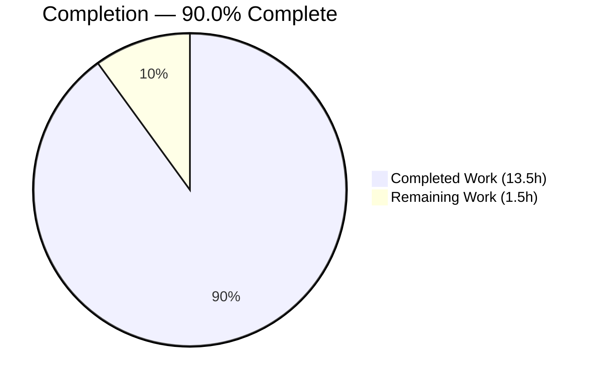
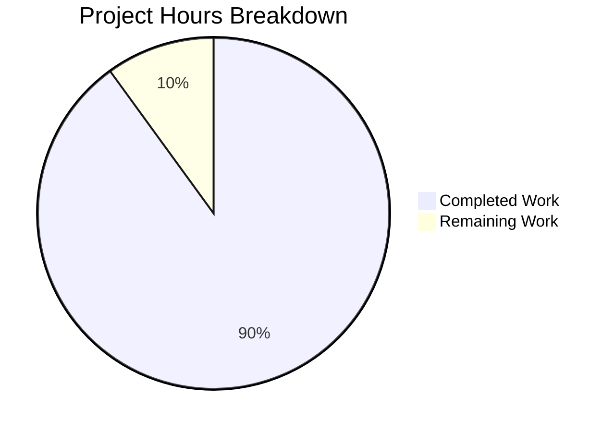
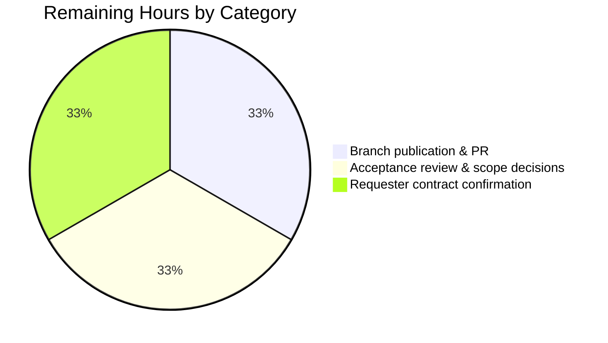
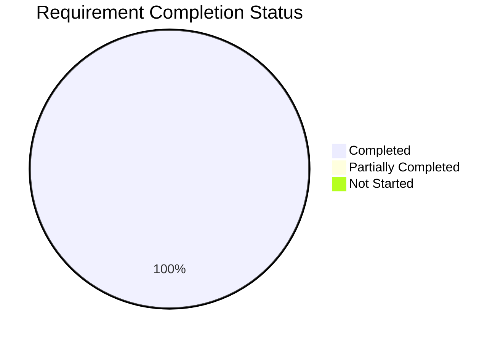

# 1. Executive Summary

## 1.1 Project Overview

This project adds one HTTP route to the repository's single-file Node.js server. A request whose path is exactly `/status` now receives `200` with `Content-Type: application/json` and the static body `{"status":"ok"}`; every other path still receives the unchanged `Hello, World!\n` response. It uses Node's built-in `http` module only — no framework, no dependency, no manifest — inside `server.js`, which remains the sole source file and grew from one line to seven. Consumers are any HTTP client needing a lightweight liveness probe, delivered without adding a dependency, a build step or a second file.

## 1.2 Completion Status



Chart colours: Completed = Dark Blue `#5B39F3`, Remaining = White `#FFFFFF`.

| Metric | Value |
|---|---|
| Total Hours | 15.0 |
| Completed Hours (AI + Manual) | 13.5 (13.5 AI + 0.0 Manual) |
| Remaining Hours | 1.5 |
| Percent Complete | **90.0%** |

Calculation: 13.5 ÷ 15.0 × 100 = **90.0%**. All 20 requirements in scope are delivered; the remaining 1.5 hours are human sign-off — branch publication, acceptance review of the diff, and confirmation of four response-contract decisions.

## 1.3 Key Accomplishments

- ✅ `/status` returns `200`, one `Content-Type: application/json`, and the 15-byte literal `{"status":"ok"}` (`server.js:2-5`).
- ✅ Every other path still returns `200` with 14 bytes and no application header (`server.js:6`).
- ✅ Path matching is exact: 28 near-miss targets fall through, zero over-matches.
- ✅ Every HTTP method takes the route; `HEAD` returns headers with a zero-length body.
- ✅ Single-write safety holds under 200-way concurrency — no stream or header errors, stable process.
- ✅ Startup unchanged: `node server.js`, no install or build step, one 41-byte readiness line.
- ✅ Zero dependencies and zero prohibited artifacts across the tree.
- ✅ The whole change is 7 added lines in one file, with zero comments.

## 1.4 Critical Unresolved Issues

**No unresolved defects, and 0 of 20 in-scope requirements remain open.** Fourteen items are open as *decisions*: thirteen accepted with a caveat by instruction, plus one coverage gap.

| Issue | Impact | Owner | ETA |
|---|---|---|---|
| Four response-contract decisions unconfirmed (4 items): JSON field names, no method restriction, exact-match-only paths, `Content-Type` only on `/status` | A different intended contract would change the literal at `server.js:4` or the test at `server.js:2` | Requester | 0.5h |
| Production hardening accepted-absent (9 items): authentication, method restriction, rate limiting and request caps, security headers, TLS, application error handling, audit logging, dependency-scan surface, interface binding | Not deployable to a public network as-is; see §5.2 and §6 | Platform owner | Scope decision |
| No automated test asset in the repository (1 item) | Nothing re-verifies the two response paths on a future edit | Repository owner | Scope decision |

## 1.5 Access Issues

**No access issues identified.** Building and running requires no credentials and no third-party service.

| System/Resource | Type of Access | Issue Description | Resolution Status | Owner |
|---|---|---|---|---|
| Repository (`check_billing_sep_01`) | Read/write on the working branch | None — the branch is committed locally and ready to publish | ✅ No issue | Repository owner |
| Package registries | Dependency download | Not required — zero declared and zero transitive dependencies | ✅ Not applicable | — |
| External services / API keys | Runtime credentials | Not required — the server makes no outbound call and reads no environment variable | ✅ Not applicable | — |
| TCP port 3000 | Local bind at run time | Hardcoded and single-occupancy; free on the current host | ✅ No issue | Operator |

## 1.6 Recommended Next Steps

1. **[High]** Publish the branch and open the pull request (0.5h).
2. **[High]** Review the diff against its acceptance criteria and settle the three standing scope decisions (0.5h).
3. **[Medium]** Confirm the four response-contract decisions with the requester (0.5h).
4. **[Low]** Commission a hardening scope — TLS, request limits, security headers, interface binding — before any exposure beyond a local host (§6).
5. **[Low]** Authorize a minimal automated test for both response paths before `server.js` is edited again.

# 2. Project Hours Breakdown

## 2.1 Completed Work Detail

| Component | Hours | Description |
|---|---|---|
| `/status` route implementation | 1.5 | Concise arrow body converted to a block; exact-match branch, explicit `writeHead(200, {'Content-Type':'application/json'})`, the literal `{"status":"ok"}` body and the early `return` (`server.js:1-5`) |
| Default fall-through preservation | 0.5 | `res.end('Hello, World!\n')` carried over verbatim and held as the handler's last statement, so no other path changes (`server.js:6`) |
| Constraint-compliance engineering | 1.5 | Under-10-line budget (7-line file), zero comments, zero dependencies, single-file diff, and 19 artifact categories kept absent across the tree |
| Static validation gates | 1.0 | Parse gate (`node --check`), scope/diff-shape gate, fixed-string and positional verification of all seven lines, prohibited-artifact and placeholder sweeps |
| HTTP contract and control-flow review | 1.0 | Route registration, status/header/body fidelity, write-once-per-request analysis, lifecycle and module-surface review |
| Completeness, directive and comment review | 1.5 | Requirement inventory (20 items), directive compliance matrix, comment-policy audit, `README.md` immutability check |
| Static security and supply-chain review | 1.0 | Untrusted-input tracing from `req.url`, injection-sink sweeps, secret sweep, zero-dependency supply-chain assessment, Node API currency check |
| Runtime functional verification | 2.0 | `/status` contract on two host spellings, 28 path-strictness variants plus raw-socket literal targets, seven-method matrix, single-write safety under sequential and 200-way concurrent load |
| Runtime startup and lifecycle verification | 1.0 | Readiness-line byte fidelity across 24 independent starts, port-bind confirmation, `EADDRINUSE` behaviour, signal handling, restart idempotency |
| Runtime security and browser verification | 1.5 | 15 payload families, 23 file-disclosure probes, secret-echo checks across four request channels, headless-Chrome rendering safety and console inspection |
| Acceptance verification | 1.0 | Cross-domain pass (contract → branch decision → headers/body → logging silence → process health), three restart cycles, browser-versus-client agreement |
| **Total** | **13.5** | |

## 2.2 Remaining Work Detail

| Category | Hours | Priority |
|---|---|---|
| Branch publication and pull-request creation (optionally clearing the untracked screenshot artifacts under `blitzy/screenshots/` for a spotless tree) | 0.5 | High |
| Human acceptance review of the `server.js` diff against the acceptance criteria, including the three standing scope decisions — documentation refresh, production hardening, automated test asset (§5.2) | 0.5 | High |
| Requester confirmation of the four open response-contract decisions — field names, method restriction, path-match strictness, `Content-Type` asymmetry (§5.2) | 0.5 | Medium |
| **Total** | **1.5** | |

## 2.3 Hours Reconciliation

| Line | Hours |
|---|---|
| Completed (§2.1 total) | 13.5 |
| Remaining (§2.2 total) | 1.5 |
| **Total Project Hours** | **15.0** |

13.5 + 1.5 = 15.0, matching the Total Hours in §1.2. Completion = 13.5 ÷ 15.0 × 100 = **90.0%**, the figure used in §1.2, §7 and §8. Work the project was explicitly instructed not to perform — test suites, lint and format configuration, CI, containers, documentation, error handling, logging, and externalized configuration — is outside the agreed scope and is therefore excluded from both columns; it is carried as risk in §6 and as recommendations in §8.

# 3. Test Results

The repository contains no test suite, no runner and no coverage tool, and creating any of them was outside the agreed scope. Verification was therefore executed directly: the parse and scope gates that serve as this project's whole-package gate, static source-fidelity checks over all seven lines, and runtime exercises that drove the running server with `curl`, raw sockets and headless Chrome. Every row below is an executed check with an observed result.

| Area / Category | Framework | Tests | Passed | Failed | Coverage | What This Proves |
|---|---|---|---|---|---|---|
| Syntax / parse gate | `node --check` (Node 22.23.2) | 1 | 1 | 0 | 1 of 1 source file | The delivered file parses under the target runtime without executing |
| Repository scope gate | `git status` / `git diff` | 3 | 3 | 0 | Whole tree | Only `server.js` changed, `README.md` is byte-identical, and no untracked source file exists |
| Source-fidelity checks | Shell + Python assertions | 18 | 18 | 0 | `server.js:1-7` | Every prescribed construct appears exactly once, the route test is the handler's first statement and the default response its last |
| Prohibited-artifact & placeholder sweeps | Shell | 19 | 19 | 0 | Whole tree | No manifest, lockfile, `node_modules`, test directory, lint config, CI, container, new document, TODO or stub exists |
| HTTP contract & routing | `curl` + raw sockets | 192 | 192 | 0 | Both response paths | `/status` is exact to the byte and routing is strict string equality with zero over-matches |
| Startup, logging & lifecycle | `curl` + process/socket inspection | 75 | 75 | 0 | Startup path, listener, signals | The readiness line is byte-identical on every start, the port binds and releases cleanly, and no request produces log output |
| Security & robustness | `curl` + raw sockets + headless Chrome | 304 | 304 | 0 | `req.url` surface, headers, logs | No payload is reflected, no file is served, no secret is echoed or logged, and malformed input discloses nothing |
| Acceptance & cross-domain flow | `curl` + raw sockets + headless Chrome | 291 | 291 | 0 | All in-scope requirements | Contract, branch decision, logging silence and process health hold together end to end, and the browser agrees with the CLI client |
| **Total** | | **903** | **903** | **0** | | |

The 862 runtime cases were driven by roughly 2,850 HTTP requests, 63 raw-socket sessions, 29 server starts and 2 browser sessions; the remaining 41 are static checks over the tree.

### Not Covered

- **No automated regression asset.** None of the verification above is stored in the repository as a runnable test, so nothing re-verifies the two response paths on a future edit. Before `server.js` changes again, a human should authorize a minimal test asserting `200` + `application/json` + `{"status":"ok"}` on `/status` and `200` + 14 bytes on any other path.
- **Line and branch coverage is not measured.** No coverage tool exists in the repository. Both handler branches were driven at runtime, so the executable surface was exercised, but no percentage is reported and none should be quoted.
- **TLS / HTTPS is not covered** — no such code path exists (`server.js` uses `http` only). If TLS is ever terminated in front of the service, the proxy path needs its own test.
- **Dependency vulnerability scanning is not covered** and is not required: zero declared and zero transitive dependencies, and `npm audit` cannot run without a lockfile. Runtime patching is an external, host-level concern.
- **Sustained soak and load above 200-way concurrency is not covered.** Behaviour was verified under bursts, not over hours. Test at expected production concurrency before real exposure.
- **Multi-instance behaviour is not covered.** Port 3000 is hardcoded and single-occupancy, so only one instance per host was ever run; horizontal deployment needs a port-allocation decision first (§6).

# 4. Runtime Validation & UI Verification

The server was started from the checkout and driven end to end. There is no UI in this project — no HTML, CSS or client-side asset — so browser verification treated Chrome as a second HTTP client and checked what it renders and reports.

- ✅ **Operational — Application start-up.** `node server.js` runs straight from the checkout with no install, dependency-resolution or build step, binds port 3000 (`LISTEN *:3000`) and prints exactly one 41-byte readiness line; the first request after that line always succeeded, across 29 independent starts.
- ✅ **Operational — `GET /status`.** `200`, exactly one `Content-Type: application/json`, and the 15-byte body `{"status":"ok"}` with no trailing newline; the body parses as JSON with the single key `status` = `"ok"`. Identical on `127.0.0.1`, `localhost` and the host interface.
- ✅ **Operational — `/status` across methods.** `GET`, `POST`, `PUT`, `PATCH`, `DELETE`, `OPTIONS` and `TRACE` all return the same 15 bytes; `HEAD` returns the headers with a zero-length body, confirmed at the socket level.
- ✅ **Operational — Default path preserved.** `/`, `/index.html`, `/api/anything`, `/favicon.ico`, `/health`, `/metrics`, `/readyz` and 30+ other targets return `200` with exactly 14 bytes and no application-set `Content-Type`; the header-name set is unchanged from the pre-change server.
- ✅ **Operational — Path strictness.** `/status/`, `/status?x=1`, `/STATUS`, `//status`, `/status%2F`, dot-segment and double-encoded variants, and an absolute-form request target all fall through — 28 near-misses, zero over-matches, confirmed with raw sockets that bypass client normalisation. `/status#frag` matches because the fragment never reaches the wire.
- ✅ **Operational — Load, reuse and single-write safety.** Sequential mixed traffic, 30-, 50- and 200-way concurrent bursts, a 40-worker mixed-path storm, keep-alive reuse and pipelined pairs all returned correct bodies with no header bleed, a stable process, zero bytes on stderr and no file-descriptor or memory growth. Responses were sub-millisecond.
- ✅ **Operational — Browser client.** Headless Chrome rendered `{"status":"ok"}` on `/status` (15 characters, `document.contentType` = `application/json`) and `Hello, World!` on both `/` and `/status/`, with zero console messages of any level and no failed, aborted or blocked request. Script and image payloads placed in the path or query were never reflected into the DOM and raised no dialog.
- ✅ **Operational — Process lifecycle.** `SIGTERM` and `SIGINT` terminate the process and release the port immediately, with a clean rebind afterwards; a second instance against the held port exits `1` with `EADDRINUSE` naming port 3000 and prints no readiness line, so the log never falsely claims readiness.
- ⚠ **Partial — Observability.** The only output the process ever produces is the startup line: after roughly 2,850 requests, stdout was still one line and stderr still 0 bytes, and no metrics endpoint exists. Runtime health can therefore be judged only by probing `/status` from outside.
- **Never exercised at runtime.** TLS/HTTPS, authentication, configuration loading and outbound integrations were never driven, because no such code path exists — `server.js` imports only `http`, reads no environment variable, and makes no outbound call. No automated run exists to re-drive any of the flows above on a future change.

# 5. Compliance & Quality Review

## 5.1 Compliance Matrix

| # | Deliverable / Benchmark | Verified Status | Evidence | Progress |
|---|---|---|---|---|
| 1 | One `/status` route inside the existing request handler | ✅ Pass | `server.js:2`, commit `15cb539` | ██████████ 100% |
| 2 | Static JSON payload `{"status":"ok"}` passed directly to `res.end` | ✅ Pass | `server.js:4`; 15 bytes, no serialization call | ██████████ 100% |
| 3 | Status `200` set explicitly | ✅ Pass | `server.js:3`; status line verified byte-by-byte at runtime | ██████████ 100% |
| 4 | `Content-Type: application/json` on `/status` only | ✅ Pass | `server.js:3` single header entry; zero on 30+ other paths | ██████████ 100% |
| 5 | Exact path equality, no normalization | ✅ Pass | `server.js:2`; 28 near-miss targets fall through | ██████████ 100% |
| 6 | Early return — one response write per request | ✅ Pass | `server.js:4`; zero stream/header errors under load | ██████████ 100% |
| 7 | Pre-existing default response preserved verbatim and last | ✅ Pass | `server.js:6` identical to the baseline call expression | ██████████ 100% |
| 8 | Built-in `http` only — zero dependencies, no manifest or lockfile | ✅ Pass | `server.js:1`; `require(` count 1; artifact sweep clean | ██████████ 100% |
| 9 | Single-file change; `README.md` untouched | ✅ Pass | `git diff --name-status` = `M server.js`; README md5 unchanged | ██████████ 100% |
| 10 | Size budget under 10 lines and comment ceiling of one | ✅ Pass | 7-line file, `7 1 server.js` numstat, 0 comments | ██████████ 100% |
| 11 | Startup chain, port literal `3000` and readiness log byte-identical | ✅ Pass | `server.js:1,7`; readiness line identical across 29 starts | ██████████ 100% |
| 12 | Deliberate absences preserved (no error handling, validation, added logging, metrics, shutdown hook, externalized config; 19 artifact categories absent) | ✅ Pass | Token sweeps all zero; `console.` count 1, the pre-existing readiness log | ██████████ 100% |

## 5.2 AAP & Rule Divergences and Gaps

No user-specified rules govern this repository, so every divergence below is measured against the Agent Action Plan. Six were identified; three are sanctioned by explicit instruction.

| What the AAP/Rule Required | What Was Delivered Instead | Why It Diverged | Impact | Remediation |
|---|---|---|---|---|
| §0.8 / §0.11.1: "Do not run a live verification suite — no starting the server, no executing curl against it as part of generation." | The change was written and committed without the server ever being started; the server was then started and driven with ~2,850 HTTP requests and two browser sessions to verify it | The prohibition is scoped to writing the change; an HTTP response contract cannot be confirmed by reading alone | Positive — the contract is proven on the wire. Zero repository impact; the only residue is six untracked PNGs under `blitzy/screenshots/` | None required; delete or ignore the untracked PNGs for a spotless tree |
| §0.9: four response-contract questions to be recorded, not answered | All four were answered by assumption and built: `{"status":"ok"}` field names, no method restriction, exact-match-only paths, `Content-Type` on `/status` only | The request specified only "a static JSON message"; the plan fixed each value so the route could be built at all | A different intended contract changes the literal at `server.js:4` or the test at `server.js:2` | Confirm with the requester (§2.2, 0.5h) |
| §0.6.2: the specification describes the response as input-independent on every path | The specification is left untouched and is now stale for `/status` | **Sanctioned** — §0.7.4/§0.3.2 forbid rewriting or expanding it | Documentation drift only; no runtime effect | Refresh if the documentation prohibition is lifted |
| §0.3.2 / P4: no hardening, validation, logging, metrics, shutdown handling or externalized configuration | None of it exists: nine production controls are absent by design | **Sanctioned** — the user declared a minimal workflow change and prohibited each item | Not deployable to a public network as-is | Commission a hardening scope before real exposure (§6) |
| §0.3.2: "Do not create test suites" | No test file, runner or fixture exists in the repository | **Sanctioned** — explicit instruction | No regression guard; a future edit is unverified until re-checked by hand | Authorize a minimal test before `server.js` changes again |
| Standard practice: each commit carries a change | Commit `0b3927e` changes no file; its tree is identical to `15cb539` | The constraint check it records required no source change, and the work was committed rather than dropped | Cosmetic history only; the diff against the base is unaffected | None, or squash at merge |

**Live verification of the delivered route.** The plan forbade starting the server or running any HTTP client while the change was being written, and that held: the implementation commit was validated only with `node --check server.js`, which parses without executing and binds no port. Verifying the route afterwards took the opposite approach deliberately — `node server.js` was started from the checkout and driven with roughly 2,850 requests, 63 raw-socket sessions and two headless-Chrome sessions, because a status code, a header and a 15-byte body are claims about the wire that reading cannot settle. The repository was untouched throughout: `server.js` md5 `9b77d6ee9db1b908d8dcd8440bad514f` before and after, no tracked-file delta. Six screenshot PNGs remain untracked under `blitzy/screenshots/`; remove them if you want an empty `git status`.

**Four assumed contract decisions.** The request asked for "a static JSON message" and nothing more, so four questions had no answer: the field names, whether `/status` should be method-restricted, whether `/status/` and `/status?x=1` should match, and whether a `Content-Type` should be emitted where no other response carries one. The plan recorded each as an open question and then fixed a value so the route could exist — `{"status":"ok"}`, no method test (`req.method` is never read), strict equality at `server.js:2`, and `application/json` at `server.js:3` only. All four are single-line decisions: a different field set changes `server.js:4`; tolerating a trailing slash or query string changes `server.js:2`. Confirm them before a consumer depends on the endpoint.

**Stale specification.** The project's technical specification records the server's response as input-independent across every method and path, and identifies any read of `req` as the change that would end that property. This route is exactly that change, so the specification is now accurate for every path except `/status`. It was not updated because the instruction not to rewrite or expand it is explicit and binding — a sanctioned divergence, not an oversight. The practical effect is limited: the specification is not a repository file, and nothing in the tree depends on it. When documentation work is next authorized, the `/status` contract (200, `application/json`, `{"status":"ok"}`, exact-match only) is the single paragraph that needs adding.

**Accepted production hardening gaps.** Nine controls a public HTTP service would normally carry are absent: authentication and authorization, method restriction, rate limiting with body and connection caps, security headers beyond `Content-Type`, TLS, controlled application error handling, audit logging, a dependency-scanning surface, and network-interface restriction — `server.js:7` omits the host, so the listener binds every interface while the readiness line advertises `127.0.0.1`. Each is absent because the instruction prohibited adding it, and each was confirmed still absent in the delivered file. Current exposure is genuinely low: two static literals, no cookie, no rendered user input, no protected data. This becomes a release blocker only if the service is exposed beyond a local host, at which point §6 lists the controls to commission.

**No automated test asset.** Creating test suites was prohibited, so the repository holds no test file, runner, fixture or harness, and the verification recorded in §3 and §4 lives outside it. The consequence is concrete rather than theoretical: the next edit to `server.js` has nothing to run against it, and the contract would have to be re-proven by hand. Because the file is seven lines and exports nothing, the gap is cheap to close — two assertions (`/status` returning `200` + `application/json` + `{"status":"ok"}`, any other path returning `200` + 14 bytes) would cover the entire executable surface. Decide this before the file grows.

**Content-neutral commit.** The branch carries two commits above its base. `15cb539` contains the whole change — `7 1 server.js` — and `0b3927e` contains nothing: `git diff --stat 15cb539..HEAD` is empty, so the tip tree and the implementation tree are byte-identical. It exists because the constraint check it records completed without requiring a source change, and the work was committed rather than dropped. Nothing about the delivered code is affected, the diff against the base is still one file with seven insertions, and `git log --oneline` is the only place the emptiness shows. Squash the two commits at merge if you prefer a single-commit history.

# 6. Risk Assessment

These are forward-looking exposures for the delivered code. Severity assumes the service is eventually run somewhere real; probability assumes no further change of scope.

| Risk | Category | Severity | Probability | Mitigation | Status |
|---|---|---|---|---|---|
| No automated test asset exists, so a future edit to `server.js` has nothing to verify it | Technical | Medium | High | Authorize a two-assertion test covering both response paths before the file is edited again | Open — outside the agreed scope |
| The response contract rests on four decisions the requester has not confirmed (§5.2) | Technical | Low | Medium | Confirm field names, method policy, path strictness and the `Content-Type` asymmetry before a consumer depends on `/status` | Open — 0.5h in §2.2 |
| `/status` returns a compile-time literal, so it answers `200 ok` regardless of any future dependency's health | Technical | Low | Medium | Treat it as a liveness signal only; add real health logic the moment the server gains a dependency | Accepted by design |
| `server.js:7` omits the host, so the listener binds every interface while the readiness line advertises loopback | Security | Medium | Medium | Restrict reachability with network policy or a firewall; bind explicitly only in a future scope, since the listen chain must stay byte-identical | Accepted by instruction |
| Plaintext HTTP with no volumetric controls — no TLS, no rate limiting, no body or connection caps, no application timeouts | Security | Medium | Medium | Terminate TLS and apply request limits at a reverse proxy before any public exposure | Accepted by instruction |
| No security headers beyond `Content-Type` and no application error handling; malformed input is answered only by the runtime parser | Security | Low | Medium | Add `nosniff`, a frame policy and controlled error responses in a production scope | Accepted by instruction |
| No request or error logging and no metrics — a wedged process is indistinguishable from a healthy one in the logs | Operational | Medium | Medium | Probe `/status` externally for health; add request logging and metrics in a future scope | Accepted by instruction |
| Port 3000 is hardcoded and single-occupancy with fatal contention, no `PORT` override, and `SIGTERM` drops in-flight responses | Operational / Integration | Medium | Medium | Allocate the port at the infrastructure layer, run one instance per host, and drain connections at the proxy | Accepted by instruction |

**Integration exposure is nil.** There is nothing external to fail: zero declared and zero transitive dependencies, no outbound HTTP, database, cache, queue or webhook call, no environment variable read, and one process holding one listening socket. No credential or API key is needed to build, run or verify the service, and there is no supply-chain surface to scan.

# 7. Visual Project Status



Colour key — Completed Work: Dark Blue `#5B39F3`; Remaining Work: White `#FFFFFF`.

**Remaining hours by category (§2.2)**



**Requirement status across the 20 in-scope requirements**



| Priority of remaining work | Hours | Share |
|---|---|---|
| High | 1.0 | 67% |
| Medium | 0.5 | 33% |
| Low | 0.0 | 0% |
| **Total** | **1.5** | **100%** |

Totals reconcile with §1.2 and §2.2: Completed 13.5h, Remaining 1.5h, Total 15.0h, **90.0% complete**.

# 8. Summary & Recommendations

**What was delivered.** `server.js` now carries a `/status` route: an exact-match branch on the request path that answers with `200`, `Content-Type: application/json` and the literal body `{"status":"ok"}`, then returns before the original response can also be written. The pre-existing `res.end('Hello, World!\n')` call survives verbatim as the handler's last statement, so every other path behaves exactly as it did. The change is seven added lines in one file (`git diff --numstat` = `7 1 server.js`), with no comment, no dependency, no manifest, no lockfile and no second file touched. All 20 in-scope requirements are delivered, which puts the project at **90.0% complete** (13.5 of 15.0 hours); the outstanding 1.5 hours are human sign-off, not engineering.

**What was verified.** 903 executed checks passed with none failing: the parse and scope gates that serve as this project's whole-package gate, 37 static source-fidelity and artifact checks, and 862 runtime cases driven by roughly 2,850 HTTP requests, 63 raw-socket sessions, 29 server starts and two headless-Chrome sessions. The `/status` contract held byte-for-byte across seven HTTP methods, three network interfaces, two client stacks and three restart cycles; 28 near-miss paths fell through with zero over-matches; 30+ other paths returned the unchanged 14-byte default with no application header; and load up to 200-way concurrency produced no double-write error, no process restart and no resource growth. No payload was ever reflected, no file was ever served, and no secret placed in a header, cookie, query string or body appeared in any response or log.

**What remains, and the critical path.** Three actions, in order: publish the branch and open the pull request; review the diff against its acceptance criteria — one file, under 10 lines added, no dependency, default response retained — and settle the three standing scope decisions; then confirm the four response-contract decisions with the requester, since they were assumed rather than specified. Nothing blocks that path. The largest standing gap is that the repository holds no automated test, so the next edit to `server.js` will have nothing to verify it; a two-assertion test would cover the whole executable surface and is worth authorizing before the file grows.

**Production readiness.** For the purpose the work was scoped against — a minimal, local status endpoint — the implementation is ready: the contract is exact, the existing behaviour is intact, and the startup path is unchanged and deterministic. For a real public deployment it is deliberately not ready, and the nine absent controls are documented rather than hidden: no TLS, no rate limiting or request caps, no security headers, no authentication, no application error handling, no audit logging, and a listener that binds every interface while the readiness line advertises loopback. Each was excluded by explicit instruction, and each is listed in §6 with its mitigation. Exposure today is low because the service returns two static literals, reads nothing from the request but the path, holds no file descriptor and stores nothing.

**Success metrics.** `/status` returns `200` with `Content-Type: application/json` and exactly 15 bytes; any other path returns `200` with exactly 14 bytes and no application `Content-Type`; `node --check server.js` exits `0`; the diff against the base touches `server.js` alone with seven insertions; and `node server.js` prints one 41-byte readiness line and serves its first request immediately. All five were observed, and all five are cheap for a reviewer to re-confirm using §9.

# 9. Development Guide

## 9.1 System Prerequisites

| Requirement | Value | Notes |
|---|---|---|
| Node.js | 22.12.0 or newer on the 22.x line (verified on v22.23.2) | The repository pins no version — there is no `engines` field, `.nvmrc` or `.node-version` |
| Operating system | Any platform Node 22 supports (verified on Linux x86-64) | No platform-specific code |
| Free TCP port | 3000 | Hardcoded in `server.js`; the server reads no `PORT` variable |
| Optional tooling | `curl`, `lsof` or `ss`, `git` | Used only to verify and inspect, never required to run |
| Disk / memory | A few hundred KB; ~60 MB resident when running | The checkout is 428 KB excluding `.git` |

## 9.2 Environment Setup

There is nothing to install and nothing to configure. The project has no package manifest, no lockfile, no `node_modules`, no build step, no virtual environment, no environment variables and no configuration file. Do **not** run `npm install` or `npm ci` — there is no manifest, and creating one is outside the agreed scope.

```bash
# 1. Enter the checkout
cd /path/to/check_billing_sep_01

# 2. Confirm the runtime (expect v22.12.0 or newer)
node --version
# → v22.23.2

# 3. Confirm the tree is the two-file project it should be
git ls-files
# → README.md
# → server.js
```

## 9.3 Validate Before Running

`node --check` parses the file without executing it, so it starts no server and binds no port. This is the project's per-change gate.

```bash
# Syntax gate — expect no output and exit status 0
node --check server.js; echo "exit=$?"
# → exit=0

# Whole-package gate — parse plus a clean-tree check
node --check server.js && git status --porcelain; echo "exit=$?"
# → exit=0   (no modified tracked file; any output should be untracked evidence only)
```

## 9.4 Application Startup

```bash
# Confirm port 3000 is free first
lsof -i :3000 || echo "port 3000 is free"

# Foreground (Ctrl-C to stop)
node server.js
# → Server running at http://127.0.0.1:3000/

# Background, capturing the pid so you can stop exactly that process.
# Write the log outside the checkout so the clean-tree gate keeps passing.
node server.js > ~/server.log 2>&1 & pid=$!
sleep 1; cat ~/server.log
# → Server running at http://127.0.0.1:3000/
```

Startup order is trivial: one process, no dependencies, no migrations, no companion service. Readiness is the single stdout line; the first request succeeds immediately after it appears.

## 9.5 Verification Steps

```bash
# 1. The listener exists
lsof -i :3000
# → node  <pid>  ...  TCP *:3000 (LISTEN)

# 2. The new route
curl -i http://localhost:3000/status
# → HTTP/1.1 200 OK
# → Content-Type: application/json
# → {"status":"ok"}          (15 bytes, no trailing newline)

# 3. The preserved default response
curl -i http://localhost:3000/
# → HTTP/1.1 200 OK
# → Content-Length: 14       (and no Content-Type header)
# → Hello, World!

# 4. Path matching is exact — these intentionally return the default
curl -s -o /dev/null -w '%{size_download}\n' http://localhost:3000/status/
curl -s -o /dev/null -w '%{size_download}\n' 'http://localhost:3000/status?x=1'
# → 14
# → 14

# 5. Stop the server by the pid you captured (never pkill/killall by name)
kill "$pid"
```

## 9.6 Example Usage

```bash
# Liveness probe suitable for a supervisor or load balancer
curl -sf http://localhost:3000/status | grep -q '"status":"ok"' \
  && echo "service healthy" || echo "service NOT healthy"

# Machine-readable field extraction
curl -s http://localhost:3000/status | node -e \
  'let d="";process.stdin.on("data",c=>d+=c).on("end",()=>console.log(JSON.parse(d).status))'
# → ok

# Any method takes the route — the payload never varies
curl -s -X POST -d '{"ignored":true}' http://localhost:3000/status
# → {"status":"ok"}
```

## 9.7 Troubleshooting

| Symptom | Cause | Resolution |
|---|---|---|
| `Error: listen EADDRINUSE: address already in use :::3000` and exit status 1 | Another process holds port 3000; no readiness line is printed, so the log never falsely claims success | Find the holder with `lsof -ti :3000` and stop that specific pid, or wait for it to exit. Do not `pkill` by name |
| `PORT=9999 node server.js` still serves on 3000 | The port is a hardcoded literal and no environment variable is read | Expected. Map the port at the infrastructure layer, or commission a configuration change (§6) |
| `/status/` or `/status?x=1` returns `Hello, World!` | Path matching is exact string equality by design | Expected. Request `/status` with no trailing slash and no query string |
| `curl 'http://localhost:3000/status?'` returns JSON | `curl` strips an empty trailing query before sending, so the server receives `/status` | Expected. To test that variant, write the literal request line over a raw socket |
| `431 Request Header Fields Too Large` with an empty body | The request target or header block exceeded the runtime's ~16 KB limit | Expected runtime behaviour, not application logic. Shorten the request |
| `400 Bad Request` on a malformed request line or a missing `Host` header | Rejected by the runtime's HTTP parser before the handler runs | Expected. The process survives and discloses nothing |
| The background server disappears between shell commands | A process started with plain `&` is reaped when its shell session ends | Start it detached: `setsid nohup node server.js > ~/server.log 2>&1 &` |
| An unexpected file shows up in `git status` | A log or scratch file was written inside the checkout | Keep run logs outside the checkout (`~/server.log`); the clean-tree gate treats any new source file as a scope breach |
| No log output while requests are being served | There is no request or error logging — by design, the only output is the startup line | Expected. Judge health by probing `/status` (§6) |
| In-flight responses dropped on shutdown | `SIGTERM` terminates immediately; there is no graceful drain | Expected. Drain at a proxy if this matters in your deployment |

# 10. Appendices

## Appendix A. Command Reference

| Purpose | Command | Expected Result |
|---|---|---|
| Check the runtime | `node --version` | `v22.23.2` (any 22.12.0+ is fine) |
| Syntax gate (no execution) | `node --check server.js` | No output, exit `0` |
| Whole-package gate | `node --check server.js && git status --porcelain` | Exit `0`, no modified tracked file |
| List tracked files | `git ls-files` | `README.md`, `server.js` |
| Inspect the change | `git diff --numstat origin/2109_03...HEAD` | `7	1	server.js` |
| Inspect changed paths | `git diff --name-status origin/2109_03...HEAD` | `M	server.js` |
| Start the server | `node server.js` | `Server running at http://127.0.0.1:3000/` |
| Start detached | `setsid nohup node server.js > ~/server.log 2>&1 &` | Readiness line in `~/server.log` |
| Probe the new route | `curl -i http://localhost:3000/status` | `200`, `application/json`, `{"status":"ok"}` |
| Probe the default route | `curl -i http://localhost:3000/` | `200`, `Content-Length: 14`, `Hello, World!` |
| Find the listener | `lsof -i :3000` | One `node` process in `LISTEN` |
| Stop the server | `kill "$pid"` (pid captured at start) | Port released immediately |

## Appendix B. Port Reference

| Port | Protocol | Bound By | Configurable | Notes |
|---|---|---|---|---|
| 3000 | HTTP | `server.js:7` — `.listen(3000, …)` | No | Hardcoded literal; no `PORT` variable is read. Single-occupancy: a second instance exits `1` with `EADDRINUSE`. The host argument is omitted, so the listener binds every interface even though the readiness line names `127.0.0.1` |

## Appendix C. Key File Locations

| Path | Role | State |
|---|---|---|
| `server.js` | The entire application — HTTP server, request handler, `/status` route, listener | Modified on this branch: 7 lines, 265 bytes |
| `server.js:1` | `require('http').createServer((req,res)=>{` — module import and handler head | Prefix byte-identical to the baseline |
| `server.js:2-5` | The `/status` branch: exact path test, `writeHead(200, …)`, literal body, early `return` | Added |
| `server.js:6` | `res.end('Hello, World!\n');` — the default response for every other path | Carried over verbatim from the baseline |
| `server.js:7` | `.listen(3000, …)` with the readiness log | Tail byte-identical to the baseline |
| `README.md` | Repository title only, 22 bytes | Untouched |
| `blitzy/screenshots/` | Untracked browser-verification images | Untracked; safe to delete |

## Appendix D. Technology Versions

| Component | Version | Source |
|---|---|---|
| Node.js | v22.23.2 (`/usr/bin/node`) | Host runtime; the repository pins no version |
| npm | 11.18.0 | Present on the host, unused by this project |
| Node core module | `http` (built-in) | The only module the application imports |
| Third-party dependencies | 0 declared, 0 transitive | No manifest or lockfile exists |
| git | 2.51.0 | Host tooling |
| curl | 8.14.1 | Host tooling, used for verification only |

## Appendix E. Environment Variable Reference

The application reads no environment variable — `process.env` does not appear anywhere in `server.js`. No `.env` file exists or is required.

| Variable | Used By The Application | Effect |
|---|---|---|
| `PORT` | No | Ignored; the port is the hardcoded literal `3000`. Setting it has no effect on the bind |
| Any other variable | No | No effect |

## Appendix F. Developer Tools Guide

- **`node --check <file>`** — the project's compile-equivalent step. It parses without executing, so it is safe to run repeatedly and never binds a port.
- **`git diff --numstat <base>...HEAD`** — the fastest way to confirm the change is still one file and still under the size budget.
- **`git status --porcelain`** — the scope gate. Anything other than untracked evidence directories means the single-file rule has been broken.
- **`lsof -i :3000` / `ss -ltn`** — identify the port holder before starting the server; stop only the pid you started, never by process name.
- **`curl -i`** — shows status line and headers together, which is what the `/status` contract is defined in terms of. Note that `curl` strips an empty trailing `?`, so raw sockets are needed to test `/status?` literally.
- **`od -c` / `wc -c`** — verify the exact bodies: 15 bytes for `{"status":"ok"}` with no trailing newline, 14 bytes for `Hello, World!\n` with one.

## Appendix G. Glossary

| Term | Meaning in this project |
|---|---|
| Default response / fall-through | The pre-existing `Hello, World!\n` reply returned for every path other than exactly `/status` |
| Exact-match routing | Path selection by strict string equality on the request path, with no normalization, decoding or trimming — so `/status/` and `/status?x=1` do not match |
| Early return | `return res.end(...)` inside the `/status` branch, which guarantees one response write per request |
| `Content-Type` asymmetry | `/status` carries `application/json`; no other response carries any application-set `Content-Type`. Intentional |
| Readiness line | The single 41-byte `Server running at http://127.0.0.1:3000/` printed once by the listen callback |
| Whole-package gate | `node --check server.js && git status --porcelain` — this project's only build/verify gate, standing in for a test suite it does not have |
| Accepted-absent control | A production capability deliberately not implemented because the agreed scope prohibited it (see §5.2 and §6) |
