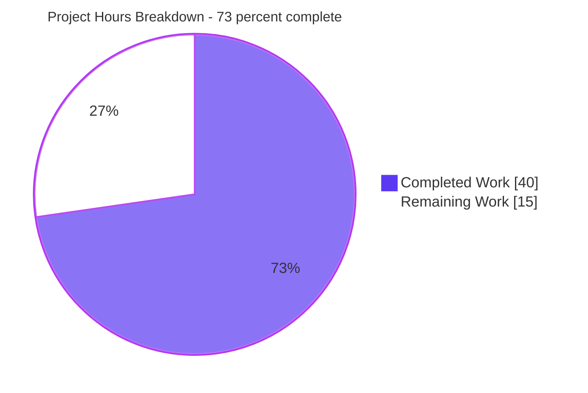
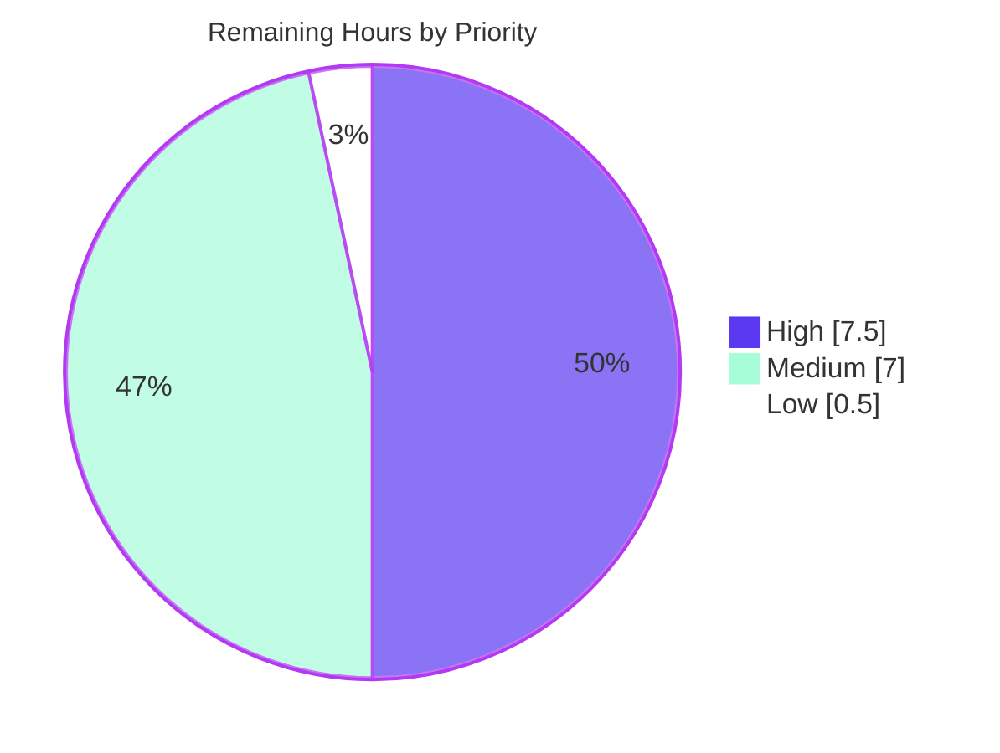

# 1. Executive Summary

## 1.1 Project Overview

`check_billing_sep_01` is a minimal HTTP service that answers every request with a fixed greeting. This work converted it from a single-statement Node.js `http` server into an Express 5 application with one request-logging middleware, environment-driven configuration, a dependency manifest and a PM2 process descriptor — exclusively the six changes that were asked for. Its users are operators and API clients; the value is a supervised, observable service in place of an unmanaged one-liner. Scope is five authored files plus a generated lock: no database, external integration or user interface.

## 1.2 Completion Status


| Metric | Value |
|---|---|
| **Total Hours** | **55.0** |
| Completed Hours (AI + Manual) | 40.0 (40.0 autonomous + 0.0 manual) |
| Remaining Hours | 15.0 |
| **Percent Complete** | **73%** (40.0 ÷ 55.0) |

Completion covers the agreed scope plus the work to deploy it. All twelve scoped deliverables are implemented and verified; the remaining hours are decisions and host deployment.

## 1.3 Key Accomplishments

- ✅ Express 5 application serving every method and path with the original 200 and 14-byte body (`server.js`)
- ✅ One catch-all route, `app.all('/{*splat}')`, matching the root and every deeper path
- ✅ One Apache-combined log line per request on stdout, alongside the startup banner
- ✅ `PORT`, `HOST` and `MESSAGE` read inline, each defaulting to the previous literal
- ✅ Banner names the address actually bound; a failed bind terminates rather than reporting success
- ✅ Error responses carry no stack trace or filesystem path, whatever `NODE_ENV` says
- ✅ Three pinned dependencies, a reproducible lock, `npm audit` clean across 150 packages
- ✅ PM2 supervision from `ecosystem.config.js`, plus a documented install and three start paths

## 1.4 Critical Unresolved Issues

Eighteen items are open. None is unfinished implementation — 12 of 12 scoped deliverables are complete — and none stops the service running. Three are authorization decisions; fifteen are behaviours the closed scope deliberately left in place, each verified and quantified.

| Issue | Impact | Owner | ETA |
|---|---|---|---|
| Authorization decisions (3): ratify the `package.json` `overrides` security exception; confirm AGPL-3.0 `pm2` against licence policy; decide a runtime version pin | Release governance. The `overrides` key alone holds two HIGH advisories closed; removing it reopens them | Risk owner | 2.5 h |
| Log pipeline accepted by scope (5): piped stdout whose reader closes ends the process; a stalled pipe buffers ~3.5 KiB per request; URLs and query strings logged verbatim; no length cap or rotation; parser-rejected 400/431 leave no record | Use the documented sinks (file redirect or PM2) and treat the log as secret-bearing and unbounded | Platform | 4.0 h |
| Exposure and hardening absences accepted by scope (6): no authentication on any path, no security headers, no timeouts/size caps/rate limits, all-interfaces bind behind a loopback banner, `MESSAGE` served as live HTML | Control exposure upstream; nothing sensitive sits behind the single static route today | Security | 3.0 h |
| Supervision and runtime (2): starting onto an occupied port is fatal by design, which under PM2 becomes a restart loop; single-threaded handling with no horizontal scaling | Assert the port is free before deploy; front with a proxy if concurrency grows | Operations | 4.0 h |
| Error-path and environment logging (2): malformed-escape paths write ~1.3 KB of stack trace per request to stderr and PM2's error log; the process inherits the deploying shell's whole environment | Keep those logs on the host; launch with a clean environment | Operations | 1.5 h |

## 1.5 Access Issues

No access issues identified — the toolchain, the npm registry and PM2 all resolve without credentials, and the project needs no secrets or accounts.

| System/Resource | Type of Access | Issue Description | Resolution Status | Owner |
|---|---|---|---|---|
| — | — | No access issues identified | N/A | — |

## 1.6 Recommended Next Steps

1. **[High]** Ratify the `overrides` security exception in `package.json` — no code change needed.
2. **[High]** Decide the port-contention question, since under PM2 an occupied port yields a restart loop.
3. **[High]** Settle the log-sink policy: documented file/PM2 sinks, or an authorized stdout error handler.
4. **[High]** Deploy to the target host with boot persistence, a free-port assertion and an exposure decision.
5. **[Medium]** Bound the logs outside the application and adopt the clean-environment launch procedure.

# 2. Project Hours Breakdown

## 2.1 Completed Work Detail

Every row traces to a scoped deliverable and was verified at runtime.

| Component | Hours | Description |
|---|---|---|
| Express 5 application: framework, route, middleware mount | 4.0 | `require('http')` chain replaced by `express()`; one `app.all('/{*splat}')` route answering every method and path including the root; one `app.use(morgan('combined'))` ahead of it (`server.js:1-11`) |
| Inline environment configuration | 1.5 | `PORT`, `HOST` and `MESSAGE` read as `process.env.X \|\| <original literal>`, with `HOST` consumed only by the banner so the original all-interfaces bind survives (`server.js:4-6`) |
| Request logging to stdout | 1.5 | `combined` format with morgan's default stream, so access lines and the startup banner share stdout; one line per served request |
| Startup and bind lifecycle | 3.0 | Banner emitted from the listener's `'listening'` event and built from `server.address()`, so it names the address actually bound; a failed bind stays fatal (exit 1, no banner) (`server.js:14-18`) |
| Error-response hygiene | 1.5 | Application environment pinned to production, so malformed request targets return a bare 400 with no stack trace or filesystem path, on every start path and independent of `NODE_ENV` (`server.js:9`) |
| Dependency manifest and reproducible lock | 2.5 | First manifest for the repository: name, version, `private`, `main`, `start` script and three caret-pinned dependencies, CommonJS preserved; `lockfileVersion` 3 lock with 151 entries, reproducible byte-for-byte |
| Supply-chain hardening of the dependency tree | 3.0 | Patched version floors for the two transitive packages PM2 pins exactly, with the lock regenerated by npm; `npm audit` clean across 150 packages and a single copy of each floored package in the tree |
| PM2 process descriptor and supervised path | 2.0 | `ecosystem.config.js` one-app descriptor driving start, restart, stop and delete in fork mode with PM2's default log destinations and shell-inherited configuration |
| Repository hygiene and documented start procedure | 1.5 | `.gitignore` keeping the install out of version control while the lock stays tracked; README install prerequisite, three start paths, three environment variables and the operational rules that apply to them |
| Acceptance suite authored and executed | 2.5 | Four assertion blocks covering install resolution, direct start and response contract, the environment read, and the supervised start — each stopping on first mismatch |
| Runtime verification campaign | 11.5 | Response contract, lifecycle, bind scope, crash and shutdown, configuration matrix, log content and destination, PM2 supervision, load and memory behaviour, injection and exposure probing, and browser rendering |
| Static review of the delivered tree | 5.5 | API and backend contract, configuration, infrastructure, observability, documentation, completeness, comment and best-practice compliance, plus application and supply-chain security review across all six files |
| **Total** | **40.0** | Matches Completed Hours in Section 1.2 |

## 2.2 Remaining Work Detail

| Category | Hours | Priority |
|---|---|---|
| Ratify the `overrides` security exception and record the decision | 1.0 | High |
| Close the port-contention question (bind-error listener: decide, implement if authorized, re-verify) | 1.5 | High |
| Log-sink resilience decision and re-verification under a closing pipe | 2.0 | High |
| Host deployment: boot persistence, port allocation with a free-port assertion, exposure decision | 3.0 | High |
| Log retention, rotation and redaction policy outside the application | 2.0 | Medium |
| Clean-environment launch procedure adopted into the runbook | 1.5 | Medium |
| AGPL-3.0 `pm2` licence confirmation against policy | 1.0 | Medium |
| Monitoring and alerting for the deployed instance | 1.5 | Medium |
| Production smoke verification on the target host | 1.0 | Medium |
| Runtime version pin decision | 0.5 | Low |
| **Total** | **15.0** | Matches Remaining Hours in Sections 1.2 and 7 |

## 2.3 Hours Reconciliation

| Check | Result |
|---|---|
| Section 2.1 total | 40.0 |
| Section 2.2 total | 15.0 |
| Section 2.1 + Section 2.2 | 55.0 = Total Hours in Section 1.2 |
| Completion percentage | 40.0 ÷ 55.0 × 100 = 72.7% → **73%**, as stated in Sections 1.2, 7 and 8 |
| Manual (human) hours to date | 0.0 — all completed work was delivered autonomously |

# 3. Test Results

This project intentionally carries no test runner and no coverage tooling, so `npm test` exits with `Missing script: "test"` by design. Verification is therefore executed against the running service and its documented commands. Every figure below was observed on the delivered tree at `node v22.23.2` / `npm 11.18.0`: **66 checks executed, 66 passed, 0 failed**.

| Area / Category | Framework | Tests | Passed | Failed | Coverage | What This Proves |
|---|---|---|---|---|---|---|
| Acceptance suite (install, direct start, environment read, supervised start) | Shell assertion blocks + `curl` | 4 | 4 | 0 | All 6 scoped capabilities | The service installs, starts on every documented path and answers correctly, with each block failing fast on any mismatch |
| Compile and manifest gate | `node --check`, `JSON.parse` | 4 | 4 | 0 | 4 of 4 shipped code and config files | Every file that ships parses and loads; `ecosystem.config.js` is requirable CommonJS |
| HTTP response contract | `curl` method × path matrix | 25 | 25 | 0 | 8 methods × 3 paths, plus a conditional request | Every method and every path — root included — returns 200 with the byte-exact 14-byte body, and a matching `If-None-Match` returns 304 |
| Request-log accounting | `curl` + log diff | 2 | 2 | 0 | Every served request in the session | Exactly one Apache-combined line per request reaches stdout, and the startup banner appears exactly once per process lifetime |
| Environment configuration | `curl`, `ss` | 5 | 5 | 0 | `PORT`, `HOST`, `MESSAGE` and their defaults | Overrides take effect, the previous port falls silent, `HOST` changes only the banner, and unset variables reproduce the original literals |
| Lifecycle, supervision and robustness | PM2, POSIX signals, `curl` | 14 | 14 | 0 | Supervised and both direct start paths | Supervised start, restart and log capture all work; a contended start exits 1 with no banner while the incumbent keeps serving; `SIGTERM` releases the port; a 20 MB body and 50 parallel requests are handled with the process alive |
| Error path and file-exposure probes | `curl` | 6 | 6 | 0 | Malformed escapes and four repository paths | A malformed request target returns a 138-byte 400 with no stack trace or filesystem path, and repository files are never served — every probe returns the static body |
| Dependency audit and repository hygiene | `npm audit`, `npm ls`, `git check-ignore` | 6 | 6 | 0 | 150 resolved packages, 6 tracked files | Zero advisories across the tree, exactly three pinned direct dependencies with a single copy of each patched transitive, the install ignored and the lock tracked |

**Not Covered**

- **No automated test suite or coverage measurement exists** in the repository, and none may be added under the agreed scope. There is no unit, integration or contract test file, so every result above comes from exercising the running service; a regression would be caught only by re-running these commands.
- **Parser-rejected requests are unmeasurable from the log.** Malformed request lines, unknown methods and oversized headers are answered 400/431 below the middleware layer, so they produce no log line and no stderr output. Nothing counts or alerts on them; add an upstream proxy if attack-traffic detection matters.
- **Sustained load and soak behaviour** were exercised only in short bursts (50 parallel requests, a 20 MB body). Long-duration memory behaviour with a *stalled* stdout consumer, and throughput at production volume, should be measured on the target host before release.
- **Other Node versions** are untested. Every verdict here, including the clean dependency audit, holds specifically for `node v22.23.2` / `npm 11.18.0`; nothing in the repository pins that.
- **Authentication, TLS and external integrations** are not covered because none exists: the service has one unauthenticated static route and no database, queue, cache or outbound client.
- **Deployment-time behaviour** — boot persistence, monitoring hooks and log rotation on a real host — has never been exercised, since no target environment exists yet.

# 4. Runtime Validation &amp; UI Verification

Every flow below was driven against a running instance of the delivered service; the service has no user interface, so the browser checks confirm what a real client receives.

- ✅ **Start-up (all three paths)** — `node server.js`, `npm start` and `npx pm2 start ecosystem.config.js` each bind and print `Server running at http://127.0.0.1:<PORT>/` exactly once, naming the port actually bound.
- ✅ **HTTP response contract** — 8 methods across the root, a shallow and a deep query-bearing path all return 200 with the byte-exact 14-byte body; `HEAD` is correctly bodyless; a matching `If-None-Match` returns 304.
- ✅ **Request logging** — one Apache-combined line per request on stdout, e.g. `"GET /deep/path?q=1 HTTP/1.1" 200 14`, with the banner on the same stream and stderr silent for well-formed traffic.
- ✅ **Configuration** — `PORT=8080` moved the listener and the banner while the previous port fell silent; `MESSAGE` was served verbatim with a matching content length; `HOST=0.0.0.0` changed only the banner, with the socket still bound to every interface.
- ✅ **PM2 supervision** — launched online in fork mode at version 1.0.0 with zero restarts; `restart` returned it to online and 200 with a new pid; the error log stayed empty and no PM2 artefact was written into the checkout.
- ✅ **Error path** — malformed escape targets (`/%` and variants) return 400 with a 138-byte body containing only the status text: no `URIError`, no dependency paths, no filesystem paths, on the direct path and under supervision alike.
- ✅ **Bind and crash semantics** — the listener answers on every interface; a contended start exits 1 with `EADDRINUSE`, writes no banner and leaves the incumbent serving; `SIGTERM` releases the port cleanly.
- ✅ **Browser rendering** — in headless Chrome the root, a nested path and a fully encoded `<script>alert(1)</script>` target each render the identical single line of text; no dialog fires, `document.querySelectorAll('script').length` is 0, no request input is echoed into the DOM, there are zero JavaScript console messages, and a reload revalidates to 304 on the weak `ETag`.
- ⚠ **Log-sink durability** — with stdout piped to a reader that then closes, the next request kills the process (`write EPIPE`); the documented sinks — a file redirect and PM2's own writer — were both driven and survive, and PM2 restarts such an exit.
- ⚠ **Server-side error logging** — malformed-escape requests still write about 1.3 KB of stack trace per request to stderr and, under supervision, to PM2's error log; well-formed traffic writes nothing.

**Never exercised at runtime:** authentication and TLS (the service implements neither), any external integration (none exists — no database, queue, cache or outbound HTTP client), horizontal scaling under PM2 cluster mode (out of scope), and anything that requires a deployment target: boot persistence, monitoring probes, log rotation and production-volume load. One informational browser-side note carries no functional impact: because a plain string is sent as `text/html` with no DOCTYPE, Chrome parses each response in Quirks Mode, which is immaterial for a body containing no markup or CSS.

# 5. Compliance &amp; Quality Review

## 5.1 Compliance Matrix

Each row is a scoped deliverable and its verified state on the delivered tree.

| # | Deliverable | Status | Progress | Verified State |
|---|---|---|---|---|
| 1 | Express 5 application replacing the raw `http` server, preserving status and body | ✅ PASS | 100% | 25 method/path checks return 200 with the byte-exact 14-byte body (`server.js:1,8`) |
| 2 | Single catch-all route matching every method and every path including the root | ✅ PASS | 100% | `app.all('/{*splat}')` answers `/`, shallow and deep query-bearing paths (`server.js:11`) |
| 3 | Exactly one middleware, the request logger, mounted ahead of the route | ✅ PASS | 100% | One `app.use` in the file; no error-handling, parsing or security middleware present (`server.js:10`) |
| 4 | Inline environment configuration with the original literals as defaults | ✅ PASS | 100% | `PORT`/`HOST`/`MESSAGE` verified in both directions; no config module, dotenv or validation layer (`server.js:4-6`) |
| 5 | Request logging in Apache-combined format on stdout, startup banner preserved | ✅ PASS | 100% | One log line per served request; banner once per lifetime on the same stream |
| 6 | PM2 process descriptor running the same entry point | ✅ PASS | 100% | Two-key descriptor; start, restart, stop and delete all healthy in fork mode (`ecosystem.config.js`) |
| 7 | Dependency manifest: three pinned dependencies, CommonJS preserved, no runtime pin | ⚠ PASS with exception | 100% | Exactly 3 direct dependencies; no `type`, `devDependencies` or `engines`; carries one extra key documented in 5.2 (`package.json`) |
| 8 | Generated lock file reproducing the exact resolutions | ✅ PASS | 100% | `lockfileVersion` 3, 151 entries, reproducible byte-for-byte; `npm ci` exits 0 (`package-lock.json`) |
| 9 | Repository hygiene: the install excluded from version control | ✅ PASS | 100% | `.gitignore` is the single `node_modules/` rule; the lock stays tracked; 6 tracked files total |
| 10 | Documented start procedure: install prerequisite, three start paths, three variables | ✅ PASS | 100% | Every documented command executed successfully, including a clean-clone install and run (`README.md`) |
| 11 | Acceptance evidence for install, response contract, configuration and supervision | ✅ PASS | 100% | All four assertion blocks pass on the delivered tree |
| 12 | Supply-chain posture of the introduced dependency tree | ✅ PASS | 100% | `npm audit` reports 0 vulnerabilities across 150 packages, with a single copy of each patched transitive |

## 5.2 AAP &amp; Rule Divergences and Gaps

No user-specified rules were supplied for this project — that was confirmed rather than assumed — so every divergence below is against the agreed plan. Eight were identified; none is a defect in the delivered behaviour, and each is stated with the evidence a reader can open.

| # | What the Plan Required | What Was Delivered Instead | Why It Diverged | Impact | Remediation |
|---|---|---|---|---|---|
| 1 | A six-key manifest, with the three dependencies resolving as pinned | A seventh key, `"overrides":{"js-yaml":"^4.3.2","ws":"^8.21.1"}`, lifting two transitive packages above the versions PM2 pins | PM2 7.0.4 pins both as exact specs inside published advisory ranges, and no PM2 release above 7.0.4 exists, so an override is the only mechanism that removes them | Audit is clean and behaviour is unchanged; the gap is governance — the exception is unratified | Ratify as delivered (1.0 h, no code change), or bump PM2 when a compliant release ships. Never delete the key alone |
| 2 | The listen call written as `app.listen(PORT, callback)`, on the stated premise that the framework registers no bind-error listener | `const server = app.listen(PORT)` plus a `'listening'` handler that builds the banner from `server.address()` (`server.js:14-18`) | The premise is false for Express 5: a trailing callback is attached as the server's one-shot `error` listener, so that form would print a success banner and exit 0 on a bound port | Positive. Bind failure is fatal and the banner names the address actually bound; the file is 18 lines rather than the sketched ten | None. Do not "simplify" the call back to the two-argument form |
| 3 | A ten-line file with exactly one comment and no extra application configuration | An added `app.set('env', 'production');` with a short trailing comment (`server.js:9`), making two comments | Without it the framework's development default serves its error page with a stack trace and absolute filesystem paths to unauthenticated clients on any malformed escape | None on agreed behaviour — status, body, headers, conditional response, built-in 404 text and log output all verified unchanged | None. Keep it pinned rather than environment-driven |
| 4 | Two README lines covering the install, the start paths and the environment variables | Two lines (cap held) that additionally carry the stdout-durability rule, the production error-mode statement, the stderr-trace note and the `MESSAGE` trust caveat | Those accepted operational risks had no other permitted home: no new documentation file and no third content line | Documentation is denser than the austerity intent; every claim in it was verified true | Confirm acceptable, or authorize a fuller operations document |
| 5 | The bind-error listener question raised, not built | Not built: no `'error'` listener anywhere, so an occupied port is fatal and under PM2 becomes a repeating restart cycle | The plan explicitly requires it be left unbuilt pending a human decision | Deploying onto an occupied port yields a supervised app that never serves | Decide; if authorized, one line plus re-verification (1.5 h) |
| 6 | Logging limited to the `combined` format on the default stream, with no stream option, redaction or rotation | Exactly that, so: a closing stdout pipe ends the process; a stalled pipe buffers; URLs and query strings are logged verbatim, uncapped and unrotated; parser-rejected requests leave no record | Every remedy — a stdout error handler, a stream option, a masking format, rotation — is an explicit exclusion of the agreed scope | Operational and data-handling exposure, quantified below and bounded to the undocumented piped-stdout path | Adopt the documented sinks, bound the log outside the app, or authorize a specific scope addition (4.0 h) |
| 7 | No security work: no authentication, security headers, size caps, timeouts, rate limiting or TLS, and the all-interfaces bind preserved | Exactly that: every path and method is reachable unauthenticated, no security headers are emitted, a 20 MB body is accepted, and the listener binds every interface while the banner advertises loopback | All of it is either an explicit exclusion or, for the header set, an accepted framework default recorded in the plan | Material only when the service is exposed; nothing sensitive sits behind the single static route today | Control exposure upstream, and authorize hardening before any route does more than return a constant (3.0 h) |
| 8 | No runtime version pin | No `engines`, `.nvmrc`, `.node-version` or `.tool-versions` anywhere | The plan decided this explicitly: the project pinned nothing before, and adding one would impose an unrequested constraint | Every clean verdict, including the dependency audit, holds for `node v22.23.2` / `npm 11.18.0` specifically | Pin at the host or add `engines`, and re-audit on a Node major change (0.5 h) |

**1 — The manifest's seventh key.** `package.json` carries `"overrides":{"js-yaml":"^4.3.2","ws":"^8.21.1"}` where the plan enumerates six top-level keys. PM2 7.0.4 declares `js-yaml` and `ws` as exact versions sitting inside published denial-of-service advisory ranges, and exact transitive pins cannot be lifted by a caret range or deduplication. The resolved tree carries `js-yaml 4.3.2` and `ws 8.21.3` as single copies, and `npm audit` reports zero vulnerabilities across 150 packages. Removing the key restores both vulnerable versions on the next install. A risk owner must ratify the exception as delivered, or replace it when PM2 publishes a compliant release; `npm audit fix --force` must never be run, since it selects a breaking major downgrade.

**2 — The listen call and the banner.** The plan sketched `app.listen(PORT, () => console.log(...))` and asserted the framework registers no bind-error listener. Express 5 does: a trailing callback is attached through `server.once('error', …)`, so that form turns a port collision into a success-looking banner followed by a silent exit 0 — a supervised start would report health while serving nothing. The delivered form (`server.js:14-18`) keeps the server object, emits the banner from its `'listening'` event, and reads the port from `server.address()`, which also stops the banner advertising an address the process is not serving. Verified: a contended start exits 1 with no banner, and the default banner is byte-identical to the original.

**3 — The pinned application environment.** `server.js:9` adds `app.set('env', 'production');` where the plan describes a ten-line file with a single comment. The framework's development default renders its error page from the thrown error's stack, so any request carrying a stray percent escape — `/%`, `/%zz`, invalid UTF-8 and the rest of that family — would return a page exposing absolute filesystem paths, the dependency layout and the middleware order to a client with no credentials. Pinning the setting rather than reading `NODE_ENV` means that cannot be reopened by an environment variable. The response is a 138-byte page carrying only the status text, and every agreed observable was re-checked and is unchanged.

**4 — README density.** The file holds its heading plus exactly two content lines, as the cap requires, but those lines carry more than the install and the variable list: stdout must have a durable consumer, the application runs in production mode whatever `NODE_ENV` says, unhandled-error traces still reach stderr and PM2's error log, and `MESSAGE` is trusted configuration served as HTML. Those facts are the accepted mitigations for behaviours the scope leaves in place, and with no new documentation file and no third line permitted, the authorized lines were the only home available. Every claim was verified at runtime. Confirm the density is acceptable, or authorize a separate operations document.

**5 — Port contention left open.** No `'error'` listener exists on the server, so a failed bind stays an unhandled error that terminates the process with exit 1 — deliberately, since that is the pre-existing behaviour the plan preserves. Under PM2 the supervisor restarts an exiting process, so an occupied port produces a repeating restart cycle that ends in an `errored` app and a log full of `EADDRINUSE`, with no banner ever printed. The plan identified this consequence and required it be raised rather than built. A human must decide: accept it and assert port freeness before each deploy, or authorize a bind-error listener, which is one line plus re-verification.

**6 — The log pipeline as specified.** The logger runs in `combined` format on its default stream with no options, which is what was asked for, and four consequences follow. If stdout is a pipe whose reader exits, the next request raises an unhandled `write EPIPE` and the process dies — reproduced, with the documented alternatives (a file redirect, or PM2's draining writer) verified immune. A stalled reader buffers roughly 3.5 KiB per request in memory. Request URLs and query strings are recorded verbatim, with no length cap and no rotation, so a client controls up to ~16 KB of log per request. Parser-rejected requests are never logged at all. Bound these outside the application, or authorize a specific addition.

**7 — Hardening deliberately absent.** Every path and method answers 200 without credentials, no security headers are emitted, `X-Powered-By` is present, and there is no rate limit, request-size cap or application timeout (a 20 MB body is accepted; a slow byte-dribble defeats the runtime's 60-second header timeout). The listener binds every interface while the banner advertises loopback — preserved on purpose, because the original service behaved the same way. `MESSAGE` is served verbatim as `text/html`, so operator-supplied markup becomes live DOM. Probing confirmed no request input ever reaches the response body and no repository file is ever served. Control exposure at the network edge, and authorize hardening before any route returns more than a constant.

**8 — No runtime pin.** Nothing in the repository constrains the Node major used to install or run the service: no `engines` field, and no `.nvmrc`, `.node-version` or `.tool-versions` file. That was a deliberate decision — the project pinned nothing beforehand, and a pin would add a constraint nobody asked for. The practical consequence is that the clean verdicts in this document, including the zero-vulnerability audit and the measured response behaviour, were established on `node v22.23.2` with `npm 11.18.0`. If the deploying host runs a different Node major, re-run the install and the audit before release, or add a pin at the host or in the manifest.

# 6. Risk Assessment

Forward-looking risks for the delivered service. There are no integration risks from external systems, because the service has no database, queue, cache or outbound HTTP client — the only integration surface is the process supervisor.

| Risk | Category | Severity | Probability | Mitigation | Status |
|---|---|---|---|---|---|
| A stdout consumer that closes ends the service on the next request (`write EPIPE` from the logger's per-request write) | Technical | High | Medium | Use the documented sinks — redirect stdout to a file, or run under PM2, both verified immune; PM2 also restarts such an exit. Decide whether to authorize a stdout error handler | Open — accepted by scope, mitigation documented |
| Service reachable on every interface with no authentication, no security headers, no rate limit, no size cap and no timeouts | Security | High | Medium | Restrict exposure at the network edge (ingress, firewall or a reverse proxy enforcing limits). Nothing sensitive sits behind the single static route today | Open — accepted by scope |
| Removing the manifest's `overrides` key reopens two HIGH transitive advisories | Security | High | Low | Ratify and protect the key; re-run `npm audit` after any dependency change; never run `npm audit fix --force` | Open — awaiting ratification |
| Access log holds request URLs and query strings verbatim, uncapped and unrotated, so it retains whatever clients volunteer and grows at their pace | Security | Medium | Medium | Treat the log as a secret-bearing artefact; bound growth with a filesystem quota or external rotation; keep it off shared collectors | Open — accepted by scope |
| The process inherits the deploying shell's whole environment, and malformed-escape requests write stack traces to stderr and PM2's error log | Operational | Medium | Medium | Launch with a clean environment carrying only `PATH`, `PORT`, `HOST` and `MESSAGE` — verified to leave no credential-shaped variable in the process — and keep those logs on the host | Open — mitigation verified, not yet adopted |
| Deploying onto an occupied port yields a supervised app that never serves (fatal bind, then a restart loop) | Integration | Medium | Medium | Assert the port is free before start (`ss -ltn "sport = :<PORT>"`); decide the outstanding bind-error listener question | Open — decision pending |
| Single-threaded request handling: tail latency rises under simultaneous load and there is no horizontal scaling | Technical | Low | Medium | Front with a proxy or authorize cluster mode if concurrency grows; 50 parallel requests were all served without error | Accepted — inherent to the runtime |
| No runtime version pin, so the clean dependency and behaviour verdicts are specific to one Node release line | Technical | Low | Medium | Pin at the host or add an `engines` constraint, and re-run the install and audit if the host's Node major differs | Open — decision pending |

# 7. Visual Project Status

Completed work is shown in Blitzy dark blue (`#5B39F3`); remaining work in white (`#FFFFFF`).



**Remaining work by priority** (15.0 hours total)



**Remaining hours by category**

| Category | Hours | Share of remaining |
|---|---|---|
| Host deployment (boot persistence, port allocation, exposure decision) | 3.0 | 20% |
| Log-sink resilience decision and re-verification | 2.0 | 13% |
| Log retention, rotation and redaction outside the application | 2.0 | 13% |
| Port-contention decision (bind-error listener) | 1.5 | 10% |
| Clean-environment launch procedure | 1.5 | 10% |
| Monitoring and alerting | 1.5 | 10% |
| Ratify the `overrides` security exception | 1.0 | 7% |
| AGPL-3.0 `pm2` licence confirmation | 1.0 | 7% |
| Production smoke verification on the target host | 1.0 | 7% |
| Runtime version pin decision | 0.5 | 3% |
| **Total** | **15.0** | **100%** |

**Scope status at a glance**

| Dimension | Position |
|---|---|
| Scoped deliverables complete and verified | 12 of 12 |
| Implementation defects outstanding | 0 |
| Open items requiring a human decision | 18 (3 authorization, 15 accepted-by-scope behaviours) |
| Completed / Remaining / Total hours | 40.0 / 15.0 / 55.0 |

# 8. Summary &amp; Recommendations

**What was delivered.** The service that was a single statement is now an Express 5 application: one catch-all route answering every method and every path with the original status and byte-exact body, one request-logging middleware writing an Apache-combined line per request to stdout, three inline environment reads that each default to the value the service used before, a first dependency manifest with three pinned packages and a reproducible lock, a PM2 process descriptor, an ignore rule keeping the install out of version control, and a documented start procedure covering all three start paths. Two behaviours are stronger than the sketched design, because the agreed scope could not be met otherwise: the startup banner reports the address actually bound and a failed bind is fatal, and error responses carry no stack trace or filesystem path whatever the environment says. The project stands at **73% complete — 40.0 of 55.0 hours** — with all twelve scoped deliverables implemented and verified.

**What was verified.** Verification was executed against the running service rather than a test suite, because the agreed scope carries no test runner and forbids adding one. Sixty-six checks were run on the delivered tree and all sixty-six passed: the four acceptance blocks, the compile and manifest gate, 25 method/path response checks plus a conditional request, log-line accounting, the configuration matrix, fourteen lifecycle, supervision and robustness checks, six error-path and file-exposure probes, and the dependency audit and hygiene sweep. A real browser client renders the root, a nested path and an encoded-script payload identically, with no dialog, no injected script element and zero JavaScript console output. `npm audit` reports zero vulnerabilities across 150 packages.

**What remains, and the critical path.** Fifteen hours remain, and only about four of them are engineering. The critical path is three decisions and one deployment: ratify the `overrides` security exception that is currently the sole guard on two HIGH advisories; settle whether a bind-error listener should exist, since an occupied port otherwise produces a supervised app that restarts forever without serving; settle the stdout-sink policy, since a piped consumer that closes will end the process; then deploy onto the target host with boot persistence, a free-port assertion and a deliberate decision about the all-interfaces bind. Log bounding, the clean-environment launch procedure, licence confirmation, monitoring and a production smoke run follow.

**Success metrics for release.** A 200 with the 14-byte body on `/` from the deployed host (that response is the health check — there is no health endpoint); exactly one combined log line per request landing in a durable, bounded sink; the startup banner naming the port actually bound; `npm audit` still at zero; PM2 reporting the app online with a stable restart counter; and a recorded decision against each of the eighteen open items.

**Production readiness.** The code is functionally ready and was exercised broadly; it is not yet formally releasable. Nothing outstanding is an implementation defect, but the service deliberately has no authentication, no security headers, no request limits and no log rotation, and it binds every interface while advertising loopback. That posture is acceptable behind a controlled network edge for a route that returns a constant, and unacceptable if the service is exposed directly or grows a route that does anything more. Take the three decisions, deploy behind a boundary you control, and bound the logs — then this is a supportable service rather than an unmanaged one.

# 9. Development Guide

Every command below was executed against this repository and the output shown is what it produced. Run them from the repository root.

## 9.1 System Prerequisites

| Requirement | Value | Notes |
|---|---|---|
| Node.js | 22.23.2 (22 LTS line) | The reference runtime for this project; nothing in the repository pins it |
| npm | 11.18.0 or newer | 10.9.8 or newer is sufficient |
| Operating system | Any Linux/macOS host with a POSIX shell | Verified on Ubuntu with `bash` |
| Free TCP port | 3000 by default, or whatever `PORT` you set | A bound port is fatal at start — check first |
| Disk | ~30 MB for `node_modules` | No database, broker, container or cloud account is required |
| Credentials | None | The service declares and needs no secrets or API keys |

```bash
node -v    # v22.23.2
npm -v     # 11.18.0
```

## 9.2 Environment Setup

There is no virtual environment and no `.env` file. All configuration is read inline from the process environment, and every variable is optional:

| Variable | Default | Effect |
|---|---|---|
| `PORT` | `3000` | Port the listener binds; also reported in the startup banner |
| `HOST` | `127.0.0.1` | Advertised in the startup banner **only** — it does not narrow the bind, which is always all-interfaces |
| `MESSAGE` | `Hello, World!\n` | Response body, served verbatim as `text/html`. Treat it as trusted configuration: markup in it becomes live DOM |

On a host whose shell carries credentials, launch with a clean environment so the process inherits nothing it does not need:

```bash
env -i PATH=/usr/bin:/bin PORT=3000 node server.js
```

## 9.3 Dependency Installation

The lock file is committed, so install from it:

```bash
CI=true npm ci
# added 149 packages, and audited 150 packages
# found 0 vulnerabilities
```

If no lock file is present, install version-qualified — a bare install against the caret ranges can resolve later releases, and it also reformats the compact manifest:

```bash
CI=true npm install express@5.2.1 morgan@1.12.1 pm2@7.0.4
```

Verify the result:

```bash
npm ls --depth 0
# check_billing_sep_01@1.0.0
# ├── express@5.2.1
# ├── morgan@1.12.1
# └── pm2@7.0.4

npm audit        # found 0 vulnerabilities
```

There is no build, transpile or bundle step — JavaScript runs from source. The equivalent "compile" gate is:

```bash
node --check server.js
node --check ecosystem.config.js
node -e "JSON.parse(require('fs').readFileSync('package.json','utf8'))"
node -e "JSON.parse(require('fs').readFileSync('package-lock.json','utf8'))"
```

## 9.4 Application Startup

Confirm the port is free first — a bound port terminates the process:

```bash
ss -ltn "sport = :3000"    # only the header row means free
```

Three equivalent start paths:

```bash
# 1. Direct, stdout to a file (never to a pipe whose reader can exit)
node server.js > out.log 2>&1 & SRV=$!
# stop with: kill "$SRV"

# 2. Via the start script — node runs as a CHILD of npm, so kill the group
setsid npm start > out.log 2>&1 & NPMPID=$!
# stop with: kill -- -"$NPMPID"

# 3. Supervised by PM2, with its own isolated home
export PM2_HOME=$(mktemp -d)
npx pm2 start ecosystem.config.js
npx pm2 list
npx pm2 logs check_billing_sep_01 --lines 20 --nostream
npx pm2 delete ecosystem.config.js && npx pm2 kill && rm -rf "$PM2_HOME"
```

Each path prints one banner per process lifetime:

```
Server running at http://127.0.0.1:3000/
```

## 9.5 Verification Steps

```bash
curl -sS -w '|%{http_code}' http://127.0.0.1:3000/
# Hello, World!
# |200
```

A 200 on `/` is the health check — there is no health endpoint, no authentication and no user interface.

```bash
# Any method, any path answers identically
curl -sS -o /dev/null -w '%{http_code}\n' -X POST 'http://127.0.0.1:3000/deep/nested/path?q=1'   # 200

# Response headers (7, all framework or runtime defaults)
curl -s -D - -o /dev/null http://127.0.0.1:3000/
# X-Powered-By: Express
# Content-Type: text/html; charset=utf-8
# Content-Length: 14
# ETag: W/"e-YP3pwjELDUytTauNEmsEOH77ook"

# One access-log line per request
tail -1 out.log
# ::ffff:127.0.0.1 - - [21/Sep/2026:05:18:18 +0000] "GET /deep/path?q=1 HTTP/1.1" 200 14 "-" "curl/8.14.1"

# Under PM2, the same output lands in its out log
grep -c 'HTTP/1.1"' "$PM2_HOME"/logs/check-billing-sep-01-out.log
```

Clean-clone rehearsal of the documented procedure:

```bash
git clone <repo-url> ~/clonecheck && cd ~/clonecheck
CI=true npm ci && PORT=8093 node server.js > run.log 2>&1 &
sleep 2 && head -1 run.log && curl -sS http://127.0.0.1:8093/
# Server running at http://127.0.0.1:8093/
# Hello, World!
git status --porcelain     # empty: node_modules is ignored
```

## 9.6 Example Usage

```bash
# Change the port and the body together
PORT=8080 MESSAGE='service up' node server.js > out.log 2>&1 &
curl -sS -w ' |%{http_code}|%{size_download}\n' http://127.0.0.1:8080/
# service up |200|10

# HOST changes only the banner; the socket still binds every interface
HOST=0.0.0.0 PORT=8081 node server.js > out.log 2>&1 &
head -1 out.log                   # Server running at http://0.0.0.0:8081/
ss -ltn "sport = :8081"           # LISTEN ... *:8081

# Conditional request
ET=$(curl -s -D - -o /dev/null http://127.0.0.1:3000/ | awk 'tolower($1)=="etag:"{print $2}' | tr -d '\r')
curl -s -o /dev/null -w '%{http_code}\n' -H "If-None-Match: $ET" http://127.0.0.1:3000/    # 304
```

## 9.7 Troubleshooting

| Symptom | Cause | Resolution |
|---|---|---|
| Process exits 1 with `Error: listen EADDRINUSE` and no banner | The port is already bound. This is deliberate — a failed bind is fatal rather than silent | Free the port (`kill "$(lsof -ti :3000)"`) or start on another `PORT`. Under PM2 this becomes a restart loop, so always assert the port is free before starting |
| Service answers one request then dies with `write EPIPE` | stdout was piped to a reader that exited; the per-request log write then raises an unhandled error | Redirect stdout to a file (`> out.log`) or run under PM2, both of which are verified safe. Never pipe stdout to a consumer that can exit |
| Port stays bound after stopping `npm start` | `npm start` runs node as a child; killing npm orphans it | Kill the process group: `setsid npm start … ; kill -- -"$NPMPID"`, or `kill "$(lsof -ti :<PORT>)"` |
| `npm test` fails with `Missing script: "test"` | There is no test runner in this project by design | Expected, not a regression. Use the verification commands in 9.5 |
| Startup banner says `127.0.0.1` but remote clients can reach the service | The listener binds every interface; `HOST` only labels the banner. This behaviour is preserved deliberately | Restrict reachability at the network edge if that is not what you want |
| `GET /%` (or similar) returns 400 | The router cannot decode the escape. The response is a bare 138-byte page with no internal detail | Expected. Note that each such request writes a stack trace to stderr and to PM2's error log — keep those logs on the host |
| `npm audit` reports HIGH findings after a dependency change | The manifest's `overrides` floors were bypassed or removed | Restore `"overrides":{"js-yaml":"^4.3.2","ws":"^8.21.1"}` and reinstall. Never run `npm audit fix --force` — it selects a breaking major downgrade |
| `npx pm2` affects an unrelated app | PM2 commands ran against the shared default home | Always `export PM2_HOME=$(mktemp -d)` (or a dedicated path) before any `pm2` command, and tear down only your own daemon |
| Log file grows quickly | Request URLs, referrers and user agents are recorded verbatim with no cap or rotation | Bound it outside the application: filesystem quota, external rotation, or an upstream proxy |

# 10. Appendices

## A. Command Reference

| Purpose | Command |
|---|---|
| Install from the committed lock | `CI=true npm ci` |
| Install version-qualified (no lock present) | `CI=true npm install express@5.2.1 morgan@1.12.1 pm2@7.0.4` |
| List direct dependencies | `npm ls --depth 0` |
| Audit the resolved tree | `npm audit` |
| Syntax-check the source | `node --check server.js` · `node --check ecosystem.config.js` |
| Validate the manifests | `node -e "JSON.parse(require('fs').readFileSync('package.json','utf8'))"` |
| Start directly | `node server.js > out.log 2>&1 &` |
| Start via the script | `setsid npm start > out.log 2>&1 &` (stop with `kill -- -$!`) |
| Start supervised | `PM2_HOME=$(mktemp -d) npx pm2 start ecosystem.config.js` |
| Inspect supervision | `npx pm2 list` · `npx pm2 describe check_billing_sep_01` |
| Read supervised logs | `npx pm2 logs check_billing_sep_01 --lines 20 --nostream` |
| Tear down supervision | `npx pm2 delete ecosystem.config.js && npx pm2 kill` |
| Smoke-test the service | `curl -sS -w '\|%{http_code}' http://127.0.0.1:3000/` |
| Check a port is free | `ss -ltn "sport = :3000"` |
| Find and stop the listener | `kill "$(lsof -ti :3000)"` |
| Confirm ignore rules | `git check-ignore -v node_modules` · `git check-ignore -v package-lock.json` |

## B. Port Reference

| Port | Used by | Notes |
|---|---|---|
| 3000 | The HTTP listener, by default | Override with `PORT`; the banner reports the port actually bound |
| Any | `PORT=<n> node server.js` | A value the runtime cannot read as a TCP port binds a UNIX socket instead, and the banner says so rather than printing a false URL |
| — | No other port | No database, cache, broker, metrics or admin port exists |

## C. Key File Locations

| Path | Role |
|---|---|
| `server.js` | The entire application: requires, three environment reads, production env pin, one middleware, one route, listen and banner (18 lines) |
| `package.json` | Manifest: name, version, `private`, `main`, `start` script, three dependencies, and the `overrides` security floors |
| `package-lock.json` | Generated lock, `lockfileVersion` 3, 151 entries — regenerated by npm, never hand-edited |
| `ecosystem.config.js` | PM2 descriptor: one app entry with `name` and `script` |
| `.gitignore` | Single rule, `node_modules/` |
| `README.md` | Heading plus the install prerequisite, three start paths, three environment variables and the operational rules |
| `node_modules/` | 150 resolved packages; ignored by version control |

## D. Technology Versions

| Component | Version | Source |
|---|---|---|
| Node.js | 22.23.2 | Host runtime (not pinned by the repository) |
| npm | 11.18.0 | Host runtime |
| express | 5.2.1 | `dependencies` (`^5.2.1`) |
| morgan | 1.12.1 | `dependencies` (`^1.12.1`) |
| pm2 | 7.0.4 | `dependencies` (`^7.0.4`) — licensed AGPL-3.0, run out-of-process and never required into the app |
| js-yaml | 4.3.2 | Transitive, floored by `overrides` |
| ws | 8.21.3 | Transitive, floored by `overrides` |
| Module system | CommonJS | `"type": "module"` deliberately absent — `require` must keep working in both JavaScript files |

## E. Environment Variable Reference

| Variable | Required | Default | Consumed by | Notes |
|---|---|---|---|---|
| `PORT` | No | `3000` | `app.listen` and the startup banner | Unvalidated by design; the banner always reports what was actually bound |
| `HOST` | No | `127.0.0.1` | The startup banner only | Cannot narrow the bind — the listener always answers on every interface |
| `MESSAGE` | No | `Hello, World!\n` | The response body | Served verbatim as `text/html`; trusted configuration, so never set it from untrusted input |
| `NODE_ENV` | No | — | Nothing | The application pins its own environment to production, so error responses never carry stack traces whatever this is set to |
| `PM2_HOME` | No (recommended) | `~/.pm2` | PM2 only | Set it per deployment so supervision never touches an unrelated daemon |

## F. Developer Tools Guide

| Concern | Position |
|---|---|
| Test runner | None, by design. `npm test` reports `Missing script: "test"`. Verification is the commands in Section 9.5 |
| Coverage | No instrumentation exists and none may be added |
| Linter / formatter / type checker | None. `node --check` plus JSON parsing is the static gate |
| Build tooling | None. JavaScript runs from source; there is no transpile or bundle step |
| CI pipeline, containers, infrastructure-as-code | None in the repository |
| Process supervision | PM2, driven from `ecosystem.config.js` in fork mode with one instance and PM2's default log destinations |
| Debugging a request | Read the access log — one combined line per request, with method, path, status and response size |

## G. Glossary

| Term | Meaning here |
|---|---|
| Catch-all route | `app.all('/{*splat}')` — one registration answering every HTTP method and every path, including the root |
| Combined format | Apache combined access-log layout: remote address, timestamp, request line, status, response size, referrer, user agent |
| All-interfaces bind | The listener is created without a host argument, so it accepts connections on every network interface, not only loopback |
| Startup banner | The single line printed once per process lifetime after a successful bind, naming the address actually bound |
| Fork mode | PM2's default execution mode: one process, no clustering |
| Overrides | npm manifest mechanism that forces a transitive package to a chosen version — used here to lift two packages the supervisor pins exactly |
| Durable consumer | A stdout sink that cannot vanish mid-run: a file, or PM2's own log writer. A pipe whose reader exits is not one |
