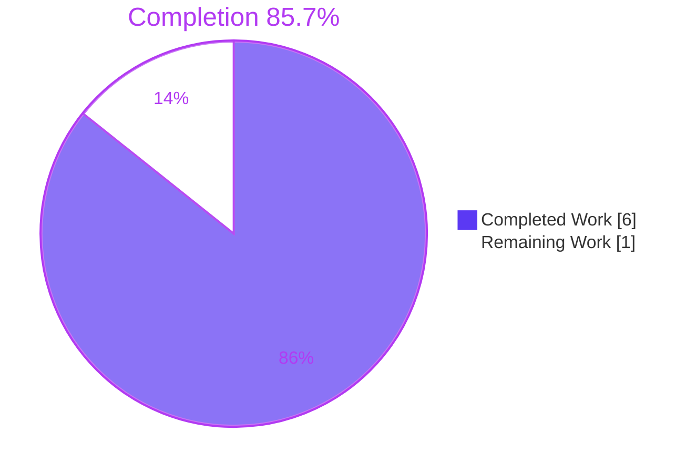
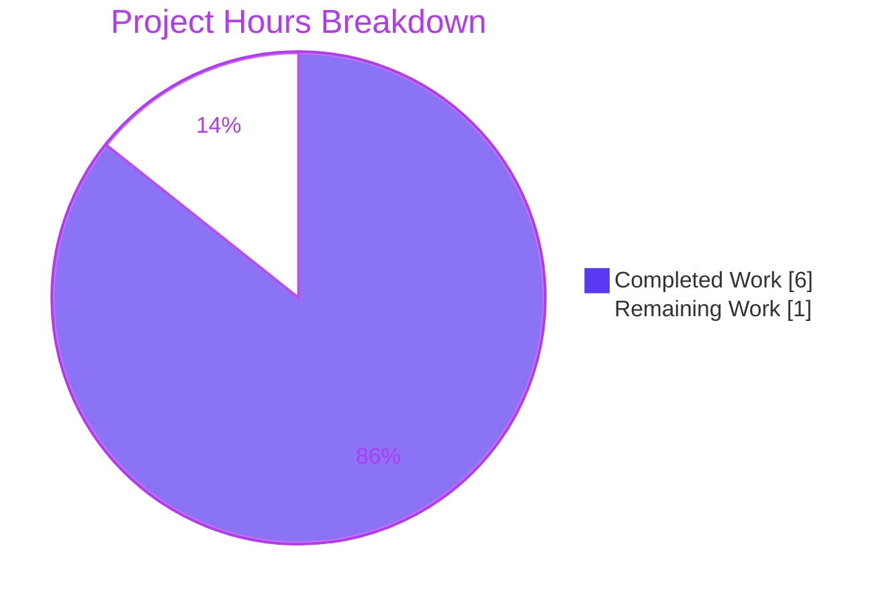
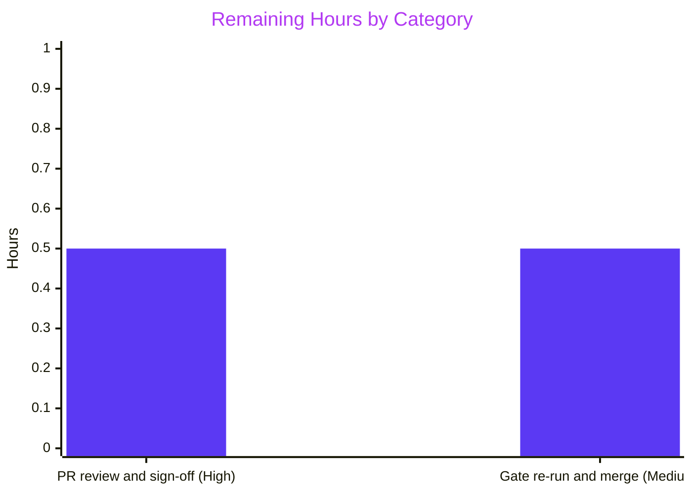

# 1. Executive Summary

## 1.1 Project Overview

`check_billing_sep_01` is a one-statement Node.js HTTP server (`server.js`) that answers every request on port 3000 with `Hello, World!`. This change makes the repository usable by a developer who clones it cold and runs it once, without changing what the server does. `server.js` gains a one-line JSDoc summary. `README.md` is rewritten in place with the project name, a one-sentence description, an Install section (nothing to install, Node.js alone) and a Run section with the exact command and address. The scope is documentation only: two files, no dependencies, and identical runtime behaviour.

## 1.2 Completion Status


```mermaid
%%{init: {"theme": "base", "themeVariables": {"pie1": "#5B39F3", "pie2": "#FFFFFF", "pieStrokeColor": "#B23AF2", "pieOuterStrokeColor": "#B23AF2", "pieSectionTextColor": "#B23AF2", "pieTitleTextColor": "#B23AF2"}}}%%
pie showData title Completion 85.7%
    "Completed Work" : 6
    "Remaining Work" : 1
```

| Metric | Value |
|---|---|
| Total Hours | 7 |
| Completed Hours (AI + Manual) | 6 (6 AI + 0 manual) |
| Remaining Hours | 1 |
| Percent Complete | 85.7% |

6 hours completed out of 7 total hours = 85.7% complete. All seven AAP requirements (R1–R7) are delivered and verified. The remaining hour is pull-request review and merge.

## 1.3 Key Accomplishments

- ✅ `server.js` line 1 is the requested JSDoc summary, character for character, with no tags
- ✅ `server.js` line 2 is byte-identical to baseline `a3cb672`, so no executable code changed
- ✅ `README.md` matches the planned 14-line, 351-byte text exactly, with the original H1 kept
- ✅ All 11 acceptance checks pass, and `node --check server.js` exits 0
- ✅ Wire output matches the baseline server on 21 of 21 method/path probes
- ✅ The README flow works from a cold clone with only Node.js installed
- ✅ Only the two permitted files changed

## 1.4 Critical Unresolved Issues

None of the 7 requirements is unresolved. There are 3 open items, all accepted with a caveat and none blocking release. They touch 4 of the 7 requirements (R1, R3, R5 and R7) and need the reviewer's sign-off (Section 5.2).

| Issue | Impact | Owner | ETA |
|---|---|---|---|
| Both edits are committed, so acceptance checks 1, 2 and 4 must be compared with `a3cb672`. Run verbatim, checks 1 and 2 print nothing and check 4 exits 1 | Could mislead validation. The artefacts are unaffected | Reviewer | Before merge (0.5h, with the gate run) |
| "Every request, on any method and any path" is broader than what reaches the handler: `CONNECT` gets no reply, unknown methods get 400, and `HEAD` gets no body | Wording caveat only. Behaviour is identical to baseline | Reviewer | At PR review |
| The README names no working directory or stop step. `node server.js` fails with `MODULE_NOT_FOUND` outside the clone | Minor friction for new users | Reviewer | At PR review |

## 1.5 Access Issues

No access issues identified. No credentials, services or package registries are needed.

## 1.6 Recommended Next Steps

1. **[High]** Review the two-file PR and sign off the three caveats in Section 5.2.
2. **[Medium]** Re-run the acceptance gate in Section 9.5, then merge into `2209_04`.
3. **[Low]** If you support Node.js releases older than v22, test the Run step on the oldest one.
4. **[Low]** Plan any server hardening as a separate change, because this scope forbids it.

# 2. Project Hours Breakdown

## 2.1 Completed Work Detail

| Component | Hours | Description |
|---|---|---|
| Code-fact analysis and claim tracing (AAP 0.2.3, 0.3) | 0.5 | Every documented fact is traced to `server.js:2`: an HTTP server, port 3000, an unconditional `res.end('Hello, World!\n')`, and `req` never read. Details the code does not settle are kept out of both files |
| R1 — `server.js` JSDoc summary | 0.5 | Exemplar inserted as new line 1 at column 0 (90 bytes + LF), in commit `dd649cf`. The statement is not split, and the comment has no tags |
| R2–R5 — `README.md` rewrite in place | 1.0 | H1 kept, one description sentence, `## Install`, and `## Run` with an `sh` fence and the address, in commit `7f78b2e`. 14 lines, 351 bytes, LF endings, file mode unchanged |
| R6 — behaviour-preservation verification | 2.0 | Byte identity of line 2 against `a3cb672`, plus a runtime comparison with the baseline server covering status, headers, body, startup log, bind, failure exits and signal exits |
| R7 — acceptance gate and required outputs | 1.0 | All 11 checks were run from the repository root, with check 7 in an isolated network namespace. The values the code does not settle (AAP 0.2.3) were observed and are listed in Section 4 |
| README-follow validation (R4, R5) | 1.0 | Cold clone, clean `env -i`, a `PATH` holding only `node`, an offline namespace, a `git archive` copy, and a browser rendering of the README address |
| **Total** | **6.0** | |

## 2.2 Remaining Work Detail

| Category | Hours | Priority |
|---|---|---|
| PR review and sign-off of the accepted caveats (Section 5.2 items 1, 3 and 4) | 0.5 | High |
| Re-run the acceptance gate with checks 1, 2 and 4 compared against `a3cb672`, then merge into `2209_04` | 0.5 | Medium |
| **Total** | **1.0** | |

## 2.3 Hours Calculation

- Completed: 0.5 + 0.5 + 1.0 + 2.0 + 1.0 + 1.0 = **6 hours**
- Remaining: 0.5 + 0.5 = **1 hour**
- Total: 6 + 1 = **7 hours**
- Completion: 6 / 7 × 100 = **85.7%**

Confidence is high because every AAP item is narrowly defined and verified. Remaining effort excludes optional hardening and Node.js version testing, which fall outside the AAP.

# 3. Test Results

The repository has no committed test suite, manifest or coverage tooling. Its quality gate is the AAP's 11 acceptance checks. Everything below was run from the repository root on Node.js v22.23.2, with every server started in a private network namespace (`unshare -n`).

| Area / Category | Framework | Tests | Passed | Failed | Coverage | What This Proves |
|---|---|---|---|---|---|---|
| Static acceptance checks 1–6 and 8–11 | bash, git, grep, od, `node --check` | 10 | 10 | 0 | N/A | Only the two files changed. The comment is one tag-free line, line 2 is unchanged, and the file parses. The README has the required H1, headings, command, line limit and trailing newline |
| Runtime acceptance check 7 | bash, curl | 1 | 1 | 0 | N/A | `node server.js` starts the server, and `http://127.0.0.1:3000/` returns exactly `Hello, World!` |
| Exact-text conformance | cmp | 2 | 2 | 0 | N/A | `README.md` is byte-identical to the planned text, and `server.js` line 1 is byte-identical to the exemplar |
| Wire contract | curl | 22 | 22 | 0 | N/A | Six methods on three paths, including an unknown path, plus `HEAD`, `localhost` and `[::1]`, all get 200. Every non-`HEAD` body is the 14-byte `Hello, World!\n`, and no `Content-Type` is sent |
| Baseline differential against `a3cb672` | curl, cmp | 22 | 22 | 0 | N/A | Status, headers and body for 21 method/path probes, plus the startup log, are byte-identical to the original server |
| Lifecycle and failure modes | bash, ss, kill | 5 | 5 | 0 | N/A | Listens on `*:3000`. `SIGTERM` exits 143 and `SIGINT` exits 130, and both free the port. `PORT` is ignored, and a second instance exits 1 with `EADDRINUSE` |
| **Total** | | **62** | **62** | **0** | N/A | |

Observed check 7 output (exit 0):

```text
Server running at http://127.0.0.1:3000/
Hello, World!
```

`node --check server.js` prints nothing and exits 0.

**Not Covered**

- **Node.js versions other than v22.23.2.** The code does not settle a minimum version. Before release, run `node --check server.js` and the Run step on the oldest version the team supports.
- **Non-Linux hosts and shells** (macOS, Windows PowerShell or cmd). The README command is shell-neutral, but it was run only under bash on Linux.
- **GitHub's rendered view of `README.md`.** The Markdown was checked as raw GFM (ATX headings, a balanced `sh` fence) but was not viewed on github.com.
- **Regression protection.** No automated test or CI job guards these files. A later edit to `server.js` could leave the comment and README stale without anything failing.

# 4. Runtime Validation & UI Verification

- ✅ **Startup:** `node server.js` is ready in about 0.1 s. It prints exactly `Server running at http://127.0.0.1:3000/` (41 bytes) and writes nothing to stderr. It listens on the dual-stack wildcard `*:3000` (`::`), not on loopback only.
- ✅ **Request handling:** every well-formed request gets `HTTP/1.1 200 OK` with body `Hello, World!\n`, on any path and for GET, POST, PUT, PATCH, DELETE, OPTIONS and TRACE. Headers are `Date`, `Connection: keep-alive`, `Keep-Alive: timeout=5` and `Content-Length: 14`. There is no `Content-Type`.
- ✅ **README flow in a terminal:** a cold `git clone` has only `README.md` and `server.js`. The fenced command, run verbatim, starts the server, and `curl` on the README address returns the body.
- ✅ **README flow in a browser:** Chrome renders `Hello, World!` at `http://127.0.0.1:3000/` and at `/any/path?x=1`. There is no redirect and no console message, and `/favicon.ico` also gets 200.
- ✅ **Nothing to install:** the server runs under `env -i`, with a `PATH` holding only `node`, in an offline namespace, and from a `git archive` copy with no `.git`. The run creates no files.
- ⚠ **Requests Node rejects before the handler:** `CONNECT` is closed without a reply. An unknown method token such as `FOO`, and malformed input, get 400. Headers over 16 KB get 431, and `HEAD` returns no body. All of this is identical at baseline.
- ✅ **Shutdown:** `SIGTERM` exits 143 and `Ctrl-C` (`SIGINT`) exits 130, and both release port 3000. The server installs no signal handlers.
- ✅ **Bind failure (unchanged from baseline):** a second instance exits 1 with `Error: listen EADDRINUSE: address already in use :::3000` (unhandled `'error'` event), and the first keeps serving.
- ✅ **Configuration:** the server reads no environment variables. With `PORT=4000` set it still serves on 3000, and 4000 refuses connections.
- ⚠ **Not exercised at runtime:** Node.js releases other than v22.23.2, and non-Linux hosts. The project has no authentication, database or external integration to exercise.

The runtime checks confirm what the code does not have: no routing, no 404 branch, no error handling, no explicit status code, no environment-variable configuration and no `Content-Type`. Neither `server.js` nor `README.md` claims any of these. The minimum Node.js version is still unsettled.

# 5. Compliance & Quality Review

## 5.1 Compliance Matrix

| Deliverable | Benchmark | Status | Evidence | Progress |
|---|---|---|---|---|
| R1 — one-line JSDoc summary | Exemplar verbatim, column 0, one sentence, no tags, statement not split | ✅ PASS | `server.js:1`; checks 3 and 5 | ■■■■■ 100% |
| R2 — H1 kept verbatim | `# check_billing_sep_01` is line 1 | ✅ PASS | `README.md:1`; check 9 | ■■■■■ 100% |
| R3 — description sentence | One sentence, code-backed facts only | ✅ PASS (caveat, 5.2 #3) | `README.md:3` | ■■■■■ 100% |
| R4 — `## Install` | Nothing to install, Node.js alone, no `npm install` | ✅ PASS | `README.md:5–7`; check 9 | ■■■■■ 100% |
| R5 — `## Run` | `sh` fence holding exactly `node server.js`, then the address | ✅ PASS (caveat, 5.2 #4) | `README.md:9–14`; checks 7 and 9 | ■■■■■ 100% |
| R6 — behaviour unchanged | Line 2 byte-identical to `a3cb672`, wire output identical | ✅ PASS | `server.js:2`; check 4; baseline differential | ■■■■■ 100% |
| R7 — acceptance checks and required outputs | 11 checks pass, and the check outputs, absences and unsettled values are recorded | ✅ PASS (adapted, 5.2 #1–2) | Sections 3 and 4 | ■■■■■ 100% |
| Scope boundary (AAP 0.8) | Only `README.md` and `server.js` modified, nothing created | ✅ PASS | `git diff --name-status a3cb672` → `M README.md`, `M server.js` | ■■■■■ 100% |
| Accuracy (AAP 0.7.2) | No claim of a status code, headers, routing, loopback-only binding or a Node version | ✅ PASS | `README.md:3,7,14`; `server.js:1` | ■■■■■ 100% |
| Format (AAP 0.1.2, 0.4.1) | GFM, ATX headings, 14 lines, LF only, trailing newline | ✅ PASS | Checks 8, 10 and 11; 0 CR bytes | ■■■■■ 100% |
| Security hygiene | No secrets, credentials, new inputs or dependencies | ✅ PASS | Only a comment and Markdown were added | ■■■■■ 100% |
| User rules | "nick admin rule" and "test admin share rule" | ✅ N/A | Neither rule has body text, so neither requires anything | — |

## 5.2 AAP & Rule Divergences and Gaps

| # | What the AAP/Rule Required | What Was Delivered Instead | Why It Diverged | Impact | Remediation |
|---|---|---|---|---|---|
| 1 | Stop if HEAD ≠ `a3cb672` (0.2.2). Leave edits unstaged until the checks run, with checks 1 and 2 compared to the index and check 4 to HEAD (0.9.1) | Both edits committed (`dd649cf`, `7f78b2e`) before the gate ran. Checks 1, 2 and 4 compared with `a3cb672` | Each file was committed when it was written. The HEAD mismatch was this change's own `server.js` commit | No effect on the artefacts. On this branch the verbatim checks 1, 2 and 4 prove nothing | Use the `a3cb672` forms (Section 9.5) and sign off |
| 2 | Check 7 run as given, printing `Hello, World!` "and nothing else" | Run inside `unshare -n`. The output also contains the startup line | Port 3000 is hard-coded and was shared on the validation host. The startup line comes from the unchanged `listen` callback | None. The body is exactly `Hello, World!` | None needed. AAP 0.9.1 sanctions judging on the curl body |
| 3 | Describe only what the code does (0.1.2). State that every request, on any method and path, gets `Hello, World!` (0.1.4) | `server.js:1` and `README.md:3` say "every request", but Node rejects some requests before the handler | AAP 0.4.1 fixes both texts verbatim, and 0.8.2 forbids changing the server | The wording is broader than reality for non-standard requests. No functional effect | Sign off, or later qualify it as "every well-formed request" |
| 4 | Let a cold cloner start the server and reach it (0.7.2), using the exact 14-line text (0.4.1) | The README has no `cd` step and no stop instruction | AAP 0.4.1 fixes the README text, so extra lines would depart from the plan | `node server.js` run outside the clone fails with `MODULE_NOT_FOUND` | Sign off, or add a `cd` line later (still within 15 lines) |

**1 — Committed edits and re-anchored checks.** AAP 0.9.1 wanted both edits left unstaged, so that checks 1 and 2 compare the working tree with the index and check 4 compares it with HEAD. Instead, `server.js` was committed in `dd649cf` (10:01:47) and `README.md` in `7f78b2e` (10:03:51), before the gate ran. When the README edit began, HEAD was already `dd649cf`, which is this change's own work. The README still matched its baseline (22 bytes, final byte `0x31`), so the work continued instead of stopping. Checks 1, 2 and 4 were run against `a3cb672`, which tests the same bytes. Run verbatim on this branch, checks 1 and 2 print nothing and check 4 exits 1. Use the forms in Section 9.5.

**2 — Check 7 in an isolated namespace.** `server.js:2` hard-codes port 3000 with no override, and port 3000 on the validation host was shared. Check 7 was therefore run unchanged inside `unshare -n bash -c 'ip link set lo up; …'`, which gives the server a private `127.0.0.1:3000` without any code edit. The output is `Server running at http://127.0.0.1:3000/` followed by `Hello, World!`. The first line comes from the unchanged `listen` callback. AAP 0.9.1 anticipated this and ruled that the check is judged on the curl body, which matches exactly. On a workstation where port 3000 is free, the plain command gives the same result. No action is needed.

**3 — "Every request" wording.** `server.js:1` (the user's exemplar) and `README.md:3` both say that every request, on any method and path, gets `Hello, World!`. That is true of every well-formed request that reaches the handler. Node's HTTP parser, however, closes `CONNECT` without a reply, answers unknown method tokens and malformed input with 400, and answers oversized headers with 431. `HEAD` returns no body, as HTTP requires. All of this is identical at `a3cb672`. Both texts are unchanged because the AAP fixes them verbatim and forbids handler changes. The reviewer should accept the wording, or qualify it in a later change.

**4 — No working directory or stop step.** The Run section gives `node server.js` and the address, exactly as planned. It does not say to `cd` into the clone first, or how to stop the server. Run from another directory, the command fails with `Error: Cannot find module '…/server.js'` (exit 1). `Ctrl-C` stops the server cleanly (exit 130, port released). The text was held to the AAP's verbatim 14-line version, because extra lines would have departed from it. The impact is minor friction for newcomers. The reviewer should accept this, or add a `cd check_billing_sep_01` line later, which keeps the file within the 15-line limit.

**User rules.** Neither user rule ("nick admin rule", "test admin share rule") has body text, so the delivered files cannot diverge from them.

# 6. Risk Assessment

| Risk | Category | Severity | Probability | Mitigation | Status |
|---|---|---|---|---|---|
| The server listens on every interface (`:::3000`), while the README and startup log advertise `127.0.0.1`. On a networked host it is reachable from outside | Security | Medium | Medium | Run it only on trusted hosts or behind a firewall. Bind to `127.0.0.1` in a separate hardening change (out of scope here) | Accepted: unchanged from baseline, and the README makes no loopback-only claim |
| No authentication, no security headers and no `Content-Type`. Browsers fall back to `text/plain` with windows-1252 | Security / Integration | Low | Low | Keep it as a local demo. Add `res.writeHead` with headers in a separate change if clients depend on them | Accepted: unchanged from baseline |
| Port 3000 is hard-coded and the server has no `'error'` listener, so a busy port crashes it with a stack trace (exit 1) | Operational | Low | Medium | Free port 3000 before starting (Section 9.7). Do not change the port as part of this scope | Accepted: unchanged from baseline |
| Behaviour on Node.js releases other than v22.23.2 is unverified | Technical | Low | Low | Only the built-in `http` module is used. Run `node --check` and the Run step on the oldest supported release | Open |
| AAP checks 1, 2 and 4, run verbatim on the committed branch, print nothing or exit 1 and look like failures | Operational | Low | High | Use the forms compared against `a3cb672` (Section 9.5) | Open until merge |
| The comment and README hard-code the port and response. A later code change can make them stale, and no test would catch it | Technical | Low | Low | Update `server.js:1` and `README.md:3,14` whenever `server.js:2` changes. Consider a CI grep check | Open |

# 7. Visual Project Status


```mermaid
%%{init: {"theme": "base", "themeVariables": {"pie1": "#5B39F3", "pie2": "#FFFFFF", "pieStrokeColor": "#B23AF2", "pieOuterStrokeColor": "#B23AF2", "pieSectionTextColor": "#B23AF2", "pieTitleTextColor": "#B23AF2"}}}%%
pie showData title Project Hours Breakdown
    "Completed Work" : 6
    "Remaining Work" : 1
```

**Remaining hours by priority (1 hour total)**


```mermaid
%%{init: {"theme": "base", "themeVariables": {"xyChart": {"plotColorPalette": "#5B39F3", "titleColor": "#B23AF2"}}}}%%
xychart-beta
    title "Remaining Hours by Category"
    x-axis ["PR review and sign-off (High)", "Gate re-run and merge (Medium)"]
    y-axis "Hours" 0 --> 1
    bar [0.5, 0.5]
```

| Priority | Tasks | Hours |
|---|---|---|
| High | 1 | 0.5 |
| Medium | 1 | 0.5 |
| Low | 0 | 0 |
| **Total** | **2** | **1.0** |

# 8. Summary & Recommendations

**Delivered and verified.** The project is 85.7% complete: 6 of 7 hours are done, and the remaining hour is review and merge. Every AAP requirement, R1 through R7, is met. `server.js` has the exact one-line JSDoc summary, and its executable statement is byte-identical to `a3cb672`. `README.md` matches the planned 14-line text byte for byte. It gives a cold cloner the project name, what the server does, the fact that nothing needs installing, the start command and the address. All 11 acceptance checks pass. Against the original server, status, headers, body and startup output are identical across 21 method/path probes.

**Remaining gaps.** Nothing is unresolved, but three accepted caveats need the reviewer's sign-off (Section 5.2). First, both edits are committed, so the checks that compare against the index or HEAD must be run against `a3cb672`. Second, "every request, on any method and any path" does not cover requests Node rejects before the handler. Third, the README gives no `cd` or stop instruction. None of these affects runtime behaviour. The second and third follow from the AAP fixing both texts verbatim, and the first from the edits being committed before the gate ran.

**Critical path to production.** Review the two-file diff (+15/−1 lines), and accept or schedule the three caveats. Then re-run the gate using the commands in Section 9.5; check 7 needs a free port 3000 or a private network namespace. Finally, merge into `2209_04`. No deployment, configuration or credential step is involved.

**Success metrics and readiness.** Four criteria define readiness, and all four hold now: 11 of 11 acceptance checks pass, `node --check` exits 0, the wire output is byte-identical to the baseline, and only the two permitted paths change. The change is ready to merge once reviewed. The server keeps its baseline limitations: it binds every interface, has no error handling and sends no `Content-Type`. That is acceptable for a local demo, but the server would need a separate hardening change before facing a network.

**Recommendations.** Merge as delivered. If the team supports Node.js releases older than v22, confirm the Run step on the oldest one. Consider a small CI job that runs the Section 9.5 gate, so that later edits to `server.js` cannot leave the comment and README stale.

# 9. Development Guide

## 9.1 System Prerequisites

- **Node.js**: any release that provides the built-in `http` module and `node --check`. Verified on v22.23.2. No minimum version is declared.
- **git**, **bash** (the gate uses process substitution) and **curl**. The gate also uses GNU `grep`, `diff`, `od`, `head` and `tail`.
- Optional, Linux only, as root: `unshare` and `ip`, to run the server in a private network namespace when port 3000 is busy.
- Any OS that Node.js supports. Only Linux was exercised.

## 9.2 Environment Setup

No virtual environment, environment variable, service or secret is needed. The server reads no environment variables.

```bash
git clone <repository-url> check_billing_sep_01
cd check_billing_sep_01
node --version          # any Node.js release, e.g. v22.23.2
```

## 9.3 Dependency Installation

Nothing to install. The repository has no `package.json` or lockfile, so do not run `npm install`.

## 9.4 Application Startup

Run from the repository root. The server stays in the foreground on port 3000.

```bash
node server.js
```

Expected output: `Server running at http://127.0.0.1:3000/`. Stop the server with `Ctrl-C` (exit 130), which releases the port.

## 9.5 Verification Steps

Parse check (expect no output and exit 0):

```bash
node --check server.js; echo "exit=$?"
```

Full acceptance gate, with checks 1, 2 and 4 compared against the baseline commit `a3cb672`. Run it from the repository root:

```bash
bash -c '
echo C1; git diff --name-only a3cb672
echo C2; git diff --numstat a3cb672 -- server.js
echo C3; head -n 1 server.js
echo C4; diff <(git show a3cb672:server.js) <(tail -n +2 server.js); echo "c4 exit=$?"
echo C5; grep -cE "@param|@returns|@type" server.js
echo C6; node --check server.js; echo "c6 exit=$?"
echo C7; node server.js & SRV=$!; sleep 1; curl -s http://127.0.0.1:3000/; kill $SRV
echo C8; grep -c "" README.md
echo C9; head -n 1 README.md; grep -q "node server.js" README.md; echo "run-cmd=$?"; grep -q "npm install" README.md; echo "npm-install=$?"
echo C10; grep -E "^## " README.md
echo C11; tail -c 1 README.md | od -An -tx1
'
```

Expected output: C1 lists `README.md` and `server.js`. C2 prints `1	0	server.js`. C3 prints the `/** … */` line. C4 prints no diff and `c4 exit=0`. C5 prints `0`. C6 prints `c6 exit=0`. C7 prints `Server running at http://127.0.0.1:3000/` and then `Hello, World!`. C8 prints `14`. C9 prints `# check_billing_sep_01`, `run-cmd=0` and `npm-install=1`. C10 prints `## Install` and `## Run`. C11 prints ` 0a`.

If port 3000 is taken on a Linux host, run check 7 as root inside a private network namespace instead:

```bash
unshare -n bash -c 'ip link set lo up; node server.js & SRV=$!; sleep 1; curl -s http://127.0.0.1:3000/; kill $SRV'
```

## 9.6 Example Usage

With the server running in another terminal:

```bash
curl -s http://127.0.0.1:3000/                 # Hello, World!
curl -s -X POST http://127.0.0.1:3000/any/path # Hello, World!  (any method, any path)
curl -s -i http://127.0.0.1:3000/              # HTTP/1.1 200 OK, Content-Length: 14, no Content-Type
```

`http://localhost:3000/` and `http://[::1]:3000/` also answer, and a browser at `http://127.0.0.1:3000/` shows `Hello, World!` as plain text.

## 9.7 Troubleshooting

| Symptom | Cause | Resolution |
|---|---|---|
| `Error: Cannot find module '…/server.js'` (`MODULE_NOT_FOUND`), exit 1 | The command was run outside the repository root | `cd check_billing_sep_01`, then run `node server.js` |
| `Error: listen EADDRINUSE: address already in use :::3000`, exit 1 | Another process holds port 3000 | Find it with `lsof -iTCP:3000 -sTCP:LISTEN -n -P` or `ss -ltnp 'sport = :3000'` and stop that process by its PID. Do not change the port in `server.js` |
| `PORT=4000 node server.js` still serves on 3000 | The server reads no environment variables | This is expected behaviour. The port is fixed at 3000 |
| Check 1 or 2 prints nothing, or check 4 shows a diff | The AAP's verbatim forms compare against the index or HEAD, which already hold the edits | Use the `a3cb672` forms in Section 9.5 |
| The browser shows plain text with odd encoding | No `Content-Type` header is sent | This is expected, and identical to the baseline server |

# 10. Appendices

## A. Command Reference

| Purpose | Command |
|---|---|
| Start the server | `node server.js` |
| Parse check | `node --check server.js` |
| Fetch the response | `curl -s http://127.0.0.1:3000/` |
| Inspect status and headers | `curl -s -i http://127.0.0.1:3000/` |
| Changed paths since baseline | `git diff --name-status a3cb672` |
| Confirm code line unchanged | `diff <(git show a3cb672:server.js) <(tail -n +2 server.js)` |
| Isolated run (Linux, root) | `unshare -n bash -c 'ip link set lo up; node server.js & SRV=$!; sleep 1; curl -s http://127.0.0.1:3000/; kill $SRV'` |
| Find the port-3000 holder | `lsof -iTCP:3000 -sTCP:LISTEN -n -P` |

## B. Port Reference

| Port | Protocol | Bind | Purpose |
|---|---|---|---|
| 3000 | HTTP/1.1 over TCP | `::` dual-stack wildcard (all IPv4 and IPv6 interfaces) | The only listener. Hard-coded at `server.js:2` and not configurable |

## C. Key File Locations

| Path | Role |
|---|---|
| `server.js` | Line 1: JSDoc summary. Line 2: the entire server (unchanged since `a3cb672`) |
| `README.md` | Project name, description, `## Install`, `## Run` (14 lines) |

## D. Technology Versions

| Technology | Version | Note |
|---|---|---|
| Node.js | v22.23.2 | The only version tested. No minimum is declared |
| Node.js modules | built-in `http` only | No third-party packages |
| Module format | CommonJS | `require('http')` |

## E. Environment Variable Reference

None. The server reads no environment variables. `PORT` and `HOST` are ignored.

## F. Developer Tools Guide

- `node --check server.js` is the only build or compile step, and it produces no output files.
- There is no linter, formatter, test runner or CI configuration in the repository.
- `git show a3cb672:<file>` gives the pre-change baseline of either file for comparison.

## G. Glossary

| Term | Meaning |
|---|---|
| AAP | The agreed specification for this change, with requirements R1–R7 |
| Baseline (`a3cb672`) | The commit "Create server.js", the state before this change |
| Acceptance gate | The AAP's 11 ordered checks (Section 9.5) |
| Private network namespace | An isolated Linux network stack (`unshare -n`) with its own `127.0.0.1:3000` |
| JSDoc summary | A single-line `/** … */` comment describing the code below it |
